# Power BI'daki neredeyse tüm nesneleri silme
Bu makalede, Power BI hizmetindeki bir panoyu, raporu, çalışma kitabını, veri kümesini, uygulamayı, görselleştirmeyi ve çalışma alanını silmeyle ilgili bilgiler sunulmaktadır.

## Bir panoyu silme
Panoları kaldırabilirsiniz. Bir panoyu kaldırdığınızda bağlı olduğu veri kümesi veya o panoyla ilişkilendirilmiş raporlar silinmez.

* Sahibi olduğunuz panoları kaldırabilirsiniz. İş arkadaşlarınızla paylaşmış olduğunuz panoları Power BI çalışma alanınızdan kaldırdığınızda ilgili pano bu kişilerin Power BI çalışma alanlarından da kaldırılır.
* Sizinle paylaşılmış olan bir panoya ihtiyacınız kalmadıysa söz konusu panoyu kaldırabilirsiniz.  Kaldırdığınız panolar başkalarının Power BI çalışma alanından kaldırılmaz.
* [Kurumsal içerik paketine](service-organizational-content-pack-disconnect.md) dahil olan panoları kaldırmak için, ilişkilendirilmiş veri kümesini kaldırmanız gerekir.

### Bir panoyu silmek için
1. Çalışma alanınızda **Panolar** sekmesini seçin.
2. Silmek istediğiniz panoyu bulun ve Sil simgesini geçin.

    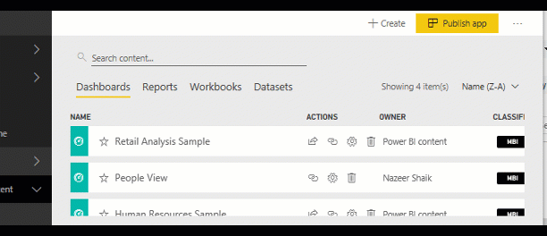

## Bir raporu silme
Endişelenmeyin, bir raporu sildiğinizde raporun temel aldığı veri kümesi silinmez.  Rapordan sabitlediğiniz görselleştirmeler de güvendedir. Bu görselleştirmeler silinene kadar panoda kalmaya devam eder.

### Bir raporu silmek için
1. Çalışma alanınızda **Raporlar** sekmesini seçin.
2. Silmek istediğiniz raporu bulup Sil simgesini   geçin.   

    
3. Silme işlemini onaylayın.

   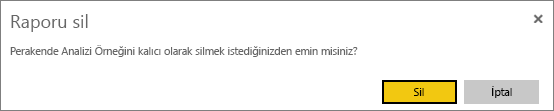

   > [!NOTE]
   > [İçerik paketlerinde](service-organizational-content-pack-introduction.md) bulunan raporlar bu yöntemle silinemez.  Bkz. [Kurumsal içerik paketi bağlantılarını kaldırma](service-organizational-content-pack-disconnect.md).
   >
   >

## Bir çalışma kitabını silme
Çalışma kitaplarını kaldırabilirsiniz. Ancak bir çalışma kitabını kaldırdığınızda bu çalışma kitabındaki verilerin kullanıldığı tüm raporlar ve pano kutucukları da kaldırılır.

OneDrive İş hesabında kayıtlı çalışma kitaplarının Power BI'dan silinmesi, OneDrive'dan kaldırılmasını sağlamaz.

### Bir çalışma kitabını silmek için
1. Çalışma alanınızda **Çalışma Kitapları** sekmesini seçin.
2. Silmek istediğiniz çalışma kitabını bulun ve Sil  simgesini seçin.

    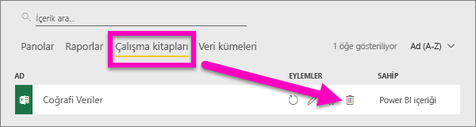
3. Silme işlemini onaylayın.

   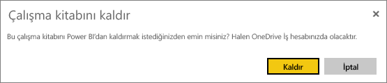

## Bir veri kümesini silme
Veri kümeleri silinebilir. Ancak bir veri kümesini sildiğinizde ilgili veri kümesindeki verilerin kullanıldığı tüm raporlar ve pano kutucukları da silinir.

Veri kümesi bir veya daha fazla [kurumsal içerik paketinin](service-organizational-content-pack-disconnect.md) parçasıysa söz konusu veri kümesini silmek için, kullanıldığı içerik paketlerinden kaldırmanız, işlemin tamamlanmasını beklemeniz ve silmeyi tekrar denemeniz gerekir.

### Bir veri kümesini silmek için
1. Çalışma alanınızda **Veri Kümeleri** sekmesini seçin.
2. Silmek istediğiniz veri kümesini bulup üç nokta (...) simgesini seçin.  

    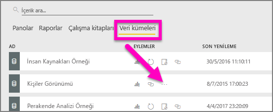
3. Açılan listeden **Sil**'i seçin.

   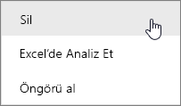
4. Silme işlemini onaylayın.

   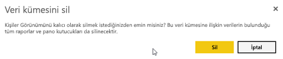

## Bir uygulama çalışma alanını silme
> [!WARNING]
> Bir uygulama çalışma alanı oluşturduğunuzda bir Office 365 grubu oluşturmuş olursunuz. Bir uygulama çalışma alanını sildiğinizde de oluşturduğunuz Office 365 grubunu silmiş olursunuz. Başka bir deyişle, söz konusu grup SharePoint ve Microsoft Teams gibi diğer O365 ürünlerinden de silinir.
>
>

Kendi oluşturduğunuz uygulama çalışma alanlarını silebilirsiniz. Ayrıca silme işleminin ardından ilişkili uygulama, tüm grup üyeleri için silinir ve AppSource'unuzdan kaldırılır (uygulamayı kuruluşunuzun tamamında yayımladıysanız). Bir uygulama çalışma alanını silmek, uygulama çalışma alanından ayrılmaktan farklıdır.

### Yöneticisi olduğunuz bir uygulama çalışma alanını silmek için
1. Sol gezinti bölmesinde, **Çalışma Alanı**'nı seçin

    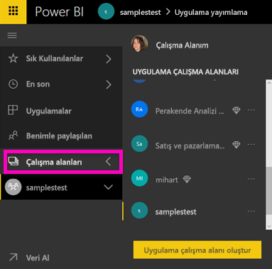
2. Silmek istediğiniz çalışma alanının sağ tarafındaki üç nokta (...) simgesini seçip **Çalışma alanını düzenle**'yi seçin.

   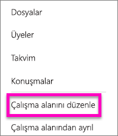
3. **Çalışma alanını düzenle** penceresinde, **Çalışma alanını sil** > **Sil**'i seçin.

    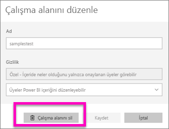

### Bir uygulama çalışma alanını listenizden kaldırma
Artık bir uygulama çalışma alanının üyesi olmak istemiyorsanız ***ayrılabilir*** ve ilgili girişin listenizden kaldırılmasını sağlayabilirsiniz. Siz bir çalışma alanından ayrıldığınızda diğer çalışma alanı üyeleri için herhangi bir değişiklik olmaz.  

> [!IMPORTANT]
> Uygulama çalışma alanındaki tek Yönetici sizseniz Power BI ayrılmanıza izin vermez.
>
>

1. Kaldırmak istediğiniz çalışma alanında işleme başlayın.
2. Sağ üst köşede üç nokta (...) simgesini seçin ve **Çalışma alanından ayrıl** > **Ayrıl** seçeneğini belirleyin.

      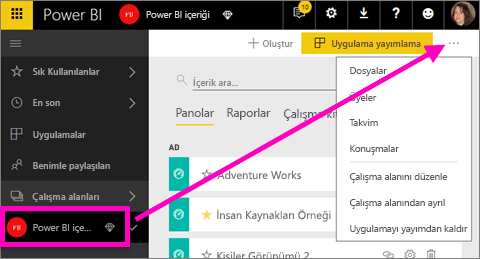

   > [!NOTE]
   > Açılan listede göreceğiniz seçenekler, uygulama çalışma alanında Yönetici veya Üye olma durumunuza göre değişir.
   >
   >

## Bir Uygulamayı silme veya kaldırma
Uygulamaları uygulama listesi sayfanızdan kolayca kaldırabilirsiniz. Ancak bir uygulamayı kalıcı olarak silme işlemi yalnızca Yönetici tarafından gerçekleştirilebilir.

### Bir uygulamayı uygulama listesi sayfanızdan kaldırma
Uygulama listesi sayfanızdan sildiğiniz uygulamalar diğer üyeler için silinmez.

1. Sol gezinti bölmesinde **Uygulamalar**'ı seçerek uygulama listesi sayfasını açın.
2. Silmek istediğiniz uygulamanın üzerine gelip Sil simgesini  seçin.

   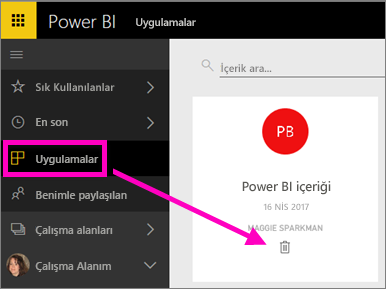

   Yanlışlıkla kaldırdığınız uygulamaları geri almak için kullanabileceğiniz birçok seçenek vardır.  Uygulama oluşturucusunun uygulamayı yeniden göndermesini isteyebilir, uygulama bağlantısını içeren özgün e-postayı bulabilir, [Bildirim merkezinizde](service-notification-center.md) uygulamayla ilgili bildirimin mevcut olup olmadığına bakabilir veya kuruluşunuzun [AppSource](service-install-use-apps.md) sayfasını kontrol edebilirsiniz.

## Önemli noktalar ve sorun giderme
Bu makalede Power BI hizmetinin başlıca yapı taşlarını silme yöntemleri ele alınmıştır. Ancak Power BI'da silebileceğiniz başka öğeler de vardır.  

* [Öne Çıkan panonuzu kaldırma](service-dashboard-featured.md#change-the-featured-dashboard)
* [Bir panoyu kaldırma (sık kullanılanlardan çıkarma)](service-dashboard-favorite.md)
* [Bir rapor sayfasını silme](service-delete.md)
* [Bir pano kutucuğunu silme](service-dashboard-edit-tile.md)
* [Bir rapor görselleştirmesini silme](service-delete.md)

Başka bir sorunuz mu var? [Power BI Topluluğu'na başvurun](http://community.powerbi.com/)
