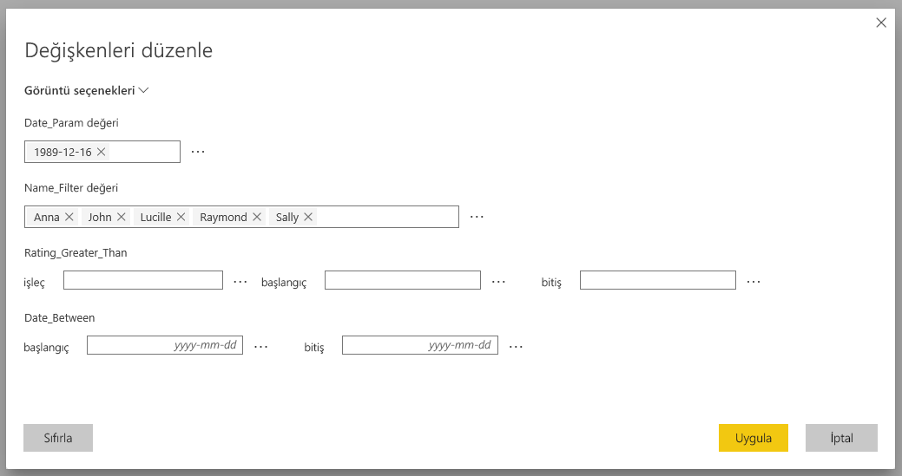
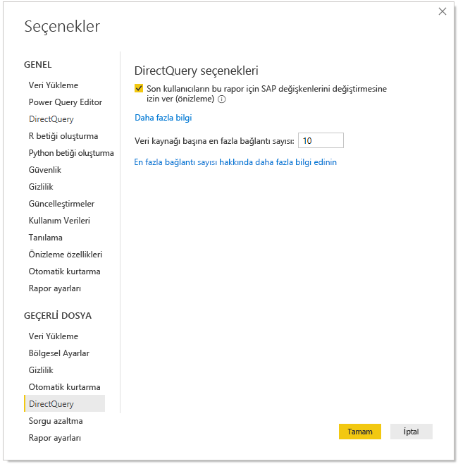
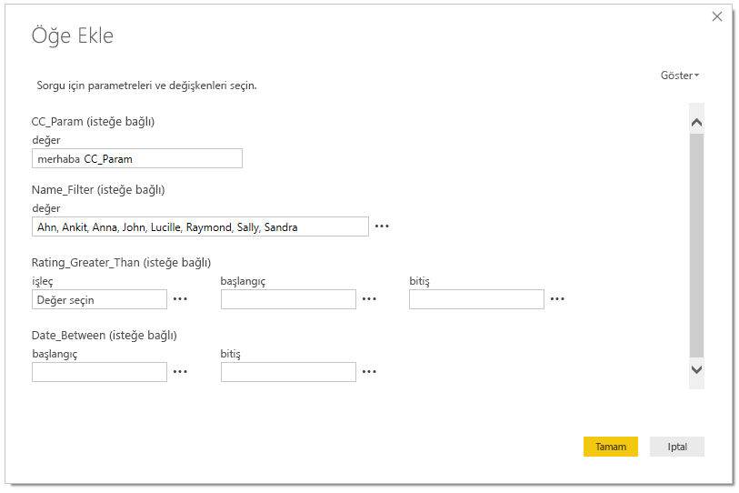
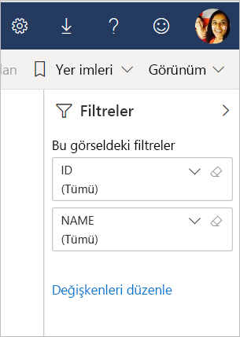

# Power BI hizmetinde SAP değişkenlerini düzenleme

Rapor yazarları DirectQuery ile SAP Business Warehouse veya SAP HANA'yı kullanırken artık son kullanıcıların Premium ve paylaşılan çalışma alanları için **Power BI Hizmeti**'nde SAP değişkenlerini düzenlemesine izin verebilir. Bu özelliğin Çalışma Alanım sayfasının Benimle paylaşılan sekmesindeki ve V1 Çalışma Alanlarından oluşturulan Uygulamalardaki raporlar için ÇALIŞMADIĞINI unutmayın. 

Bu belgede Power BI'da değişkenleri düzenlemek için nelerin gerektiği, bu özelliğin nasıl etkinleştirileceği ve Power BI hizmetinde değişkenlerin nerede düzenlendiği konuları açıklanır.

## SAP değişkenleri düzenleme gereksinimleri

SAP değişkenleri düzenleme özelliğini kullanmak için birkaç gereksinim karşılanmalıdır. Aşağıdaki listede bu gereksinimlere yer verilmiştir.

**Yeni Filtre Deneyimi gerekir** – raporunuzda [yeni filtre deneyimi](power-bi-report-filter.md) etkinleştirilmiş olmalıdır. Power BI Desktop'ta raporunuz için bu deneyimi şöyle etkinleştirebilirsiniz:
- Power BI Desktop'ta **Dosya** > **Seçenekler ve Ayarlar** > **Seçenekler**'i seçin
- Gezinti bölmesinin **Geçerli dosya** bölümünde **Rapor ayarları**'nı seçin.
- **Filtreleme deneyimi**'nin altında **Güncelleştirilmiş filtre bölmesini etkinleştirin** öğesini seçin.

**DirectQuery bağlantıları gerekli** – SAP veri kaynağına DirectQuery kullanarak bağlanmalısınız. İçeri Aktarma bağlantıları desteklenmez.

**SSO kurulumu gerekli** – bu özelliğin çalışması için çoklu oturum açma (SSO) yapılandırılmalıdır. Daha fazla bilgi için [çoklu oturum açmaya (SSO) genel bakış](service-gateway-sso-overview.md) konusuna bakın.

**Yeni Ağ Geçidi bitleri gerekli** - En son ağ geçidini indirin ve mevcut ağ geçidinizi güncelleştirin. Daha fazla bilgi için [hizmet ağ geçidi](service-gateway-onprem.md) konusuna bakın.

**SAP HANA için yalnızca çok boyutlu** – SAP HANA için, SAP değişkenleri düzenleme özelliği yalnızca çok boyutlu modellerde çalışır; ilişkisel kaynaklarda çalışmaz.

**Bağımsız bulutlarda desteklenmez** – Şu anda Bağımsız bulutlarda Power Query Online yoktur ve Bağımsız bulutlarda bu özellik de desteklenmez.

## Özelliği etkinleştirme

**SAP değişkenleri düzenleme** özelliğini etkinleştirmek için Power BI Desktop'ta SAP HANA veya SAP BW veri kaynağına bağlanın. Ardından **Dosya > Seçenekler ve ayarlar > Seçenekler**'e gidin ve sol bölmedeki Geçerli Dosya bölümünde **DirectQuery**'yi seçin. Bunu seçtiğinizde, aşağıdaki resimde gösterildiği gibi sağ bölmede DirectQuery seçeneklerini ve seçebileceğiniz **Son kullanıcıların rapordaki SAP değişkenlerini değiştirmesine izin ver** onay kutusunu görürsünüz.

## Power BI Desktop'ta SAP değişkenleri düzenleme özelliğini kullanma

Power BI Desktop'ta SAP değişkenleri düzenleme özelliğini kullanırken, şeritteki **Sorguları Düzenle** menüsünden Değişkenleri düzenle bağlantısını seçerek değişkenleri düzenleyebilirsiniz. Orada aşağıdaki iletişim kutusu görüntülenir. Bu özellik Power BI Desktop'ta bir süre için kullanılabilir. Rapor oluşturucuları aşağıdaki iletişim kutusunu kullanarak rapor için değişkenleri seçebilir.

## Hizmette SAP değişkenleri düzenleme özelliğini kullanma

Rapor Power BI hizmetine yayımlandıktan sonra kullanıcılar yeni Filtre bölmesinde **Değişkenleri düzenle** bağlantısını görebilir. Raporu ilk kez yayımlıyorsanız Değişkenleri düzenle bağlantısının görüntülenmesi 5 dakika kadar sürebilir. Bağlantı görüntülenmezse veri kümesini el ile yenilemeniz gerekecektir.
Bunu şu yolla yapabilirsiniz:

1. Power BI hizmetinde, çalışma alanına ilişkin içerik listesinden **Veri Kümeleri** sekmesini seçin.

2. Yenilemeniz gereken veri kümesini bulun ve **Yenile** simgesini seçin.

    

3. Değişkenleri düzenle bağlantısının seçilmesi **Değişkenleri düzenle** iletişim kutusunu açar ve kullanıcılar burada değişkenleri geçersiz kılabilir. **Sıfırla** düğmesinin seçilmesi değişkenleri iletişim kutusu açıldığında görüntülenen ilk değerlerine sıfırlar.

    

4. **Değişkenleri düzenle** iletişim kutusunda yapılan tüm değişiklikler yalnızca bu kullanıcı için kalıcı olur (Power BI'daki diğer kalıcılık davranışlarına benzer biçimde). Aşağıdaki resimde gösterilen **Varsayılana sıfırla**'nın seçilmesi, raporu değişkenler de dahil olmak üzere rapor oluşturucusunun özgün durumuna sıfırlar.

    

SAP HANA veya SAP BW kullanan **Değişkenleri düzenle** özelliğinin etkinleştirildiği Power BI hizmetinde yayımlanmış raporla çalışırken, rapor sahibi bu varsayılan ayarları değiştirebilir. Raporun sahibi düzenleme modunda değişkenleri değiştirebilir ve söz konusu ayarların bu raporda *yeni varsayılan ayarlara* dönüşmesini sağlamak için raporu kaydedebilir. Rapor sahibi tarafından bu tür bir değişiklik yapıldıktan sonra rapora erişen diğer tüm kullanıcılar varsayılan ayarlar olarak bu yeni ayarları görür.

## Sonraki adımlar

SAP HANA, SAP BW veya DirectQuery hakkında daha fazla bilgi için aşağıdaki makaleleri okuyun:

- [Power BI Desktop'ta SAP HANA'yı kullanma](desktop-sap-hana.md)
- [DirectQuery ve SAP Business Warehouse (BW)](desktop-directquery-sap-bw.md)
- [DirectQuery ve SAP HANA](desktop-directquery-sap-hana.md)
- [Power BI'da DirectQuery kullanma](desktop-directquery-about.md)
