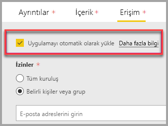

# SharePoint Online'da rapor web bölümüyle ekleme

Power BI'ın SharePoint Online'a yönelik yeni rapor web bölümü ile etkileşimli Power BI raporlarını SharePoint Online sayfalarına kolayca ekleyebilirsiniz.

Yeni kullanırken **SharePoint Online'a ekleme** seçeneği, eklenen raporlar tamamen güvenli kolayca güvenli iç Portal oluşturabilirsiniz.

## Gereksinimler

İçin **SharePoint Online'a ekleme** raporlarının çalışması için aşağıdakiler gereklidir:

* Power BI Pro lisansı veya bir [Power BI Premium kapasitesi (EM veya P SKU)](service-premium-what-is.md) Power BI lisansına sahip.
* SharePoint Online'a yönelik Power BI web bölümü için [Modern Sayfalar](https://support.office.com/article/Allow-or-prevent-creation-of-modern-site-pages-by-end-users-c41d9cc8-c5c0-46b4-8b87-ea66abc6e63b) gereklidir.

## Raporunuzu ekleme
Raporunuzu SharePoint Online'a eklemek için rapor URL'sini ve SharePoint Online'nın yeni Power BI web bölümüyle kullanmak gerekir.

### Bir rapor URL'sini alma

1. Power BI hizmetinde raporu görüntüleyin.

2. Seçin **dosya** açılır menüsünde, ardından **SharePoint Online'a ekleme**.

    

3. İletişim kutusundan rapor URL'sini kopyalayın.

    

### Power BI raporunu bir SharePoint Online sayfasına ekleme

1. Hedef sayfayı SharePoint Online'da açın ve seçin **Düzenle**.

    

    Veya Sharepoint Online'da seçin **+ yeni** yeni bir modern site sayfası oluşturmak için.

    

2. Seçin **+** açılır ve ardından **Power BI**.

    

3. **Rapor ekle**'yi seçin.

      

4. İçinde rapor daha önce kopyaladığınız URL'yi yapıştırın **Power BI raporu bağlantısı** bölmesi. Rapor otomatik olarak yüklenir.

    

5. SharePoint Online kullanıcılarınızın bu değişikliği görebilmesi için **Yayımla**'yı seçin.

    

## Raporlara erişim verme

Bir raporu SharePoint Online'a eklediğinizde otomatik olarak kullanıcıların rapor görüntülemesine izin vermek değil - görüntüleme izinleri Power BI'da ayarlamanız gerekir.

> [!IMPORTANT]
> Power BI hizmetinde, raporu görebilecek olan kullanıcıları belirleyip listede olmayanlara erişim izni vermeyi unutmayın.

Power bı'da rapor erişim sağlamak için iki yolu vardır. SharePoint Online ekip sitenizi oluşturmak için bir Office 365 grubu kullanıyorsanız, ilk yol, kullanıcı bir üyesi olarak listelemektir **Power BI hizmetinde uygulama çalışma alanı** ve **SharePoint sayfası**. Daha fazla bilgi için bkz. [Bir uygulama çalışma alanını yönetme](service-manage-app-workspace-in-power-bi-and-office-365.md).

İkinci yol, bir uygulama içinde bir rapor ekleme ve doğrudan kullanıcılarla paylaşın oluşturmaktır:  

1. Yazar (bir Pro kullanıcısı olması gerekir), bir uygulama çalışma alanında bir rapor oluşturur. Paylaşılacak **Power BI ücretsiz sürüm kullanıcıları**, uygulama çalışma alanı olarak ayarlanması gerekir bir **Premium çalışma alanı**.

2. Yazar, uygulamanın yayınlar ve aracıyı yükler. Yazar, uygulamayı SharePoint Online'da ekleme için kullanılan rapor URL'si erişimi yüklediğinizden emin olun ister.

3. Artık tüm kullanıcılar da uygulamayı yükleyebilir. Ayrıca **uygulama otomatik olarak yüklemeniz** özelliğini de etkinleştirebilirsiniz [Power BI Yönetici portalına](service-admin-portal.md)uygulamasının son kullanıcılar için önceden yüklü olması için.

   

4. Yazar uygulamayı açar ve rapora gider.

5. Yazar ekleme rapor URL'sini uygulamasının yüklü rapordan kopyalar. **Özgün rapor URL'si, uygulama çalışma alanından kullanmayın.**

6. SharePoint Online'da yeni bir ekip sitesi oluşturun.

7. Daha önce kopyaladığınız rapor URL'si için Power BI web bölümü ekleyin.

8. Verilerden faydalanacak olan tüm son kullanıcıları ve/veya grupları SharePoint Online sayfasına ve oluşturduğunuz Power BI uygulamasına ekleyin.

    > [!NOTE]
    > **Kullanıcıların veya grupların SharePoint sayfasındaki raporu görebilmeleri için hem SharePoint Online sayfasına hem de Power BI uygulamasındaki rapora erişebiliyor olmaları gerekir.**

Artık son kullanıcılar SharePoint Online'daki ekip sitesine giderek sayfadaki raporları görüntüleyebilir.

## Çok faktörlü kimlik doğrulaması

Power BI ortamınızda oturum açmak için çok faktörlü kimlik doğrulaması kullanmanız gerekiyorsa kimliğinizi doğrulamak için bir güvenlik cihazıyla oturum açmanız istenebilir. Bu, çok faktörlü kimlik doğrulaması kullanarak SharePoint Online'a için oturum açmamış, ancak Power BI ortamınızın bir hesabı doğrulamak için bir güvenlik cihazı gerektirir ortaya çıkar.

> [!NOTE]
> Azure Active Directory 2.0 çok faktörlü kimlik doğrulamasını desteklemez; kullanıcıların bir hata iletisi görürsünüz. Kullanıcı, güvenlik cihazını kullanarak SharePoint Online oturumu açması halinde raporu görüntüleyebilir.

## Web bölümü ayarları

SharePoint Online için Power BI web bölümü için ayarlayabileceğiniz ayarları altındadır.

| Özellik | Açıklama |
| --- | --- |
| Sayfa adı |Web bölümü'nün varsayılan sayfayı ayarlar. Açılan listeden bir değer seçin. Herhangi bir sayfa görüntülenmiyorsa raporunuzda tek sayfa vardır veya yapıştırdığınız URL bir sayfa adı içeriyordur. Belirli bir sayfayı seçmek için URL'deki rapor bölümünü kaldırın. |
| Göster |Raporun SharePoint Online sayfasına nasıl uyduğunu ayarlar. |
| Gezinti Bölmesini Göster |Gezinti bölmesini gösterir veya gizler. |
| Filtre Bölmesini Göster |Filtre bölmesini gösterir veya gizler. |

## Yüklenmeyen raporlar

Raporunuzu Power BI web bölümünde yüklenmemesine neden şu iletiyi görebilirsiniz:

Bu iletinin iki olası nedeni vardır.

1. Rapor erişiminiz yok.
2. Rapor silinmiştir.

Sorunu gidermek için SharePoint Online sayfası sahibiyle iletişime geçin.

## Lisanslama

SharePoint’te rapor görüntüleyen kullanıcıların bir **Power BI Pro lisansına** sahip olması veya içeriğin bir **[Power BI Premium kapasitesinde (EM veya P SKU)](service-admin-premium-purchase.md)** bulunması gerekir.

## Bilinen sorunlar ve sınırlamalar

* Hata: "Hata oluştu, lütfen oturumu kapatıp yeniden açmayı ve bu sayfayı yeniden ziyaret etmeyi deneyin. Bağıntı Kimliği: undefined, http yanıt durumu: 400, sunucu hata kodu 10001, ileti: Yenileme belirteci eksik"
  
  Bu hatayı almaya devam ederseniz aşağıdaki sorun giderme adımlarından birini deneyin.
  
  1. SharePoint oturumunuzu kapatıp tekrar açın. Tekrar oturum açmadan önce tüm tarayıcı pencerelerini kapattığınızdan emin olun.

  2. Kullanıcı hesabınızın multi factor authentication (MFA) gerektiriyorsa, ardından MFA Cihazınızı (telefon uygulaması, akıllı kart, vb.) kullanarak SharePoint için oturum açın.
  
  3. Azure B2B Konuk kullanıcı hesapları desteklenmez. Kullanıcılar bölümün yüklendiğini gösteren Power BI logosunu görür, ancak rapor gösterilmez.

* Power BI, SharePoint Online ile aynı yerelleştirilmiş dilleri desteklemez. Bu nedenle, eklenen rapordaki yerelleştirme doğru olmayabilir.

* Internet Explorer 10 kullanıyorsanız sorunlarla karşılaşabilirsiniz. [Office 365](https://products.office.com/office-system-requirements#Browsers-section) ve [Power BI için tarayıcı desteği](consumer/end-user-browsers.md) sayfalarına bakabilirsiniz.

* Power BI web bölümü [ulusal bulutlar](https://powerbi.microsoft.com/clouds/) için kullanılamaz.

* Klasik SharePoint Sunucusu bu web bölümü ile desteklenmez.

* [URL filtreleri](service-url-filters.md), SPO web bölümü ile desteklenmez.

## Sonraki adımlar

* [Son kullanıcıların modern site oluşturmasına izin verme veya bunu engelleme](https://support.office.com/article/Allow-or-prevent-creation-of-modern-site-pages-by-end-users-c41d9cc8-c5c0-46b4-8b87-ea66abc6e63b)  
* [Power BI'da uygulama oluşturma ve dağıtma](service-create-distribute-apps.md)  
* [Panoları iş arkadaşlarınızla ve diğer kişilerle paylaşma](service-share-dashboards.md)  
* [Power BI Premium nedir?](service-premium-what-is.md)
* [Raporu güvenli bir portala veya web sitesine ekleme](service-embed-secure.md)

Başka bir sorunuz mu var? [Power BI Topluluğu'na sorun](http://community.powerbi.com/)