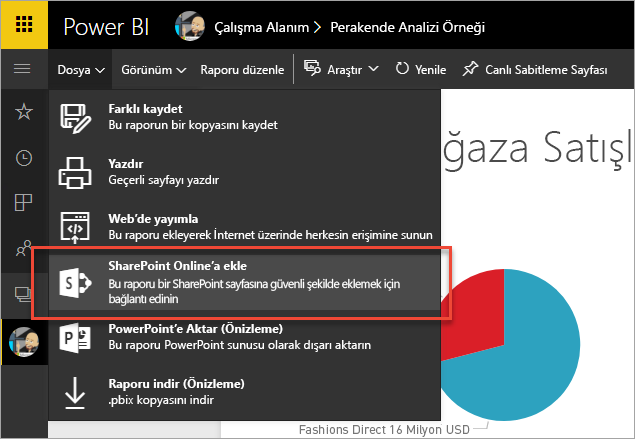
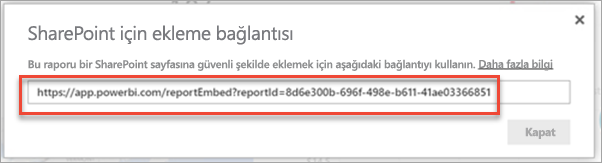
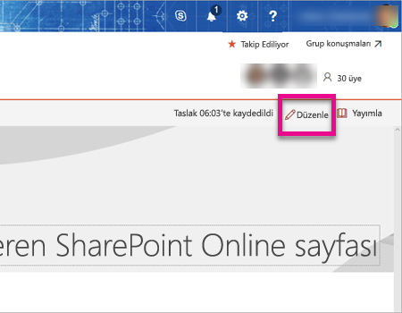
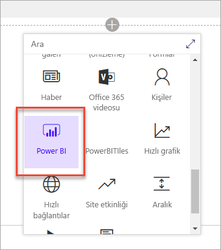
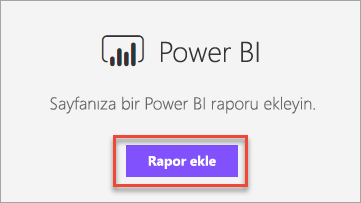
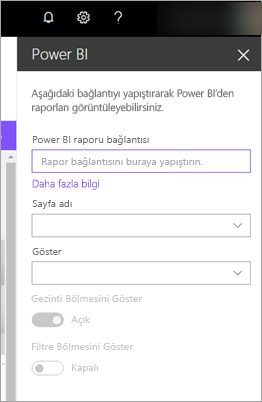
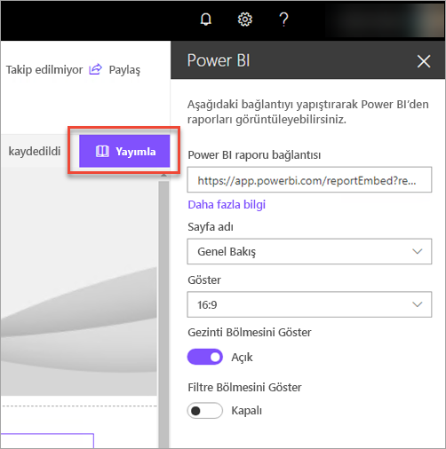
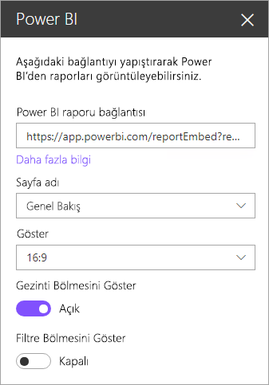
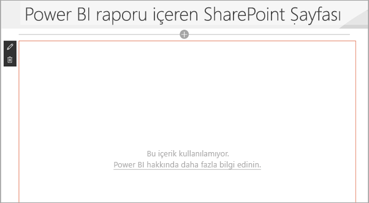

# SharePoint Online'da rapor web bölümüyle ekleme

Power BI'ın SharePoint Online'a yönelik yeni rapor web bölümü ile etkileşimli Power BI raporlarını SharePoint Online sayfalarına kolayca ekleyebilirsiniz.

Yeni **SharePoint Online'a ekle** seçeneğini kullandığınızda, eklenen raporlar tamamen güvenli olduğu için kolayca güvenli iç portal oluşturabilirsiniz.

## Gereksinimler

**SharePoint Online'a ekle** seçeneği kullanılarak eklenen raporlarının çalışması için birkaç gereksinim vardır.

* SharePoint Online'a yönelik Power BI web bölümü için [Modern Sayfalar](https://support.office.com/article/Allow-or-prevent-creation-of-modern-site-pages-by-end-users-c41d9cc8-c5c0-46b4-8b87-ea66abc6e63b) gereklidir.

## Raporunuzu ekleme

Raporunuzu SharePoint Online'a eklemek için öncelikle raporun URL'sini alıp bu URL'yi SharePoint Online'daki yeni Power BI web bölümünde kullanmanız gerekir.

### Raporunuzun URL'sini alma

1. Raporu Power BI hizmetinde görüntüleyin.

2. **Dosya** menü öğesini seçin.

3. **SharePoint Online'a ekle**'yi seçin.
   
    

4. İletişim kutusundaki URL'yi kopyalayın.

    

   > [!NOTE]
   > Raporları görüntülerken web tarayıcınızın adres çubuğunda görüntülenen URL'leri de kullanabilirsiniz. Bu URL, görüntülemekte olduğunuz rapor sayfasını içerir. Farklı bir sayfayı kullanmak istiyorsanız URL'deki rapor bölümünü kaldırmanız gerekir.

### Power BI raporunu bir SharePoint Online sayfasına ekleme

1. SharePoint Online'da raporu eklemek istediğiniz sayfayı açıp **Düzenle**'yi seçin.

    

    Alternatif olarak, SharePoint Online'da **+ Yeni**'yi seçerek yeni bir modern site oluşturabilirsiniz.

    

2. **+** öğesini ve **Power BI** web bölümünü seçin.

    

3. **Rapor ekle**'yi seçin.

    

4. Rapor URL'sini özellik bölmesine yapıştırın. Bu, yukarıdaki adımlarda kopyaladığınız URL'dir. Rapor otomatik olarak yüklenir.

    

5. SharePoint Online kullanıcılarınızın bu değişikliği görebilmesi için **Yayımla**'yı seçin.

    

## Raporlara yönelik erişim izni verme

Bir raporu SharePoint Online'a eklediğinizde kullanıcılara raporu görüntüleme izni otomatik olarak verilmez. Raporu görüntüleme izinleri Power BI hizmetinde ayarlanır.

> [!IMPORTANT]
> Power BI hizmetinde, raporu görebilecek olan kullanıcıları belirleyip listede olmayanlara erişim izni vermeyi unutmayın.

Power BI hizmetinde rapora yönelik erişim izni vermek için kullanabileceğiniz iki yöntem vardır. SharePoint Online ekip sitenizi oluşturmak için bir Office 365 Grubu kullanıyorsanız kullanıcıyı, Power BI hizmetindeki uygulama çalışma alanının bir üyesi olarak eklersiniz. Bu sayede kullanıcılar söz konusu grubun içeriğini görüntüleyebilir. Daha fazla bilgi için bkz. [Power BI'da uygulama oluşturma ve dağıtma](service-create-distribute-apps.md).

Alternatif olarak, kullanıcılarınıza rapora yönelik erişim izni vermek için aşağıdaki yöntemleri kullanabilirsiniz.

1. Rapordan panoya bir kutucuk ekleme.

2. Panoyu, rapora erişmesi gereken kullanıcılarla paylaşma. Daha fazla bilgi için bkz. [Panoları iş arkadaşlarınızla ve diğer kişilerle paylaşma](service-share-dashboards.md).

## Web bölümü ayarları

Aşağıda, SharePoint Online'a yönelik Power BI web bölümü için yapılabilecek ayarların açıklamalarına yer verilmiştir.

| Özellik | Açıklama |
| --- | --- |
| Sayfa adı |Web bölümü tarafından gösterilen varsayılan sayfayı ayarlar. Açılan listeden bir değer seçin. Herhangi bir sayfa görüntülenmiyorsa raporunuzda tek sayfa vardır veya yapıştırdığınız URL bir sayfa adı içeriyordur. Belirli bir sayfayı seçmek için URL'deki rapor bölümünü kaldırın. |
| Görüntüle |Bu seçenek, raporun SharePoint Online sayfasına nasıl yerleştirileceğini ayarlamanızı sağlar. |
| Gezinti Bölmesini Göster |Gezinti bölmesini gösterir veya gizler. |
| Filtre Bölmesini Göster |Filtre bölmesini gösterir veya gizler. |

## Çok faktörlü kimlik doğrulaması

Power BI ortamınızda oturum açmak için çok faktörlü kimlik doğrulaması kullanmanız gerekiyorsa kimliğinizi doğrulamak için bir güvenlik cihazıyla oturum açmanız istenebilir. Bu durum SharePoint Online oturumunuzu çok faktörlü kimlik doğrulaması kullanmadan açmış olmanız ancak Power BI ortamınızın, güvenlik cihazıyla doğrulanmış bir hesap istemesi durumunda ortaya çıkar.

> [!NOTE]
> Çok faktörlü kimlik doğrulaması henüz Azure Active Directory 2.0 sürümünde desteklenmemektedir. Kullanıcılar *hata* ifadesini içeren bir iletiyle karşılaşacaktır. Kullanıcı, güvenlik cihazını kullanarak SharePoint Online oturumu açması halinde raporu görüntüleyebilir.

## Yüklenmeyen raporlar

Raporunuz, Power BI web bölümünde yüklenmeyebilir ve aşağıdaki ileti görüntülenebilir.

*Bu içerik kullanılamıyor.*

Bu iletinin iki olası nedeni vardır.

1. Rapora erişiminiz yoktur.
2. Rapor silinmiştir.

Sorunu çözmenize yardımcı olması için SharePoint Online sayfasının sahibiyle iletişime geçmeniz gerekir.

## Bilinen sorunlar ve sınırlamalar

* **Error: "An error occurred, please try logging out and back in and then revisiting this page. Correlation id: undefined, http response status: 400, server error code 10001, message: Missing refresh token"** (Hata: Bir hata oluştu, lütfen oturumunuzu kapatıp açtıktan sonra bu sayfayı yeniden ziyaret etmeyi deneyin. Bağıntı kimliği: tanımsız, http yanıtı durumu: 400, sunucu hata kodu 10001, ileti: Yenileme belirteci eksik)
  
  Bu hatayla karşılaşırsanız lütfen aşağıdakilerden birini yapmayı deneyin.
  
  1. SharePoint oturumunuzu kapatıp tekrar açın. Tekrar oturum açmadan önce tüm tarayıcı pencerelerini kapattığınızdan emin olun.

  2. Kullanıcı hesabınız için çok faktörlü kimlik doğrulaması (MFA) kullanmanız gerekiyorsa SharePoint oturumunuzu, çok faktörlü kimlik doğrulaması cihazınızı (telefon uygulaması, akıllı kart vb.) kullanarak açtığınızdan emin olun.

* Power BI, SharePoint Online ile aynı yerelleştirilmiş dilleri desteklemez. Bu nedenle, eklenen rapordaki yerelleştirme doğru olmayabilir.

* Internet Explorer 10 kullanıyorsanız sorunlarla karşılaşabilirsiniz. [Office 365](https://products.office.com/office-system-requirements#Browsers-section) ve [Power BI için tarayıcı desteği](service-browser-support.md) sayfalarına bakabilirsiniz.

* Power BI web bölümü [ulusal bulutlarda](https://powerbi.microsoft.com/en-us/clouds/) kullanılamaz. 

## Sonraki adımlar

[Son kullanıcıların modern site oluşturmasına izin verme veya bunu engelleme](https://support.office.com/article/Allow-or-prevent-creation-of-modern-site-pages-by-end-users-c41d9cc8-c5c0-46b4-8b87-ea66abc6e63b)  
[Power BI'da uygulama oluşturma ve dağıtma](service-create-distribute-apps.md)  
[Panoları iş arkadaşlarınızla ve diğer kişilerle paylaşma](service-share-dashboards.md)  
[Power BI Premium nedir?](service-premium.md)  

Başka bir sorunuz mu var? [Power BI Topluluğu'na sorun](http://community.powerbi.com/) 

