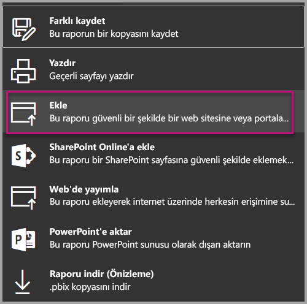
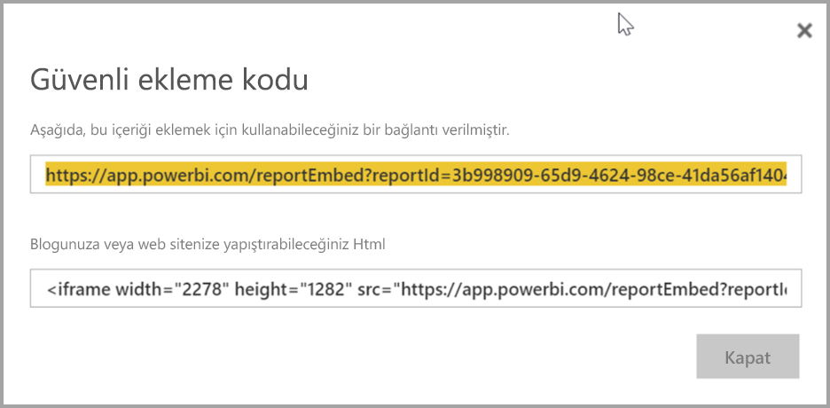
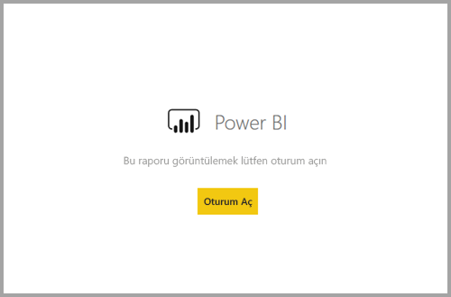
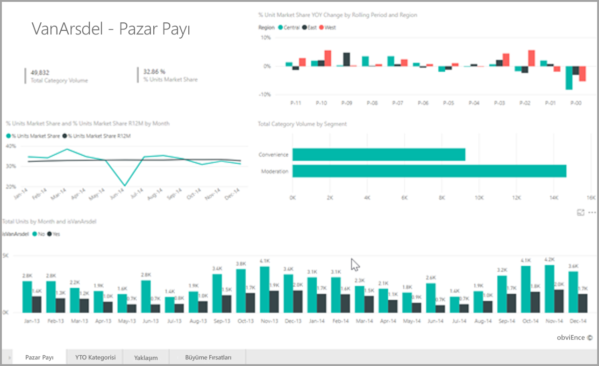

# <a name="embed-a-report-in-a-secure-portal-or-website"></a>Raporu güvenli bir portala veya web sitesine ekleme

Yeni **ekleme** seçeneği için Power BI raporları, kolayca ve güvenli bir şekilde katıştırabilir raporları iç web portallarında. Bu portallar olabilir **bulut tabanlı** veya **şirket içinde barındırılan**, SharePoint 2019 gibi. Katıştırılmış raporlar aracılığıyla tüm öğe izinleri ve veri güvenliği saygı [satır düzeyi güvenlik (RLS)](service-admin-rls.md). Kod içermeyen bir URL veya iFrame kabul eden herhangi bir portal katıştırma sağlarlar. 

**Ekleme** seçeneğini destekler [URL filtrelerinin](service-url-filters.md) ve URL ayarları. Bu, HTML ve JavaScript yalnızca temel bilgi gerektiren bir düşük kodlu yaklaşımı kullanarak portalı ile tümleştirmenize olanak sağlar.

## <a name="how-to-embed-power-bi-reports-into-portals"></a>Power BI raporlarını portallara **ekleme**

1. Power BI hizmetinde raporlara yönelik yeni **Ekle** seçeneği **Dosya** menüsünde sağlanır.

    

2. Seçin **ekleme** bağlantı ve güvenli bir rapor eklemek için kullanabileceğiniz bir iFrame sağlayan bir iletişim kutusunu açmak için seçenek.

    

3. Kullanıcı raporu URL'si doğrudan açar veya bir web Portalı'nda katıştırılmış olsun, rapor erişimi kimlik doğrulaması gerektirir. Bir kullanıcı için Power BI, tarayıcı oturumu açmış olmayan aşağıdaki ekranda görüntülenir. Bunlar seçtiğinizde **oturum açma**, yeni bir tarayıcı penceresi veya sekmesinde açılamıyor. Kullanıcılar oturum açmak için yoksa sorulduğunda için açılır pencere engelleyicileri denetleyin sağlayın.

    

4. Kullanıcı oturum açtıktan sonra rapor, sayfa gezintisi ve filtre ayarı verileri gösterir ve açılır. Yalnızca görüntüleme iznine sahip kullanıcılar, Power BI raporunda görebilirsiniz. Tüm [satır düzeyi güvenlik (RLS)](service-admin-rls.md) kuralları da uygulanır. Son olarak, kullanıcının doğru bir biçimde lisanslanmış olması gerekir. Power BI Pro lisansı gereklidir veya rapor bir Power BI Premium kapasitesinde yer alan bir çalışma alanında olmalıdır. Her zaman, yeni bir tarayıcı penceresi açın oturum açmak kullanıcının olmalıdır. Ancak, oturum açtıktan sonra diğer raporları otomatik olarak yükleyin.

    

5. İFrame kullanarak, düzenlemeniz gerekebilir **yükseklik** ve **genişliği** portal web sayfasında sığdırmak için.

    

## <a name="granting-report-access"></a>Rapor erişimi verme

**Ekleme** seçeneği kullanıcıların raporu görüntülemek için otomatik olarak izin vermez. Görüntüleme izinleri Power BI hizmetinde ayarlanır.

Power BI hizmetinde, ekli raporlar erişim gerektiren kullanıcılar ile paylaşabilirsiniz. Bir Office 365 grubu kullanıyorsanız, kullanıcı bir uygulama çalışma alanı üyesi olarak listeleyebilirsiniz. Daha fazla bilgi için bkz. nasıl [Power BI ve Office 365'te uygulama çalışma alanınızı yönetme](service-manage-app-workspace-in-power-bi-and-office-365.md).

## <a name="licensing"></a>Lisanslama

Ekli raporu görüntülemek için kullanıcıların bir Power BI Pro lisansı gerekir veya içerik içinde bir çalışma alanında olması gerekiyor bir [Power BI Premium kapasitesi (EM veya P SKU)](service-admin-premium-purchase.md).

## <a name="customize-your-embed-experience-using-url-settings"></a>URL ayarlarını kullanarak ekleme deneyiminizi özelleştirme

Ekleme URL'nin giriş ayarlarını kullanarak kullanıcı deneyimi özelleştirebilirsiniz. Sağlanan iFrame içinde URL'nin güncelleştirebilirsiniz **src** ayarları.

| Özellik  | Açıklama  |  |  |  |
|--------------|-----------------------------------------------------------------------------------------------------------------------------------------------------------------------------------------------------------------------|---|---|---|
| pageName  | Kullanabileceğiniz **pageName** sorgu dizesi parametresi hangi rapor sayfasını açmak için ayarlanacak. Bu değer rapor URL'nin sonunda Power BI hizmetinde bir raporu görüntülerken, aşağıda gösterildiği gibi bulabilirsiniz. |  |  |  |
| URL Filtreleri  | Kullanabileceğiniz [URL filtrelerinin](service-url-filters.md) ekleme URL'de ekleme içeriği filtrelemek için Power BI Arabiriminden aldı. Bu şekilde, yalnızca temel düzeyde bir HTML ve JavaScript deneyimiyle alt düzey kod tümleştirmeleri oluşturabilirsiniz.  |  |  |  |

## <a name="set-which-page-opens-for-an-embedded-report"></a>Hangi sayfa için eklenmiş bir raporu açar küme 

Bulabilirsiniz **pageName** Power BI hizmetinde bir raporu görüntülerken, rapor URL'nin sonunda bir değer.

1. Web tarayıcınızda Power BI hizmetinden raporu açın ve ardından adres çubuğuna URL'yi kopyalayın.

    

2. **pageName** ayarını URL'nin sonuna ekleyin.

    

## <a name="filter-report-content-using-url-filters"></a>URL filtrelerini kullanarak rapor içeriğini filtreleme 

Kullanabileceğiniz [URL filtrelerinin](service-url-filters.md) farklı rapor görünümlerini sağlamak için. Örneğin aşağıdaki URL, Enerji sektörüne ilişkin verileri gösterecek şekilde raporu filtreler.

**pageName** ile [URL Filtreleri](service-url-filters.md)'nin birlikte kullanılması güçlü bir sonuç verebilir. Temel HTML ve JavaScript kullanarak deneyimler oluşturabilirsiniz.

Örneğin, bir HTML sayfasına ekleyebilirsiniz. bir düğme şu şekildedir:

```html
<button class="textLarge" onclick='show("ReportSection", "Energy");' style="display: inline-block;">Show Energy</button>
```

Bu onay kutusu seçildiğinde, düğmeye iFrame enerji sektör filtre içeren güncelleştirilmiş bir URL ile güncelleştirmek için bir işlevi çağırır.

```javascript
function show(pageName, filterValue)

{

var newUrl = baseUrl + "&pageName=" + pageName;

if(null != filterValue && "" != filterValue)

{

newUrl += "&$filter=Industries/Industry eq '" + filterValue + "'";

}

//Assumes there’s an iFrame on the page with id=”iFrame”

var report = document.getElementById("iFrame")

report.src = newUrl;

}
```


Alt düzey kodlu özel bir deneyim oluşturmak için istediğiniz kadar çok düğme ekleyebilirsiniz. 

## <a name="considerations-and-limitations"></a>Önemli noktalar ve sınırlamalar

* Azure işletmeler arası (B2B) ile dışarıdan konuk kullanıcıları desteklemez.

* Güvenli ekleme özelliği Power BI hizmetinde yayımlanmış olan raporlarda çalışır.

* Kullanıcı, yeni bir tarayıcı penceresi açtığınızda raporu görüntülemek oturum açmanız gerekir.

* Bazı tarayıcılar özellikle InPrivate veya Incognito modları kullanırken oturum açma, sonra sayfayı yenilemeniz gerekir.

* Tek bir oturum açma deneyimi elde etmek, ekleme SharePoint Online seçeneğini kullanın veya özel tümleştirme kullanarak bir derleme için [verilerin sahibi kullanıcıdır](developer/embed-sample-for-your-organization.md) yöntemi ekleme. 

* **Ekle** seçeneğiyle birlikte sağlanan otomatik kimlik doğrulama özelliği Power BI JavaScript API’si ile çalışmaz. Power BI JavaScript API'si için kullanmak [verilerin sahibi kullanıcıdır](developer/embed-sample-for-your-organization.md) yöntemi ekleme. 

## <a name="next-steps"></a>Sonraki adımlar

* [Power bı'da çalışmanızı paylaşmanın yolları](service-how-to-collaborate-distribute-dashboards-reports.md)

* [URL sorgu dizesi parametrelerini kullanarak bir raporu filtreleme](service-url-filters.md)

* [SharePoint Online'da rapor web bölümüyle ekleme](service-embed-report-spo.md)

* [Power BI'dan Web'de Yayımlama](service-publish-to-web.md)