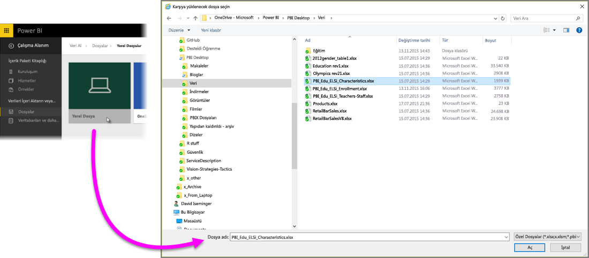
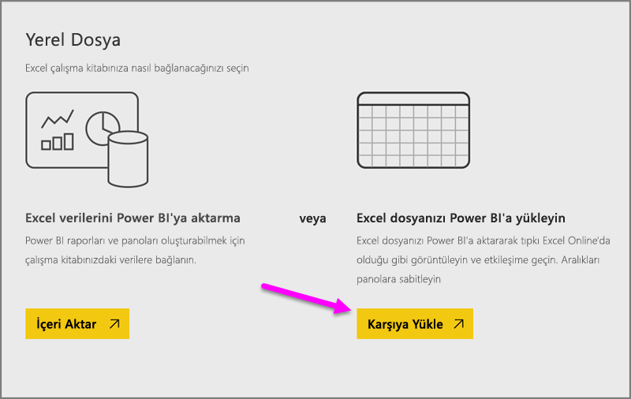
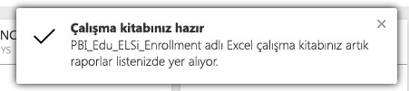
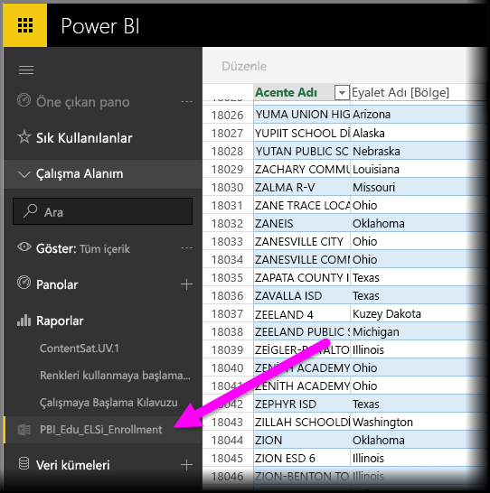

# Excel çalışma kitabı dosyalarından veri alma

Microsoft Excel, dünya çapında en yaygın olarak kullanılan iş uygulamalarından biridir. Ayrıca, verilerin Power BI'a alınması için de en sık kullanılan yöntemlerinden biridir.

## Power BI ne tür çalışma kitaplarını desteklemektedir?
Power BI, Excel 2007 ve sonraki sürümlerinde oluşturulan çalışma kitaplarını içeri aktarmayı veya bu çalışma kitaplarına bağlanmayı desteklemektedir. Çalışma kitapları .xlsx veya .xlsm dosya türünde kaydedilmeli ve 1 GB'ın altında olmalıdır. Bu makalede açıklanan bazı özellikler yalnızca Excel'in sonraki sürümlerinde kullanılabilir.

### Veri tabloları veya aralıkları içeren çalışma kitapları
Çalışma kitabınız, veri aralıkları içeren basit çalışma sayfalarına sahipse Power BI'da verilerinizden en iyi şekilde yararlanmak için bu aralıkları tablo olarak biçimlendirdiğinizden emin olun. Böylece, Power BI'da rapor oluştururken Alanlar bölmesinde, verilerinizin daha kolay görselleştirilmesini sağlayan adlandırılmış tablolar ve sütunlar görürsünüz.

### Veri modelleri içeren çalışma kitapları
Çalışma kitapları; bağlantılı tablolar, Power Query (Excel 2016'daki Al ve Dönüştür) veya Power Pivot kullanılarak yüklenen bir veya daha fazla veri tablosunun bulunduğu bir veri modeli içerebilir. Power BI; ilişkiler, ölçüler, hiyerarşiler ve KPI'ler gibi tüm veri modeli özelliklerini destekler.

> [!NOTE]
> Veri modelleri içeren çalışma kitapları, Power BI kiracıları arasında paylaşılamaz. Örneğin, Power BI'da *contoso.com* hesabı ile oturum açan bir kullanıcı, bir Excel çalışma kitabını, Power BI'da *woodgrovebank.com* hesabından oturum açan bir kullanıcı ile paylaşamaz.
> 
> 

### Dış veri kaynaklarına yönelik bağlantılar içeren çalışma kitapları
Bir dış veri kaynağına bağlanmak için Excel kullanırsanız çalışma kitabınız Power BI'a alındığında, bağlantılı veri kaynağındaki verileri temel alan raporlar ve panolar oluşturabilirsiniz. Ayrıca, doğrudan veri kaynağına otomatik olarak bağlanmak ve güncelleştirmeler almak için Zamanlanmış Yenileme'yi ayarlayabilirsiniz. Artık yenilemeyi Excel'deki Veri şeridinden el ile yapmanız gerekmez. Bu veri kaynağındaki veriler temel alınarak oluşturulan, raporlardaki tüm görselleştirmeler ve panolardaki kutucuklar, otomatik olarak güncelleştirilir. Daha fazla bilgi için bkz. [Power BI'da veri yenileme](refresh-data.md).

### Power View sayfaları, PivotTable'lar ve grafikler içeren çalışma kitapları
PowerView sayfalarınız, PivotTable'larınız ve grafiklerinizin Power BI'da nasıl görüneceği veya görünmeyeceği, çalışma kitabı dosyanızın kaydedildiği konuma ve çalışma kitabını Power BI'a almak için seçtiğiniz yönteme bağlıdır. Bu konu, aşağıda daha ayrıntılı şekilde açıklanmaktadır.

## Veri türleri
Power BI şu veri türlerini destekler: Tam Sayı, Ondalık Sayı, Para Birimi, Tarih, Doğru/Yanlış, Metin. Verileri Excel'de belirli veri türleri olarak işaretlemek, daha iyi bir Power BI deneyimi elde edilmesini sağlar.

## Çalışma kitabınızı Power BI için hazırlama
Excel çalışma kitaplarınızın Power BI için hazır olmasını nasıl sağlayacağınız hakkında daha fazla bilgi edinmek için bu faydalı videoyu izleyin.

<iframe width="500" height="281" src="https://www.youtube.com/embed/l2wy4XgQIu0" frameborder="0" allowfullscreen></iframe>

## Çalışma kitabı dosyanızı nereye kaydettiğiniz önemlidir
**Yerel**: Çalışma kitabı dosyanızı bilgisayarınızdaki bir yerel sürücüye veya kuruluşunuzdaki diğer bir konuma kaydederseniz Power BI'ı kullanarak dosyanızı Power BI'a yükleyebilirsiniz. Dosyanız gerçekte yerel sürücünüzde kalır. Böylece, dosyanın tamamı Power BI'a aktarılmamış olur. Burada gerçekleştirilen asıl işlem, Power BI'da yeni bir veri kümesinin oluşturulması ve hem verilerin hem de veri modelinin (varsa) çalışma kitabından söz konusu veri kümesine yüklenmesidir. Çalışma kitabınız Power View sayfaları içeriyorsa bu sayfalar, Power BI sitenizdeki Raporlar bölümünde görünür. Excel 2016'da **Yayımla** özelliği de bulunur (**Dosya** menüsünün altında). **Yayımla** özelliğinin kullanılması, Power BI'daki **Veri Al > Dosyalar > Yerel Dosya** yolunun kullanılması ile aynı etkiye sahip olsa da çalışma kitabında düzenli olarak değişiklik yapıyorsanız genellikle Power BI'daki veri kümenizi güncelleştirmek için daha kolay bir yöntemdir.

**OneDrive - İş**: OneDrive İş kullanıyorsanız Excel'deki çalışmalarınızla Power BI'daki veri kümenizi, raporlarınızı ve panolarınızı eşitlenmiş durumda tutmanın en etkili yolu, Power BI'da oturum açarken kullandığınız hesap ile OneDrive İş'te oturum açmaktır. Hem Power BI hem de OneDrive bulutta olduğundan Power BI, OneDrive'daki çalışma kitabı dosyanıza yaklaşık olarak her saatte bir *bağlanır*. Herhangi bir değişiklik bulunması durumunda veri kümeniz, raporlarınız ve panolarınız Power BI'da da otomatik olarak güncelleştirilir. Tıpkı çalışma kitabınızı bir yerel sürücüye kaydettiğinizde olduğu gibi, Yayımla özelliğini, Power BI'daki veri kümenizi ve raporlarınızı hemen güncelleştirmek için de kullanabilirsiniz. Bu özelliği kullanmadığınız durumlarda Power BI, genellikle bir saat içinde verilerinizi otomatik olarak eşitler.

**OneDrive - Bireysel**: Çalışma kitabı dosyalarınızı kendi OneDrive hesabınıza kaydederseniz OneDrive İş ile ilgili olarak elde ettiğiniz avantajların pek çoğundan yararlanırsınız. En büyük fark şudur: Dosyanıza ilk kez bağlanırken (Veri Al > Dosyalar > OneDrive – Bireysel yolunu izleyerek) OneDrive'da Microsoft hesabınızla oturum açmanız gerekir. Bu genellikle, Power BI'da oturum açarken kullandığınız hesaptan farklıdır. OneDrive'da Microsoft hesabınız ile oturum açarken Oturumumu açık bırak seçeneğini belirlediğinizden emin olun. Bu şekilde Power BI, yaklaşık olarak her saatte bir çalışma kitabı dosyanıza bağlanabilir, böylece Power BI'daki veri kümenizin ve raporlarınızın eşitlenmiş durumda kalmasını sağlayabilir.

**SharePoint - Ekip Siteleri**: Power BI Desktop dosyalarınızı SharePoint - Ekip Siteleri'ne kaydetme işlemi, OneDrive İş'e kaydetme işlemiyle oldukça benzerlik gösterir. En büyük fark, Power BI'dan dosyaya bağlanma şeklinizdir. Bir URL belirtebilir veya kök klasöre bağlanabilirsiniz.

## Bir Excel çalışma kitabını kullanmaya ilişkin iki yöntem
Çalışma kitabı dosyalarınızı **OneDrive**'a kaydediyorsanız Power BI'da verilerinizi araştırmak için izleyebileceğiniz iki yol vardır

### Excel verilerini Power BI'a aktarma
**İçeri aktar** seçeneğini belirlediğinizde tablo ve/veya veri modellerindeki desteklenen tüm veriler Power BI'da yeni bir veri kümesine aktarılır. Power View sayfalarınız varsa bunlar Power BI'da rapor olarak yeniden oluşturulur.

Çalışma kitabınızı düzenlemeye devam edebilirsiniz. Değişiklikleriniz kaydedildikten sonra, genellikle yaklaşık bir saat içinde Power BI'daki veri kümesi ile eşitlenir. Daha hızlı bir sonuç elde etmek istiyorsanız Yayımla'ya tekrar tıklayabilir ve değişikliklerinizin anında dışarı aktarılmasını sağlayabilirsiniz. Raporlarınızda ve panolarınızda bulunan tüm görselleştirmeler de güncelleştirilir.

Verileri bir veri modeline yüklemek için Al ve Dönüştür veya Power Pivot seçeneğini kullandıysanız ya da çalışma kitabınız, Power BI'da görmek istediğiniz görselleştirmeler içeren Power View sayfaları içeriyorsa bu seçeneği belirleyin.

Excel 2016'da, Yayımla > Dışarı Aktar seçeneğini de kullanabilirsiniz. Bu da hemen hemen aynı işe yarar. Daha fazla bilgi edinmek için bkz. [Excel 2016'daki içeriği Power BI'da yayımlama](service-publish-from-excel.md).

### Power BI'da Excel'e bağlanma, Excel verilerini yönetme ve görüntüleme
**Bağlan**'ı seçtiğinizde çalışma kitabınız, Power BI'da tıpkı Excel Online'daki gibi görünecektir. Ancak, Excel Online'dan farklı olarak çalışma sayfalarınızdaki öğeleri doğrudan panolarınıza sabitlemenize yardımcı olacak harika özellikler edineceksiniz.

Çalışma kitabınızı Power BI'da düzenleyemezsiniz. Ancak, bazı değişiklikler yapmanız gerekirse Düzenle'ye tıklayıp çalışma kitabınızı Excel Online'da düzenlemeyi veya bilgisayarınızdaki Excel'de açmayı tercih edebilirsiniz. Yaptığınız değişiklikler OneDrive'daki çalışma kitabına kaydedilir.

Bu yolu seçtiğinizde Power BI, bağlı çalışma kitabı için karşılık gelen bir veri kümesi oluşturur. Gerekirse bir Power BI raporu oluşturmak için bu veri kümesini kullanabilirsiniz. Çalışma kitabınız, Power BI çalışma alanı gezinti bölmesindeki Raporlar bölümünde de görünür. Bağlı çalışma kitaplarında özel bir Excel simgesi bulunur.

Çalışma sayfalarında yalnızca veri varsa veya panolara sabitlemek istediğiniz aralıklar, PivotTable'lar ve grafikler söz konusuysa bu seçeneğini belirleyin.

Excel 2016'da, Yayımla > Karşıya Yükle seçeneğini de kullanabilirsiniz. Bu da hemen hemen aynı işe yarar. Daha fazla bilgi edinmek için bkz. [Excel 2016'daki içeriği Power BI'da yayımlama](service-publish-from-excel.md).

## Power BI'daki içeriği bir Excel çalışma kitabına aktarma veya bağlama
1. Power BI'daki gezinti bölmesinden **Veri Al**'ı seçin.
   
   
2. Dosyalar'da, **Al**'a tıklayın.
   
   
3. Dosyanızı bulun.
   
   
4. Çalışma kitabı dosyanız OneDrive veya SharePoint - Ekip Siteleri'ndeyse **İçeri aktar** veya **Bağlan** seçeneğini belirleyin.

## Yerel Excel çalışma kitapları
Yerel bir Excel dosyası kullanıp bu dosyayı da Power BI'a yükleyebilirsiniz. Önceki menüden **Yerel Dosya**'yı seçin ve Excel çalışma kitaplarınızın kaydedildiği konuma gidin.

Seçimi yaptıktan sonra dosyanızı Power BI'a Yükleme seçeneğini belirleyin.

Çalışma kitabınız karşıya yüklendikten sonra çalışma kitabının hazır olduğunu belirten bir bildirim alırsınız.

Hazır olduğunda çalışma kitabınızı Power BI'ın **Raporlar** bölümünde bulabilirsiniz.

## Excel 2016'daki içeriği Power BI sitenizde yayımlama
Excel 2016'daki **Power BI'da Yayımla** özelliğinin kullanılması, dosyanızın içeri aktarılması veya dosyanıza bağlanılması için Power BI'da kullanılan **Veri Al** seçeneği ile aynı işlevi görür. Ayrıntıları burada ele almayacak olsak da daha fazla bilgi için [Excel 2016'daki içeriği Power BI'da yayımlama](service-publish-from-excel.md) makalesini inceleyebilirsiniz.

## Sorun giderme
Çalışma kitabı dosyası çok mu büyük? [Power BI'da görüntülemek üzere bir Excel çalışma kitabının boyutunu azaltma](reduce-the-size-of-an-excel-workbook.md) makalesine göz atın.

Geçerli sürümde İçeri Aktar özelliği seçildiğinde, Power BI yalnızca bir adlandırılmış tablo veya veri modelinin parçası olan verileri içeri aktarır. Sonuç olarak, çalışma kitabı adlandırılmış tablo, Power View sayfası veya Excel veri modeli içermiyorsa şu hatayla karşılaşabilirsiniz: **"Excel çalışma kitabınızda herhangi bir veri bulamadık"**. [Bu makale](service-admin-troubleshoot-excel-workbook-data.md), çalışma kitabınızı düzeltme ve yeniden içeri aktarma hakkında bilgi vermektedir.

## Sonraki adımlar
**Verilerinizi araştırma**: Dosyanızdaki verileri ve raporları Power BI'a aktardığınıza göre artık araştırmaya başlayabilirsiniz. Yeni veri kümesine sağ tıklayıp Araştır seçeneğini belirlemeniz yeterlidir. 4. adımda OneDrive'daki bir çalışma kitabı dosyasına bağlanmayı seçerseniz çalışma kitabınız Raporlar bölümünde görünür. Çalışma kitabına tıkladığınızda, söz konusu çalışma kitabı, Power BI'da tıpkı Excel Online'da olduğu gibi açılır.

**Yenileme zamanlama**: Excel çalışma kitabı dosyanız dış veri kaynaklarına bağlanıyorsa veya dosyayı bir yerel sürücüden içeri aktardıysanız veri kümenizin ya da raporunuzun her zaman güncel olduğundan emin olmak için zamanlanmış yenileme ayarlayabilirsiniz. Çoğu durumda, zamanlanmış yenileme ayarlamak oldukça kolaydır ancak bu makalede ayrıntılara yer vermek amaçlanmamıştır. Daha fazla bilgi edinmek için bkz. [Power BI'da veri yenileme](refresh-data.md).

[Excel 2016'daki içeriği Power BI'da yayımlama](service-publish-from-excel.md)

[Excel için Power BI Publisher](publisher-for-excel.md)

[Power BI'da veri yenileme](refresh-data.md)

