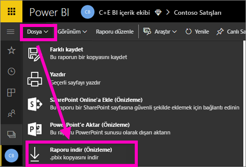
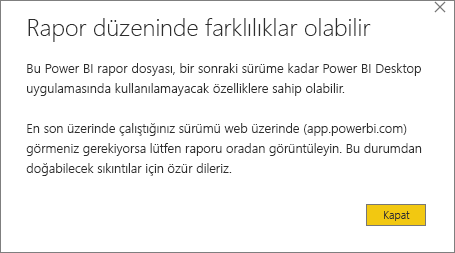
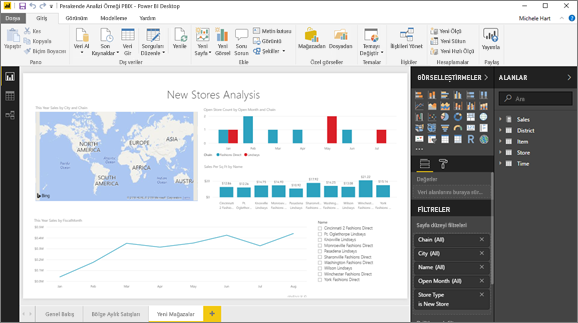

# Bir raporu Power BI hizmetinden Power BI Desktop'a aktarma (Önizleme)
Power BI Desktop uygulamasında bir raporu kaydedip **Yayımla**'yı seçerek Power BI hizmetine aktarabilirsiniz (*indirme* olarak da adlandırılır). Ayrıca, bu dışarı aktarma işleminin yönünü değiştirip Power BI hizmetinde bulunan bir raporu Desktop uygulamasına indirebilirsiniz. Herhangi bir yönde dışarı aktarılan dosyaların uzantısı *.pbix* olur.

Dikkat etmeniz gereken bazı sınırlamalar ve önemli noktalar bu makalenin sonraki bölümlerinde ele alınmıştır.

## Raporu .pbix olarak indirme
.pbix dosyasını indirmek için şu adımları uygulayın:

1. **Power BI hizmetinde** indirmek istediğiniz raporu [Düzenleme görünümü](service-reading-view-and-editing-view.md)'nde açın.
2. Menü çubuğundan **Dosya > Raporu indir**'i seçin.
   
   > [!NOTE]
   > Raporun indirilebilmesi için 23 Kasım 2016 tarihinden sonra [Power BI Desktop kullanılarak oluşturulmuş](guided-learning/publishingandsharing.yml?tutorial-step=2) ve bu tarihten sonra güncelleştirilmiş olması gerekir. Aksi halde Power BI hizmetindeki *Raporu indir* seçeneği gri renkte görünür.
   > 
   > 
3. .pbix dosyası oluşturulurken bir durum başlığında ilerleme durumu görüntülenir. Hazır olduğunda .pbix dosyasını açmanız veya kaydetmeniz istenir. Dosyanın adı raporun başlığıyla aynı olur.
   
    
   
    Artık .pbix dosyasını ister Power BI hizmetinde (app.powerbi.com) isterseniz de Power BI Desktop uygulamasında açabilirsiniz.     
4. Raporu Desktop uygulamasında hemen açmak için **Aç**'ı seçin. Dosyayı belirli bir konuma kaydetmek için **Kaydet > Farklı Kaydet**'i seçin. Henüz yüklü değilse [Power BI Desktop uygulamasını yükleyin](desktop-get-the-desktop.md).
   
    Raporu Desktop uygulamasında açtığınızda Power BI hizmeti raporunda bulunan bazı özelliklerin Desktop uygulamasında kullanılamayacağını belirten bir uyarı iletisiyle karşılaşabilirsiniz.
   
    

5. Desktop'taki rapor düzenleyicisi ile Power BI hizmetindeki rapor düzenleyicisi neredeyse aynı görünüme sahiptir.  
   
    

## Önemli noktalar ve sorun giderme
Power BI hizmetinden *.pbix* dosyası indirirken (dışarı aktarırken) dikkat etmeniz gereken bazı önemli noktalar ve sınırlamalar vardır.

* Dosyayı indirebilmek için raporu düzenleme iznine sahip olmanız gerekir
* Raporun **Power BI Desktop** kullanılarak oluşturulup **Power BI hizmetinde** *yayımlanmış* olması veya .pbix dosyasının hizmete *yüklenmiş* olması gerekir.
* Raporların 23 Kasım 2016'dan sonra yayımlanmış veya güncelleştirilmiş olması gerekir. Bu tarihten önce yayımlanmış olan raporlar indirilemez.
* Bu özelik, içerik paketleri de dahil olmak üzere **Power BI hizmetinde** oluşturulmuş olan raporlarla kullanılamaz.
* İndirilen dosyaları açarken mutlaka **Power BI Desktop** uygulamasının son sürümünü kullanmanız gerekir. İndirilen *.pbix* dosyaları **Power BI Desktop** uygulamasının eski sürümlerinde açılmayabilir.
* Yöneticiniz verileri dışarı aktarma özelliğini devre dışı bıraktıysa bu özellik **Power BI hizmetinde** görüntülenmez.
* Artımlı yenileme ile veri kümesi bir *.pbix* dosyasına indirilemez.

## Sonraki adımlar
Bu özellik hakkındaki bir dakikalık **Guy in a Cube** videosunu izleyin:

<iframe width="560" height="315" src="https://www.youtube.com/embed/ymWqU5jiUl0" frameborder="0" allowfullscreen></iframe>

**Power BI hizmetini** kullanmayı öğrenmenize yardımcı olabilecek farklı makaleleri de inceleyebilirsiniz:

* [Power BI'daki raporlar](service-reports.md)
* [Power BI - Temel Kavramlar](service-basic-concepts.md)

**Power BI Desktop** uygulamasını yükledikten sonra aşağıdaki makaleler hızlı bir şekilde çalışmaya başlamanızı sağlayabilir:

* [Power BI Desktop ile çalışmaya başlama](desktop-getting-started.md)

Başka bir sorunuz mu var? [Power BI Topluluğu'na başvurun](http://community.powerbi.com/)   

