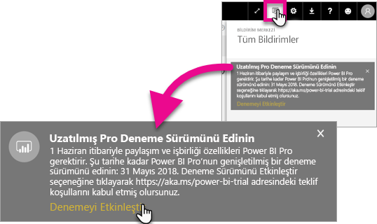
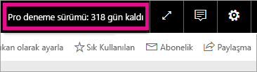

# Uzatılmış Pro Deneme Sürümünü etkinleştirme
1 Haziran 2017 tarihinden başlayarak uygun olan tüm kullanıcılar Power BI hizmeti için Uzatılmış Pro Deneme Sürümünü kullanmaya başlayabilecek.

<iframe width="640" height="360" src="https://www.youtube.com/embed/tPsNoPyY9aA?showinfo=0" frameborder="0" allowfullscreen></iframe>

[3 Mayıs 2017 Power BI Premium duyurusunun](https://powerbi.microsoft.com/blog/microsoft-accelerates-modern-bi-adoption-with-power-bi-premium/) bir parçası olarak Microsoft, Power BI hizmetinde yapılan ve 1 Haziran 2017'den itibaren geçerli olarak hizmet değişikliklerini paylaştı. Bu değişiklikler; erişimin tüm veri kaynaklarına genişletilmesi, daha yüksek çalışma alanı depolama sınırları ve daha yüksek yenileme ile akış oranlarını getirerek sürümü Power BI Pro'ya eşdeğer hale getirdi.

Duyuruda aynı zamanda eşler arası pano paylaşma, grup çalışma alanları (yeni adıyla uygulama çalışma alanları), PowerPoint'e aktarma ve Power BI uygulamalarıyla Excel'de çözümleme yapma gibi paylaşım ve işbirliği özelliklerinin yalnızca Power BI Pro kullanıcıları tarafından kullanılabileceği de paylaşıldı. CSV/Excel ve PowerPoint' aktarma, 3 Mayıs'ta Power BI Pro'ya özgü özellikler olarak açıklanmıştı ancak geniş kullanıcı topluluklarından alınan geri bildirim sonucunda bu özelliğin Ücretsiz hizmet kullanıcılarına da sunulması kararı verildi.

1 Haziran 2017'den başlayarak geçtiğimiz yıl içinde (2 Mayıs 2017 veya öncesinde) hizmeti aktif olarak kullanan Ücretsiz hizmet kullanıcıları Power BI Pro sürümünün ücretsiz ve 12 aylık uzatılmış deneme sürümünü kullanma hakkına sahip olacak. Kullanıcıların Power BI Pro sürümünün tüm özelliklerini bir yıl daha kullanmalarını sağlayacak olan bu teklif, topluluğa bir teşekkürün yanı sıra kullanıcılara tanınan değişikliklere ayak uydurma süresi olarak değerlendirilebilir.

1 Haziran 2017 tarihinde teklif için uygun olan kullanıcılar, hizmette oturum açtıklarında değişikliklerin yapıldığını bildiren ve Uzatılmış Power BI Pro deneme sürümü teklifine kaydolmalarını isteyen bir bildirimle karşılaşacaktır. Ürün içi bildirimler kullanıcının BT yöneticisinin kontrolünde değildir. Ayrıca BT yöneticisi kullanıcının yerine uzatılmış Power BI Pro deneme sürümüne kaydolamaz. Teklif için uygun olan tüm kullanıcıların bu işlemi gerçekleştirmek için gerekli eylemleri yerine getirmesi gerekir.

Kullanıcılar teklife 12 aylık sürenin herhangi bir noktasına katılabilir ancak Uzatılmış Pro deneme sürümü teklifi, kabul ettikleri tarihten bağımsız olarak tüm kullanıcılar için 31 Mayıs 2018 tarihinde sona erecektir. Belirtilen tarihte kullanıcılar, Power BI Pro sürümünü satın alma seçeneğine veya Power BI Pro sürümünü satın almayı tercih etmemeleri halinde Power BI'ın paylaşım ve işbirliği özelliklerine sahip olmayan Ücretsiz sürümüne geçme seçeneğine sahip olacaktır.

Power BI Pro sürümünde herhangi bir değişiklik yapılmayacaktır. Bu kullanıcılar değişiklikten etkilenmeyecek ve 1 Haziran 2017 veya sonrasında hizmette oturum açtığında herhangi bir bildirim görmeyecektir. Uzatılmış Power BI Pro deneme sürümü teklifini reddeden veya teklif için uygun olmayan kullanıcılar, Power BI uygulamasının paylaşım ve işbirliği özellikleri bulunmayan Ücretsiz sürümünü kullanmaya devam edebilecektir. Bu kullanıcılar, Power BI [web sitesini](https://powerbi.microsoft.com/get-started/) ziyaret ederek diledikleri zaman standart 60 günlük Power BI Pro deneme sürümüne kaydolabilir.

## Uzatılmış Pro Deneme Sürümü için uygunluk durumu
Hesabınızın Uzatılmış Pro Deneme Sürümü teklifine uygun olabilmesi için aşağıdaki gereksinimleri karşılaması gerekir.

* 3 Mayıs 2016 ve 2 Mayıs 2017 tarihleri arasında etkin olan Ücretsiz Power BI sürümü kullanıcıları Uzatılmış Pro Deneme Sürümü için uygundur.
* *60 günlük ürün içi Pro deneme sürümünü* kullanmış veya kullanmakta olan kullanıcılar da Uzatılmış Pro Deneme Sürümünden faydalanabilir.

> [!NOTE]
> Office 365'te Power BI Pro veya Power BI Pro Deneme Sürümü aboneliği lisansı atanmış olan kullanıcılar bu teklife dahil değildir.
> 
> 

## Etkinleştirme
Uzatılmış Pro Deneme Sürümünü iki farklı şekilde etkinleştirebilirsiniz. Birincisi Power BI'da oturum açmaktır. Bildirimi kapattıysanız bildirim alanında da bir seçenek göreceksiniz.

> [!NOTE]
> Ürün içi iletiler yönetici denetiminde değildir ve uygun kullanıcılarla paylaşılır.
> 
> 

### Oturum açma deneyimi
Power BI hizmetinde oturum açtığınızda teklif için uygunsanız bir açılır bildirim görürsünüz. **Deneme Sürümünü Etkinleştir**'i seçtiğinizde Uzatılmış Pro Deneme Sürümü başlar. Başka bir işlem yapmanıza gerek yoktur.

Bunu yaptığınızda deneme süresi boyunca paylaşılan panoların ve raporların tümüne erişebilirsiniz.

**Şimdi Değil**'i seçtiğinizde Uzatılmış Pro Deneme Sürümünü deneme süresinin sonu olan 31 Mayıs 2018 tarihine kadar etkinleştirebilirsiniz.

### Daha sonraki bir tarihte etkinleştirme
**Şimdi Değil**'i seçerek açılır pencereyi kapattıysanız Uzatılmış Pro Deneme Sürümünü deneme süresinin sonu olan 31 Mayıs 2018 tarihine kadar etkinleştirebilirsiniz. Bunun için **Bildirim merkezi**'ne gitmeniz gerekir.

Bildirim merkezinde Uzatılmış Pro Deneme Sürümüyle ilgili bir bildirim görürsünüz. Bu bildirim kullanıcı tarafından kapatılana kadar kalır.

Deneme sürümünü başlatmak için bildirimin içinden **Deneme Sürümünü Etkinleştir**'i seçin. Başka bir işlem yapmanıza gerek yoktur.

Bunu yaptığınızda deneme süresi boyunca paylaşılan panoların ve raporların tümüne erişebilirsiniz.

## Etkinleştirdikten sonra
Etkinleştirme işleminden sonra deneme sürümü için kalan gün sayısı sağ üst köşede gösterilir.

[Uzatılmış Pro Deneme Sürümü teklifi hüküm ve koşullarını](https://aka.ms/power-bi-trial) gözden geçirebilirsiniz. Uzatılmış Pro Deneme Sürümü tüm kullanıcılar için 31 Mayıs 2018 tarihine kadar devam edecektir.

## Sık Sorulan Sorular
**3 Mayıs 2017 tarihinden sonra kaydolan kullanıcılara ne olacak?**

3 Mayıs 2017 tarihinde veya sonrasında Ücretsiz Power BI sürümüne kaydolan kullanıcılar, Uzatılmış Pro Deneme Sürümünden faydalanamaz. Ancak standart 60 günlük Pro Deneme Sürümünü kullanabilirler.

**Kuruluşumda kimlerin Uzatılmış Pro Deneme Sürümünü kullanmaya uygun olduğunu nasıl öğrenebilirim?**

Bunu herhangi bir şekilde doğrudan öğrenemeseniz de kuruluşunuzda son 30 gündeki etkin kullanıcıları görüntülemek için Power BI için Azure Active Directory Integrated Applications raporunu inceleyebilirsiniz. Bu bilgi, teklifi kullanabilecek kullanıcılar hakkında fikir verebilir. Daha fazla bilgi için bkz. [Oturum açmış Power BI kullanıcılarını bulma](service-admin-access-usage.md).

Uygunluk döneminde olan ve ücretsiz lisansa sahip etkin kullanıcılara açılır bildirim gönderilecektir. 

> [!NOTE]
> Azure AD raporu bir kullanıcının Power BI'da Ücretsiz veya Pro kullanıcı olma durumunu göstermez. Yalnızca hangi kullanıcıların ne zaman Power BI'da oturum açtığını belirtir. Bir kullanıcının bu raporda yer alması, Uzatılmış Pro Deneme Sürümü için uygun olduğu anlamına gelmez.
> 
> 

**Yöneticiler kullanıcıların Uzatılmış Pro Deneme Sürümünü etkinleştirmesini kısıtlayabilir mi?**

Hayır. Yöneticilerin, kullanıcıların Uzatılmış Pro Deneme Sürümünü veya hizmet içi 60 günlük Power BI Pro deneme sürümünü etkinleştirmesini kısıtlamasını sağlayacak bir yöntem yoktur.

## Sonraki adımlar
[Extended Pro Trial offer terms and conditions (Uzatılmış Pro Deneme Sürümü teklifi hüküm ve koşulları)](https://aka.ms/power-bi-trial)  
[Power BI Service agreement for individual users (Bireysel kullanıcılar için Power BI Hizmeti sözleşmesi)](https://powerbi.microsoft.com/terms-of-service/)  
[Power BI Premium announcement (Power BI Premium duyurusu)](https://aka.ms/pbipremium-announcement)  
[Oturum açmış Power BI kullanıcılarını bulma](service-admin-access-usage.md)

Başka bir sorunuz mu var? [Power BI Topluluğu'na sorun](https://community.powerbi.com/)

