# Microsoft Flow ve Power BI

[Microsoft Flow](https://flow.microsoft.com/en-us/documentation/getting-started), işletme kullanıcılarının kullandığı, sayısı sürekli olarak artan uygulamalarda ve SaaS hizmetlerinde iş akışlarının otomatikleştirilmesine yönelik bir SaaS teklifidir. Flow ile; bildirimler almak, dosyaları eşitlemek, veri toplamak ve daha fazlasını gerçekleştirmek için, sık kullandığınız uygulamaları ve hizmetleri (Power BI dahil) tümleştirerek görevleri otomatikleştirebilirsiniz. Yinelenen görevler, iş akışı otomasyonuyla kolay hale gelir.

[Flow'u kullanmaya hemen başlayın.](https://flow.microsoft.com/documentation/getting-started)

Sirui, bir Power BI uyarısı tetiklendiğinde iş arkadaşlarına ayrıntılı bir e-posta gönderilmesini sağlayan bir Akış oluştururken ona eşlik edin. Ardından, videonun altında yer alan adım adım yönergeleri izleyerek bu işlemi kendiniz deneyin.

<iframe width="560" height="315" src="https://www.youtube.com/embed/YhmNstC39Mw" frameborder="0" allowfullscreen></iframe>

## Power BI veri uyarısıyla tetiklenen bir akış oluşturma

### Önkoşullar
Bu eğitimde, biri şablondan ve diğeri sıfırdan olmak üzere iki farklı akışı nasıl oluşturacağınız gösterilmektedir. Örneği takip edebilmek için, [Power BI'da bir veri uyarısı oluşturun](service-set-data-alerts.md), ücretsiz bir Slack hesabı oluşturun ve [Microsoft Flow'a kaydolun](https://flow.microsoft.com/en-us/#home-signup) (ücretsiz!).

## Power BI'ı kullanan bir akış oluşturma (şablondan)
Bu görevde bir Power BI veri uyarısı (bildirim) tarafından tetiklenen basit bir akış oluşturmak için şablon kullanacağız.

1. Microsoft Flow'da (flow.microsoft.com) oturum açın.
2. **Akışlarım**'ı seçin.
   
   
3. **Şablondan oluştur** seçeneğini belirleyin.
   
    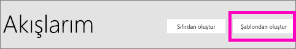
4. Power BI şablonlarını bulmak için Arama kutusunu kullanın ve **Power BI veri uyarısı tetiklendiğinde her izleyiciye e-posta gönder > Devam** seçeneğini işaretleyin.
   
    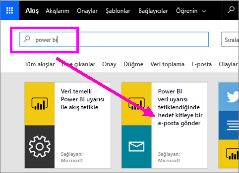

### Akışı oluşturma
Bu şablonda bir tetikleyici (İrlanda'nın kazandığı her yeni Olimpiyat madalyasına yönelik Power BI veri uyarısı) ve bir eylem (e-posta gönderme) bulunur. Bir alan seçtiğinizde Flow, ekleyebileceğiniz dinamik içerikleri görüntüler.  Bu örnekte, kutucuk değerini ve ileti gövdesindeki kutucuk URL'sini ekledik.

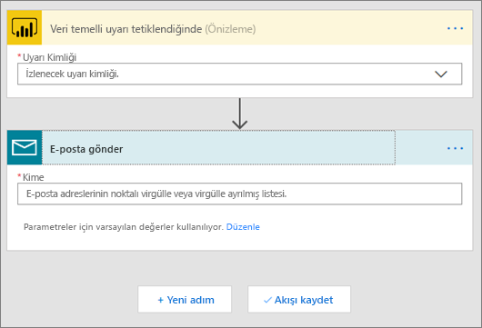

1. Tetikleyici açılan menüsünden bir Power BI veri uyarısı seçin. **New medal for Ireland** seçeneğini belirleyin. Uyarı oluşturma hakkında bilgi edinmek için bkz. [Power BI'daki veri uyarıları](service-set-data-alerts.md).
   
   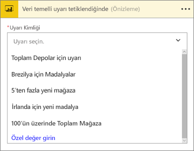
2. Bir veya daha fazla geçerli e-posta adresi girin ve sonra **Düzenle** (aşağıda gösterilmiştir) ya da **Dinamik içerik ekle**’yi seçin. 
   
   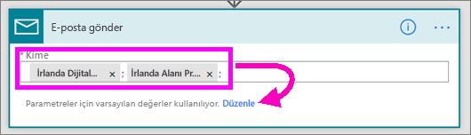

3. Akış, tutabileceğiniz veya değiştirebileceğiniz bir başlık ve ileti oluşturur. Power BI'de uyarı oluştururken ayarladığınız tüm değerleri kullanabilirsiniz; imleci yerleştirmeniz ve gri ile vurgulanan alanı seçmeniz yeterlidir. 

   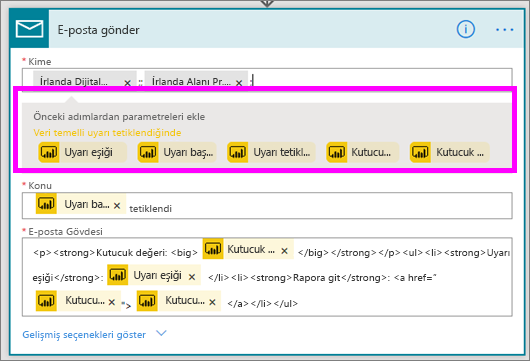

1.  Örneğin, Power BI'de **Bir madalya daha kazandık** şeklinde bir uyarı başlığı oluşturduysanız, **Uyarı başlığı**’nı seçerek bu metni e-postanızın Konu alanına ekleyebilirsiniz.

    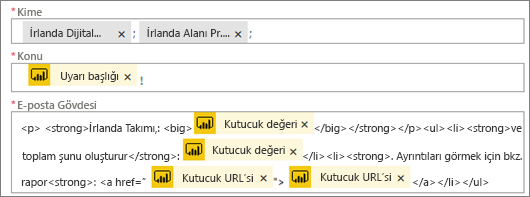

    Ayrıca, varsayılan e-posta gövdesini kabul edebilir veya kendinizinkini oluşturabilirsiniz. Yukarıdaki örnekte iletinin birkaç değişikliği gösterilmiştir.

1. Bu işlemi tamamladığınızda, **Akış oluştur** veya **Akışı kaydet** seçeneğini belirleyin.  Akış oluşturulur ve değerlendirilir.  Flow, herhangi bir hata bulması durumunda sizi bilgilendirir.
2. Hata bulunması halinde bunları düzeltmek için **Akışı düzenle**'yi, aksi halde, yeni akışı çalıştırmak için **Bitti**'yi seçin.
   
   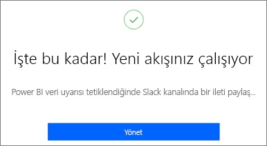
5. Veri uyarısı tetiklendiğinde belirttiğiniz adreslere bir e-posta gönderilir.  
   
   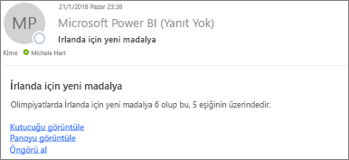

## Power BI'ı kullanan bir Akış oluşturma (sıfırdan)
Bu görevde, bir Power BI veri uyarısı (bildirim) ile tetiklenen basit bir akışı sıfırdan oluşturacağız.

1. Microsoft Flow'da oturum açın.
2. **Akışlarım** > **Boş akış oluştur** seçeneğini belirleyin.
   
   
3. Bir Power BI tetikleyicisi bulmak için Arama kutusunu kullanın ve **Power BI - veri temelli bir uyarı tetiklendiğinde** seçeneğini belirleyin.

### Akışınızı oluşturma
1. Açılan menüden uyarınızın adını seçin.  Uyarı oluşturma hakkında bilgi edinmek için bkz. [Power BI'daki veri uyarıları](service-set-data-alerts.md).
   
    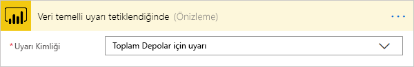
2. **Yeni adım** > **Eylem ekle**'yi seçin.
   
   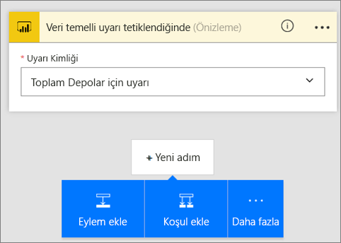
3. **Outlook**'u bulun ve **Create event** seçeneğini belirleyin.
   
   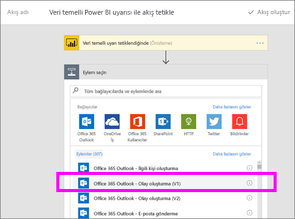
4. Etkinlik alanlarını doldurun. Bir alan seçtiğinizde Flow, ekleyebileceğiniz dinamik içerikleri görüntüler.
   
   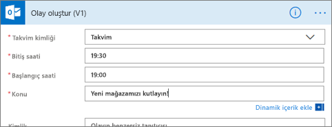
5. Gerekli alanları doldurduktan sonra, **Akış oluştur**'u seçin.  Flow, akışı kaydeder ve değerlendirir. Herhangi bir hatayla karşılaşılmazsa **Bitti**'yi seçerek bu akışı çalıştırın.  Yeni akış **Akışlarım** sayfanıza eklenir.
   
   
6. Akış Power BI veri uyarınız ile tetiklendiğinde aşağıdakine benzer bir Outlook etkinlik bildirimi alırsınız.
   
    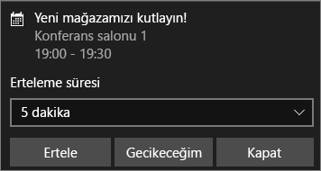

## Sonraki adımlar
* [Get started with Microsoft Flow (Microsoft Flow ile çalışmaya başlama)](https://flow.microsoft.com/en-us/documentation/getting-started/)
* [Set data alerts in Power BI service (Power BI hizmetinde veri uyarısı oluşturma)](service-set-data-alerts.md)
* [iPhone'unuzda veri uyarısı oluşturma](mobile-set-data-alerts-in-the-mobile-apps.md)
* [Windows 10 için Power BI mobil uygulamasında veri uyarısı oluşturma](mobile-set-data-alerts-in-the-mobile-apps.md)
* Başka bir sorunuz mu var? [Power BI Topluluğu'na başvurun](http://community.powerbi.com/)

