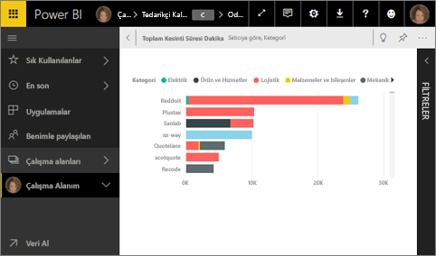
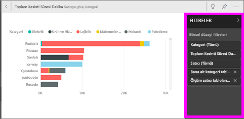
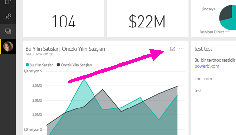
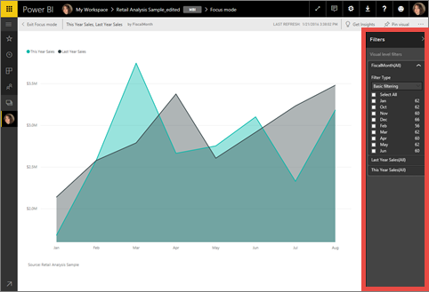
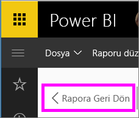

# Bir pano kutucuğunu veya rapor görselini odak modunda görüntüleme
<iframe width="560" height="315" src="https://www.youtube.com/embed/dtdLul6otYE" frameborder="0" allowfullscreen></iframe>

## Odak modu nedir?
***Odak*** modu, daha fazla ayrıntı görmek için bir pano kutucuğunu veya rapor görselini genişletmenize (büyütmenize) olanak tanır.  Odak modundayken, söz konusu görsel oluşturulduğunda uygulanan filtreleri görüntüleyebilir ve değiştirebilirsiniz.  

> [!NOTE]
> Odak, [tam ekran modundan](service-fullscreen-mode.md) farklıdır.
> 
## Pano kutucukları için odak modu
1. Kutucuk görselleştirmesinin üzerine gelin, üç nokta (...) simgesini seçin ve **Odak modunda aç**  seçeneğini belirleyin.  
   
2. Kutucuk, tuvalin tamamını kaplayacak şekilde açılır. 

   

3. Bu görsele uygulanan tüm filtreleri görüntülemek için Filtreler bölmesini genişletin.
   
   

4. Filtreleri değiştirerek daha fazla araştırma yapın ve ilgi çekici bir şeyle karşılaşırsanız görseli panoya sabitleyin.

5. Odak modundan ayrılmak ve panoya geri dönmek için **< Odak modundan çık** (görselin sol üst köşesinde) seçeneğini belirleyin.
   
        

## Rapor görselleştirmeleri için odak modu

1. Rapor görselleştirmesinin üzerine gelin ve **odak modu** simgesini  seçin.  
   
   
2. Görselleştirme, tuvalin tamamını kaplayacak şekilde açılır. 

   
   
3. Bu görsele uygulanan tüm filtreleri görüntülemek için Filtreler bölmesini genişletin.
   
   
4. Filtreleri değiştirerek daha fazla araştırma yapın ve ilgi çekici bir şeyle karşılaşırsanız görseli panoya sabitleyin.   
5. Odak modundan ayrılmak ve rapora geri dönmek için **< Rapora geri dön** (görselin sol üst köşesinde) seçeneğini belirleyin. 
   
      

## Odak modundan tam ekran moduna geçme
Odak moduna geçtikten sonra kutucuğu veya görseli [tam ekran modunda (TV modu) görüntüleyebilirsiniz.](service-fullscreen-mode.md) Tam ekran modunda görüntüleme yaparak menülerin ve gezinti düğmelerinin dikkatinizi dağıtmasını önleyebilirsiniz.

## Önemli noktalar ve sorun giderme
* Bir rapordaki görselleştirme ile odak modunu kullanırken tüm filtreleri görüntüleyebilir ve değiştirebilirsiniz: Görsel düzeyi, Sayfa düzeyi ve Rapor düzeyi.    
* Bir panodaki görselleştirme ile odak modunu kullanırken yalnızca Görsel düzeyi filtrelerini görüntüleyebilir ve değiştirebilirsiniz.

Başka bir sorunuz mu var? [Power BI Topluluğu'na başvurun](http://community.powerbi.com/)

