# Çok kısa bir sürede Excel çalışma kitaplarından muhteşem raporlar elde etme
Yöneticiniz gün bitimine kadar, son kampanyaya ilişkin izlenimlerinizle birlikte güncel satış rakamlarınızın yer aldığı bir rapor sunmanızı istiyor. Ancak, güncel verileriniz çeşitli üçüncü taraf sistemlerde ve dizüstü bilgisayarınızdaki dosyalarda mevcut. Daha önce, görseller oluşturmak ve bir raporu biçimlendirmek için saatlerinizi harcadığınızı hatırlıyorsunuz. Endişelenmeye başlıyorsunuz.

Endişelenmeyin. Power BI ile çok kısa sürede harika raporlar oluşturabilirsiniz.

Bu örnekte, yerel sistemde bulunan bir dosyayı karşıya yükleyecek, yeni bir rapor oluşturacak ve bu raporu iş arkadaşlarımızla paylaşacağız. Üstelik bu işlemlerin tümünü Power BI'da gerçekleştireceğiz.

## Verilerinizi hazırlama
Örnek olarak basit bir Excel dosyasını ele alalım. Excel dosyanızı Power BI'a yükleyebilmeniz için verilerinizi düz bir tabloda düzenlemeniz gerekir. Bu, her sütunda aynı veri türlerinin (ör. metin, tarih, sayı veya para birimi) bulunacağı anlamına gelir. Bir başlık satırınız olmalı ancak toplamı görüntüleyen herhangi bir sütun veya satırınız olmamalıdır.

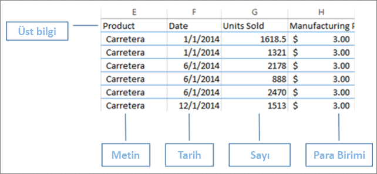

Şimdi, verilerinizi bir tablo olarak biçimlendirin. Excel'in Giriş sekmesindeki Stiller grubunda **Tablo Olarak Biçimlendir** seçeneğini belirleyin. Çalışma sayfanızda uygulanacak bir tablo stili seçin. Excel çalışma sayfanız artık Power BI'a yüklenmek için hazır.

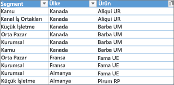

## Excel dosyanızı Power BI'a yükleme
Power BI, bilgisayarınızda bulunan Excel dosyaları da dahil olmak üzere birçok veri kaynağına bağlanır. Çalışmaya başlamak için Power BI hizmetinde oturum açın. Henüz kaydınız yoksa [ücretsiz kaydolabilirsiniz](https://powerbi.com).

Yeni bir pano oluşturmak istediğinizi varsayalım. **Çalışma Alanım**'ı açın ve **+ Oluştur** simgesini seçin.

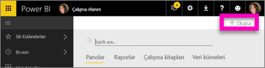

**Pano**'yu seçin, bir ad girin ve **Oluştur** seçeneğini belirleyin. Yeni pano hiç veri olmadan görüntülenir.

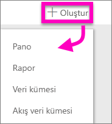

Sol gezinti bölmesinin alt kısmında bulunan **Veri Al** seçeneğini belirleyin. Veri Al sayfasında, Verileri İçeri Aktarın veya Bağlanın bölümündeki Dosyalar kutusunda **Al** seçeneğini belirleyin.

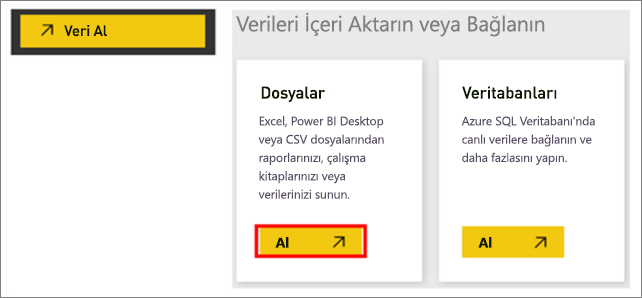

Dosyalar sayfasında **Yerel Dosya**'yı seçin. Bilgisayarınızdaki Excel çalışma kitabına gidin ve söz konusu çalışma kitabını seçerek Power BI'a yükleyin. **İçeri aktar**'ı seçin.

> **NOT**: Bu eğitimin geri kalan kısmında birlikte ilerleyebilmemiz için [Financial Sample çalışma kitabını](sample-financial-download.md) kullanın.
> 
> 

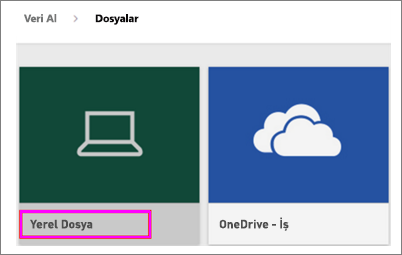

## Raporunuzu oluşturma
Power BI, Excel dosyanızı içeri aktardıktan sonra raporunuzu oluşturmaya başlayın. **Veri kümeniz hazır** iletisi göründüğünde **Veri kümesini görüntüle**'yi seçin.  Power BI, Düzenleme görünümü'nde açılır ve rapor tuvali görüntülenir. Sağ tarafta Görsel Öğeler, Filtreler ve Alanlar bölmeleri bulunur.

Excel çalışma kitabınızdaki tablo verilerinin, Alanlar bölümünde göründüğüne dikkat edin. Power BI, sütun başlıklarını tablo adının altında ayrı alanlar olarak listeler.

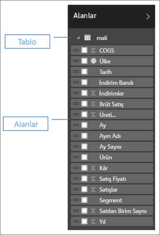

Artık görselleştirme oluşturmaya başlayabilirsiniz. Yöneticiniz, zamanla elde edilen kârı görmek istiyor. Alanlar bölmesinde **Profit**'i rapor tuvaline sürükleyin. Power BI, varsayılan olarak bir çubuk grafik görüntüler. Ardından, **Date**'i de rapor tuvaline sürükleyin. Power BI, çubuk grafiği, tarihe göre kâr görüntülenecek şekilde güncelleştirir.

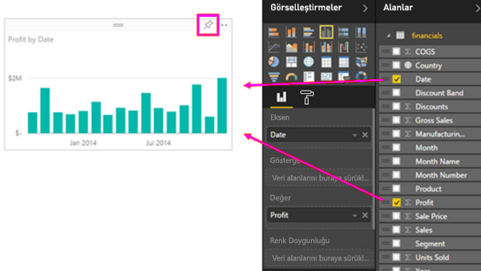

> **İPUCU**: Grafiğiniz beklediğiniz gibi görünmüyorsa toplama işlemlerinizi kontrol edin. Örneğin, **Değer** kutusunda, yeni eklediğiniz değere sağ tıklayın ve verilerin istediğiniz şekilde toplandığından emin olun.  Biz bu örnekte **Toplam** seçeneğini kullanıyoruz.
> 
> 

Yöneticiniz, en fazla kâr sağlayan ülkeleri görmek istiyor. Bir harita görselleştirmesi hazırlayarak yöneticinizi etkileyebilirsiniz. Bunun için, tuvalinizde boş bir alan seçip Alanlar bölmesinden **Country** ve ardından **Profit** alanlarını sürüklemeniz yeterlidir. Power BI her bir konumun göreceli kârını temsil eden balonlar içeren bir harita görseli oluşturur.

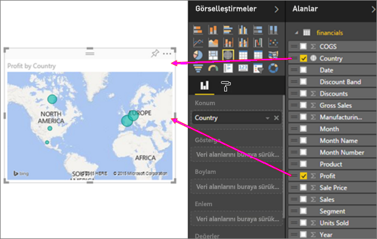

Ürüne ve pazar segmentine göre satışları görüntüleyen bir görsel oluşturmaya ne dersiniz? Çok basit. Alanlar bölmesinde Sales, Product ve Segment alanlarının yanında bulunan onay kutularını seçin. Power BI anında bir çubuk grafik oluşturur. Görsel Öğeler menüsündeki simgelerden birini seçerek grafiğin türünü değiştirin. Örneğin, görseli bir Yığılmış çubuk grafik olarak değiştirin.  Grafiği sıralamak için üç nokta (...) > **Sıralama Ölçütü** seçeneğini belirleyin.

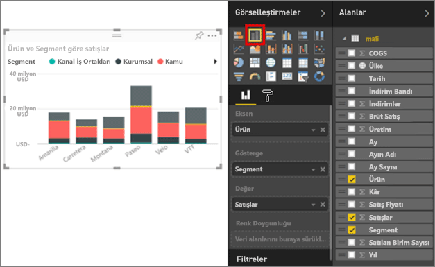

Tüm görsellerinizi Panonuza sabitleyin. Artık, panonuzu iş arkadaşlarınızla paylaşabilirsiniz.

## Panonuzu paylaşma
Panonuzu yöneticiniz Paula ile paylaşmak istiyorsunuz. Panonuzu ve bağlantılı raporu, Power BI hesabı olan tüm iş arkadaşlarınızla paylaşabilirsiniz. Bu kişiler raporunuzla etkileşim kurabilir ancak değişiklikleri kaydedemez.

Raporunuzu paylaşmak için panonun üst kısmında bulunan **Paylaş** seçeneğini belirleyin.

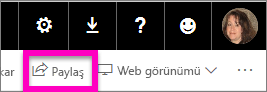

Power BI, Panoyu Paylaş sayfasını görüntüler. Üst kısımdaki alana, alıcıların e-posta adreslerini girin. Aşağıdaki alana bir ileti ekleyin. Alıcıların panonuzu diğer kullanıcılarla paylaşmasına izin vermek için **Alıcıların panonuzu paylaşmasına izin verin** seçeneğini belirleyin. **Paylaş**'ı seçin.

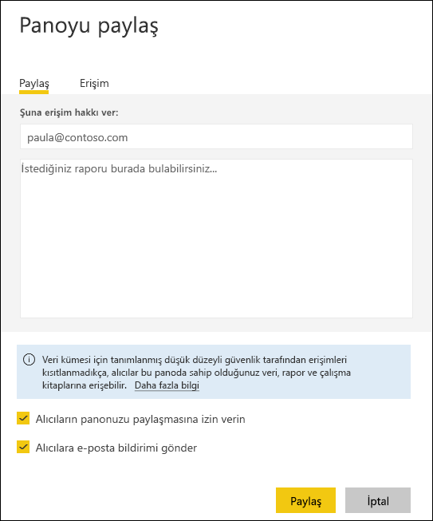

Sonraki adımlar

* [Power BI hizmeti ile çalışmaya başlama](service-get-started.md)
* [Power BI Desktop ile çalışmaya başlama](desktop-getting-started.md)
* [Power BI - Temel Kavramlar](service-basic-concepts.md)
* Başka bir sorunuz mu var? [Power BI Topluluğu'na başvurun](http://community.powerbi.com/)

