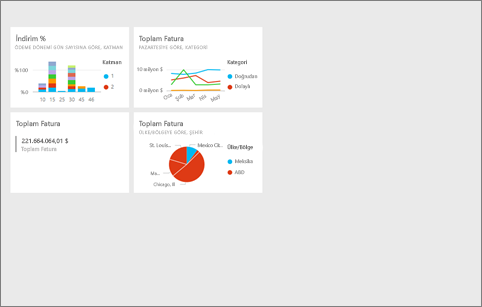
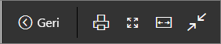
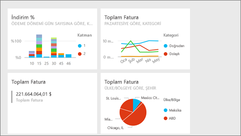
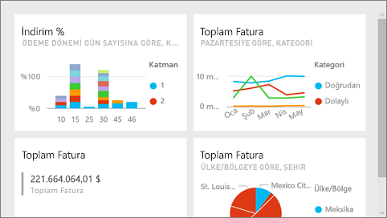
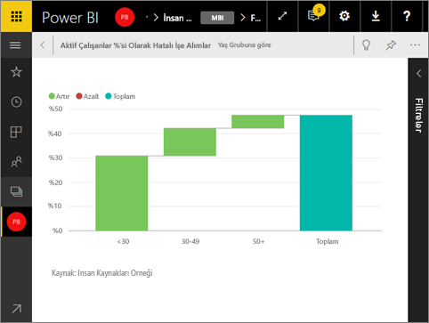

# Power BI hizmetinde tam ekran modu
## Tam ekran modu nedir?

Power BI içeriğinizi (panolar, rapor sayfaları, kutucuklar ve görselleştirmeler) menüler ve gezinti düğmeleri dikkatinizi dağıtmadan görüntüleyebilirsiniz.  Her zaman tek bir bakışta içeriğinizin katıksız bir tam ekran görünümünü elde edersiniz. Bu bazen TV Modu olarak adlandırılır. Tam ekran modunda kullanılabilen işlevler içeriğe göre değişiklik gösterir. 

Power BI mobil kullanıyorsanız [Windows 10 mobil uygulamaları için tam ekran kullanılabilir](mobile-windows-10-app-presentation-mode.md). Power BI Desktop, raporlar veya görselleştirmeler için tam ekran moduna sahip değildir ancak [İlişki görünümü](desktop-report-view.md) ve [rapor görselleri için odak modu](service-focus-mode.md)’na yönelik Sayfaya sığdır özelliğine sahiptir.

 

Tam ekran modunun kullanım alanlarına ilişkin bazı örnekler aşağıda verilmiştir:

* panolarınızı, kutucuklarınızı veya raporlarınızı bir toplantıda veya konferansta sunma
* bir iş yerinde özel bir geniş ekran veya projektör aracılığıyla görüntüleme
* küçük bir ekranda görüntüleme
* kilitli modda gözden geçirme (bağlantılı raporu veya panoyu açmaya gerek kalmadan, ekrana dokunabilir veya fareyle kutucukların üzerine gelebilirsiniz)

> **NOT**: Tam ekran modu [Odak (büyütme) modundan](service-focus-mode.md) farklıdır.
> 
> 

Aşağıdaki videoda, tam ekran modunda açtığı panosunda gezinen ve varsayılan görüntüyü denetlemek için bazı URL parametreleri uygulayan Amanda'yı izleyin. Ardından, videonun altında yer alan adım adım yönergeleri izleyerek bu işlemi kendiniz deneyin.

<iframe width="560" height="315" src="https://www.youtube.com/embed/c31gZkyvC54" frameborder="0" allowfullscreen></iframe>

## Panolar ve rapor sayfaları için tam ekran modu
1. Panonuzun veya raporunuzun üst kısmındaki Power BI menü çubuğundan **tam ekran** simgesini  seçin. Bu işlemin ardından pano tuvaliniz veya rapor sayfanız ekranın tamamını kaplar. Aşağıdaki örnekte bir pano gösterilmektedir.
   
      
2. Tam ekran modunda birçok menü seçeneği mevcuttur.  Menüyü görüntülemek için farenizi veya imlecinizi hareket ettirmeniz yeterlidir. 
   
     Panolar için menü    
         
   
     Rapor sayfaları için menü    
        
   
        
    Tarayıcınızda önceki sayfaya gitmek için **Geri** düğmesini kullanın. Önceki sayfa bir Power BI sayfasıysa bu da tam ekran modunda görüntülenir.  Siz kapatana kadar tam ekran modu açık kalır.
   
        
    Tam ekran modundaki panonuzu veya rapor sayfanızı yazdırmak için bu düğmeyi kullanın. 
   
        
    Panonuzu, kaydırma çubukları olmadan maksimum boyutta görüntülemek için **Ekrana sığdır** düğmesini kullanın.     
   
    
   
           
    Bazen kaydırma çubuklarını önemsemez ve panonuzun, mevcut alanın tüm genişliğini kullanmasını istersiniz. **Genişliğe uydur** düğmesini seçin.    
   
    
   
           
    Tam ekran modundaki raporlarda bu okları kullanarak sayfalar arasında gezinebilirsiniz.    
3. Tam ekran modundan çıkmak için **Tam ekrandan çık** simgesini seçin.
   
      

## Görselleştirmeler ve pano kutucukları için tam ekran modu
1. Pano kutucuklarınızı ve rapor görselleştirmelerinizi tam ekran modunda görüntülemek için söz konusu kutucuğu veya görselleştirmeyi öncelikle [Odak modunda](service-focus-mode.md) açmış olmanız gerekir. 
   
    
2. Ardından, kutucuk veya görsel için Tam Ekran simgesini   seçin. Bu işlemin ardından kutucuk veya görsel, menüler ya da gezinti çubukları olmadan tam ekran modunda görüntülenir.
   
    

## Sonraki adımlar
[Power BI'daki panolar](service-dashboards.md)  
[Odak modu](service-focus-mode.md)    

Başka bir sorunuz mu var? [Power BI Topluluğu'na başvurun](http://community.powerbi.com/)

