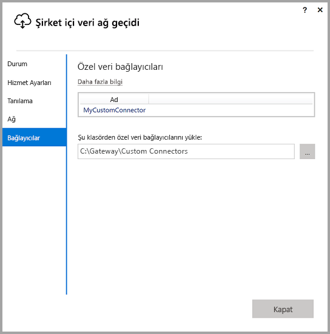
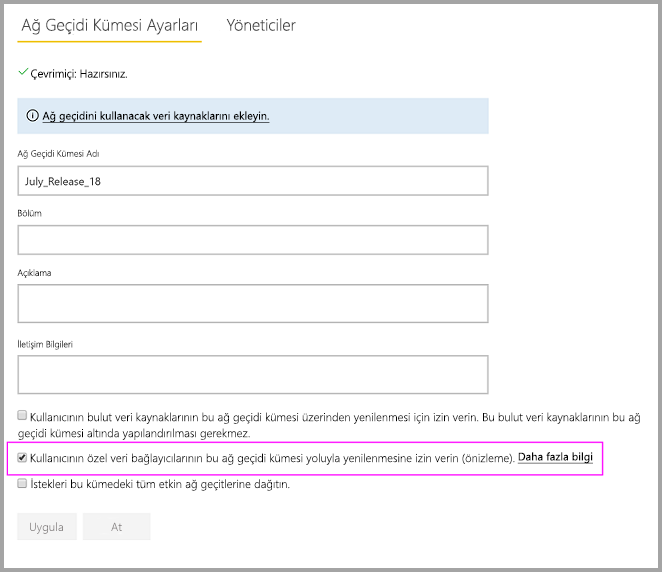
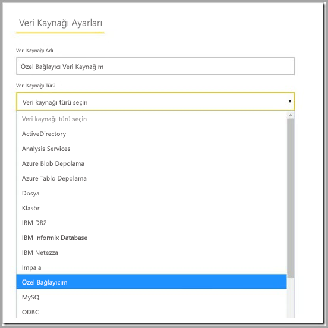

# Şirket içi veri ağ geçidinde özel veri bağlayıcılarını kullanma

[!INCLUDE [gateway-rewrite](includes/gateway-rewrite.md)]

Power BI veri bağlayıcıları ile bir uygulamadan, hizmetten veya veri kaynağından verilere bağlanıp erişebilirsiniz. Özel veri bağlayıcıları geliştirebilir ve bunları Power BI Desktop'ta kullanabilirsiniz.

Power BI için özel veri bağlayıcıları geliştirme hakkında daha fazla bilgi edinmek için bkz. [Veri Bağlayıcı SDK’sı GitHub sayfası](https://aka.ms/dataconnectors). Bu site, Power BI ve Power Query’yi kullanmaya başlamaya yönelik bilgileri ve örnekleri içerir.

Power BI Desktop'ta özel veri bağlayıcıları kullanan raporlar oluşturduğunuzda, şirket içi veri ağ geçidini kullanarak bu raporları Power BI hizmetinden yenileyebilirsiniz.

## Bu özelliği etkinleştirme ve kullanma

Şirket içi veri ağ geçidinin Temmuz 2018 veya üzeri bir sürümünü yüklediğinizde, **Bağlayıcılar** sekmesini şirket içi veri ağ geçidinde görebilirsiniz. **Özel veri bağlayıcılarını klasörden yükle** kutusundan, ağ geçidini çalıştıran kullanıcı tarafından erişilebilen bir klasör seçin. Varsayılan kullanıcı şudur: *NT SERVICE\PBIEgwService*. Ağ geçidi, o klasörde yer alan özel bağlayıcı dosyalarını otomatik olarak yükler. Veri bağlayıcılarının listesinde görünürler.

Şirket içi veri ağ geçidini (kişisel mod) kullanıyorsanız, Power BI raporunuzu Power BI hizmetine yükleyebilir ve bunu yenilemek için ağ geçidini kullanabilirsiniz.

Şirket içi veri ağ geçidinde özel bağlayıcınız için bir veri kaynağı oluşturmanız gerekir. Power BI hizmetinin ağ geçidi ayarları sayfasında ağ geçidi kümesini seçtiğinizde, bu kümeyle özel bağlayıcı kullanmanızı sağlayan bir seçenek görmeniz gerekir. Bu seçeneği kullanabilmek için kümedeki tüm ağ geçitlerinin Temmuz 2018 güncelleştirmesine veya daha yeni bir sürüme sahip olduğundan emin olun. Bu kümeyle özel bağlayıcı kullanma seçeneğini etkinleştirin.

Bu seçenek etkinleştirildiğinde, özel bağlayıcılarınızı bu ağ geçidi kümesinde oluşturabileceğiniz veri kaynaklarının arasında görürsünüz. Yeni özel bağlayıcınızı kullanan bir veri kaynağı oluşturduktan sonra Power BI hizmetindeki bu özel bağlayıcıyı kullanarak Power BI raporlarını yenileyebilirsiniz.

## Önemli noktalar ve sınırlamalar

* Oluşturduğunuz klasöre arka plan ağ geçidi hizmeti tarafından erişilebildiğinden emin olun. Genellikle kullanıcınızın Windows klasörü veya sistem klasörleri içindeki klasörler erişilebilir durumda olmayacaktır. Klasör erişilebilir değilse şirket içi veri ağ geçidi uygulaması bir ileti gösterir. Bu yönerge, şirket içi veri ağ geçidi (kişisel mod) için geçerli değildir.
* Özel bağlayıcıların şirket içi veri ağ geçidi ile çalışabilmesi için özel bağlayıcı kodunda “TestConnection” bölümü oluşturulması gerekir. Power BI Desktop ile özel bağlayıcılar kullanıldığında bu kısım gerekli olmaz. Bu nedenle, Power BI Desktop ile çalışan ancak ağ geçidi ile çalışmayan bir bağlayıcınız olabilir. TestConnection bölümü uygulama hakkında daha fazla bilgi için lütfen [bu belgeye](https://github.com/Microsoft/DataConnectors/blob/master/docs/m-extensions.md#implementing-testconnection-for-gateway-support) bakın.
* Ağ geçitleri üzerinden özel bağlayıcılar için OAuth şu anda yalnızca ağ geçidi yöneticileri için desteklenir; diğer veri kaynağı kullanıcıları için desteklenmez.

## Sonraki adımlar

* [Veri kaynağınızı yönetme - Analysis Services](service-gateway-enterprise-manage-ssas.md)  
* [Veri kaynağınızı yönetme - SAP HANA](service-gateway-enterprise-manage-sap.md)  
* [Veri kaynağınızı yönetme - SQL Server](service-gateway-enterprise-manage-sql.md)  
* [Veri kaynağınızı yönetme - Oracle](service-gateway-onprem-manage-oracle.md)  
* [Veri kaynağınızı yönetme - İçeri aktarma/zamanlanmış yenileme](service-gateway-enterprise-manage-scheduled-refresh.md)
* [Şirket içi veri ağ geçidi için ara sunucu ayarlarını yapılandırma](/data-integration/gateway/service-gateway-proxy)
* [Power BI’dan şirket içi veri kaynaklarına kadar SSO (çoklu oturum açma) için Kerberos’u kullanma](service-gateway-sso-kerberos.md)  

Başka bir sorunuz mu var? [Power BI Topluluğu](https://community.powerbi.com/)'na sorun.
