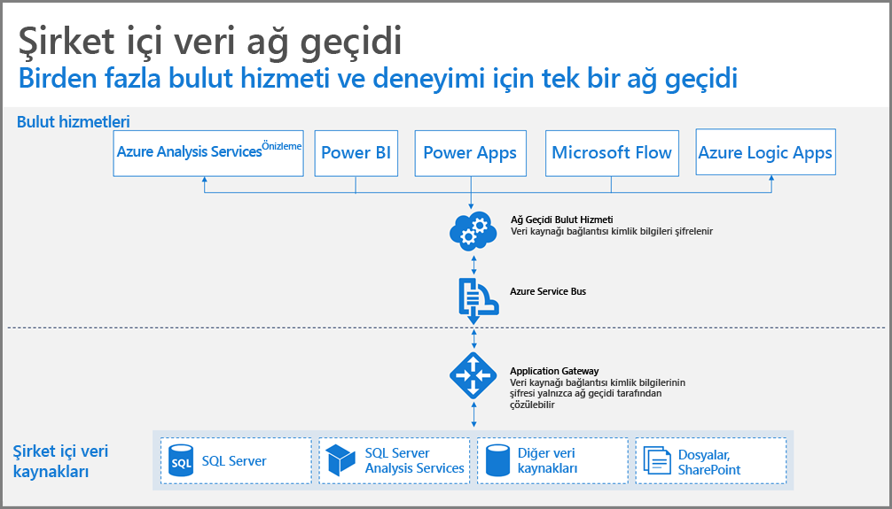
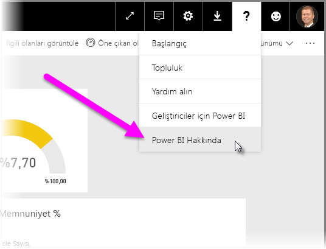
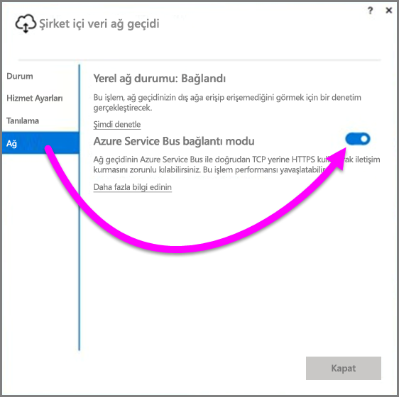
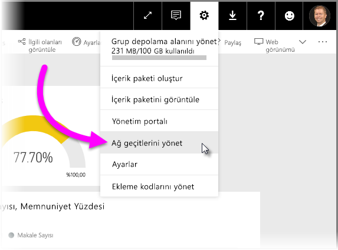

# Power BI için veri ağ geçidi dağıtmaya ilişkin yönergeler

Bu makalede, ağ ortamınızda bir veri ağ geçidini dağıtmaya ilişkin yönergeler ve önemli noktalar sunulmaktadır. **Ağ geçidi**, Power BI gibi bir bulut hizmetinde gerçekleştirilen birbirini izleyen kullanımlara yönelik olarak, özel bir şirket içi ağda bulunan verilere erişimi kolaylaştıran yazılımdır. Bu makalede, dağıtım işlemi adım adım açıklanır ve **şirket içi veri ağ geçidi** kurulumu ile ilgili yönergeler sağlanır.

**Şirket içi veri ağ geçidi** ile ilgili daha fazla bilgi edinmek için yükleme bağlantısının da bulunduğu [blog gönderisine](https://powerbi.microsoft.com/blog/power-bi-gateways-march-update/) göz atın.

## Şirket içi veri ağ geçidini yükleme ile ilgili önemli noktalar
Yükleme ve dağıtım ile ilgili ayrıntılara girmeden önce dikkat etmeniz gereken birkaç önemli nokta vardır. Aşağıdaki bölümlerde, göz önünde bulundurmanız gereken önemli noktalar açıklanmaktadır.

### Kullanıcı sayısı
Ağ geçidinin kullanıldığı bir rapordan yararlanan kullanıcı sayısı, ağ geçidinin yükleneceği konuma karar vermede önemli bir unsurdur. Aşağıda, üzerinde düşünülmesi gereken bazı sorular verilmiştir:

* Kullanıcılar bu raporları günün farklı zamanlarında mı kullanıyor?
* Ne tür bağlantılar (DirectQuery veya İçeri Aktar) kullanılıyor?
* Tüm kullanıcılar aynı raporu mu kullanıyor?

Tüm kullanıcılar belirli bir rapora her gün aynı anda erişiyorsa ağ geçidini, tüm istekleri işleyebilen bir makineye yüklediğinizden emin olmak istersiniz. (Bu konuda karar vermenize yardımcı olabilecek performans sayaçları ve minimum gereksinimler için aşağıdaki bölümlere bakın.)

**Power BI**'da *rapor* başına yalnızca *bir* ağ geçidine izin veren bir kısıtlama söz konusudur, bu nedenle bir rapor birden çok veri kaynağını temel alıyor olsa bile tüm bu veri kaynaklarının tek bir ağ geçidinden geçmesi gerekir. Ancak, bir pano *birden çok* rapora dayanıyorsa katkı sağlayan her rapor için, ayrılmış bir ağ geçidi kullanabilirsiniz. Böylece ağ geçidi yükünü, tek bir panoya katkı sağlayan birden çok rapor arasında dağıtmış olursunuz.

### Bağlantı türü
**Power BI** iki tür bağlantı sunar: **DirectQuery** ve **İçeri Aktarma**. Tüm veri kaynakları her iki bağlantı türünü de desteklemeyebilir ve güvenlik gereksinimleri, performans, veri sınırları ve veri modeli boyutları gibi birçok nedenden, biri diğerine tercih edilebilir. [Şirket içi veri ağ geçidi makalesindeki](service-gateway-onprem.md) *kullanılabilir veri kaynağı türlerinin listesi* bölümünde, bağlantı türü ve desteklenen veri kaynakları ile ilgili daha fazla bilgiye ulaşabilirsiniz.

Ağ geçidi kullanımı, kullanılmakta olan bağlantı türüne göre değişiklik gösterebilir. Örneğin, mümkün olduğunda **DirectQuery** veri kaynaklarını **Zamanlanmış Yenileme** veri kaynaklarından ayırmanız gerekir (veri kaynaklarının farklı raporlarda olduğu ve ayrılabileceği varsayılmıştır). Bunu gerçekleştirerek, tam da şirketin ana panosu için kullanılan büyük boyutlu bir veri modeli için sabah gerçekleştirilecek zamanlanmış yenilemeyle aynı sırada, ağ geçidinde binlerce DirectQuery isteğinin birikmesinin önüne geçersiniz. Her biri için şu noktaları aklınızda bulundurmanız gerekir:

* **Zamanlanmış yenileme** için: Sorgunuzun boyutuna ve günlük olarak gerçekleşen yenileme sayısına bağlı olarak, önerilen minimum donanım gereksinimlerini aşmama veya daha yüksek performans gösteren bir makineye yükseltme arasında seçim yapabilirsiniz. Belirli bir sorgu katlanmış değilse ağ geçidi makinesinde dönüştürme işlemleri gerçekleştirilir, böylece ağ geçidi makinesi, kullanılabilir daha fazla RAM'den yararlanır.
* **DirectQuery** için: Herhangi bir kullanıcı raporu her açtığında veya verilere göz attığında bir sorgu gönderilir. Bu nedenle, 1.000'den fazla kullanıcının aynı anda verilere erişeceğini öngörüyorsanız bilgisayarınızın güçlü ve nitelikli donanım bileşenlerinden oluştuğundan emin olmak istersiniz. Daha fazla CPU çekirdeği, **DirectQuery** bağlantısı için daha iyi bir performans elde edilmesini sağlar.

**Şirket içi veri ağ geçidi** yüklenecek bir makine için gereksinimler şunlardır:

**Minimum:**

* .NET 4.5 Framework
* Windows 7 veya Windows Server 2008 R2 64 bit sürümü (ya da sonraki sürümler)

**Önerilen:**

* 8 Çekirdekli CPU
* 8 GB Bellek
* Windows 2012 R2 64 bit sürümü (veya sonraki sürümler)

### Konum
Ağ geçidinin yüklendiği konum sorgu performansınızı önemli ölçüde etkiler, bu nedenle ağ gecikmesini en aza indirmek için ağ geçidiniz, veri kaynağı konumlarınız ve Power BI kiracınızın birbirine mümkün olduğunca yakın olduğundan emin olun. Power BI hizmetinde Power BI kiracınızın konumunu belirlemek için, sağ üst köşede bulunan **?** simgesini ve ardından **Power BI Hakkında**'yı seçin.

### Ağ geçitlerini izleme
Yüklü ağ geçitlerinizin kullanımını ve performansını izlemek için kullanabileceğiniz birkaç araç vardır.

#### Performans sayaçları
Ağ geçidinde gerçekleşen etkinliği değerlendirmek için kullanılabilecek birçok performans sayacı vardır. Sayaçlar, belirli bir türde ve büyük miktarda etkinliğiniz olup olmadığını anlamanıza yardımcı olarak sizi yeni bir ağ geçidi dağıtımı yapmaya yönlendirebilir.

> [!NOTE]
> Bu sayaçlar, belirli bir görevin süresini yakalamaz.
> 
> 

Makinenizdeki sayaçlara ek olarak, *ağ geçidi sayacı*, makinenizin ne kadar yük işlediği hakkında fikir edinmenizi sağlayabilir ve sunucu kaynak kapasitesinin esnetildiğini veya aşıldığını gösterebilir.

Bu sayaçlara **Windows Performans İzleyicisi**'nden erişebilir ve bu amaçla kullandığınız tüm raporlama araçları için söz konusu sayaçlardan faydalanabilirsiniz. Ağ geçidi performans izleyicisinin Power BI ile kullanılması hakkındaki ayrıntılı yönergeler için, bir topluluk üyesi tarafından oluşturulmuş aşağıdaki blog gönderisine göz atabilirsiniz.

* [Şirket içi veri ağ geçitlerini izleme](https://insightsquest.com/2016/08/08/monitor-on-premises-data-gateways/)

#### Günlükler
Yapılandırma ve hizmet günlükleri, ağ geçidinizde neler olduğu hakkında farklı bir bakış açısı sunar. Power BI hizmetinde tüm hata iletileri bildirilmediğinden, bağlantınızın beklediğiniz gibi çalışmaması halinde her zaman ağ geçidi günlüklerini denetleyin.

Yerel makinenizdeki tüm günlük dosyalarını görmenin kolay bir yolu da ilk yüklemenin tamamlanmasının ardından ağ geçidini yeniden açtığınızda **şirket içi veri ağ geçidinde** bulunan *Günlükleri dışarı aktar* düğmesini kullanmak ve ardından **Tanılama > Günlükleri dışarı aktar** seçeneğini belirlemektir.

#### Ek günlükler
Ağ geçidi varsayılan olarak temel günlük kaydı gerçekleştirir. Ağ geçidi sorunlarını araştırıyor ve sorgu bağlantı ayrıntıları hakkında daha fazla bilgiye ihtiyaç duyuyorsanız ek günlük bilgilerini almak için geçici olarak *ayrıntılı günlük kaydını* etkinleştirebilirsiniz. Bunu gerçekleştirmek için, yüklü ağ geçidinde **Tanılama > Ek günlükler**'i seçin.

Bu ayarın etkinleştirilmesiyle birlikte günlük boyutunun, ağ geçidi kullanımına bağlı olarak önemli ölçüde artış göstermesi olasıdır. Günlükleri inceleme işlemini tamamladıktan sonra **Ek günlükler**'i devre dışı bırakmanız önerilir. Normal ağ geçidi kullanımı sırasında bu ayarın etkin olarak bırakılması önerilmez.

#### Ağ yapılandırması
Ağ geçidi **Azure Service Bus**'a yönelik bir giden bağlantı oluşturur. Ağ geçidi şu giden bağlantı noktaları ile iletişim kurar:

* TCP 443 (varsayılan)
* 5671
* 5672
* 9350 ila 9354

Ağ geçidi için gelen bağlantı *gerekmez*. Gerekli tüm bağlantı noktaları, yukarıdaki listede bulunmaktadır.

Güvenlik duvarınızda veri bölgenize ilişkin IP adreslerini beyaz listeye eklemeniz önerilir. [Microsoft Azure Veri Merkezi IP listesinde](https://www.microsoft.com/download/details.aspx?id=41653) bulunan IP adresi listesini indirebilirsiniz. Bu liste haftalık olarak güncelleştirilir. Ağ geçidi, tam etki alanı adı (FQDN) ile belirtilen IP adresini kullanarak **Azure Service Bus** ile iletişim kurar. Ağ geçidini HTTPS kullanarak iletişim kurmaya zorluyorsanız ağ geçidi yalnızca FQDN kullanır ve IP adresleri kullanılarak iletişim kurulmaz.

#### Azure Service Bus ile HTTPS iletişimini zorlama
Ağ geçidini, **Azure Service Bus** ile doğrudan TCP yerine HTTPS kullanarak iletişim kurmaya zorlayabilirsiniz. Bunu yaparsanız performansta az oranda bir düşüklük gözlemlersiniz. Ayrıca ağ geçidinin kullanıcı arabirimini kullanarak, ağ geçidini, HTTPS üzerinden **Azure Service Bus** ile iletişim kurmaya da zorlayabilirsiniz. (Ağ geçidinin Mart 2017 sürümünden itibaren geçerlidir.)

Bunu gerçekleştirmek için ağ geçidinde **Ağ**'ı seçin, ardından **Azure Service Bus bağlantı modu**'nu **Açık** duruma getirin.

### Ek yönergeler
Bu bölümde, ağ geçitlerini dağıtmaya ve yönetmeye ilişkin ek yönergeler sunulmuştur.

* Tek hata noktası bulunmamasına özen gösterin. Mümkünse, şirket içi veri kaynaklarınızı birkaç ağ geçidine dağıtın; bu durumda bir makine kullanılamaz hale gelse bile verilerinizin belirli bölümlerini yenileyebilir ve işlevselliği tamamen yitirmekten kaçınabilirsiniz.
* Ağ geçidi, etki alanı denetleyicilerine yüklenemez; bu nedenle böyle bir yükleme gerçekleştirmeyi planlamayın veya denemeyin.
* Ağ geçidini; kapatılabilecek, uyku moduna geçebilecek veya İnternet bağlantısı bulunmayabilecek bir bilgisayara (örneğin, bir dizüstü bilgisayar) yüklemeyin. Ağ geçidi, belirtilen koşullarda çalıştırılamaz.
* Performans ile ilgili sorunlar yaşanması olasılığına karşı, ağ geçidini kablosuz ağ üzerinden yüklemeyin.

#### Ağ Geçidi Kurtarma
**Kurtarma anahtarını** kullanarak mevcut ağ geçidinizi kurtarabilir veya yeni bir makineye taşıyabilirsiniz. Kurtarma anahtarı, ağ geçidini yükleyen kullanıcıya verilir ve daha sonra *değiştirilemez*. Kurtarma anahtarı, hem veri şifreleme hem de ağ geçidi kurtarma işlemlerinde kullanılır.

Ağ geçidinizi kurtarmak için; ağ geçidinde yönetici olduğunuzdan, ağ geçidinin adını bildiğinizden, doğru kurtarma anahtarına sahip olduğunuzdan ve benzer performans özelliklerini taşıyan yeni bir makineniz bulunduğundan emin olun.

Oturum açtıktan sonra **Migrate an existing gateway** (Mevcut ağ geçidini taşı) seçeneğini belirleyin. Ardından, kurtarmak veya geçirmek istediğiniz ağ geçidini seçmeniz, son olarak da kurtarma anahtarını girip yapılandırmayı gerçekleştirmeniz gerekir. Bu adım tamamlandığında, eski ağ geçidi yeni ağ geçidi ile değiştirilir ve yeni ağ geçidi, eski ağ geçidinin adının yanı sıra önceden yapılandırılmış tüm veri kaynaklarını devralır. Tüm veri kaynakları, herhangi bir yeniden yayımlama işlemine gerek olmadan yeni makineden geçmeye başlar. Otomatik yük devretme henüz desteklenmemekle birlikte, ağ geçidi ekibinin etkin olarak üzerinde düşündüğü bir özelliktir.

#### Yöneticiler
**Power BI hizmetinde** ağ geçidi yöneticilerinin bir listesine ulaşabilirsiniz. **Power BI** hizmetinde oturum açtıktan sonra, **Ayarlar** (dişli simgesi) **> Ağ geçitlerini yönet > Gateway UI** (Ağ Geçidi UI'si) seçeneğini belirleyin.  

Burada, bir ağ geçidi seçebilir ve ağ geçidi yöneticilerinin listesini görebilirsiniz. Listelenen yöneticiler ağ geçidi için erişim, kurtarma ve silme işlemlerini gerçekleştirebilir. Ayrıca ağ geçidindeki veri kaynaklarını silip yenilerini ekleyebilirler. Kuruluştaki tüm yöneticilerin kendi gruplarındaki tüm ağ geçitlerine erişimi bulunduğundan emin olmak için aşağıdakilerin gerçekleştirilmesi önerilir:

* Bir **AAD** güvenlik grubu oluşturup diğer kullanıcıları bu gruba ekledikten sonra güvenlik grubunu ilgili ağ geçidi yöneticilerinin listesine ekleyin. Böylece, bir hata olması durumunda veya ağ geçidini kurtarmanız ya da taşımanız gerekmesi halinde ağ geçidine birden fazla kişi erişebilir. Ayrıca bu işlem diğer yöneticilerin, gruplarında hangi ağ geçitlerinin kullanıldığını ve her bir ağ geçidinde bulunan veri kaynaklarını görmesini de sağlar.

## Sonraki adımlar
[Ara sunucu ayarlarını yapılandırma](service-gateway-proxy.md)  
[Şirket içi veri ağ geçidiyle ilgili sorunları giderme](service-gateway-onprem-tshoot.md)  
[Şirket içi veri ağ geçidi hakkında SSS](service-gateway-onprem-faq.md)  

Başka bir sorunuz mu var? [Power BI Topluluğu'na başvurun](http://community.powerbi.com/)

