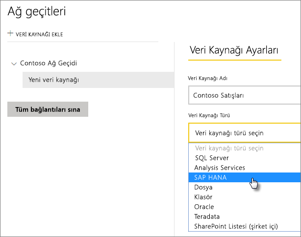
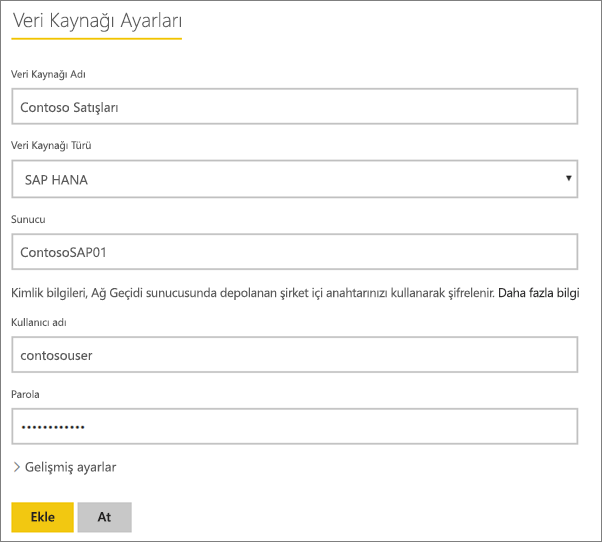
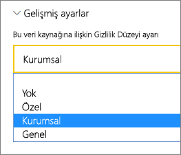
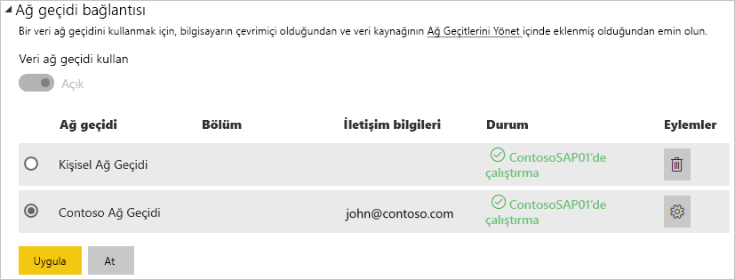

# SAP HANA veri kaynağınızı yönetme
Şirket içi veri ağ geçidini yükledikten sonra, ilgili ağ geçidi ile kullanılabilecek veri kaynaklarını eklemeniz gerekir. Bu makalede, ağ geçitleriyle ve veri kaynaklarıyla nasıl çalışıldığı anlatılmaktadır. SAP HANA veri kaynağını zamanlanmış yenileme veya DirectQuery için kullanabilirsiniz.

## Ağ geçidini indirme ve yükleme
Ağ geçidini Power BI hizmetinden indirebilirsiniz. **İndir** > **Data Gateway** seçeneğini belirleyin veya [ağ geçidi indirme sayfasına](https://go.microsoft.com/fwlink/?LinkId=698861) gidin.

## Ağ geçidi ekleme
Bir Ağ Geçidi eklemek için ortamınızdaki bir sunucuda ağ geçidini [indirin](https://go.microsoft.com/fwlink/?LinkId=698861) ve yükleyin. Ağ geçidi, yüklendikten sonra **Ağ geçitlerini yönet** bölümündeki ağ geçidi listelerinde görünecektir.

> [!NOTE]
> **Ağ geçitlerini yönet** seçeneği en az bir ağ geçidinin yöneticisi olduğunuzda görüntülenir. Bunun için bir yönetici olarak eklenmeniz veya bir ağ geçidi yükleyip yapılandırmanız gerekir.
> 
> 

## Ağ geçitlerini kaldırma
Bir ağ geçidini kaldırmak, söz konusu ağ geçidi altındaki tüm veri kaynaklarının da silinmesine neden olur.  Ayrıca bu işlem, ilgili veri kaynaklarını kullanan panoların ve raporların da çalışmamasına yol açar.

1. Sağ üst köşedeki dişli simgesi  > **Ağ geçitlerini yönet**'i seçin.
2. Ağ geçidi > **Kaldır**'ı seçin
   
   

## Veri kaynağı ekleme
Bir ağ geçidi seçip **Veri kaynağı ekle**'ye tıklayarak veya Ağ geçidi > **Veri kaynağı ekle** bölümüne giderek veri kaynağı ekleyebilirsiniz.

Ardından, listeden **Veri Kaynağı Türü**'nü seçebilirsiniz.

Daha sonra, **Sunucu**, **Kullanıcı Adı** ve **Parola** gibi veri kaynağı bilgilerini doldurmanız gerekir.

> [!NOTE]
> Veri kaynağına yönelik tüm sorgular bu kimlik bilgileri kullanılarak çalıştırılır. [Kimlik bilgilerinin](service-gateway-onprem.md#credentials) nasıl depolandığı ile ilgili daha fazla bilgi için, şirket içi veri ağ geçidi konusunun ele alındığı ana makaleye başvurun.
> 
> 

Tüm bilgileri doldurduktan sonra **Ekle**'ye tıklayabilirsiniz.  Artık bu veri kaynağını bir şirket içi SAP HANA sunucusunda zamanlanmış yenileme veya DirectQuery için kullanabilirsiniz. İşlem başarılı olduğunda *Bağlantı Başarılı* iletisi göreceksiniz.

### Gelişmiş ayarlar
Veri kaynağınızın gizlilik düzeyini yapılandırabilirsiniz. Bu işlem, verilerin nasıl bir araya getirilebileceğini denetler. Bu yalnızca zamanlanmış yenileme için kullanılır. DirectQuery için geçerli değildir. [Daha fazla bilgi](https://support.office.com/article/Privacy-levels-Power-Query-CC3EDE4D-359E-4B28-BC72-9BEE7900B540)

## Veri kaynaklarını kaldırma
Bir veri kaynağını kaldırmak, ilgili veri kaynağını kullanan panoların ve raporların çalışmamasına yol açar.  

Bir Veri Kaynağını kaldırmak için, Veri Kaynağı > **Kaldır** bölümüne gidin.

## Yöneticileri yönetme
Ağ geçidine ilişkin Yöneticiler sekmesinde, ağ geçidini yönetebilen kullanıcılar (veya güvenlik grupları) ekleyebilir ve kaldırabilirsiniz.

## Kullanıcıları yönetme
Veri kaynağına ilişkin Kullanıcılar sekmesinde, veri kaynağını kullanabilen kullanıcılar veya güvenlik grupları ekleyebilir ve bunları kaldırabilirsiniz.

> [!NOTE]
> Kullanıcılar listesi yalnızca kimlerin rapor yayımlayabildiğini denetler. Rapor sahipleri panolar veya içerik paketleri oluşturabilir ve bunları diğer kullanıcılarla paylaşabilir.
> 
> 

## Veri kaynağını kullanma
Oluşturduğunuz veri kaynağı, DirectQuery bağlantıları veya zamanlanmış yenileme ile kullanılabilir.

> [!NOTE]
> Şirket içi veri ağ geçidinde bulunan veri kaynağındaki ve Power BI Desktop’taki sunucu ve veritabanı adı eşleşmelidir!
> 
> 

Ağ geçidindeki veri kaynağı ve veri kümeniz arasındaki bağlantı, sunucu ve veritabanı adınızı temel alır. Bunlar eşleşmelidir. Örneğin, Power BI Desktop'ta sunucu adı için bir IP Adresi sağlarsanız bu IP Adresini ağ geçidi yapılandırmasındaki veri kaynağında da kullanmanız gerekir. Power BI Desktop'ta *SUNUCU\ÖRNEK* yapılandırmasını kullanırsanız ağ geçidi için yapılandırılan veri kaynağında da aynısını kullanmanız gerekir.

Bu durum hem DirectQuery hem de zamanlanmış yenileme için geçerlidir.

### Veri kaynağını DirectQuery bağlantılarıyla kullanma
Sunucu ve veritabanı adının, Power BI Desktop'ta ve ağ geçidinin yapılandırılmış veri kaynağında eşleştiğinden emin olmanız gerekir. Ayrıca, DirectQuery veri kümelerini yayımlamak için kullanıcınızın, veri kaynağının **Kullanıcılar** sekmesinde listelendiğinden emin olmanız gerekir. DirectQuery'ye yönelik seçim, Power BI Desktop'ta verileri ilk kez içeri aktardığınız sırada gerçekleşir. [Daha fazla bilgi](desktop-use-directquery.md)

Power BI Desktop'tan veya **Veri Al** seçeneğini kullanarak yayımladığınız raporlarınızla hemen çalışmaya başlayabilirsiniz. Ağ geçidinde veri kaynağı oluşturulduktan sonra bağlantının kullanılabilir hale gelmesi için birkaç dakika beklemeniz gerekebilir.

### Zamanlanmış yenileme ile veri kaynağını kullanma
Ağ geçidinde yapılandırılan veri kaynağının **Kullanıcılar** sekmesinde listeleniyorsanız ve sunucu ile veritabanı adı eşleşiyorsa ağ geçidini zamanlanmış yenileme ile kullanılabilen bir seçenek olarak görürsünüz.

## Sonraki adımlar
[Şirket içi veri ağ geçidi](service-gateway-onprem.md)  
[Şirket içi veri ağ geçidi (ayrıntılı)](service-gateway-onprem-indepth.md)  
[Şirket içi veri ağ geçidiyle ilgili sorunları giderme](service-gateway-onprem-tshoot.md)  
Başka bir sorunuz mu var? [Power BI Topluluğu'na başvurun](http://community.powerbi.com/)

