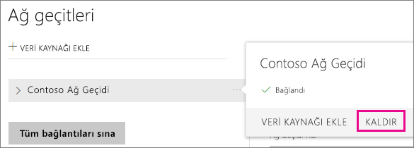
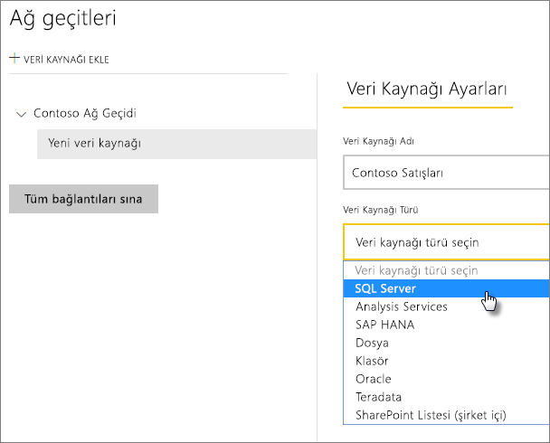
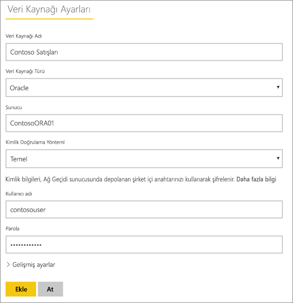
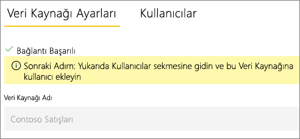
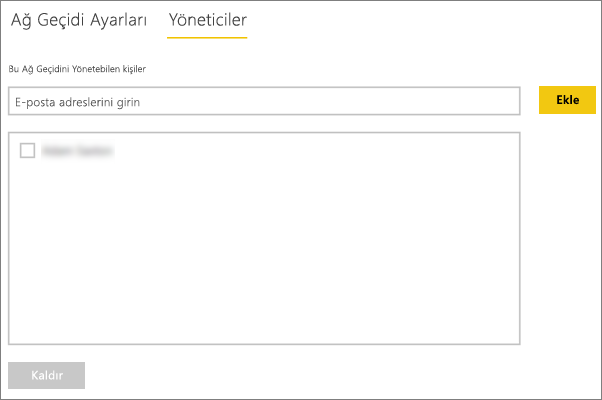
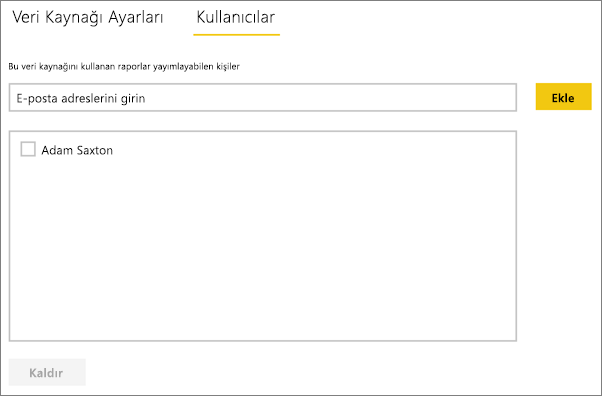
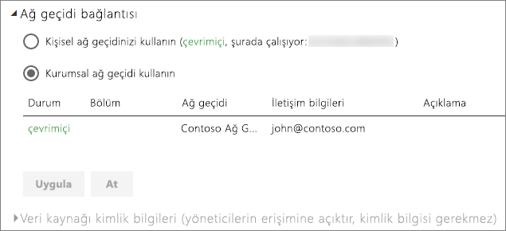

# Veri kaynağınızı yönetme - İçeri Aktarma/Zamanlanmış Yenileme
Şirket içi veri ağ geçidini yükledikten sonra, ilgili ağ geçidi ile kullanılabilecek veri kaynaklarını eklemeniz gerekir. Bu makalede, DirectQuery veya canlı bağlantılardan farklı olarak, zamanlanmış yenileme için kullanılan veri kaynakları ve ağ geçitleri ile nasıl çalışılacağı incelenecektir.

## Ağ geçidini indirme ve yükleme
Ağ geçidini Power BI hizmetinden indirebilirsiniz. **İndir** > **Data Gateway** seçeneğini belirleyin veya [ağ geçidi indirme sayfasına](https://go.microsoft.com/fwlink/?LinkId=698861) gidin.

## Ağ geçidi ekleme
Ağ geçidi eklemek için kurumsal ağ geçidini ortamınızdaki bir sunucuya [indirmeniz](https://go.microsoft.com/fwlink/?LinkId=698863) ve yüklemeniz yeterlidir. Ağ geçidi, yüklendikten sonra **Ağ geçitlerini yönet** bölümündeki ağ geçidi listelerinde görünür.

> [!NOTE]
> **Ağ geçitlerini yönet** seçeneği en az bir ağ geçidinin yöneticisi olduğunuzda görüntülenir. Bunun için bir yönetici olarak eklenmeniz veya bir ağ geçidi yükleyip yapılandırmanız gerekir.
> 
> 

## Ağ geçitlerini kaldırma
Bir ağ geçidini kaldırmak, söz konusu ağ geçidi altındaki tüm veri kaynaklarının da silinmesine neden olur.  Ayrıca bu işlem, ilgili veri kaynaklarını kullanan panoların ve raporların da çalışmamasına yol açar.

1. Sağ üst köşedeki dişli simgesi  > **Ağ geçitlerini yönet**'i seçin.
2. Ağ geçidi > **Kaldır**'ı seçin
   
   

## Veri kaynağı ekleme
Bir ağ geçidi seçip **Veri kaynağı ekle**'ye tıklayarak veya Ağ geçidi > **Veri kaynağı ekle** bölümüne giderek veri kaynağı ekleyebilirsiniz.

Ardından, listeden **Veri Kaynağı Türü**'nü seçebilirsiniz. Listelenen tüm veri kaynakları, kurumsal ağ geçidi ile zamanlanmış yenileme için kullanılabilir. Analysis Services, SQL Server ve SAP HANA zamanlanmış yenileme veya DirectQuery/canlı bağlantılar için kullanılabilir.

Ardından, kaynak bilgilerini ve veri kaynağına erişmek için kullanılan kimlik bilgilerini içeren veri kaynağı bilgilerini doldurmanız gerekir.

> [!NOTE]
> Veri kaynağına yönelik tüm sorgular bu kimlik bilgileri kullanılarak çalıştırılır. [Kimlik bilgilerinin](service-gateway-onprem.md#credentials) nasıl depolandığı ile ilgili daha fazla bilgi için, şirket içi veri ağ geçidi konusunun ele alındığı ana makaleye başvurun.
> 
> 

Tüm bilgileri doldurduktan sonra **Ekle**'ye tıklayabilirsiniz.  Artık bu veri kaynağını şirket içi verilerinizle zamanlanmış yenileme için kullanabilirsiniz. İşlem başarılı olduğunda *Bağlantı Başarılı* iletisi görüntülenir.

<!-- Shared Install steps Include -->
[!INCLUDE [gateway-onprem-datasources-include](./includes/gateway-onprem-datasources-include.md)]

### Gelişmiş ayarlar
Veri kaynağınızın gizlilik düzeyini yapılandırabilirsiniz. Bu işlem, verilerin nasıl bir araya getirilebileceğini denetler. Bu işlem yalnızca zamanlanmış yenileme için kullanılır. [Daha fazla bilgi](https://support.office.com/article/Privacy-levels-Power-Query-CC3EDE4D-359E-4B28-BC72-9BEE7900B540)

## Veri kaynaklarını kaldırma
Bir veri kaynağını kaldırmak, ilgili veri kaynağını kullanan panoların ve raporların çalışmamasına yol açar.  

Bir Veri Kaynağını kaldırmak için, Veri Kaynağı > **Kaldır** bölümüne gidin.

## Yöneticileri yönetme
Ağ geçidine ilişkin Yöneticiler sekmesinde, ağ geçidini yönetebilen kullanıcılar ekleyebilir ve kullanıcıları kaldırabilirsiniz. Şu anda yalnızca kullanıcı ekleyebilirsiniz. Güvenlik grupları eklenemez.

## Kullanıcıları yönetme
Veri kaynağına ilişkin Kullanıcılar sekmesinde, veri kaynağını kullanabilen kullanıcılar veya güvenlik grupları ekleyebilir ve bunları kaldırabilirsiniz.

> [!NOTE]
> Kullanıcılar listesi yalnızca kimlerin rapor yayımlayabildiğini denetler. Rapor sahipleri panolar veya içerik paketleri oluşturabilir ve bunları diğer kullanıcılarla paylaşabilir.
> 
> 

## Veri kaynağını zamanlanmış yenileme için kullanma
Oluşturduğunuz veri kaynağı, DirectQuery bağlantıları veya zamanlanmış yenileme ile kullanılabilir.

> [!NOTE]
> Şirket içi veri ağ geçidinde bulunan veri kaynağındaki ve Power BI Desktop’taki sunucu ve veritabanı adı eşleşmelidir!
> 
> 

Ağ geçidindeki veri kaynağı ve veri kümeniz arasındaki bağlantı, sunucu ve veritabanı adınızı temel alır. Bunlar eşleşmelidir. Örneğin, Power BI Desktop'ta sunucu adı için bir IP Adresi sağlarsanız bu IP Adresini ağ geçidi yapılandırmasındaki veri kaynağında da kullanmanız gerekir. Power BI Desktop'ta *SERVER\INSTANCE* (SUNUCU\ÖRNEK) seçeneğini kullanırsanız ağ geçidi için yapılandırılan veri kaynağında da aynısını kullanmanız gerekir.

Ağ geçidinde yapılandırılan veri kaynağının **Kullanıcılar** sekmesinde yer alıyorsanız ve sunucu ile veritabanı adı eşleşiyorsa ağ geçidini zamanlanmış yenileme ile kullanılabilen bir seçenek olarak görürsünüz.

> [!WARNING]
> Veri kümeniz birden çok veri kaynağı içeriyorsa her bir veri kaynağı, ağ geçidine eklenmelidir. Ağ geçidine bir veya daha fazla veri kaynağı eklenmezse ağ geçidini zamanlanmış yenileme için kullanılabilir olarak göremezsiniz.
> 
> 

## Sınırlamalar
* OAuth, Şirket içi veri ağ geçidi ile desteklenen bir kimlik doğrulama düzeni değildir. OAuth kimlik doğrulamasını gerekli kılan veri kaynakları ekleyemezsiniz. Veri kümeniz OAuth kimlik doğrulamasını gerekli kılan bir veri kaynağı içeriyorsa ağ geçidini zamanlanmış yenileme için kullanamazsınız.

## Sonraki adımlar
[Şirket içi veri ağ geçidi](service-gateway-onprem.md)  
[Şirket içi veri ağ geçidi (ayrıntılı)](service-gateway-onprem-indepth.md)  
[Şirket içi veri ağ geçidiyle ilgili sorunları giderme](service-gateway-onprem-tshoot.md)  
Başka bir sorunuz mu var? [Power BI Topluluğu'na başvurun](http://community.powerbi.com/)

