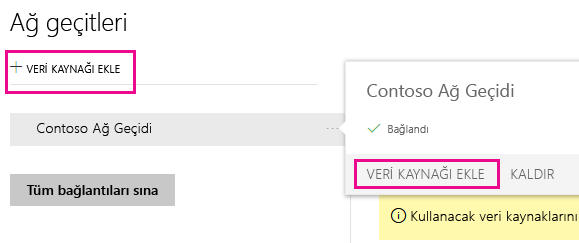
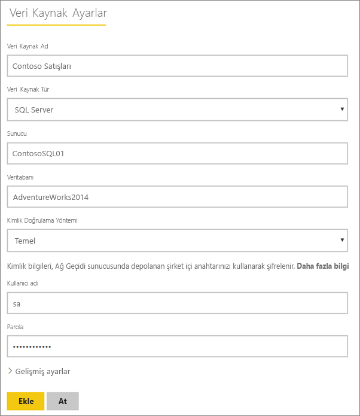
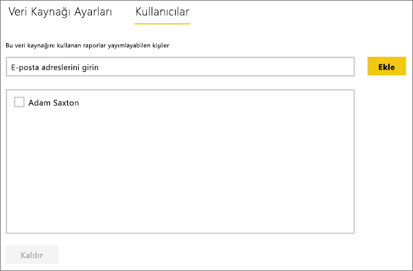
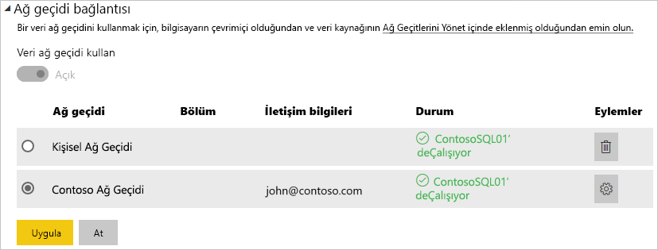

# Manage your data source - SQL Server (Veri kaynağınızı yönetme - SQL Server)
Şirket içi veri ağ geçidini yükledikten sonra ilgili ağ geçidi ile kullanılabilen veri kaynaklarını ekleyebilirsiniz. Bu makalede, ağ geçitleriyle ve veri kaynaklarıyla nasıl çalışıldığı anlatılmaktadır. SQL Server veri kaynağını zamanlanmış yenileme veya DirectQuery için kullanabilirsiniz.

## Ağ geçidini indirme ve yükleme
Ağ geçidini Power BI hizmetinden indirebilirsiniz. **İndir** > **Data Gateway** seçeneğini belirleyin veya [ağ geçidi indirme sayfasına](https://go.microsoft.com/fwlink/?LinkId=698861) gidin.

## Ağ geçidi ekleme
Bir ağ geçidi eklemek için ortamınızdaki bir sunucudan ağ geçidini [indirip](https://go.microsoft.com/fwlink/?LinkId=698861) yüklemeniz yeterlidir. Ağ geçidi, yüklendikten sonra **Ağ geçitlerini yönet** seçeneği altındaki ağ geçidi listelerinde görünür.

> [!NOTE]
> **Ağ geçitlerini yönet** seçeneği en az bir ağ geçidinin yöneticisi olduğunuzda görünür. Bu durum, bir ağ geçidine yönetici olarak eklendiğinizde veya bir ağ geçidini kendiniz yükleyip yapılandırdığınızda gerçekleşir.
> 
> 

## Ağ geçitlerini kaldırma
Bir ağ geçidini kaldırmak, söz konusu ağ geçidi altındaki tüm veri kaynaklarının da silinmesine neden olur.  Ayrıca bu işlem, ilgili veri kaynaklarını kullanan panoların ve raporların da çalışmamasına yol açar.

1. Sağ üst köşedeki dişli simgesi  > **Ağ geçitlerini yönet**'i seçin.
2. Ağ geçidi > **Kaldır**'ı seçin
   
   

## Veri kaynağı ekleme
Bir ağ geçidi seçip **Veri kaynağı ekle**'ye tıklayarak veya Ağ geçidi > **Veri kaynağı ekle** bölümüne giderek veri kaynağı ekleyebilirsiniz.

Ardından **Veri Kaynağı Türü**'nü listeden seçebilirsiniz.

> [!NOTE]
> DirectQuery kullanırken, ağ geçidi yalnızca **SQL Server 2012 SP1** ve sonraki sürümlerini destekler.
> 
> 

Ardından, **Sunucu** ve **Veritabanı**'nı içeren veri kaynağı bilgilerini doldurmak isteyebilirsiniz.  

Bir **Kimlik Doğrulama Yöntemi** seçmeniz de gerekecektir.  Bu yöntem **Windows** veya **Temel** seçeneklerinden biri olabilir.  Windows Kimlik Doğrulaması yerine SQL Kimlik Doğrulaması kullanacaksanız **Temel**'i seçmeyi tercih edebilirsiniz. Ardından, bu veri kaynağı için kullanılacak kimlik bilgilerini girin.

> [!NOTE]
> Kerberos Çoklu Oturum Açma (SSO) özelliği, veri kaynağı için yapılandırılmadığı ve etkinleştirilmediği sürece veri kaynağına yönelik tüm sorgular bu kimlik bilgileri kullanılarak çalıştırılır. SSO ile oturum açıldığında, içeri aktarılan veri kümeleri için, depolanan kimlik bilgilerini kullanır ancak DirectQuery veri kümeleri, SSO ile sorgu yürütmek için geçerli Power BI kullanıcısını kullanır. Daha fazla bilgi edinmek için, [kimlik bilgilerinin](service-gateway-onprem.md#credentials) nasıl depolandığını anlatan ana şirket içi veri geçidi makalesine veya [Power BI ve şirket içi veri kaynakları arasında SSO (çoklu oturum açma) gerçekleştirmek için Kerberos'u kullanmayı](service-gateway-kerberos-for-sso-pbi-to-on-premises-data.md) anlatan makaleye göz atın.
> 
> 

Her yeri doldurduktan sonra **Ekle**'ye tıklayabilirsiniz.  Artık bu veri kaynağını bir şirket içi SQL Server'da zamanlanmış yenileme veya DirectQuery için kullanabilirsiniz. İşlem başarılı olduğunda *Bağlantı Başarılı* iletisi göreceksiniz.

### Gelişmiş ayarlar
Veri kaynağınızın gizlilik düzeyini yapılandırabilirsiniz. Bu işlem, verilerin nasıl bir araya getirilebileceğini denetler. Bu yalnızca zamanlanmış yenileme için kullanılır. DirectQuery için geçerli değildir. [Daha fazla bilgi](https://support.office.com/article/Privacy-levels-Power-Query-CC3EDE4D-359E-4B28-BC72-9BEE7900B540)

## Veri kaynaklarını kaldırma
Bir veri kaynağını kaldırmak, ilgili veri kaynağını kullanan panoların ve raporların çalışmamasına yol açar.  

Bir Veri Kaynağını kaldırmak için, Veri Kaynağı > **Kaldır** bölümüne gidin.

## Yöneticileri yönetme
Ağ geçidine ilişkin Yöneticiler sekmesinde, ağ geçidini yönetebilen kullanıcılar (veya güvenlik grupları) ekleyebilir ve kaldırabilirsiniz.

## Kullanıcıları yönetme
Veri kaynağına ilişkin Kullanıcılar sekmesinde, veri kaynağını kullanabilen kullanıcılar veya güvenlik grupları ekleyebilir ve bunları kaldırabilirsiniz.

> [!NOTE]
> Kullanıcılar listesi yalnızca kimlerin rapor yayımlayabildiğini denetler. Rapor sahipleri panolar veya içerik paketleri oluşturabilir ve bunları diğer kullanıcılarla paylaşabilir.
> 
> 

## Veri kaynağını kullanma
Veri kaynağı, oluşturulduktan sonra DirectQuery bağlantılarıyla veya zamanlanmış yenileme yoluyla kullanılabilir.

> [!NOTE]
> Şirket içi veri ağ geçidinde bulunan veri kaynağındaki ve Power BI Desktop'taki sunucu adı ile veritabanı adı eşleşmelidir!
> 
> 

Ağ geçidindeki veri kaynağı ve veri kümeniz arasındaki bağlantı, sunucu ve veritabanı adınızı temel alır. Bunlar eşleşmelidir. Örneğin, **Power BI Desktop** içinde sunucu adı için bir IP Adresi sağlarsanız bu IP Adresini ağ geçidi yapılandırması içindeki veri kaynağında da kullanmanız gerekir. Power BI Desktop'ta *SERVER\INSTANCE* (SUNUCU\ÖRNEK) seçeneğini kullanırsanız ağ geçidi için yapılandırılan veri kaynağında da aynısını kullanmanız gerekir.

Bu durum hem DirectQuery hem de zamanlanmış yenileme için geçerlidir.

### Veri kaynağını DirectQuery bağlantılarıyla kullanma
Sunucu ve veritabanı adının **Power BI Desktop**'ta ve ağ geçidinin yapılandırılmış veri kaynağında eşleştiğinden emin olmanız gerekir. Ayrıca, DirectQuery veri kümelerini yayımlamak için kullanıcınızın, veri kaynağının **Kullanıcılar** sekmesinde listelendiğinden emin olmanız gerekir. DirectQuery'ye yönelik seçim, verileri ilk kez içeri aktardığınızda Power BI Desktop'ta gerçekleşir. [Daha fazla bilgi](desktop-use-directquery.md)

Power BI Desktop'tan veya **Veri Al** seçeneğini kullanarak yayımladığınız raporlarınızla hemen çalışmaya başlayabilirsiniz. Ağ geçidinde veri kaynağı oluşturulduktan sonra bağlantının kullanılabilir hale gelmesi için birkaç dakika beklemeniz gerekebilir.

### Zamanlanmış yenileme ile veri kaynağını kullanma
Ağ geçidinde yapılandırılan veri kaynağının **Kullanıcılar** sekmesinde listeleniyorsanız ve sunucu ile veritabanı adı eşleşiyorsa ağ geçidini zamanlanmış yenileme ile kullanılabilen bir seçenek olarak görürsünüz.

## Sonraki adımlar
* [Şirket içi veri ağ geçidi](service-gateway-onprem.md)  
* [Şirket içi veri ağ geçidi (ayrıntılı)](service-gateway-onprem-indepth.md)  
* [Şirket içi veri ağ geçidiyle ilgili sorunları giderme](service-gateway-onprem-tshoot.md)
* [Use Kerberos for SSO (single sign-on) from Power BI to on-premises data sources (Power BI ve şirket içi veri kaynakları arasında SSO (çoklu oturum açma) gerçekleştirmek için Kerberos'u kullanma)](service-gateway-kerberos-for-sso-pbi-to-on-premises-data.md). 
* Başka bir sorunuz mu var? [Power BI Topluluğu'na başvurun](http://community.powerbi.com/)

