# Veri kaynağınızı yönetme - Analysis Services
Şirket içi veri ağ geçidini yükledikten sonra, ilgili ağ geçidi ile kullanılabilecek veri kaynaklarını eklemeniz gerekir. Bu makalede, ağ geçitleriyle ve veri kaynaklarıyla nasıl çalışıldığı anlatılmaktadır. Analysis Services veri kaynağını zamanlanmış yenileme veya canlı bağlantılar için kullanabilirsiniz.

<iframe width="560" height="315" src="https://www.youtube.com/embed/ownIGbcRAAU" frameborder="0" allowfullscreen></iframe>

## Ağ geçidini indirme ve yükleme
Ağ geçidini Power BI hizmetinden indirebilirsiniz. **İndir** > **Data Gateway** seçeneğini belirleyin veya [ağ geçidi indirme sayfasına](https://go.microsoft.com/fwlink/?LinkId=698861) gidin.

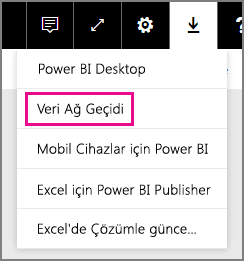

## Analysis Services canlı bağlantılarına ilişkin sınırlamalar
Tablolu veya çok boyutlu örnekler için canlı bağlantı kullanabilirsiniz.

| **Sunucu sürümü** | **Gerekli SKU** |
| --- | --- |
| 2012 SP1 CU4 veya sonraki sürümler |İş Zekası ve Enterprise SKU'su |
| 2014 |İş Zekası ve Enterprise SKU'su |
| 2016 |Standart SKU veya sonraki sürümler |

* Hücre düzeyinde Biçimlendirme ve çeviri özellikleri desteklenmez.
* Eylemler ve Adlandırılmış Kümeler Power BI için açık değildir ancak Eylemleri veya Adlandırılmış kümeleri de içeren çok boyutlu küplere yine de bağlanabilir, görseller ve raporlar oluşturabilirsiniz.

## Ağ geçidi ekleme
Bir ağ geçidi eklemek için ortamınızdaki bir sunucudan ağ geçidini [indirip](https://go.microsoft.com/fwlink/?LinkId=698861) yüklemeniz yeterlidir. Ağ geçidi, yüklendikten sonra **Ağ geçitlerini yönet** seçeneği altındaki ağ geçidi listelerinde görünür.

> [!NOTE]
> **Ağ geçitlerini yönet** seçeneği en az bir ağ geçidinin yöneticisi olduğunuzda görüntülenir. Bunun için bir yönetici olarak eklenmeniz veya bir ağ geçidi yükleyip yapılandırmanız gerekir.
> 
> 

## Ağ geçitlerini kaldırma
Bir ağ geçidini kaldırmak, söz konusu ağ geçidi altındaki tüm veri kaynaklarının da silinmesine neden olur.  Ayrıca bu işlem, ilgili veri kaynaklarını kullanan panoların ve raporların da çalışmamasına yol açar.

1. Sağ üst köşedeki dişli simgesi  > **Ağ geçitlerini yönet**'i seçin.
2. Ağ geçidi > **Kaldır**'ı seçin

   

## Veri kaynağı ekleme
Bir ağ geçidi seçip **Veri kaynağı ekle**'ye tıklayarak veya Ağ geçidi > **Veri kaynağı ekle** bölümüne giderek veri kaynağı ekleyebilirsiniz.

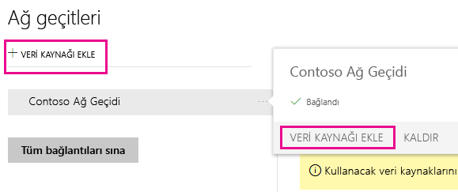

Böylece **Veri Kaynağı Türü**'nü listeden seçebilirsiniz. Çok Boyutlu veya Tablolu bir sunucuya bağlanıyorsanız Analysis Services'i seçin.

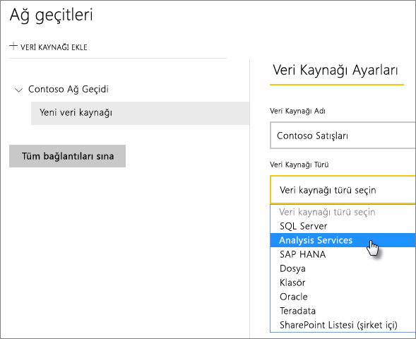

Ardından **Sunucu**'yu ve **Veritabanı**'nı içeren veri kaynağına ilişkin bilgileri doldurmanız gerekir.  

Girdiğiniz **Kullanıcı Adı** ve **Parola** Analysis Services örneğine bağlanmak için ağ geçidi tarafından kullanılır.

> [!NOTE]
> Girdiğiniz Windows hesabının bağlantı kurduğunuz örneğe ilişkin Sunucu Yöneticisi izinlerine sahip olması gerekir. Bu hesabın parolası, süresi dolacak şekilde ayarlanmışsa kullanıcılar, parolanın veri kaynağı için güncelleştirilmemesi durumunda bağlantı hatası alabilir. [Kimlik bilgilerinin](service-gateway-onprem.md#credentials) nasıl depolandığı ile ilgili daha fazla bilgi için, şirket içi veri ağ geçidi konusunun ele alındığı ana makaleye başvurun.
> 
> 

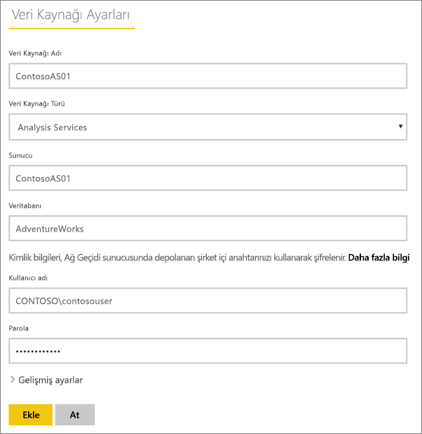

Tüm bilgileri doldurduktan sonra **Ekle**'ye tıklayabilirsiniz.  Şirket içi bir Analysis Services örneğine yönelik olarak, zamanlanmış yenileme veya canlı bağlantılar için bu veri kaynağını kullanabilirsiniz.  İşlem başarılı olursa *Bağlantı Başarılı* iletisi görürsünüz.

### Gelişmiş ayarlar
Veri kaynağınızın gizlilik düzeyini yapılandırabilirsiniz. Bu işlem, verilerin nasıl bir araya getirilebileceğini denetler. Bu işlem yalnızca zamanlanmış yenileme için kullanılır. Canlı bağlantılar için geçerli değildir. [Daha fazla bilgi](https://support.office.com/article/Privacy-levels-Power-Query-CC3EDE4D-359E-4B28-BC72-9BEE7900B540)

## Analysis Services'de kullanıcı adları
Bir kullanıcının Analysis Services'e bağlı bir raporla kurduğu her etkileşimde etkin kullanıcı adı, ağ geçidine ve ardından şirket içi Analysis Services sunucunuza geçirilir. Etkin kullanıcı olarak Analysis Services'e, Power BI'da oturum açmak için kullandığınız e-posta adresini geçiririz. Bu, [EffectiveUserName](https://msdn.microsoft.com/library/dn140245.aspx#bkmk_auth) bağlantı özelliğine geçirilir. Bu e-posta adresi, yerel Active Directory Etki Alanı'nda tanımlı bir UPN ile eşleşmelidir. UPN, Active Directory hesabının bir özelliğidir. Daha sonra bu Windows hesabının, bir Analysis Services rolünde mevcut olması gerekir. Active Directory'de eşleşme bulunamazsa oturum açma işlemi başarılı olmaz. [Daha fazla bilgi](https://msdn.microsoft.com/library/ms677605.aspx)

Ayrıca, Power BI oturum açma adınızı yerel dizin UPN'si ile eşleyebilirsiniz. [Daha fazla bilgi](service-gateway-enterprise-manage-ssas.md#map-user-names)

<iframe width="560" height="315" src="https://www.youtube.com/embed/Qb5EEjkHoLg" frameborder="0" allowfullscreen></iframe>

### UPN'min ne olduğunu nasıl anlarım?
UPN'nizin ne olduğunu bilmeyebilir ve bir etki alanı yöneticisi olmayabilirsiniz. Hesabınızın UPN'sini bulmak için iş istasyonunuzdan aşağıdaki komutu çalıştırabilirsiniz.

    whoami /upn

Sonuç, e-posta adresi gibi görünür ancak bu, etki alanı hesabınızdaki UPN'dir. Canlı bağlantılar için Analysis Services veri kaynağı kullanıyorsanız ve bu, Power BI'da oturum açmak için kullandığınız e-posta adresiyle eşleşmiyorsa [Kullanıcı adlarını eşlemeyi](#map-user-names) öğrenmek isteyebilirsiniz.

## Kullanıcı adlarını eşleme
<iframe width="560" height="315" src="https://www.youtube.com/embed/eATPS-c7YRU" frameborder="0" allowfullscreen></iframe>

Analysis Services için kullanıcı adlarını iki farklı şekilde eşleyebilirsiniz:

1. El ile kullanıcı yeniden eşleme 
2. AAD UPN'lerini Active Directory kullanıcıları ile yeniden eşlemeye (AD Arama eşlemesi) yönelik şirket içi Active Directory Özellik Arama

İkinci yaklaşım kullanılarak el ile eşleme gerçekleştirilebiliyor olsa da bunu yapmak zaman alıcı ve sürdürülmesi zor olabilir; desen eşleşmesi yeterli olmadığında (örneğin, etki alanı adları AAD ile şirket içi AD arasında farklı olduğunda veya kullanıcı hesabı adları AAD ve AD arasında farklı olduğunda) bu, özellikle zor bir işlemdir. Bu nedenle, ikinci yaklaşım kullanılarak el ile eşleme önerilmez.

Bu iki yaklaşımı sırasıyla aşağıdaki iki bölümde açıklayacağız

### El ile kullanıcı adı yeniden eşlemesi
Analysis Services veri kaynakları için özel Kullanıcı Asıl Adı (UPN) kuralları yapılandırabilirsiniz. Power BI hizmeti oturum açma adlarınızın yerel dizin UPN'nizle eşleşmemesi durumunda bu işlem yardımcı olur. Örneğin, Power BI'da john@contoso.com ile oturum açtığınızda ancak yerel dizin UPN'niz john@contoso.local olduğunda john@contoso.local adresinin Analysis Services'e geçirilmesini sağlayacak bir eşleme kuralı yapılandırabilirsiniz.

UPN Eşleme ekranına gitmek için aşağıdakileri yapın.

1. **Dişli simgesine** gidip **Ağ Geçitlerini Yönet** seçeneğini belirleyin.
2. Analysis Services veri kaynağını içeren ağ geçidini genişletin. Alternatif olarak, Analysis Services veri kaynağını oluşturmadıysanız bu işlemi bu noktada gerçekleştirebilirsiniz.
3. Veri kaynağını seçin ve ardından **Kullanıcılar** sekmesini seçin.
4. **Kullanıcı adlarını eşle** seçeneğini belirleyin.

    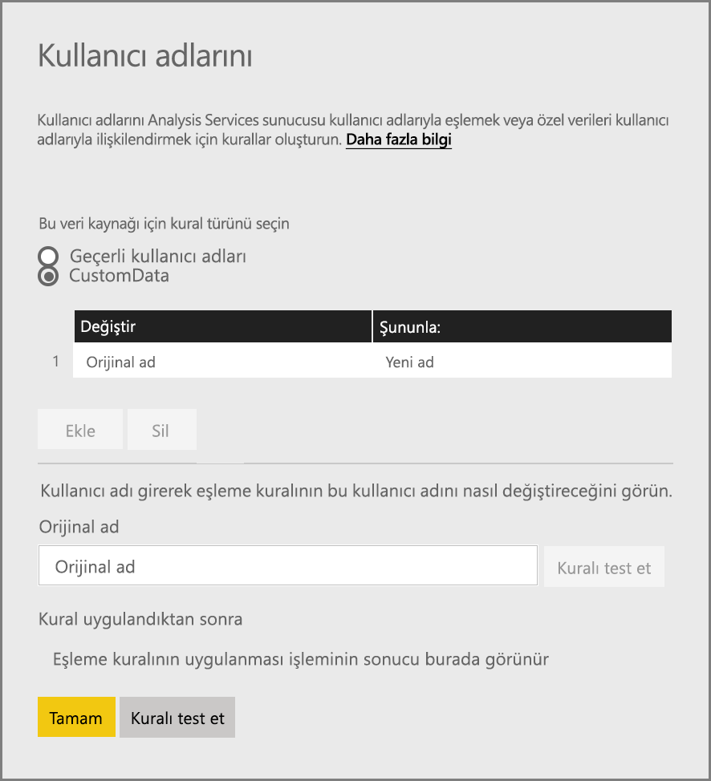

Ardından, kural eklemenin yanı sıra belirli bir kullanıcı için test gerçekleştirmeye yönelik seçenekler görürsünüz.

> [!NOTE]
> Bir kullanıcıyı yanlışlıkla değiştirebilirsiniz. Örneğin, **Değiştir (Özgün ad)** değeriniz <em>@contoso.com</em>, **Şununla (Yeni ad)** değeriniz de <em>@contoso.local</em> ise <em>@contoso.com</em> içeren oturum açma bilgilerine sahip tüm kullanıcılar <em>@contoso.local</em> ile değiştirilir. Ayrıca **Değiştir (Özgün ad)** değeriniz <em>dave@contoso.com</em>, **Şununla (Yeni ad)** değeriniz de <em>dave@contoso.local</em> ise v-dave@contoso.com oturum açma bilgisine sahip bir kullanıcı v-dave<em>@contoso.local</em> olarak gönderilir.

### AD arama eşlemesi
AAD UPN'lerini Active Directory kullanıcılarıyla yeniden eşlemek için şirket içi AD özellik arama işlemi gerçekleştirmek üzere bu bölümdeki adımları uygulayın. Başlangıç olarak bunun nasıl çalıştığını gözden geçirelim.

**Power BI hizmetinde** aşağıdakiler gerçekleşir:

- Bir Power BI AAD kullanıcısı tarafından şirket içi SSAS sunucusuna yapılan her sorgu için şunun gibi bir UPN dizesi geçirilir:      firstName.lastName@contoso.com

> [!NOTE]
> Power BI veri kaynağı yapılandırmasında tanımlanmış tüm el ile UPN kullanıcı eşlemeleri yine de kullanıcı adı dizesi Şirket içi veri ağ geçidine gönderilmeden *önce* uygulanır.
> 
> 

Yapılandırılabilir Özel Kullanıcı Eşlemesi’ne sahip Şirket içi veri ağ geçidinde aşağıdaki işlemleri gerçekleştirin:

1. Aramak için Active Directory'yi bulun (otomatik veya yapılandırılabilir)
2. **Power BI hizmetinden** gelen UPN dizesine ("firstName.lastName@contoso.com") bağlı olarak AD Kullanıcısının özniteliğini (*E-posta* gibi) arayın.
3. AD Arama başarısız olursa SSAS'ye EffectiveUser olarak geçirilen UPN'yi kullanmayı dener.
4. AD Arama başarılı olursa söz konusu AD Kullanıcısı'na ilişkin *UserPrincipalName* e-postasını alır. 
5. *UserPrincipalName* e-postasını SSAS'ye <em>Alias@corp.on-prem.contoso</em> gibi *EffectiveUser* olarak geçirir

AD Arama gerçekleştirmek için ağ geçidinizi yapılandırma:

1. En yeni ağ geçidini indirme ve yükleme
2. Ağ geçidinde **Şirket içi veri ağ geçidi hizmetini** yerel hizmet hesabı yerine bir etki alanı hesabıyla çalışacak şekilde değiştirmeniz gerekir (Aksi halde AD arama, çalışma zamanında düzgün şekilde çalışmaz). Değişikliğin geçerli olması için ağ geçidi hizmetini yeniden başlatmanız gerekir.  Makinenizde ağ geçidi uygulamasına gidin. ("On-premises data gateway" (Şirket içi veri ağ geçidi) araması yapın). Bunu yapmak için **Service settings > Change service account** (Hizmet ayarları > Hizmet hesabını değiştir) seçeneğine gidin. Yeni bir ağ geçidi oluşturmak istemiyorsanız bu ağ geçidini aynı makinede geri yüklemeniz gerekeceğinden ağ geçidine ilişkin kurtarma anahtarını bildiğinizden emin olun. 
3. Yazma izinlerine sahip olduğunuzdan emin olmak ve şu dosyayı düzenlemek için ağ geçidinin yüklendiği klasöre (*C:\Program Files\On-premises data gateway*) yönetici olarak gidin:

       Microsoft.PowerBI.DataMovement.Pipeline.GatewayCore.dll.config 
4. AD kullanıcılarınıza ilişkin Active Directory özniteliği *yapılandırmalarınıza* göre aşağıdaki iki yapılandırma değerini düzenleyin. Aşağıda gösterilen yapılandırma değerleri yalnızca örnek amaçlıdır, Active Directory yapılandırmanıza göre değer belirtmeniz gerekir. 

   
5. Yapılandırma değişikliğinin geçerli olması için **Şirket içi veri ağ geçidi** hizmetini yeniden başlatın.

### Eşleme kuralları ile çalışma
Eşleme kuralı oluşturmak için **Özgün ad** ve **Yeni Ad** değerlerini belirtmeniz ve ardından **Ekle** seçeneğini belirlemeniz gerekir.

| Alan | Açıklama |
| --- | --- |
| Değiştir (Özgün ad) |Power BI'da oturum açmak için kullandığınız e-posta adresi. |
| Şununla (Yeni Ad) |Özgün adın yerini almasını istediğiniz değer. Değiştirme işleminin sonucu Analysis Services bağlantısı için *EffectiveUserName* özelliğine geçirilecek değerdir. |

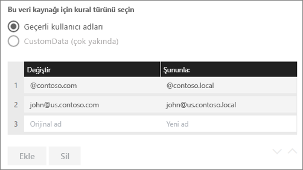

Listede bir öğe seçtiğinizde **köşeli çift ayraç simgelerini** veya giriş için **Sil** seçeneğini kullanarak öğeyi yeniden sıralamayı tercih edebilirsiniz.

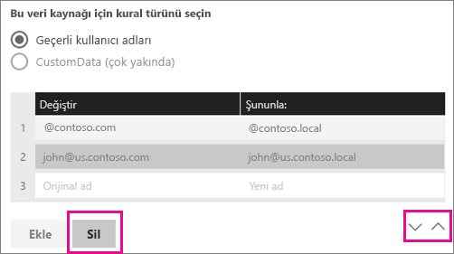

### Joker karakter (\*) kullanma
**Değiştir (Özgün ad)** dizeniz için joker karakter kullanabilirsiniz. Joker karakter yalnızca tek başına kullanılabilir, diğer herhangi bir dize bölümüyle kullanılamaz. Bu, tüm kullanıcılarınızı alıp veri kaynağına tek bir değer geçirmenize olanak tanır. Bu, kuruluşunuzdaki tüm kullanıcıların yerel ortamınızda aynı kullanıcı adını kullanmasını istediğinizde fayda sağlar.

### Bir eşleme kuralını test etme
**Özgün ad** için değer girip **Kuralı test et** seçeneğini belirleyerek özgün adın ne ile değiştirileceğini doğrulayabilirsiniz.

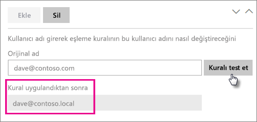

> [!NOTE]
> Hizmetin, kaydedilen kuralları kullanmaya başlaması birkaç dakika sürer. Kural, tarayıcının içinden hemen çalışır.
> 
> 

### Eşleme kurallarına ilişkin sınırlamalar
* Eşleme, yapılandırılmakta olan belirli bir veri kaynağına yönelik olarak gerçekleştirilir. Genel bir ayar değildir. Birden çok Analysis Services veri kaynağınız varsa kullanıcıları her veri kaynağına yönelik olarak eşlemeniz gerekir.

## Veri kaynaklarını kaldırma
Bir veri kaynağını kaldırmak, ilgili veri kaynağını kullanan panoların ve raporların tümünü bozar.  

Bir veri kaynağını kaldırmak için, Veri Kaynağı > **Kaldır** seçeneğine gidin.

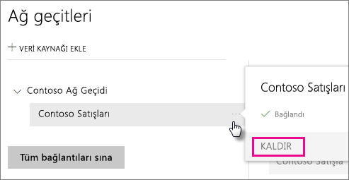

## Yöneticileri yönetme
Ağ geçidine ilişkin Yöneticiler sekmesinde, ağ geçidini yönetebilen kullanıcılar (veya güvenlik grupları) ekleyebilir ve kaldırabilirsiniz.

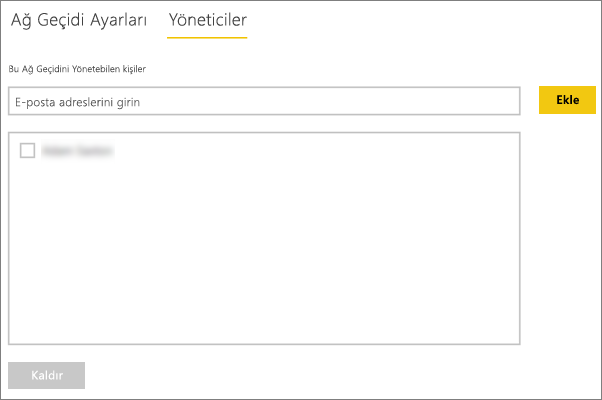

## Kullanıcıları yönetme
Veri kaynakları için, Kullanıcılar sekmesinde ilgili veri kaynağını kullanabilen kullanıcılar veya güvenlik grupları ekleyebilir ve kaldırabilirsiniz.

> [!NOTE]
> Kullanıcılar listesi yalnızca kimlerin rapor yayımlayabildiğini denetler. Rapor sahipleri panolar veya içerik paketleri oluşturabilir ve bunları diğer kullanıcılarla paylaşabilir.
> 
> 

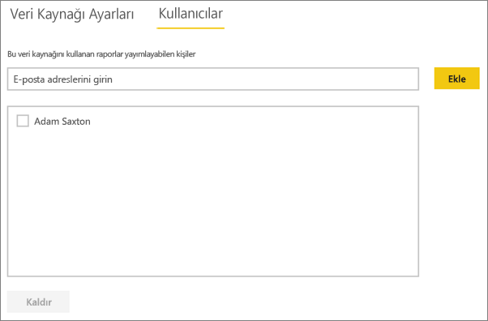

## Veri kaynağını kullanma
Veri kaynağı, oluşturulduktan sonra canlı bağlantılarla veya zamanlanmış yenileme yoluyla kullanılabilir.

> [!NOTE]
> Şirket içi veri ağ geçidinde bulunan veri kaynağındaki ve Power BI Desktop’taki sunucu ve veritabanı adı eşleşmelidir!
> 
> 

Ağ geçidindeki veri kaynağı ve veri kümeniz arasındaki bağlantı, sunucu ve veritabanı adınızı temel alır. Bunlar eşleşmelidir. Örneğin, Power BI Desktop'ta sunucu adı için bir IP Adresi sağlarsanız bu IP Adresini ağ geçidi yapılandırmasındaki veri kaynağında da kullanmanız gerekir. Power BI Desktop'ta *SUNUCU\ÖRNEK* yapılandırmasını kullanırsanız ağ geçidi için yapılandırılan veri kaynağında da aynısını kullanmanız gerekir.

Bu durum hem canlı bağlantılar hem de zamanlanmış yenileme için geçerlidir.

### Veri kaynağını canlı bağlantılarla kullanma
Sunucu ve veritabanı adının Power BI Desktop'ta ve ağ geçidinin yapılandırılmış veri kaynağında eşleştiğinden emin olmanız gerekir. Ayrıca, canlı bağlantı veri kümeleri yayımlamak için veri kaynağının **Kullanıcılar** sekmesinde kullanıcınızın listelendiğinden emin olmanız gerekir. Canlı bağlantılara yönelik seçim, verileri ilk kez içeri aktardığınızda Power BI Desktop içinde gerçekleşir.

Power BI Desktop'tan veya **Veri Al** seçeneğini kullanarak yayımladığınız raporlarınızla hemen çalışmaya başlayabilirsiniz. Ağ geçidinde veri kaynağı oluşturulduktan sonra bağlantının kullanılabilir hale gelmesi için birkaç dakika beklemeniz gerekebilir.

### Zamanlanmış yenileme ile veri kaynağını kullanma
Ağ geçidinde yapılandırılan veri kaynağının **Kullanıcılar** sekmesinde listeleniyorsanız ve sunucu ile veritabanı adı eşleşiyorsa ağ geçidini zamanlanmış yenileme ile kullanılabilen bir seçenek olarak görürsünüz.

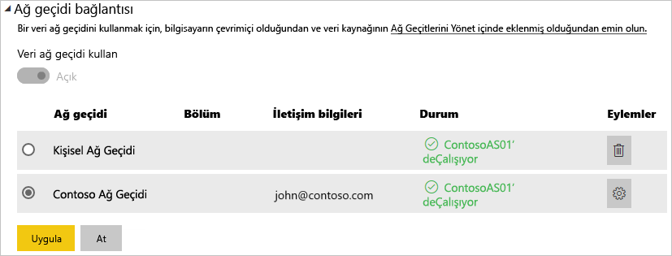

## Sonraki adımlar
[Şirket içi veri ağ geçidi](service-gateway-onprem.md)  
[Şirket içi veri ağ geçidi (ayrıntılı)](service-gateway-onprem-indepth.md)  
[Şirket içi veri ağ geçidiyle ilgili sorunları giderme](service-gateway-onprem-tshoot.md)  
Başka bir sorunuz mu var? [Power BI Topluluğu'na başvurun](http://community.powerbi.com/)

