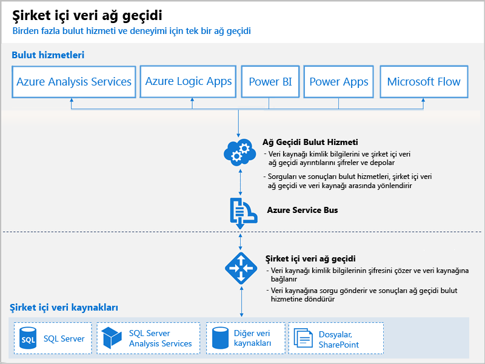

# Power BI ağ geçitleri nelerdir?

Power BI ağ geçidi, şirket içi ağı içine yüklediğiniz bir yazılımdır ve bu ağda verilere erişimi kolaylaştırır. Bağlantı isteklerini dinleyen ve yalnızca belirli ölçütlere uygun olan kullanıcı isteklerini onaylayan bir bekçi gibidir. Böylece kuruluşlar veritabanlarını ve diğer veri kaynaklarını şirket içi ağlarında tutabilir, diğer yandan da bu şirket içi verileri Power BI rapor ve panolarında güvenli bir şekilde kullanabilir.

Bir ağ geçidi tek bir veri kaynağı ya da birden çok veri kaynağı için kullanılabilir. Aşağıdaki diyagramda, üç şirket içi bilgisayar için buluttan istekleri işleyen ağ geçidi ile birlikte temel bir görünüm gösterilmektedir. Makalenin sonraki bölümlerinde bu konuyu daha ayrıntılı ele alacağız.

## Ağ geçidi türleri

Power BI, her biri farklı bir senaryoya yönelik iki ağ geçidi sunar:

* **Şirket içi veri ağ geçidi (kişisel mod)**: Tek kullanıcının kaynaklara bağlantı kurmasını sağlar ve başkalarıyla paylaşılamaz. Yalnızca Power BI ile birlikte kullanılabilir. Bu ağ geçidi, rapor oluşturan tek kişinin siz olduğunuz ve veri kaynaklarını başkalarıyla paylaşmak zorunda olmadığınız senaryolara çok uygundur.

* **Şirket içi veri ağ geçidi** – Birden fazla kullanıcının birden fazla şirket içi veri kaynağına bağlanmasını sağlar. Tümü tek bir ağ geçidi yüklemesi ile olmak üzere Power BI, PowerApps, Flow, Azure Analysis Services ve Azure Logic apps tarafından kullanılabilir. Bu ağ geçidi birden fazla kullanıcının birden fazla veri kaynağına eriştiği daha karmaşık senaryolara çok uygundur. 

## Ağ geçidi kullanma

Ağ geçidi kullanmanın dört ana adımı vardır:

1. Uygun modu kullanarak, yerel bir bilgisayara **ağ geçidini yükleme**
2. Şirket içi veri kaynaklarına erişebilmeleri için **ağ geçidine kullanıcı ekleme**
3. Raporlarda ve panolarda kullanılabilmesi için **veri kaynaklarına bağlanma**
4. Power BI raporlarının güncel olması için **şirket içi verileri yenileme**

Tek başına ağ geçidi yükleyebilir veya yüksek kullanılabilirlik için önerilen bir yöntem olarak bir ağ geçidini *kümeye* ekleyebilirsiniz.

## Ağ geçitlerinin işleyişi

Yüklediğiniz ağ geçidi bir Windows hizmeti olan **Şirket içi veri ağ geçidi** olarak çalışır. Bu yerel hizmet, Azure Service Bus aracılığıyla Ağ Geçidi Bulut Hizmeti’ne kaydedilir. Aşağıdaki diyagramda, şirket içi veriler ile ağ geçidini kullanan bulut hizmetleri arasındaki akış gösterilmektedir.

Sorgular ve veri akışı:

1. Bulut hizmeti, şirket içi veri kaynağı için şifrelenmiş kimlik bilgileri ile bir sorgu oluşturur. Bu sorgu daha sonra işlenmek üzere ağ geçidi sırasına gönderilir.
2. Ağ geçidi bulut hizmeti sorguyu çözümler ve isteği Azure Service Bus'a gönderir.
3. Şirket içi veri ağ geçidi, Azure Service Bus’ta bekleyen istekler olup olmadığını yoklar.
4. Ağ geçidi sorguyu alır, kimlik bilgilerinin şifresini çözer ve bu kimlik bilgileriyle veri kaynaklarına bağlanır.
5. Ağ geçidi, yürütme için sorguyu veri kaynağına gönderir.
6. Sonuçlar, veri kaynağından ağ geçidine ve ardından bulut hizmetine ve sunucunuza geri gönderilir.

## Sonraki adımlar
[Şirket içi veri ağ geçidini yükleme](service-gateway-install.md)

Başka bir sorunuz mu var? [Power BI Topluluğu'na başvurun](http://community.powerbi.com/)

