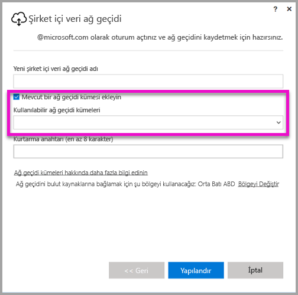

# <a name="high-availability-clusters-for-on-premises-data-gateway"></a>Şirket içi veri ağ geçidi için yüksek kullanılabilirlik kümeleri
Kuruluşunuzun Power BI raporlarında ve panolarında kullanılan şirket içi veri kaynaklarına erişebildiğinden emin olmak için **şirket içi veri ağ geçidi** yüklemelerinin **yüksek kullanılabilirlik kümelerini** oluşturabilirsiniz. Bu tür kümeler, yöneticilerin şirket içi veri kaynaklarına erişirken tek hata noktalarından kaçınmak için ağ geçitlerini gruplandırmasına olanak sağlar. Bu makalede, şirket içi veri ağ geçitlerinin yüksek kullanılabilirlik kümelerini oluşturmak için izleyebileceğiniz adımlar ve bunları ayarlamaya yönelik en iyi uygulamalar açıklanmaktadır. Yüksek kullanılabilirlik ağ geçidi kümeleri, şirket içi veri ağ geçidinin Kasım 2017 güncelleştirmesine veya üzerine sahip olmasını gerektirir.


## <a name="setting-up-high-availability-clusters-of-gateways"></a>Ağ geçitlerinin yüksek kullanılabilirlik kümelerini ayarlama

**Şirket içi veri ağ geçidi** yükleme işlemi sırasında, ağ geçidinin mevcut bir ağ geçidi kümesine eklenip eklenmeyeceğini belirtebilirsiniz. 



Ağ geçidini mevcut bir kümeye eklemek için, yeni ağ geçidini eklemek istediğiniz kümenin birincil ağ geçidi örneğine yönelik *Kurtarma anahtarını* sağlamanız gerekir. Kümenin birincil ağ geçidinin Kasım 2017 ağ geçidi güncelleştirmesini veya üzerini çalıştırıyor olması gerekir. 


## <a name="managing-a-gateway-cluster"></a>Ağ geçidi kümesini yönetme

Bir ağ geçidi kümesi iki veya daha fazla ağ geçidinden oluştuğunda, veri kaynağı ekleme veya bir ağ geçidine yönetici izinleri verme gibi tüm ağ geçidi yönetimi işlemleri kümenin parçası olan tüm ağ geçitlerine uygulanır. 

Yöneticiler **Power BI hizmetinde** dişli simgesi altında bulunan **Ağ geçitlerini yönet** menü öğesini kullandığında, kayıtlı kümelerin veya ayrı ağ geçitlerinin bir listesini görür ancak kümenin üyesi olan ağ geçidi örneklerini tek tek görmez.

Tüm yeni **Zamanlanan Yenileme** istekleri ve DirectQuery işlemleri otomatik olarak belirli bir ağ geçidi kümesinin birincil örneğine yönlendirilir. Birincil ağ geçidi örneği çevrimiçi değilse, istek kümedeki başka bir ağ geçidi örneğine yönlendirilir.

## <a name="powershell-support-for-gateway-clusters"></a>Ağ geçidi kümeleri için PowerShell desteği

PowerShell betikleri şirket içi ağ geçidi yükleme klasöründe bulunur. Bu klasör varsayılan olarak *C:\Program Files\On-premises data gateway*’dir. Bu betiklerin düzgün çalışması için PowerShell sürüm 5 veya üzerini kullanmanız gerekir. PowerShell betikleri kullanıcıların aşağıdaki işlemleri gerçekleştirmelerine olanak sağlar:

-   Bir kullanıcı için kullanılabilir ağ geçidi kümelerinin listesini alma
-   Bir kümede kayıtlı ağ geçidi örneklerinin listesini ve bunların çevrimiçi veya çevrimdışı olma durumunu alma
-   Bir küme içindeki bir ağ geçidinin etkin/devre dışı olma durumunu ve diğer ağ geçidi özelliklerini değiştirme
-   Ağ geçidini silme

Tabloda PowerShell komutlarını çalıştırmak için, önce aşağıdaki adımları uygulamanız gerekir:

1. Yönetici olarak bir PowerShell komut penceresi açın
2. Aşağıdaki tek seferlik PowerShell komutunu çalıştırın (geçerli makinede daha önce hiç PowerShell komutu çalıştırmadığınız varsayılmaktadır):

    ```
    Set-ExecutionPolicy -ExecutionPolicy Unrestricted -Force
    ```

3. Daha sonra, PowerShell penceresinde şirket içi veri ağ geçidi yükleme klasörüne gidip aşağıdaki komutu kullanarak gerekli modülü içeri aktarın:

    ```
    Import-Module .\OnPremisesDataGatewayHAMgmt.psm1
    ```

Bu adımlar tamamlandığında, ağ geçidi kümelerinizi yönetmek için aşağıdaki tablodaki komutları kullanabilirsiniz

| **Komut** | **Açıklama** | **Parametreler** |
| --- | --- | --- |
| *Login-OnPremisesDataGateway* |Bu komut kullanıcının şirket içi veri ağ geçidi kümelerini yönetmek için oturum açmasına olanak sağlar.  Diğer yüksek kullanılabilirlik komutlarının düzgün çalışması için *önce* bu komutu çalıştırarak oturum açmanız gerekir. Not: Oturum açma çağrısının parçası olarak alınan AAD kimlik doğrulama belirteci 1 saat boyunca geçerlidir ve daha sonra süresi dolar. Yeni bir belirteç almak için Login komutunu yeniden çalıştırabilirsiniz.| AAD kullanıcı adı ve parolası (ilk çağırmanın değil komut yürütmenin parçası olarak sağlanır)|
| *Get-OnPremisesDataGatewayClusters* | Oturum açan kullanıcı için ağ geçidi kümelerinin listesini alır. | İsteğe bağlı olarak, daha iyi okunabilirlik için bu komuta *Format-Table -AutoSize -Wrap* gibi biçimlendirme parametreleri geçirebilirsiniz |
| *Get-OnPremisesDataClusterGateways* | Belirtilen küme içindeki ağ geçitlerinin listesini ve her bir ağ geçidi için ek bilgileri (çevrimiçi/çevrimdışı olma durumu, makine adı vb.) alır | *-ClusterObjectID xyz*  (burada *xyz*, *Get-OnPremisesDataGatewayClusters* komutu kullanılarak alınabilen gerçek bir küme nesnesi kimliği değeriyle değiştirilir)|
| *Set-OnPremisesDataGateway* | Bir küme içindeki belirli bir ağ geçidi için, belirli ağ geçidi örneğini Etkinleştirme/Devre Dışı Bırakma dahil, özellik değerlerini ayarlamanıza olanak sağlar  | *-ClusterObjectID xyz* (*xyz*, *Get-OnPremisesDataGatewayClusters* komutu kullanılarak alınabilen gerçek bir küme nesnesi kimliği değeriyle değiştirilmelidir) *-GatewayObjectID abc*  (*abc*, belirli bir küme nesnesi kimliği için *Get-OnPremisesDataClusterGateways* komutu kullanılarak alınabilen gerçek bir ağ geçidi nesnesi kimliği değeriyle değiştirilmelidir) |
| *Get-OnPremisesDataGatewayStatus* | Bir küme içindeki belirli bir ağ geçidi örneğinin durumunu almanıza olanak sağlar  | *-ClusterObjectID xyz* (*xyz*, *Get-OnPremisesDataGatewayClusters* komutu kullanılarak alınabilen gerçek bir küme nesnesi kimliği değeriyle değiştirilmelidir) *-GatewayObjectID abc*  (*abc*, belirli bir küme nesnesi kimliği için *Get-OnPremisesDataClusterGateways* komutu kullanılarak alınabilen gerçek bir ağ geçidi nesnesi kimliği değeriyle değiştirilmelidir) |
| *Remove-OnPremisesDataGateway*  | Bir kümeden bir ağ geçidi örneğini kaldırmanıza olanak sağlar. Kümedeki diğer tüm ağ geçitleri kaldırılmadan kümedeki birincil ağ geçidinin kaldırılamayacağına dikkat edin.| *-ClusterObjectID xyz* (*xyz*, *Get-OnPremisesDataGatewayClusters* komutu kullanılarak alınabilen gerçek bir küme nesnesi kimliği değeriyle değiştirilmelidir) *-GatewayObjectID abc*  (*abc*, belirli bir küme nesnesi kimliği için *Get-OnPremisesDataClusterGateways* komutu kullanılarak alınabilen gerçek bir ağ geçidi nesnesi kimliği değeriyle değiştirilmelidir) |


## <a name="next-steps"></a>Sonraki adımlar

-   [Veri kaynağınızı yönetme - Analysis Services](service-gateway-enterprise-manage-ssas.md)  
-   [Veri kaynağınızı yönetme - SAP HANA](service-gateway-enterprise-manage-sap.md)  
-   [Veri kaynağınızı yönetme - SQL Server](service-gateway-enterprise-manage-sql.md)  
-   [Veri kaynağınızı yönetme - Oracle](service-gateway-onprem-manage-oracle.md)  
-   [Veri kaynağınızı yönetme - İçeri aktarma/Zamanlanmış yenileme](service-gateway-enterprise-manage-scheduled-refresh.md)  
-   [Şirket içi veri ağ geçidi ayrıntıları](service-gateway-onprem-indepth.md)  
-   [Şirket içi veri ağ geçidi (kişisel mod)](service-gateway-personal-mode.md)
-   [Şirket içi veri ağ geçidi için proxy ayarlarını yapılandırma](service-gateway-proxy.md)  
-   [Power BI’dan şirket içi veri kaynaklarına kadar SSO (çoklu oturum açma) için Kerberos’u kullanma](service-gateway-kerberos-for-sso-pbi-to-on-premises-data.md)  

Başka bir sorunuz mu var? [Power BI Topluluğu'na başvurun](http://community.powerbi.com/)
