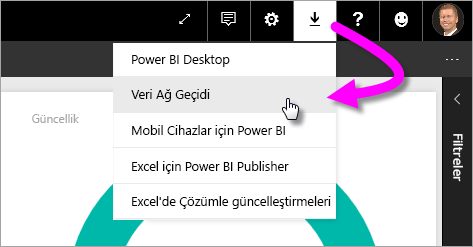
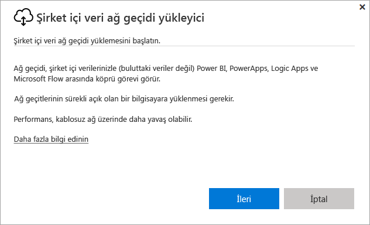
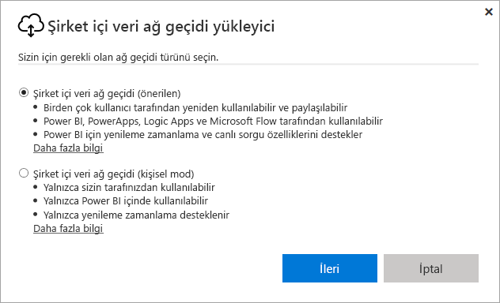
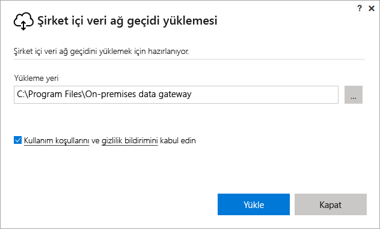
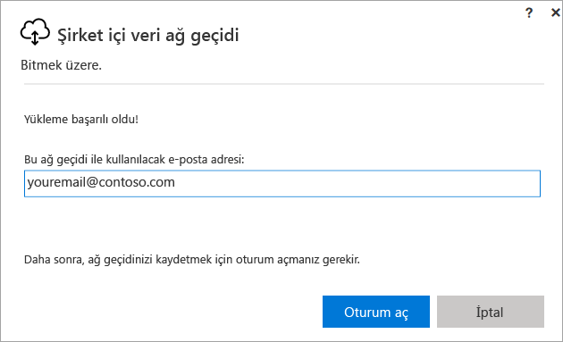
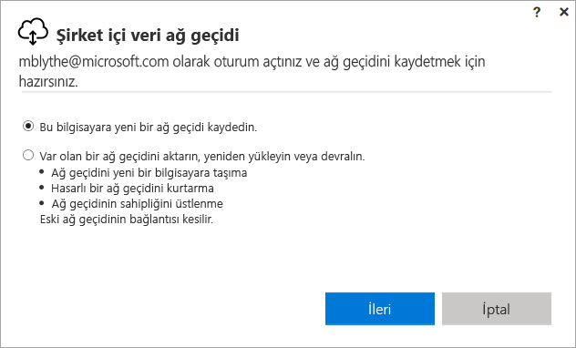
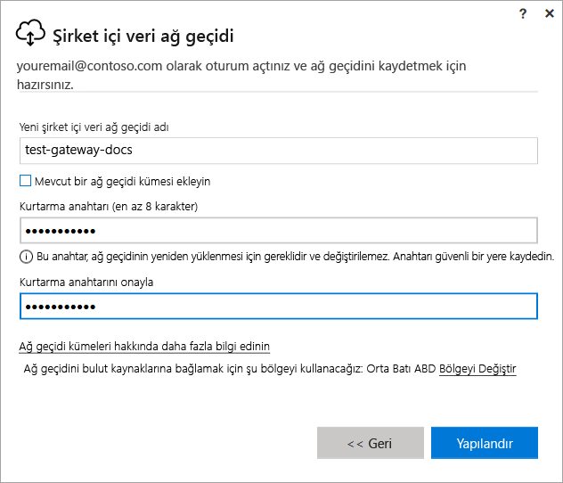
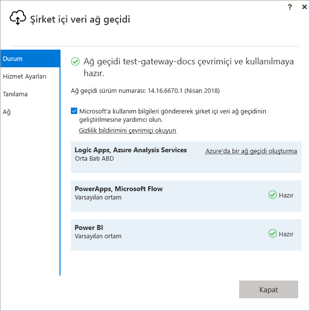
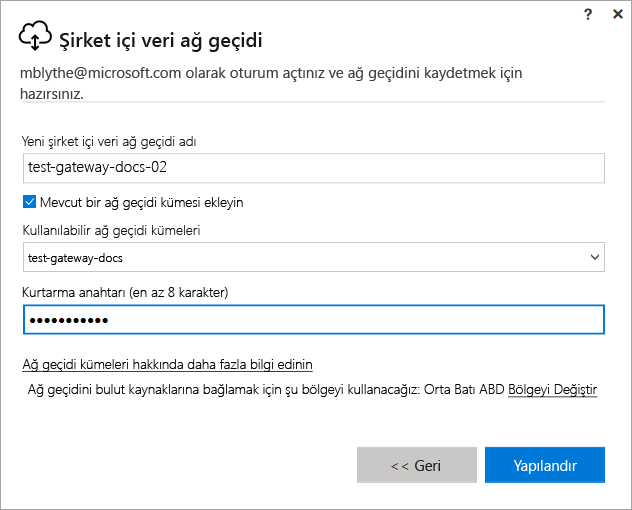

# Power BI için ağ geçidi yükleme

Power BI ağ geçidi, şirket içi ağı içine yüklediğiniz bir yazılımdır ve bu ağda verilere erişimi kolaylaştırır. [Genel bakış](service-gateway-getting-started.md) bölümünde açıklandığı gibi, kişisel modda veya standart modda (önerilen) ağ geçidi yükleyebilirsiniz. Standart modda tek başına ağ geçidi yükleyebilir veya yüksek kullanılabilirlik için önerilen bir yöntem olarak bir ağ geçidini *kümeye* ekleyebilirsiniz. Bu makalede, standart bir ağ geçidi yükleme ve sonra başka bir ağ geçidi ekleyerek küme oluşturma işlemi gösterilmektedir.

PowerApps’e kaydolmadıysanız başlamadan önce [ücretsiz deneme için kaydolun](https://app.powerbi.com/signupredirect?pbi_source=web).

## Bir ağ geçidi indirme ve yükleme

Ağ geçidi, onu yüklediğiniz bilgisayarda çalışır. Bu nedenle, her zaman açık olan bir bilgisayara yüklediğinizden emin olun. Daha iyi performans ve güvenilirlik için, bilgisayarın kablosuz ağ yerine kablolu bir ağda çalışması önerilir.

1. Power BI hizmetinde sağ üst köşedeki **indirme simgesi**  > **Veri Ağ Geçidi** öğesini seçin.

    

2. İndirme sayfasında **AĞ GEÇİDİNİ İNDİR** düğmesini seçin.

3. **Sonraki** seçeneğini belirleyin.     

    

4. **Şirket içi veri ağ geçidi (önerilen)** > **İleri**’yi seçin.

    

5. Varsayılan yükleme yolunu değiştirmeyin ve koşulları kabul edin > **Yükle**’yi seçin.

    

6. Power BI’da oturum açmak için kullandığınız hesabı girin > **Oturum aç**’ı seçin.

    

    Ağ geçidi, Power BI hesabınızla ilişkilendirilir ve ağ geçitlerini Power BI hizmetinden yönetirsiniz. Artık hesabınızda oturum açtınız.

7. **Bu bilgisayara yeni bir ağ geçidi kaydedin** > **İleri**’yi seçin.

    

8. Ağ geçidi için bir ad (kiracıda benzersiz olmalıdır) ve kurtarma anahtarı girin. Ağ geçidinizi kurtarmak veya taşımak isterseniz bu anahtar gerekli olur. **Yapılandır**'ı seçin.

    

    **Mevcut bir ağ geçidi kümesi ekleyin** seçeneğine dikkat edin. Makalenin sonraki bölümünde bu seçeneği kullanacaksınız.

9. Son penceredeki bilgileri gözden geçirin. Ağ geçidinin Power BI ve aynı zamanda PowerApps ile Flow için kullanılabilir olduğuna dikkat edin, çünkü üçü için de aynı hesabı kullanıyorum. **Kapat**'ı seçin.

    

Başarıyla bir ağ geçidi yüklediğinize göre küme oluşturmak için başka bir ağ geçidi ekleyebilirsiniz.

## Küme oluşturmak üzere başka bir ağ geçidi ekleme

Küme, ağ geçidi yöneticilerinin şirket içi veri erişimi için tek bir hata noktasına sahip olmaktan kaçınmasına olanak tanır. Birincil ağ geçidi kullanılamıyorsa, veri istekleri eklediğiniz ikinci ağ geçidine yönlendirilir vb. Bir bilgisayara yalnızca bir standart ağ geçidi yükleyebilirsiniz; bu nedenle, küme için ikinci ağ geçidini farklı bir bilgisayara yüklemeniz gerekir. Kümede yedeklilik istediğiniz için bunun yapılması mantıklıdır.

Yüksek kullanılabilirlik ağ geçidi kümeleri, Şirket içi veri ağ geçidinin Kasım 2017 güncelleştirmesine veya üzerine sahip olmasını gerektirir.

1. Ağ geçidini farklı bir bilgisayara indirip yükleyin.

2. Power BI hesabınızda oturum açtıktan sonra ağ geçidini kaydedin. **Mevcut bir kümeye ekle**’yi seçin. **Kullanılabilir ağ geçidi kümeleri** altında, yüklediğiniz ilk ağ geçidini (*birincil ağ geçidi*) seçin ve o ağ geçidinin kurtarma anahtarını girin. **Yapılandır**'ı seçin.

    

## Sonraki adımlar

[Power BI ağ geçidi yönetme](service-gateway-manage.md)

Başka bir sorunuz mu var? [Power BI Topluluğu'na başvurun](http://community.powerbi.com/)