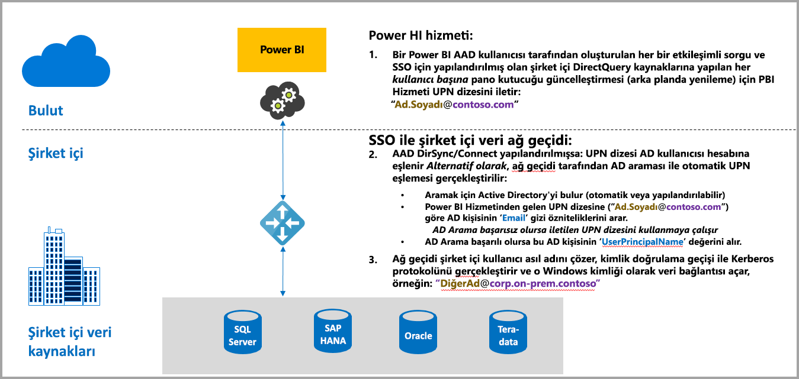
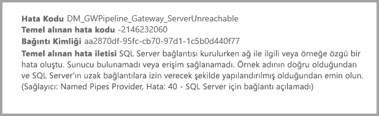
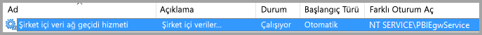
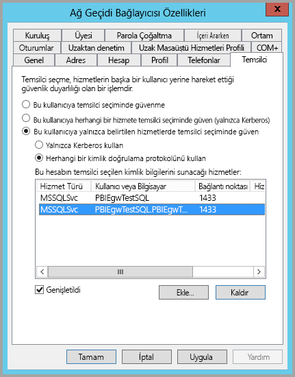
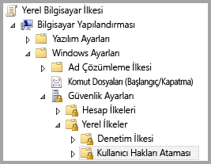
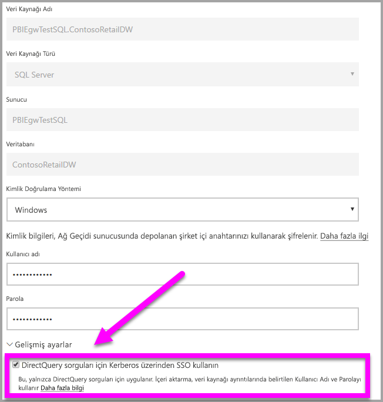
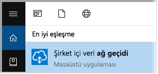
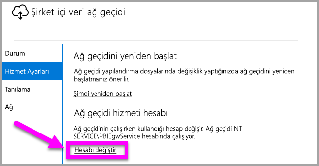

# Power BI'dan şirket içi veri kaynaklarına SSO (çoklu oturum açma) ile bağlanmak için Kerberos'u kullanma
Şirket içi veri ağ geçidinizi Kerberos ile yapılandırıp Power BI raporlarının ve panoların şirket içi verilerle etkinleştirilmesini sağlayarak sorunsuz çoklu oturum açma bağlantısından yararlanabilirsiniz. Şirket içi veri ağ geçidi, çoklu oturum açma (SSO) bağlantılarını, şirket içi veri kaynaklarına bağlanmak için kullandığı DirectQuery’den yararlanarak kurar.

Şu anda, tümü [Kerberos Kısıtlanmış Temsil](https://technet.microsoft.com/library/jj553400.aspx)'i temel alan, SQL Server, SAP HANA ve Teradata veri kaynakları desteklenmektedir.

* SQL Server
* SAP HANA
* Teradata

Bir kullanıcı Power BI Hizmeti'ndeki bir DirectQuery raporuyla etkileşime geçtiğinde; her bir çapraz filtreleme, dilimleme, sıralama ve rapor düzenleme işlemi, temel alınan şirket içi veri kaynağında canlı olarak sorgu yürütülmesine neden olabilir.  Veri kaynağı için çoklu oturum açma yapılandırıldığında, sorgular, Power BI ile etkileşime geçen kullanıcının kimliği altında (web deneyimi veya Power BI mobil uygulamaları aracılığıyla) yürütülür. Bu nedenle, her bir kullanıcı tam olarak, temel alınan veri kaynağında ilgili izinlere sahip olduğu verileri görür. Çoklu oturum açma yapılandırılmış olduğunda, paylaşılan verilerin farklı kullanıcılar için önbelleğe alınması söz konusu değildir.

## SSO ile sorgu çalıştırma sırasında gerçekleşen adımlar
SSO ile çalıştırılan bir sorgu, aşağıdaki diyagramda da gösterildiği gibi üç adımdan oluşur.

> [!NOTE]
> Oracle için SSO henüz mevcut olmasa da şu anda geliştirme aşamasındadır ve yakında kullanıma sunulacaktır.
> 
> 

Aşağıda, bu adımlara ilişkin ayrıntılar verilmiştir:

1. **Power BI hizmeti** yapılandırılmış ağ geçidine sorgu isteği gönderirken her bir sorguya *kullanıcı asıl adını* (UPN) ekler.
2. Ağ geçidinin Azure Active Directory UPN'sini yerel bir Active Directory kimliği ile eşlemesi gerekir.
   
   a.  AAD DirSync (*AAD Connect* olarak da bilinir) yapılandırılmışsa eşleme işlemi ağ geçidinde otomatik olarak gerçekleştirilir.
   
   b.  Aksi halde ağ geçidi, yerel Active Directory etki alanında arama gerçekleştirerek Azure AD UPN'sini bir yerel kullanıcı ile eşleyebilir.
3. Ağ geçidi hizmeti işlemi, eşlenen yerel kullanıcının kimliğine bürünür, temel alınan veritabanına yönelik bağlantıyı açar ve sorguyu gönderir. Ağ geçidinin veri kaynağının bulunduğu makineye yüklenmesi gerekmez.
   
   - Kullanıcının kimliğine bürünme işlemi ve bağlantı yalnızca ağ geçidi hizmet hesabının bir etki alanı hesabı (veya hizmet SID'si) olması halinde ve veritabanı için Kerberos kısıtlanmış temsilin, ağ geçidi hizmet hesabından gelen Kerberos biletleri kabul edilecek şekilde yapılandırılmış olması koşuluyla başarılı olur.  
   
   > [!NOTE]
   > Hizmet SID'sine ilişkin olarak; AAD DirSync/Connect yapılandırılmış ve kullanıcı hesapları eşitlenmişse ağ geçidi hizmetinin çalışma zamanında yerel AD aramaları gerçekleştirmesi gerekmez ve ağ geçidi hizmeti için yerel Hizmet SID'sini (etki alanı hesabı gerekmeden) kullanabilirsiniz.  Bu belgede açıklanan Kerberos kısıtlanmış temsil yapılandırmasına ilişkin adımlar aynıdır. (Tek değişiklik, etki alanı hesabı yerine hizmet SID'sine uygulanmış olmasıdır.)
   > 
   > 

> [!NOTE]
> SAP HANA için SSO’yu etkinleştirmek üzere SAP HANA’ya özgü şu yapılandırma gereksinimlerinin karşılandığından emin olmanız gerekir:
> 1. SAP HANA sunucusunun, gerekli olan en düşük sürümü çalıştırdığından emin olun. Bu sürüm, SAP HANA sunucusu platform düzeyinize bağlıdır:
> * [HANA 2 SPS 01 Rev 012.03](https://launchpad.support.sap.com/#/notes/2557386)
> * [HANA 2 SPS 02 Rev 22](https://launchpad.support.sap.com/#/notes/2547324)
> * [HANA 1 SP 12 Rev 122.13](https://launchpad.support.sap.com/#/notes/2528439)
>
> 2. Ağ geçidi makinesine SAP'nin en son HANA ODBC sürücüsünü yükleyin.  Yükleyebileceğiniz minimum sürüm Ağustos 2017'de kullanıma sunulan HANA ODBC 2.00.020.00 sürümüdür.
>
> SAP yama ve yükseltmelerinin aşağıdaki bağlantıları yararlı olabilir. SAP Destek hesabınızı kullanarak aşağıdaki kaynaklarda oturum açmanızın gerektiğini ve SAP’nin bu bağlantıları değiştirebileceğini veya güncelleştirebileceğini unutmayın.
> 
> * [HANA 2 SPS 01 Rev 012.03](https://launchpad.support.sap.com/#/notes/2557386) 
> * [HANA 2 SPS 02 Rev 22](https://launchpad.support.sap.com/#/notes/2547324) 
> * [HANA 1 SP 12 Rev 122.13](https://launchpad.support.sap.com/#/notes/2528439)

## Yetersiz bir Kerberos yapılandırmasından kaynaklanan hatalar
Temel alınan veritabanı sunucusu ve ağ geçidi **Kerberos Kısıtlanmış Temsil** için düzgün bir şekilde yapılandırılmamışsa şu hata iletisini alabilirsiniz:

Hata iletisiyle ilişkili teknik ayrıntılar ise aşağıdaki gibi görünebilir:

Bu, yetersiz Kerberos yapılandırması nedeniyle ağ geçidinin kaynak kullanıcının kimliğine düzgün bir şekilde bürünememesinden ve veritabanı bağlantısı girişiminin başarısız olmasından kaynaklanır.

## Kerberos Kısıtlanmış Temsil için hazırlanma
Kerberos Kısıtlanmış Temsil'in düzgün bir şekilde çalışması için, hizmet hesaplarındaki *Hizmet Asıl Adlarının* (SPN) ve temsilci seçme ayarlarının da dahil olduğu belirli öğelerin yapılandırılması gerekir.

### 1. Önkoşul: Şirket içi veri ağ geçidini yükleme ve yapılandırma
Şirket içi veri ağ geçidinin bu sürümü, mevcut ağ geçitlerinin ayarlarını devralma özelliğinin yanı sıra yerinde yükseltmeyi destekler.

### 2. Önkoşul: Ağ geçidi Windows hizmetini bir etki alanı hesabı olarak çalıştırma
Standart bir yüklemede, ağ geçidi, aşağıdaki görüntüde gösterildiği gibi bir makine yerel hizmet hesabı olarak (özel olarak belirtmek gerekirse, *NT Service\PBIEgwService*) çalıştırılır:

AAD'niz yerel Active Directory hesabınız ile eşitlenmediği (AAD DirSync/Connect kullanılarak) sürece, **Kerberos Kısıtlanmış Temsil**'in etkinleştirilebilmesi için ağ geçidinin bir etki alanı hesabı olarak çalıştırılması gerekir. Bu hesap değişikliğinin düzgün sonuç vermesini iki şekilde sağlayabilirsiniz:

* Şirket içi veri ağ geçidinin önceki bir sürümüyle başladıysanız, aşağıdaki makalede açıklanan adımların tümünü (3. adımda açıklanan, ağ geçidi yapılandırıcısını çalıştırmak dahil) sırasıyla ve eksiksiz bir şekilde uygulayın:
  
  * [Ağ geçidi hizmet hesabını etki alanı kullanıcısı olarak değiştirme](https://powerbi.microsoft.com/documentation/powerbi-gateway-proxy/#changing-the-gateway-service-account-to-a-domain-user)
  * Şirket içi ağ geçidinin Önizleme sürümünü zaten yüklediyseniz, hizmet hesaplarını doğrudan ağ geçidi yapılandırıcısından değiştirmeye yönelik, kullanıcı arabirimi temelli yeni bir yaklaşım bulunur. Bu makalenin sonlarında bulunan **Ağ geçidini bir etki alanı hesabına geçirme** bölümüne bakın.

> [!NOTE]
> AAD DirSync/Connect yapılandırılmış ve kullanıcı hesapları eşitlenmişse ağ geçidi hizmetinin çalışma zamanında yerel AD aramaları gerçekleştirmesi gerekmez ve ağ geçidi hizmeti için yerel Hizmet SID'sini (etki alanı hesabı gerekmeden) kullanabilirsiniz. Bu belgede açıklanan Kerberos Kısıtlanmış Temsil yapılandırmasına ilişkin adımlar söz konusu yapılandırmaya yönelik olanlarla aynıdır. (Tek değişiklik, etki alanı hesabı yerine hizmet SID'sine uygulanmış olmasıdır.)
> 
> 

### 3. Önkoşul: SPN'leri (SetSPN) ve Kerberos Kısıtlanmış Temsil ayarlarını yapılandırmak için etki alanı yöneticisi haklarını edinme
Bir etki alanı yöneticisinin SPN'leri ve Kerberos temsilci seçme ayarlarını yapılandırma (etki alanı yöneticisi hakları gerekmeden) haklarını geçici veya kalıcı olarak başka bir kişiye vermesi teknik olarak mümkün olsa da bu yaklaşım önerilmez. Aşağıdaki bölümde, **3. Önkoşul** için gereken yapılandırma adımları ayrıntılı bir şekilde sunulmuştur.

## Ağ geçidi ve veri kaynağı için Kerberos Kısıtlanmış Temsil'i yapılandırma
Sistemi düzgün bir şekilde yapılandırmak için şu iki öğeyi yapılandırmamız veya doğrulamamız gerekir:

1. Gerekirse, ağ geçidi hizmeti etki alanı hesabı için bir SPN yapılandırın (henüz yapılandırılmamışsa).
2. Ağ geçidi hizmeti etki alanı hesabında temsilci seçme ayarlarını yapılandırın.

Bu iki yapılandırma adımını uygulamak için bir etki alanı yöneticisi olmanız gerektiğini unutmayın.

Aşağıdaki bölümlerde bu adımlar sırasıyla açıklanmıştır.

### Ağ geçidi hizmet hesabı için SPN yapılandırma
Öncelikle aşağıdaki adımları uygulayarak, ağ geçidi hizmet hesabı olarak kullanılan etki alanı hesabı için bir SPN yapılandırılmış olup olmadığını belirleyin:

1. **Active Directory Kullanıcıları ve Bilgisayarları**'nı etki alanı yöneticisi olarak başlatın
2. Etki alanına sağ tıklayın, **Bul** seçeneğini belirleyin ve ağ geçidi hizmet hesabına ilişkin hesap adını yazın
3. Arama sonucunda, ağ geçidi hizmet hesabına sağ tıklayıp **Özellikler**'i seçin.
   
   * **Özellikler** iletişim kutusunda **Temsilci Seçme** sekmesi görünüyorsa SPN zaten oluşturulmuştur ve Temsilci Seçme ayarlarını yapılandırma ile ilgili bir sonraki alt bölüme geçebilirsiniz.

**Özellikler** iletişim kutusunda **Temsilci Seçme** sekmesi bulunmuyorsa söz konusu hesapta elle SPN oluşturarak, **Temsilci Seçme** sekmesinin eklenmesini sağlayabilirsiniz. (Bu, temsilci seçme ayarlarının yapılandırılması için izlenebilecek en kolay yoldur.) SPN oluşturma işlemi, Windows ile birlikte gelen [SetSPN aracı](https://technet.microsoft.com/library/cc731241.aspx) kullanılarak gerçekleştirilebilir. (SPN'yi oluşturmak için etki alanı yöneticisi haklarına sahip olmanız gerekir.)

Örneğin, ağ geçidi hizmet hesabının "PBIEgwTest\GatewaySvc", ağ geçidi hizmetinin çalıştırıldığı makinenin adının ise **Machine1** olduğunu varsayalım. Bu örnekteki makineye ilişkin ağ geçidi hizmet hesabına yönelik SPN'yi ayarlamak için aşağıdaki komutu çalıştırırsınız:

Adım tamamlandığına göre, temsilci seçme ayarlarını yapılandırmaya geçebiliriz.

### Ağ geçidi hizmet hesabında temsilci seçme ayarlarını yapılandırma
Ağ geçidi hizmet hesabındaki temsilci seçme ayarları ikinci yapılandırma gereksinimini oluşturur. Bu adımları uygulamak için kullanabileceğiniz birçok araç vardır. Bu makalede, dizindeki bilgileri yönetmek ve yayımlamak için kullanabileceğiniz ve etki alanı denetleyicilerinde varsayılan olarak bulunan bir Microsoft Yönetim Konsolu ek bileşeni olan **Active Directory Kullanıcıları ve Bilgisayarları**'nı kullanacağız. Bunu diğer makinelerdeki **Windows Özellikleri** yapılandırması aracılığıyla da etkinleştirebilirsiniz.

Protokol geçişi ile **Kerberos Kısıtlanmış Temsil**'i yapılandırmamız gerekir. Kısıtlanmış temsili kullanırken, hangi hizmetleri temsilci olarak seçmek istediğiniz konusunda açık olmanız gerekir. Örneğin, ağ geçidi hizmet hesabından gelen temsilci seçme çağrıları yalnızca SQL Server hizmetiniz veya SAP HANA sunucunuz tarafından kabul edilir.

Bu bölümde, temel alınan veri kaynaklarınız (SQL Server, SAP HANA, Teradata vb.) için zaten SPN'ler yapılandırmış olduğunuz varsayılır. Söz konusu veri kaynağı sunucusu SPN'lerinin nasıl yapılandırılacağını öğrenmek için lütfen ilgili veritabanı sunucusuna yönelik teknik belgelere bakın. [*Uygulamanızın hangi SPN'yi gerektirdiği*](https://blogs.msdn.microsoft.com/psssql/2010/06/23/my-kerberos-checklist/) konusuna açıklık getiren blog gönderisine de göz atabilirsiniz.

Sıradaki adımlar için bir ağ geçidi makinesi ve bir veritabanı sunucusu (SQL Server veritabanı) olmak üzere iki makine içeren bir şirket içi ortamının bulunduğunu, ayrıca şu ayarların ve adların geçerli olduğunu varsayacağız:

* Ağ geçidi makinesi adı: **PBIEgwTestGW**
* Ağ geçidi hizmet hesabı: **PBIEgwTest\GatewaySvc** (hesap görünen adı: Gateway Connector)
* SQL Server veri kaynağı makine adı: **PBIEgwTestSQL**
* SQL Server veri kaynağı hizmet hesabı: **PBIEgwTest\SQLService**

Bu örnek adlar ve ayarlar doğrultusunda yapılandırma adımları aşağıdaki gibi olur:

1. **Active Directory Kullanıcıları ve Bilgisayarları**'nı etki alanı yönetici haklarıyla başlatın.
2. Ağ geçidi hizmet hesabına (**PBIEgwTest\GatewaySvc**) sağ tıklayıp **Özellikler**'i seçin.
3. **Temsilci Seçme** sekmesini seçin.
4. **Bu bilgisayara yalnızca belirtilen hizmetlere temsilci seçmek için güven**'i seçin.
5. **Herhangi bir kimlik doğrulama protokolünü kullan**'ı seçin.
6. **Bu hesabın temsilci seçilen kimlik bilgilerini sunacağı hizmetler:** bölümünde **Ekle**'yi seçin.
7. Yeni iletişim kutusunda **Kullanıcı/Bilgisayar**'ı seçin.
8. SQL Server Veritabanı hizmeti için hizmet hesabını (**PBIEgwTest\SQLService**) girin ve **Tamam**'ı seçin.
9. Veritabanı sunucusu için oluşturduğunuz SPN'yi seçin. Bizim örneğimizde, SPN **MSSQLSvc** ile başlar. Veritabanı hizmeti için hem FQDN hem de NetBIOS SPN'sini eklediyseniz her ikisini de seçin. Yalnızca birini görebilirsiniz.
10. **Tamam**'ı seçin. SPN'nin listede görünmesi gerekir.
11. İsterseniz **Genişletilmiş**'i seçerek hem FQDN hem de NetBIOS SPN'sini listede görebilirsiniz.
12. **Genişletilmiş**'i işaretlediyseniz iletişim kutusu aşağıdakine benzer şekilde görünür.
    
    
13. **Tamam**'ı seçin.
    
    Son olarak, ağ geçidi hizmetinin çalıştırıldığı makinede (bizim örneğimizde, **PBIEgwTestGW**), ağ geçidi hizmet hesabına "Kimlik doğrulamasından sonra istemcinin özelliklerini al" yerel ilkesinin uygulanması gerekir. Bunu gerçekleştirmek/doğrulamak için Yerel Grup İlkesi Düzenleyicisi'ni (**gpedit**) kullanmanız gerekir.
14. Ağ geçidi makinesinde şunu çalıştırın: *gpedit.msc*
15. Aşağıdaki görüntüde gösterildiği gibi, **Yerel Bilgisayar İlkesi > Bilgisayar Yapılandırması > Windows Ayarları > Güvenlik Ayarları > Yerel İlkeler > Kullanıcı Hakları Ataması** yolunu izleyin.
    
    
16. **Kullanıcı Hakları Ataması** bölümündeki ilke listesindeki **Kimlik doğrulamasından sonra istemcinin özelliklerini al** seçeneğini belirleyin.
    
    
    
    **Kimlik doğrulamasından sonra istemcinin özelliklerini al**'a sağ tıklayıp bu ilkenin **Özellikler**'ini açın ve hesap listesini kontrol edin. Ağ geçidi hizmet hesabını (**PBIEgwTest\GatewaySvc**) içermesi gerekir.
17. **Kullanıcı Hakları Ataması** bölümündeki ilke listesinde bulunan **İşletim sisteminin parçası gibi davran (SeTcbPrivilege)** seçeneğini belirleyin. Ağ geçidi hizmet hesabının da hesap listesinde yer aldığından emin olun.
18. **Şirket içi veri ağ geçidi** hizmet işlemini yeniden başlatın.

## Power BI raporu çalıştırma
Bu makalede daha önce açıklanan tüm yapılandırma adımları tamamlandıktan sonra, veri kaynağını yapılandırmak için Power BI'daki **Ağ Geçitlerini Yönet** sayfasını kullanabilir ve buradaki **Gelişmiş Ayarlar** bölümünde SSO'yu etkinleştirip söz konusu veri kaynağına bağlı raporlar ve veri kümeleri yayımlayabilirsiniz.

Bu yapılandırma çoğu durumda çalışır. Ancak, ortamınıza bağlı olarak Kerberos ile farklı yapılandırmalar da söz konusu olabilir. Rapor hâlâ yüklenmiyorsa sorunun daha ayrıntılı bir şekilde incelenmesi için etki alanı yöneticinizle iletişime geçmeniz gerekir.

## Ağ geçidini bir etki alanı hesabına geçirme
Bu makalenin önceki bölümlerinde, **Şirket içi veri ağ geçidi** kullanıcı arabirimini kullanarak ağ geçidini, yerel bir hizmet hesabı yerine etki alanı hesabı olarak çalıştırılacak şekilde değiştirme konusuna değinmiştik. Bunu gerçekleştirmek için gereken adımlar aşağıda verilmiştir.

1. **Şirket içi veri ağ geçidi** yapılandırma aracını başlatın.
   
   
2. Ana sayfadaki **Oturum aç** düğmesini seçin ve Power BI hesabınızla oturum açın.
3. Oturum açma işlemi tamamlandıktan sonra **Hizmet Ayarları** sekmesini seçin.
4. Aşağıdaki şekilde gösterildiği gibi **Hesabı değiştir** seçeneğine tıklayarak destekli kılavuzu başlatın.
   
   

## Sonraki adımlar
**Şirket içi veri ağ geçidi** ve **DirectQuery** hakkında daha fazla bilgi için aşağıdaki kaynaklara göz atın:

* [Şirket içi veri ağ geçidi](service-gateway-onprem.md)
* [Power BI'da DirectQuery](desktop-directquery-about.md)
* [DirectQuery tarafından desteklenen veri kaynakları](desktop-directquery-data-sources.md)
* [DirectQuery ve SAP BW](desktop-directquery-sap-bw.md)
* [DirectQuery ve SAP HANA](desktop-directquery-sap-hana.md)

