# Power BI ağ geçidi yönetme

[Power BI veri ağ geçidini yükledikten](service-gateway-install.md) sonra, Power BI hizmetinin **Ağ geçitlerini yönet** alanı üzerinden, yerel bilgisayarınızdaki ağ geçidi uygulamanızdan ve PowerShell betikleri ile yönetebilirsiniz. Bu makalede Power BI hizmetine odaklanılmaktadır. Kısa süre önce bir ağ geçidi yüklediyseniz, bundan sonra [bir veri kaynağı eklemeniz](#add-a-data-source), sonra da veri kaynağına erişebilmeleri için [kullanıcı eklemeniz](#add-users-to-a-data-source) önerilir.

## Veri kaynaklarını yönetme

Power BI, her biri kendi gereksinimlerine sahip olan birçok veri kaynağını destekler. Bu örnekte SQL Server’ı veri kaynağı olarak ekleme işlemi gösterilecektir ancak adımlar diğer veri kaynakları için de benzerdir.

### Veri kaynağı ekleme

1. Power BI hizmetinin sağ üst köşesinde  > **Ağ geçitlerini yönet** öğesini seçin.

    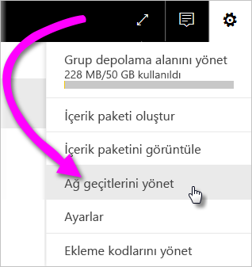

2. Bir ağ geçidi seçin > **Veri kaynağı ekleyin** veya Ağ Geçitleri > **Veri kaynağı ekle** öğesine gidin.

    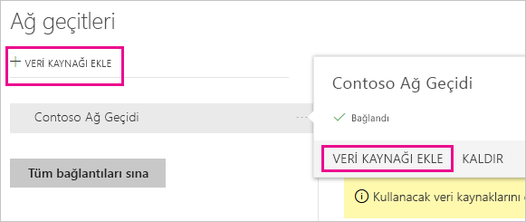

3. **Veri Kaynağı Türü**’nü seçin.

    

4. Veri kaynağı bilgilerini girin. Bu örnekte **Sunucu**, **Veritabanı** ve diğer bilgiler gereklidir.  

    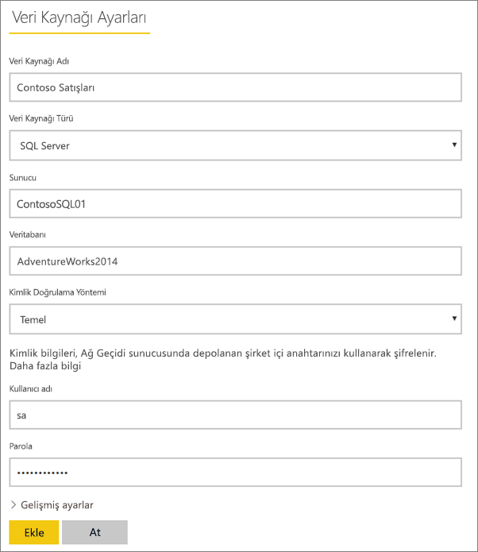

5. SQL Server için **Kimlik Doğrulama Yöntemi** olarak **Windows** veya **Temel**  (SQL Kimlik Doğrulaması) seçeneğini belirleyin.  **Temel**’i seçerseniz veri kaynağınızın kimlik bilgilerini girin.

6. **Gelişmiş ayarlar** altında, isteğe bağlı olarak veri kaynağınızın [gizlilik düzeyi]((https://support.office.com/article/Privacy-levels-Power-Query-CC3EDE4D-359E-4B28-BC72-9BEE7900B540))’ni yapılandırın ([DirectQuery](desktop-directquery-about.md) için geçerli değildir).

    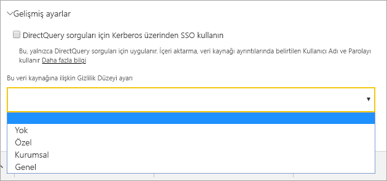

7. **Ekle**'yi seçin. İşlem başarılı olursa *Bağlantı Başarılı* ifadesini görürsünüz.

    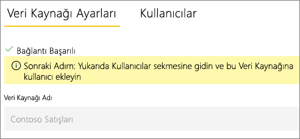

Şimdi bu veri kaynağını kullanarak SQL Server verilerinizi Power BI pano ve raporlarına ekleyebilirsiniz.

### Veri kaynaklarını kaldırma

Artık kullanmıyorsanız veri kaynağını kaldırabilirsiniz. Bir veri kaynağını kaldırmak, o veri kaynağını kullanan panoların ve raporların çalışmamasına yol açar.

Bir veri kaynağını kaldırmak için veri kaynağına gidin ve **Kaldır**’ı seçin.

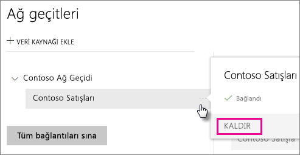

## Kullanıcıları ve yöneticileri yönetme

Bir ağ geçidine veri kaynağı ekledikten sonra, kullanıcılara ve güvenlik gruplarına ilgili veri kaynağı (tüm ağ geçidi değil) için erişim verirsiniz. Veri kaynağı kullanıcı listesi yalnızca veri kaynağından verileri içeren raporları yayımlamasına izin verilen kullanıcıları denetler. Rapor sahipleri panolar, içerik paketleri ve uygulamalar oluşturabilir ve sonra bunları diğer kullanıcılarla paylaşabilir.

Ayrıca, kullanıcılara ve güvenlik gruplarına ağ geçidi için yönetim erişimi verebilirsiniz.

### Veri kaynağına kullanıcı ekleme

1. Power BI hizmetinin sağ üst köşesinde  > **Ağ geçitlerini yönet** öğesini seçin.

2. Kullanıcı eklemek istediğiniz veri kaynağını seçin.

3. **Kullanıcılar**’ı seçin ve kuruluşunuzda seçili veri kaynağına erişim vermek istediğiniz kullanıcıyı girin. Aşağıdaki ekranda gördüğünüz üzere Maggie ve Adam'ı ekliyorum.

    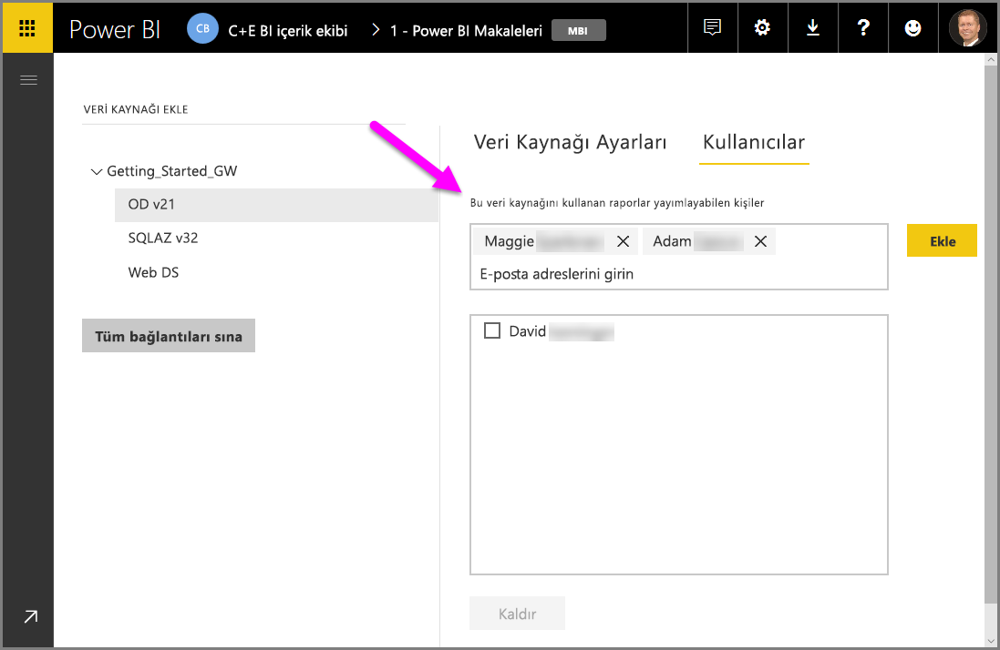

4. **Ekle**’yi seçtiğinizde kutuda eklenen üye gösterilir.

    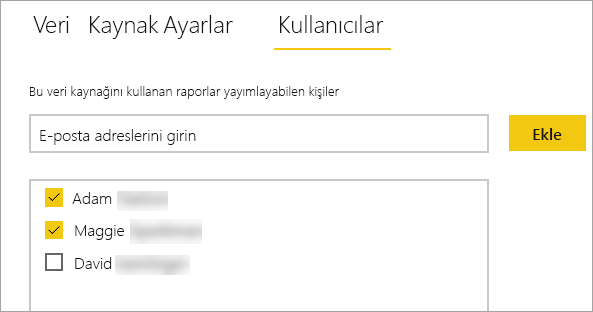

İşte bu kadar kolay. Kullanıcıları, erişim izni vermek istediğiniz her bir veri kaynağına eklemeniz gerektiğini unutmayın. Her veri kaynağının kullanıcı listesi ayrıdır ve kullanıcıları her veri kaynağına ayrıca eklemeniz gerekir.

### Veri kaynağından kullanıcıları kaldırma

Veri kaynağının **Kullanıcılar** sekmesinde, bu veri kaynağını kullanan kullanıcıları ve güvenlik gruplarını kaldırabilirsiniz.

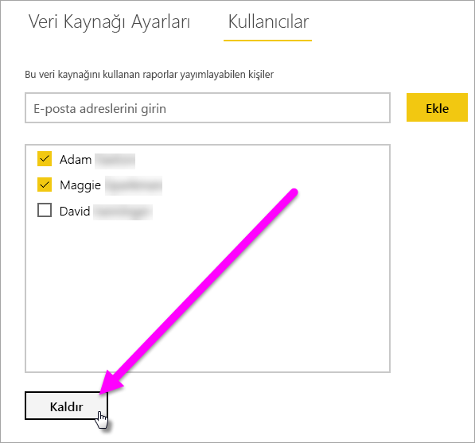

### Yönetici ekleme ve kaldırma

Ağ geçidinin **Yöneticiler** sekmesinde, ağ geçidini yönetebilen kullanıcılar (veya güvenlik grupları) ekleyin ve kaldırın.

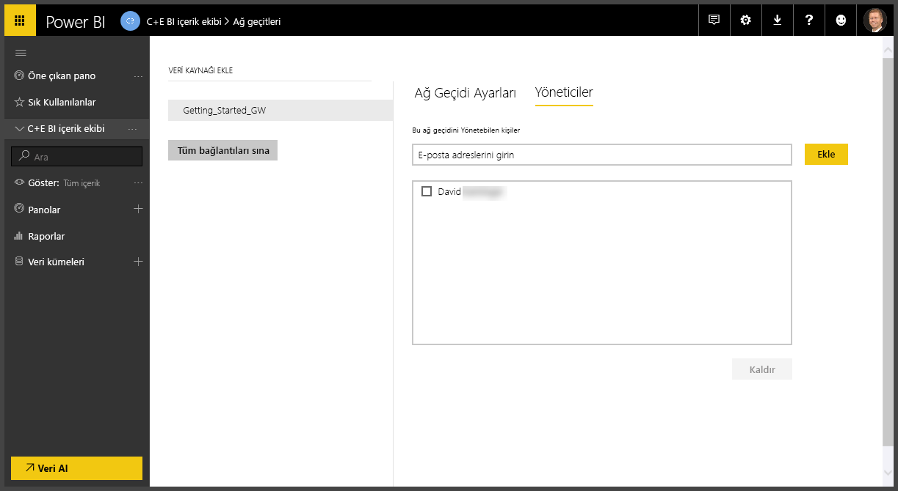

## Ağ geçidi kümesini yönetme

İki veya daha fazla ağ geçidinden olan bir küme oluşturduktan sonra, veri kaynağı ekleme veya bir ağ geçidine yönetici izinleri verme gibi tüm ağ geçidi yönetimi işlemleri kümenin parçası olan tüm ağ geçitlerine uygulanır. 

Yöneticiler **Power BI hizmetinde** dişli simgesi altında bulunan **Ağ geçitlerini yönet** menü öğesini kullandığında, kayıtlı kümelerin veya ayrı ağ geçitlerinin bir listesini görür ancak kümenin üyesi olan ağ geçidi örneklerini tek tek görmez.

Tüm yeni **Zamanlanan Yenileme** istekleri ve DirectQuery işlemleri otomatik olarak belirli bir ağ geçidi kümesinin birincil örneğine yönlendirilir. Birincil ağ geçidi örneği çevrimiçi değilse, istek kümedeki başka bir ağ geçidi örneğine yönlendirilir.

## Ağ geçidi geçirme, geri yükleme veya devralma

Ağ geçidini geçirmek, ger yüklemek veya devralmak istediğiniz bilgisayarda ağ geçidi yükleyicisini çalıştırın.

1. Ağ geçidini indirip yükleyin.

2. Power BI hesabınızda oturum açtıktan sonra ağ geçidini kaydedin. **Var olan bir ağ geçidini geçirme, geri yükleme veya devralma** > **İleri**’yi seçin.

    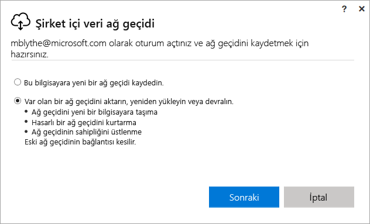

3. Kullanılabilir kümeler ve ağ geçitleri arasından seçim yapın ve seçili ağ geçidi için kurtarma anahtarını girin. **Yapılandır**'ı seçin.

    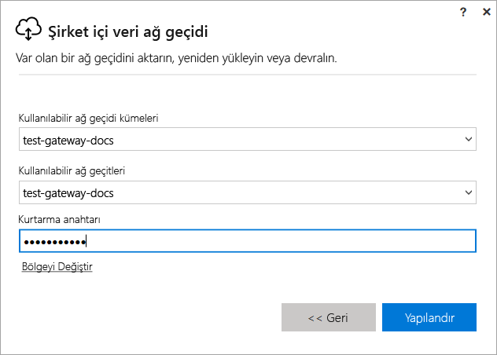

## Ağ geçidini yeniden başlatma

Ağ geçidi, bir Windows hizmeti olarak çalışır. Herhangi bir Windows hizmeti gibi ağ geçidi de birkaç yöntemle başlatılıp durdurulabilir. Aşağıda, bu işlemleri komut isteminden nasıl gerçekleştireceğiniz açıklanmıştır.

1. Ağ geçidinin çalıştığı makinede, Yönetici ayrıcalıklarıyla bir komut başlatın

2. Hizmeti durdurmak için `net stop PBIEgwService` girin.

3. Hizmeti yeniden başlatmak için `net start PBIEgwService` girin.

## Ağ geçitlerini kaldırma

Artık kullanmıyorsanız ağ geçidini kaldırabilirsiniz. Ancak, ağ geçidini kaldırmanın ağ geçidi altındaki tüm veri kaynaklarını sildiğini unutmayın. Bu işlem sonuç olarak ilgili veri kaynaklarını kullanan panoların ve raporların çalışmamasına yol açar.

1. Power BI hizmetinin sağ üst köşesinde  > **Ağ geçitlerini yönet** öğesini seçin.

2. Ağ geçidi > **Kaldır**’ı seçin
   
   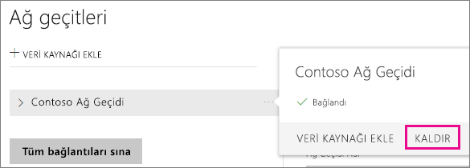

## Sonraki adımlar

[Veri ağ geçidi dağıtmaya ilişkin yönergeler](service-gateway-deployment-guidance.md)

Başka bir sorunuz mu var? [Power BI Topluluğu'na başvurun](http://community.powerbi.com/)