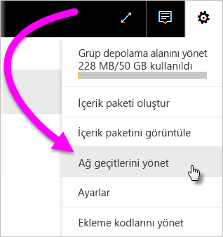
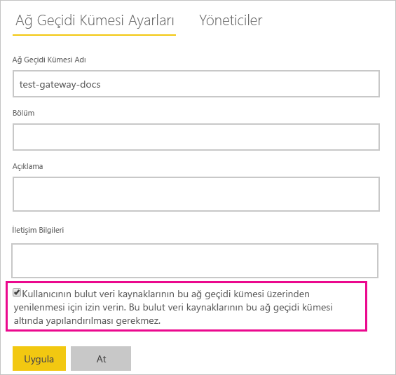
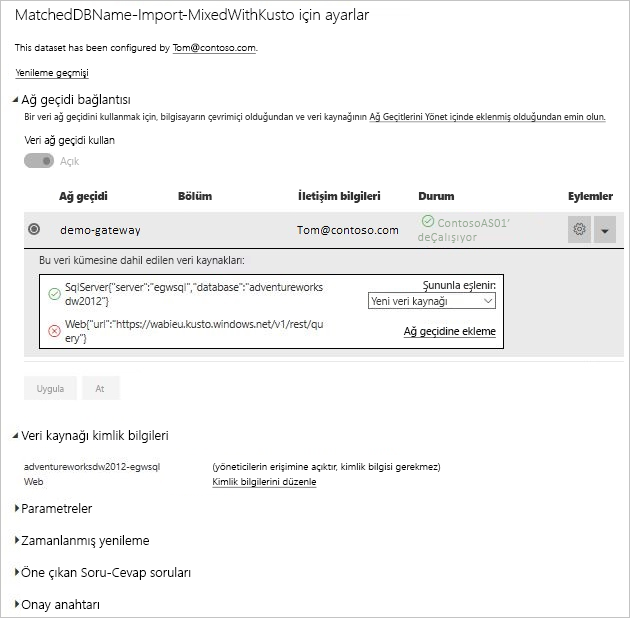

# Şirket içinde ve bulutta veri kaynakları birleştirme ya da ekleme

[!INCLUDE [gateway-rewrite](includes/gateway-rewrite.md)]

Şirket içi ve bulut veri kaynaklarını birleştirmek veya aynı sorguya eklemek için şirket içi veri ağ geçidini kullanabilirsiniz. Bu çözüm, ayrı sorgular kullanmak zorunda kalmadan birden fazla kaynaktaki verileri birleştirmek istediğinizde yararlıdır.

>[!NOTE]
>Bu makale, bulut ve şirket içi veri kaynakları tek bir sorguda birleştirilmiş veya eklenmiş veri kümeleri için geçerlidir. Ayrı sorguları içeren (biri şirket içindeki veri kaynağına diğeri de bir bulut veri kaynağına bağlanan) veri kümelerinde, ağ geçidi bulut veri kaynağın için sorguyu çalıştırmaz.

## Önkoşullar

- Yerel bir bilgisayarda [yüklü ağ geçidi](/data-integration/gateway/service-gateway-install).
- Şirket içi ve bulut veri kaynaklarını birleştiren sorgularla birlikte bir Power BI Desktop dosyası.

>[!NOTE]
>Herhangi bir bulut veri kaynağına erişmek için, ağ geçidinin bu veri kaynaklarına erişimi bulunduğundan emin olmanız gerekir.

1. Power BI hizmetinin sağ üst köşesinde  > **Ağ geçitlerini yönet** öğesini seçin.

    

2. Yapılandırmak istediğiniz ağ geçidini seçin.

3. **Ağ Geçidi Küme Ayarları** altında **Kullanıcıya ait bulut veri kaynaklarının bu ağ geçidi kümesi aracılığıyla yenilenmesine izin ver** > **Uygula**’yı seçin.

    

4. Bu ağ geçidi kümesi altında, sorgularınızda kullanılan herhangi bir [şirket içi veri kaynağını](service-gateway-enterprise-manage-scheduled-refresh.md#add-a-data-source) ekleyin. Burada bulut veri kaynaklarını eklemenize gerek yoktur.

5. Şirket içi ve bulut veri kaynaklarını birleştiren sorgularla birlikte Power BI Desktop dosyanızı Power BI hizmetine yükleyin.

6. Yeni veri kümesinin **Veri kümesi ayarları** sayfasında:

   - Şirket içi kaynak için bu veri kaynağı ile ilişkili ağ geçidini seçin.
   - **Veri kaynağı kimlik bilgileri** altında, bulut veri kaynağı kimlik bilgilerini gerektiği gibi düzenleyin.

    Birleştirmelerin güvenli bir şekilde işlendiğinden emin olmak için hem bulut hem de şirket içi veri kaynaklarınıza yönelik gizlilik düzeylerinin uygun biçimde ayarlandığından emin olun.

     

7. Bulut kimlik bilgileri ayarlandıktan sonra **Şimdi yenile** seçeneğini kullanarak veri kümesini yenileyebilirsiniz. Veya, düzenli aralıklarla yenilenecek şekilde zamanlayabilirsiniz.

## Sonraki adımlar

Ağ geçitlerinde veri yenileme hakkında daha fazla bilgi için bkz. [Zamanlanmış yenileme için veri kaynağını kullanma](service-gateway-enterprise-manage-scheduled-refresh.md#use-the-data-source-for-scheduled-refresh).
