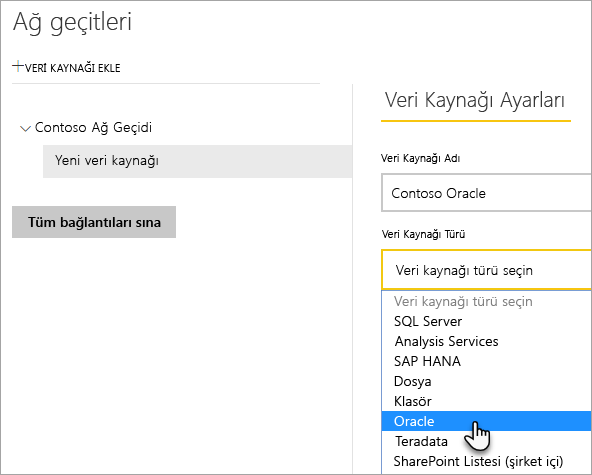
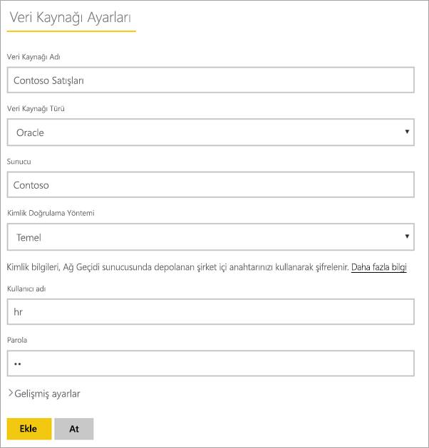
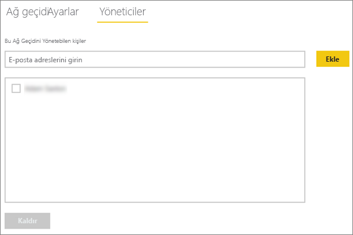
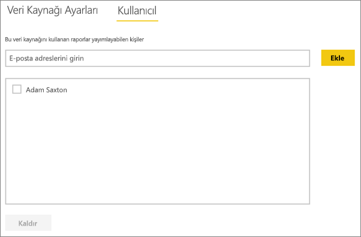
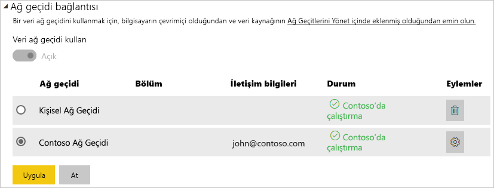

# <a name="manage-your-data-source---oracle"></a>Veri kaynağınızı yönetme - Oracle
Şirket içi veri ağ geçidini yükledikten sonra, ilgili ağ geçidi ile kullanılabilecek veri kaynaklarını eklemeniz gerekir. Bu makalede, ağ geçitleriyle ve veri kaynaklarıyla nasıl çalışıldığı anlatılmaktadır. Oracle veri kaynağını, zamanlanmış yenileme veya DirectQuery için kullanabilirsiniz.

## <a name="download-and-install-the-gateway"></a>Ağ geçidini indirme ve yükleme
Ağ geçidini Power BI hizmetinden indirebilirsiniz. **İndir** > **Veri Ağ Geçidi** seçeneğini belirleyin veya [ağ geçidi indirme sayfasına](https://go.microsoft.com/fwlink/?LinkId=698861) gidin.


> [!WARNING]
> Ağ geçidinin Oracle sunucunuza bağlanabilmesi için, .NET için Oracle Veri Sağlayıcısı'nın (ODP.NET) yüklenmiş ve yapılandırılmış olması gerekir. Bu, Oracle Data Access Components'ın (ODAC) bir parçasıdır. Oracle sağlayıcısını indirme hakkında daha fazla bilgi için aşağıdaki [Oracle İstemcisini Yükleme](#installing-the-oracle-client) bölümüne bakın.
> 
> 

## <a name="installing-the-oracle-client"></a>Oracle istemcisini yükleme
Power BI Desktop'ın **32 bit** sürümü için, **32 bit** Oracle istemcisini indirip yüklemek amacıyla aşağıdaki bağlantıyı kullanın:

* [Oracle Developer Tools for Visual Studio (12.1.0.2.4) ile 32 bit Oracle Data Access Components (ODAC)](http://www.oracle.com/technetwork/topics/dotnet/utilsoft-086879.html)

Power BI Desktop’ın **64 bit** sürümü veya Şirket içi veri ağ geçidi için, **64 bit** Oracle istemcisini indirip yüklemek üzere aşağıdaki bağlantıyı kullanın:

* [Windows x64 için 64 bit ODAC 12.2c Sürüm 1 (12.2.0.1.0)](http://www.oracle.com/technetwork/database/windows/downloads/index-090165.html)

Yüklendikten sonra, tnsnames.ora dosyanızı veritabanınız için uygun bilgilerle yapılandırmanız gerekir. Power BI Desktop ve ağ geçidi, tnsnames.ora dosyasında tanımlanan net_service_name için farklı değerlere sahiptir. Bu değer yapılandırılmazsa bağlantı kuramazsınız. tnsnames.ora için varsayılan yol şudur: `[Oracle Home Directory]\Network\Admin\tnsnames.ora`. tnsnames.ora dosyalarının nasıl yapılandırılacağı hakkında daha fazla bilgi için bkz. [Oracle: Yerel Adlandırma Parametreleri (tnsnames.ora)](https://docs.oracle.com/cd/B28359_01/network.111/b28317/tnsnames.htm).

### <a name="example-tnsnamesora-file-entry"></a>Örnek tnsnames.ora dosya girişi
tnsname.ora dosyasındaki bir girişin temel biçimi aşağıdaki şekildedir.

```
net_service_name=
 (DESCRIPTION=
   (ADDRESS=(protocol_address_information))
   (CONNECT_DATA=
     (SERVICE_NAME=service_name)))
```

Burada sunucu ve bağlantı noktası bilgileri doldurulmuş bir örnek verilmiştir.

```
CONTOSO =
  (DESCRIPTION =
    (ADDRESS = (PROTOCOL = TCP)(HOST = oracleserver.contoso.com)(PORT = 1521))
    (CONNECT_DATA =
      (SERVER = DEDICATED)
      (SERVICE_NAME = CONTOSO)
    )
  )
```

## <a name="add-a-gateway"></a>Ağ geçidi ekleme
Bir ağ geçidi eklemek için ortamınızdaki bir sunucudan ağ geçidini [indirip](https://go.microsoft.com/fwlink/?LinkId=698861) yüklemeniz yeterlidir. Ağ geçidi, yüklendikten sonra **Ağ geçitlerini yönet** seçeneği altındaki ağ geçidi listelerinde görünür.

> [!NOTE]
> **Ağ geçitlerini yönet** seçeneği en az bir ağ geçidinin yöneticisi olduğunuzda görüntülenir. Bunun için bir yönetici olarak eklenmeniz veya bir ağ geçidi yükleyip yapılandırmanız gerekir.
> 
> 

## <a name="remove-a-gateway"></a>Ağ geçitlerini kaldırma
Bir ağ geçidini kaldırmak, söz konusu ağ geçidi altındaki tüm veri kaynaklarının da silinmesine neden olur.  Ayrıca bu işlem, ilgili veri kaynaklarını kullanan panoların ve raporların da çalışmamasına yol açar.

1. Sağ üst köşedeki dişli simgesi  > **Ağ geçitlerini yönet**'i seçin.
2. Ağ geçidi > **Kaldır**'ı seçin
   
   

## <a name="add-a-data-source"></a>Veri kaynağı ekleme
Bir ağ geçidi seçip **Veri kaynağı ekle**'ye tıklayarak veya Ağ geçidi > **Veri kaynağı ekle** bölümüne giderek veri kaynağı ekleyebilirsiniz.


Ardından, listeden **Veri Kaynağı Türü**'nü seçebilirsiniz.



Bundan sonra da **Sunucu** ve **Veritabanı**'nı içeren veri kaynağı bilgilerini doldurmak isteyebilirsiniz.  

Bir **Kimlik Doğrulama Yöntemi** seçmeniz de gerekecektir.  Bu yöntem, **Windows** veya **Temel** seçeneklerinden biri olabilir.  Windows Kimlik Doğrulaması yerine Oracle'da oluşturulmuş bir hesap kullanacaksanız **Temel**'i seçebilirsiniz. Ardından, bu veri kaynağı için kullanılacak kimlik bilgilerini girin.

> [!NOTE]
> Veri kaynağına yönelik tüm sorgular bu kimlik bilgileri kullanılarak çalıştırılır. [Kimlik bilgilerinin](service-gateway-onprem.md#credentials) nasıl depolandığı ile ilgili daha fazla bilgi için, şirket içi veri ağ geçidi konusunun ele alındığı ana makaleye başvurun.
> 
> 



Tüm bilgileri doldurduktan sonra **Ekle**'ye tıklayabilirsiniz.  Artık bu veri kaynağını bir şirket içi Oracle sunucusunda zamanlanmış yenileme veya DirectQuery için kullanabilirsiniz. İşlem başarılı olduğunda *Bağlantı Başarılı* iletisini göreceksiniz.


### <a name="advanced-settings"></a>Gelişmiş ayarlar
Veri kaynağınızın gizlilik düzeyini yapılandırabilirsiniz. Bu işlem, verilerin nasıl bir araya getirilebileceğini denetler. Bu yalnızca zamanlanmış yenileme için kullanılır. DirectQuery için geçerli değildir. [Daha fazla bilgi](https://support.office.com/article/Privacy-levels-Power-Query-CC3EDE4D-359E-4B28-BC72-9BEE7900B540)


## <a name="remove-a-data-source"></a>Veri kaynaklarını kaldırma
Bir veri kaynağını kaldırmak, ilgili veri kaynağını kullanan panoların ve raporların çalışmamasına yol açar.  

Bir Veri Kaynağını kaldırmak için, Veri Kaynağı > **Kaldır** bölümüne gidin.


## <a name="manage-administrators"></a>Yöneticileri yönetme
Ağ geçidine ilişkin Yöneticiler sekmesinde, ağ geçidini yönetebilen kullanıcılar (veya güvenlik grupları) ekleyebilir ve kaldırabilirsiniz.



## <a name="manage-users"></a>Kullanıcıları yönetme
Veri kaynağına ilişkin Kullanıcılar sekmesinde, veri kaynağını kullanabilen kullanıcılar veya güvenlik grupları ekleyebilir ve bunları kaldırabilirsiniz.

> [!NOTE]
> Kullanıcılar listesi yalnızca kimlerin rapor yayımlayabildiğini denetler. Rapor sahipleri panolar veya içerik paketleri oluşturabilir ve bunları diğer kullanıcılarla paylaşabilir. Raporu veya panoyu kullanan kullanıcıların, kullanıcı listesinde olması gerekmez.
> 
> 



## <a name="using-the-data-source"></a>Veri kaynağını kullanma
Oluşturduğunuz veri kaynağı, DirectQuery bağlantıları veya zamanlanmış yenileme ile kullanılabilir.

> [!WARNING]
> Şirket içi veri ağ geçidinde bulunan veri kaynağındaki ve Power BI Desktop’taki sunucu ve veritabanı adı eşleşmelidir!
> 
> 

Ağ geçidindeki veri kaynağı ve veri kümeniz arasındaki bağlantı, sunucu ve veritabanı adınızı temel alır. Bunların eşleşmesi gerekir! Örneğin, Power BI Desktop içinde sunucu adı için bir IP Adresi sağlarsanız bu IP Adresini ağ geçidi yapılandırması içindeki veri kaynağında da kullanmanız gerekir. Bu adın, tnsnames.ora dosyasında tanımlanan bir diğer ad ile aynı olması gerekir. tnsnames.ora dosyası hakkında daha fazla bilgi için bkz. [Oracle İstemcisini Yükleme](#installing-the-oracle-client).

Bu durum hem DirectQuery hem de zamanlanmış yenileme için geçerlidir.

### <a name="using-the-data-source-with-directquery-connections"></a>Veri kaynağını DirectQuery bağlantılarıyla kullanma
Sunucu ve veritabanı adının, Power BI Desktop'ta ve ağ geçidinin yapılandırılmış veri kaynağında eşleştiğinden emin olmanız gerekir. Ayrıca, DirectQuery veri kümelerini yayımlamak için kullanıcınızın, veri kaynağının **Kullanıcılar** sekmesinde listelendiğinden emin olmanız gerekir. DirectQuery'ye yönelik seçim, verileri ilk kez içeri aktardığınızda Power BI Desktop'ta gerçekleşir. [Daha fazla bilgi](desktop-use-directquery.md)

Power BI Desktop'tan veya **Veri Al** seçeneğini kullanarak yayımladığınız raporlarınızla hemen çalışmaya başlayabilirsiniz. Ağ geçidinde veri kaynağı oluşturulduktan sonra bağlantının kullanılabilir hale gelmesi için birkaç dakika beklemeniz gerekebilir.

### <a name="using-the-data-source-with-scheduled-refresh"></a>Zamanlanmış yenileme ile veri kaynağını kullanma
Ağ geçidinde yapılandırılan veri kaynağının **Kullanıcılar** sekmesinde listeleniyorsanız ve sunucu ile veritabanı adı eşleşiyorsa ağ geçidini, zamanlanmış yenileme ile kullanılabilen bir seçenek olarak görürsünüz.



## <a name="troubleshooting"></a>Sorun giderme
Adlandırma söz dizimi yanlış olduğunda veya doğru yapılandırılmadığında Oracle'da birkaç hata ile karşılaşabilirsiniz.

* ORA-12154: TNS: could not resolve the connect identifier specified (TNS: Belirtilen bağlantı tanımlayıcısı çözümlenemiyor)  
* ORA-12514: TNS listener does not currently know of service requested in connect descriptor (TNS dinleyicisi, bağlantı tanımlayıcıda istenen hizmeti şu anda tanımıyor)  
* ORA-12541: TNS: no listener (TNS: Dinleyici yok)  
* ORA-12170: TNS:Connect timeout occurred (TNS: Bağlantı zaman aşımı oluştu)  
* ORA-12504: TNS listener was not given the SERVICE_NAME in CONNECT_DATA (CONNECT_DATA konumunda TNS dinleyicisine SERVICE_NAME verilmedi)  

Oracle istemcisi yüklü olmadığında veya doğru yapılandırılmadığında bu hatalar oluşabilir. Yüklüyse tnsnames.ora dosyasının düzgün şekilde yapılandırıldığını ve uygun net_service_name kullandığınızı doğrulamanız gerekir. Ayrıca, Power BI Desktop'ı kullanan makine ile ağ geçidini çalıştıran makine arasında aynı net_service_name değerinin kullanıldığından emin olmanız gerekir. Daha fazla bilgi için bkz. [Oracle İstemcisini Yükleme](#installing-the-oracle-client).

> [!NOTE]
> Oracle sunucu sürümü ve Oracle istemci sürümü arasındaki uyumsuzluktan kaynaklanan bir sorunla karşılaşmış da olabilirsiniz. Genellikle bunların eşleşmesi istenir.
> 
> 

Ağ geçidi ile ilgili ek sorun giderme bilgileri için bkz. [Şirket içi veri ağ geçidiyle ilgili sorunları giderme](service-gateway-onprem-tshoot.md).

## <a name="next-steps"></a>Sonraki adımlar
[Şirket içi veri ağ geçidi](service-gateway-onprem.md)  
[Şirket içi veri ağ geçidi (ayrıntılı)](service-gateway-onprem-indepth.md)  
[Şirket içi veri ağ geçidiyle ilgili sorunları giderme](service-gateway-onprem-tshoot.md)  
[Power BI Premium](service-premium.md)

Başka bir sorunuz mu var? [Power BI Topluluğu'na sorun](http://community.powerbi.com/)

