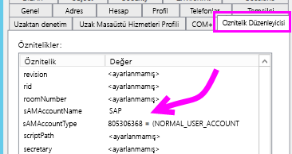
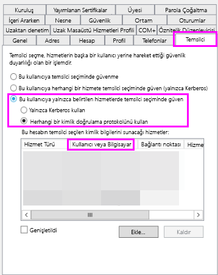
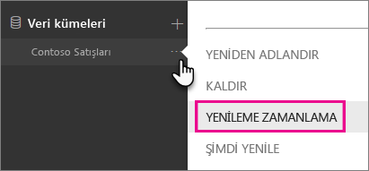
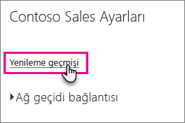
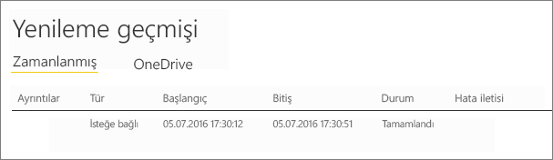

# <a name="troubleshoot-gateways---power-bi"></a>Ağ geçidiyle ilgili sorunları giderme - Power BI

[!INCLUDE [gateway-rewrite](includes/gateway-rewrite.md)]

Bu makalede, **şirket içi veri ağ geçidini** Power BI ile kullanırken karşılaşılan bazı yaygın sorunlar ele alınır. Aşağıda belirtilmemiş bir sorunla karşılaşırsanız Power BI [toplulukları](http://community.powerbi.com) sitesini kullanabilir veya bir [destek bileti](http://powerbi.microsoft.com/support) oluşturabilirsiniz.

## <a name="configuration"></a>Yapılandırma

### <a name="error-power-bi-service-reported-local-gateway-as-unreachable-restart-the-gateway-and-try-again"></a>Hata: Power BI hizmeti yerel ağ geçidine erişilemediğini bildirdi. Ağ geçidini yeniden başlatıp tekrar deneyin

Yapılandırma işleminin sonunda Power BI hizmeti, ağ geçidini doğrulamak için tekrar çağrılır. Power BI hizmeti, ağ geçidinin durumunu canlı olarak bildirmez. Windows hizmetinin yeniden başlatılması, iletişimin başarılı olmasını sağlayabilir. Daha ayrıntılı bilgi edinmek için [şirket içi veri ağ geçidi uygulamasından günlükleri toplama](/data-integration/gateway/service-gateway-tshoot#collect-logs-from-the-on-premises-data-gateway-app) bölümünde açıklandığı gibi günlükleri toplayıp gözden geçirebilirsiniz.

## <a name="data-sources"></a>Veri kaynakları

### <a name="error-unable-to-connect-details-invalid-connection-credentials"></a>Hata: Bağlanılamıyor. Ayrıntılar: "Bağlantı kimlik bilgileri geçersiz"

**Ayrıntıları göster** bölümünde, veri kaynağından alınan hata iletisi görüntülenir. SQL Server için aşağıdakine benzer bir hata iletisiyle karşılaşırsınız.

    Login failed for user 'username'.

Doğru kullanıcı adına ve parolaya sahip olduğunuzdan emin olun. Ayrıca, bu kimlik bilgileriyle veri kaynağına başarılı bir şekilde bağlanabildiğinizi de doğrulayın. Kullanılmakta olan hesabın, **Kimlik Doğrulama Yöntemi** ile eşleştiğinden emin olun.

### <a name="error-unable-to-connect-details-cannot-connect-to-the-database"></a>Hata: Bağlanılamıyor. Ayrıntılar: "Veritabanına bağlanılamıyor"

Sunucuya bağlanabildiğimizi ancak, belirtilen veritabanına bağlanamadığımızı gösterir. Veritabanının adını ve kullanıcı kimlik bilgilerinin söz konusu veritabanına erişmek için uygun izinlere sahip olduğunu doğrulayın.

**Ayrıntıları göster** bölümünde, veri kaynağından alınan hata iletisi görüntülenir. SQL Server için aşağıdakine benzer bir hata iletisiyle karşılaşırsınız.

    Cannot open database "AdventureWorks" requested by the login. The login failed. Login failed for user 'username'.

### <a name="error-unable-to-connect-details-unknown-error-in-data-gateway"></a>Hata: Bağlanılamıyor. Ayrıntılar: "Veri ağ geçidinde bilinmeyen hata oluştu"

Bu hata farklı nedenlerden kaynaklanıyor olabilir. Söz konusu veri kaynağına, ağ geçidini barındıran makineden bağlanabildiğinizi doğruladığınızdan emin olun. Bu, sunucuya erişilememesinden kaynaklanıyor olabilir.

**Ayrıntıları Göster** bölümünde şu hata kodunu görebilirsiniz: **DM_GWPipeline_UnknownError**.

Daha ayrıntılı bilgi için Olay Günlükleri > **Uygulama ve Hizmet Günlükleri** > **Şirket içi veri ağ geçidi hizmeti** bölümüne de göz atabilirsiniz.

### <a name="error-we-encountered-an-error-while-trying-to-connect-to-server-details-we-reached-the-data-gateway-but-the-gateway-cant-access-the-on-premises-data-source"></a>Hata: \<Sunucuya\> bağlanmaya çalışırken bir hata ile karşılaştık. Ayrıntılar: "Veri ağ geçidi hizmetine eriştik ancak ağ geçidi, şirket içinde veri kaynağına erişemiyor."

Belirtilen veri kaynağına bağlanamadığımızı gösterir. Söz konusu veri kaynağı için sağlanan bilgileri doğruladığınızdan emin olun.

**Ayrıntıları Göster** bölümünde şu hata kodunu görebilirsiniz: **DM_GWPipeline_Gateway_DataSourceAccessError**.

Temel alınan hata iletisi aşağıdakine benzerse bu, veri kaynağı için kullandığınız hesabın, ilgili Analysis Services örneği için bir sunucu yöneticisi olmadığı anlamına gelir. [Daha fazla bilgi](https://docs.microsoft.com/sql/analysis-services/instances/grant-server-admin-rights-to-an-analysis-services-instance)

    The 'CONTOSO\account' value of the 'EffectiveUserName' XML for Analysis property is not valid.

Temel alınan hata iletisi aşağıdakine benzerse bu, Analysis Services'e ilişkin hizmet hesabında [token-groups-global-and-universal](https://msdn.microsoft.com/library/windows/desktop/ms680300.aspx) (TGGAU) dizin özniteliğinin eksik olduğu anlamına gelebilir.

    The username or password is incorrect.

Windows 2000 öncesi uyumluluk erişimine sahip etki alanlarında TGGAU özniteliği etkindir. Ancak, yeni oluşturulan etki alanlarının çoğunda bu öznitelik varsayılan olarak etkin değildir. Daha fazla bilgi edinmek için [bu sayfaya](https://support.microsoft.com/kb/331951) göz atabilirsiniz.

Bunu doğrulamak için aşağıdaki işlemleri gerçekleştirebilirsiniz.

1. SQL Server Management Studio'daki Analysis Services makinesine bağlanın. Gelişmiş bağlantı özellikleri bölümünde, söz konusu kullanıcı için EffectiveUserName özelliğini ekleyip hatanın yeniden oluşturulup oluşturulmadığına bakın.
2. Özniteliğin listelenip listelenmediğini doğrulamak için dsacls Active Directory aracını kullanabilirsiniz. Bu araç bir etki alanı denetleyicisinde bulunur. Hesaba ilişkin ayırt edici etki alanı adının ne olduğunu bilmeniz ve bu bilgiyi araca iletmeniz gerekir.

        dsacls "CN=John Doe,CN=UserAccounts,DC=contoso,DC=com"

    Aşağıdakine benzer bir sonuç elde etmelisiniz.

            Allow BUILTIN\Windows Authorization Access Group
                                          SPECIAL ACCESS for tokenGroupsGlobalAndUniversal
                                          READ PROPERTY

Bu sorunu gidermek üzere, Analysis Services Windows hizmeti için kullanılan hesapta TGGAU özniteliğini etkinleştirmeniz gerekir.

#### <a name="another-possibility-for-username-or-password-incorrect"></a>Kullanıcı adı veya parola yanlış olabilir

Bu hata, Analysis Services sunucusunun kullanıcılardan farklı bir etki alanında olması ve iki yönlü bir güven ilişkisinin kurulmamış olmasından kaynaklanıyor olabilir.

Etki alanları arasındaki güven ilişkisini doğrulamak için etki alanı yöneticilerinizle iletişim kurmanız gerekir.

#### <a name="unable-to-see-the-data-gateway-data-sources-in-the-get-data-experience-for-analysis-services-from-the-power-bi-service"></a>Power BI hizmetinde Analysis Services'e yönelik "Veri Al" deneyiminde veri ağ geçidi veri kaynakları görüntülenmiyor

Hesabınızın, ağ geçidi yapılandırmasındaki veri kaynağının **Kullanıcılar** sekmesinde listelendiğinden emin olun. Ağ geçidine erişiminiz yoksa ağ geçidi yöneticisiyle iletişime geçerek bu bilgiyi doğrulamasını isteyin. Analysis Services listesinde görüntülenen veri kaynağını yalnızca **Kullanıcılar** listesinde bulunan hesaplar görebilir.

### <a name="error-you-dont-have-any-gateway-installed-or-configured-for-the-data-sources-in-this-dataset"></a>Hata: Bu veri kümesindeki veri kaynakları için yüklü veya yapılandırılmış ağ geçidiniz yok

Ağ geçidine [Veri kaynağı ekleme](service-gateway-data-sources.md#add-a-data-source) bölümünde açıklandığı gibi bir veya daha fazla veri kaynağı eklediğinizden emin olun. **Ağ geçitlerini yönet** bölümünde ağ geçidi görünmüyorsa tarayıcınızın önbelleğini temizlemeyi veya hizmette oturumunuzu kapatıp yeniden oturum açmayı deneyin.

## <a name="datasets"></a>Veri kümeleri

### <a name="error-there-is-not-enough-space-for-this-row"></a>Hata: Bu satır için yeterli alan yok

Satırlarınızdan birinin boyutu 4 MB'tan fazlaysa bu hatayla karşılaşırsınız. Veri kaynağınızda söz konusu satırı belirleyip filtrelemeniz veya satırın boyutunu azaltmanız gerekir.

### <a name="error-the-server-name-provided-doesnt-match-the-server-name-on-the-sql-server-ssl-certificate"></a>Hata: Sağlanan sunucu adı SQL Server SSL sertifikasındaki sunucu adından farklı

Sertifika genel adı olarak sunucunun tam etki alanı adı (FQDN) yerine yalnızca sunucunun NetBIOS adını sağladığınızda bu hata iletisiyle karşılaşabilirsiniz. Bu durum sertifikanın eşleşmemesine neden olur. Bu sorunu gidermek için ağ geçidi veri kaynağındaki ve PBIX dosyasındaki sunucu adını, sunucunun FQDN'sini kullanacak şekilde ayarlamanız gerekir.

### <a name="i-dont-see-the-on-premises-data-gateway-present-when-configuring-scheduled-refresh"></a>Zamanlanmış yenilemeyi yapılandırırken şirket içi veri ağ geçidi seçeneğini görmüyorum

Bunun farklı nedenleri olabilir.

1. Power BI Desktop'ta ve ağ geçidi için yapılandırılan veri kaynağında girilen sunucu ve veritabanı adları eşleşmiyor olabilir. Bu değerlerin aynı olması gerekir. Bunlar büyük/küçük harfe duyarlı değildir.
2. Hesabınız, ağ geçidi yapılandırmasındaki veri kaynağının **Kullanıcılar** sekmesinde yer almıyor olabilir. Hesabınızın bu listeye eklenmesi için söz konusu ağ geçidinin yöneticisi ile iletişime geçmeniz gerekir.
3. Power BI Desktop dosyanızda birden fazla veri kaynağı vardır ve bu veri kaynaklarının tümü ağ geçidiyle yapılandırılmamış olabilir. Ağ geçidinin Zamanlanmış Yenileme'de görünmesi için veri kaynaklarından her birinin söz konusu ağ geçidiyle tanımlanmış olması gerekir.

### <a name="error-the-received-uncompressed-data-on-the-gateway-client-has-exceeded-the-limit"></a>Hata: Ağ geçidi istemcisindeki alınan sıkıştırılmamış veri, sınırı aştı

Tablo başına sıkıştırılmamış veri sınırı tam olarak 10 GB'tır. Bu sorunla karşılaşmanız halinde, iyileştirme yapmak ve sorunu gidermek için tercih edebileceğiniz bazı iyi seçenekler vardır. Özel olarak belirtmek gerekirse, çoğunlukla sabit, uzun dize değerlerini azaltıp normalleştirilmiş bir anahtar kullanmak veya sütunu kaldırmak (kullanılmıyorsa) sorunu gidermenize yardımcı olabilir.

## <a name="reports"></a>Raporlar

### <a name="report-could-not-access-the-data-source-because-you-do-not-have-access-to-our-data-source-via-an-on-premises-data-gateway"></a>Raporlar, şirket içi veri ağ geçidi üzerinden veri kaynağımıza erişiminiz olmadığı için veri kaynağına erişemedi

Bu soruna genellikle aşağıdakilerden biri neden olur.

1. Veri kaynağı bilgileri, temel alınan veri kümesindeki bilgilerle eşleşmiyordur. Şirket içi veri ağ geçidi için tanımlanan veri kaynağındaki sunucu ve veritabanı adı bilgileriyle Power BI Desktop'ta sağlanan bilgilerin eşleşmesi gerekir. Power BI Desktop’ta bir IP Adresi kullanıyorsanız şirket içi veri ağ geçidine ilişkin veri kaynağında da bir IP Adresi kullanılmalıdır.
2. Kuruluşunuzdaki herhangi bir ağ geçidinde veri kaynağı yoktur. Veri kaynağını yeni veya var olan bir ağ geçidinde ya da şirket içi veri ağ geçidinde yapılandırabilirsiniz.

### <a name="error-data-source-access-error-please-contact-the-gateway-administrator"></a>Hata: Veri kaynağı erişim hatası. Lütfen ağ geçidi yöneticisiyle iletişime geçin

Bu raporda canlı bir Analysis Services bağlantısı kullanılıyorsa sorun, EffectiveUserName özelliğine iletilen bir değerin geçerli olmamasından veya Analysis Services makinesinde izinlere sahip olmamasından kaynaklanıyor olabilir. Genellikle kimlik doğrulama sorunları, EffectiveUserName özelliğine iletilen değerin yerel bir kullanıcı asıl adı (UPN) ile eşleşmemesinden kaynaklanır.

Bunu doğrulamak için aşağıdaki işlemleri gerçekleştirin.

1. [Ağ geçidi günlüklerinde](/data-integration/gateway/service-gateway-tshoot#collect-logs-from-the-on-premises-data-gateway-app) etkin kullanıcı adını bulun.
2. Değeriniz iletilirken değerin doğru olduğunu onaylayın. Değer, kullanıcınıza aitse bir komut isteminde aşağıdaki komutu kullanarak kullanıcı asıl adını görebilirsiniz. UPN bir e-posta adresine benzer.

        whoami /upn

İsterseniz Power BI'ın Azure Active Directory'den alacağı değeri görebilirsiniz.

1. [https://developer.microsoft.com/graph/graph-explorer](https://developer.microsoft.com/graph/graph-explorer) adresine göz atın.
2. Sağ üst köşedeki **Sign in** (Oturum aç) seçeneğini belirleyin.
3. Aşağıdaki sorguyu çalıştırın. Daha kapsamlı bir JSON yanıtı alırsınız.

        https://graph.windows.net/me?api-version=1.5
4. **userPrincipalName** değerini bulun.

Azure Active Directory kullanıcı asıl adınız yerel Active Directory kullanıcı asıl adınızla eşleşmezse geçerli bir değerle değiştirmek için [Kullanıcı adlarını eşle](service-gateway-enterprise-manage-ssas.md#mapping-usernames-for-analysis-services-data-sources) özelliğini kullanabilirsiniz. Alternatif olarak, kullanıcı asıl adınızı değiştirmek için kiracı yöneticinizle veya yerel Active Directory yöneticinizle iletişime geçebilirsiniz.

## <a name="kerberos"></a>Kerberos

Temel alınan veritabanı sunucusu ve şirket içi veri ağ geçidi [Kerberos Kısıtlanmış Temsili](service-gateway-sso-kerberos.md) için düzgün şekilde yapılandırılmadıysa ağ geçidinde [ayrıntılı günlük kaydını](/data-integration/gateway/service-gateway-performance#slow-performing-queries) etkinleştirin ve sorun giderme işlemlerine ağ geçidinin günlük dosyalarındaki hatalara/izlere dayalı araştırma yaparak başlayın. Görüntülenecek ağ geçidi günlüklerini toplamak için bkz. [Şirket içi veri ağ geçidi uygulamasında günlükleri toplama](/data-integration/gateway/service-gateway-tshoot#collect-logs-from-the-on-premises-data-gateway-app).

### <a name="impersonationlevel"></a>ImpersonationLevel

ImpersonationLevel, SPN kurulumu veya yerel ilke ayarıyla ilgilidir.

```
[DataMovement.PipeLine.GatewayDataAccess] About to impersonate user DOMAIN\User (IsAuthenticated: True, ImpersonationLevel: Identification)
```

**Çözüm**

Sorunu çözmek için şu adımları izleyin:

1. Şirket İçi Ağ Geçidi için bir SPN ayarlayın.
2. Active Directory’nizde (AD) kısıtlanmış temsil ayarlayın.

### <a name="failedtoimpersonateuserexception-failed-to-create-windows-identity-for-user-userid"></a>FailedToImpersonateUserException: Kullanıcının kullanıcı kimliği için Windows kimliği oluşturulamadı

Başka bir kullanıcı adına kimliğe bürünemiyorsanız FailedToImpersonateUserException oluşur. Kimliğine bürünmeye çalıştığınız hesap, ağ geçidi hizmeti etki alanının bulunduğu etki alanından başka bir etki alanından geliyorsa (bu bir sınırlamadır) bu durum oluşabilir.

**Çözüm**

* Yapılandırmanın, yukarıdaki ImpersonationLevel bölümünde yer alan adımlara göre doğru olduğundan emin olun.
* Kimliğine bürünmeye çalıştığı kullanıcı kimliğinin geçerli bir AD Hesabı olduğundan emin olun.

### <a name="general-error-1033-error-while-parsing-the-protocol"></a>Genel hata; Protokol ayrıştırılırken 1033 hatası oluştu

UPN (alias@domain.com) kullanılarak kullanıcının kimliğine bürünüldüyse, SAP HANA’da yapılandırılan dış kimliğinizin oturum açma adıyla eşleşmemesi durumunda 1033 hatasını alırsınız. Aşağıda gösterildiği gibi, günlükler bölümündeki hata günlüklerinin üst kısmında “'alias@domain.com' olan özgün UPN’nin, yeni 'alias@domain.com' UPN’si ile değiştirildiğini” görürsünüz.

```
[DM.GatewayCore] SingleSignOn Required. Original UPN 'alias@domain.com' replaced with new UPN 'alias@domain.com.'
```

**Çözüm**

* SAP HANA, kimliğine bürünülen kullanıcının kullanıcı diğer adında sAMAccountName özniteliğini kullanmasını gerektirir. Bu doğru değilse, 1033 hatasını görürsünüz.

    

* Günlüklerde, etki alanının takip ettiği diğer ad (alias@doimain.com) olan UPN’yi değil, sAMAccountName (diğer ad) adını görürsünüz.

    

```xml
      <setting name="ADUserNameReplacementProperty" serializeAs="String">
        <value>sAMAccount</value>
      </setting>
      <setting name="ADServerPath" serializeAs="String">
        <value />
      </setting>
      <setting name="CustomASDataSource" serializeAs="String">
        <value />
      </setting>
      <setting name="ADUserNameLookupProperty" serializeAs="String">
        <value>AADEmail</value>
```

### <a name="sap-aglibodbchdb-dllhdbodbc-communication-link-failure-10709-connection-failed-rte-1-kerberos-error-major-miscellaneous-failure-851968-minor-no-credentials-are-available-in-the-security-package"></a>[SAP AG][LIBODBCHDB DLL][HDBODBC] İletişim bağlantısı hatası;-10709 Bağlantı başarısız oldu (RTE:[-1] Kerberos hatası. Önemli: "Diğer hata [851968]", İkincil: "Güvenlik paketinde kimlik bilgisi yok

AD’de temsilciniz düzgün şekilde yapılandırılmadıysa -10709 Bağlantı başarısız oldu hata iletisini alırsınız.

**Çözüm**

* Ağ geçidi hizmet hesabı için AD’de temsilci sekmesinde SAP Hana sunucunuzun olduğundan emin olun.

   

## <a name="refresh-history"></a>Yenileme Geçmişi

Zamanlanmış yenileme için ağ geçidini kullandığınız sırada **Yenileme Geçmişi** seçeneği, oluşan hataları görmenizi sağlamanın yanı sıra bir destek isteği oluşturmanız gerekmesi halinde size faydalı veriler sunabilir. Hem zamanlanmış yenilemeleri hem de isteğe bağlı yenilemeleri görüntüleyebilirsiniz. Aşağıdaki adımlar, **Yenileme Geçmişi**'ne ulaşmak için yapmanız gerekenleri gösterir.

1. Power BI gezinti bölmesindeki **Veri Kümeleri** bölümünde bir veri kümesi seçin ve ardından&gt; Menüyü Aç &gt; **Yenilemeyi Zamanla** seçeneğini belirleyin.

    

2. **Ayarlar: ...** &gt; **Yenilemeyi Zamanla** bölümündeki **Yenileme geçmişi** seçeneğini belirleyin.

    

    

Yenileme senaryoları ile ilgili sorunları giderme hakkında ek bilgi için [Yenileme ile ilgili sorun giderme senaryoları](refresh-troubleshooting-refresh-scenarios.md) başlıklı makaleye göz atın.

## <a name="fiddler-trace"></a>Fiddler ile İzleme

[Fiddler](http://www.telerik.com/fiddler), Telerik tarafından kullanıma sunulup HTTP trafiğini izleyen ücretsiz bir araçtır. İstemci makinesinden Power BI hizmetindeki gelen ve giden trafiği görebilirsiniz. Bu sayede hataları ve diğer ilgili bilgileri görüntüleyebilirsiniz.


## <a name="next-steps"></a>Sonraki adımlar

* [Şirket içi veri ağ geçidi sorunlarını giderme](/data-integration/gateway/service-gateway-tshoot)
* [Şirket içi veri ağ geçidi için proxy ayarlarını yapılandırma](/data-integration/gateway/service-gateway-proxy)  
* [Veri kaynağınızı yönetme - Analysis Services](service-gateway-enterprise-manage-ssas.md)  
* [Veri kaynağınızı yönetme - SAP HANA](service-gateway-enterprise-manage-sap.md)  
* [Veri kaynağınızı yönetme - SQL Server](service-gateway-enterprise-manage-sql.md)  
* [Veri kaynağınızı yönetme - İçeri aktarma/Zamanlanmış yenileme](service-gateway-enterprise-manage-scheduled-refresh.md)  

Başka bir sorunuz mu var? [Power BI Topluluğu'na başvurun](http://community.powerbi.com/)
