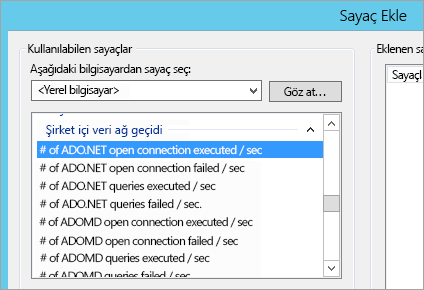
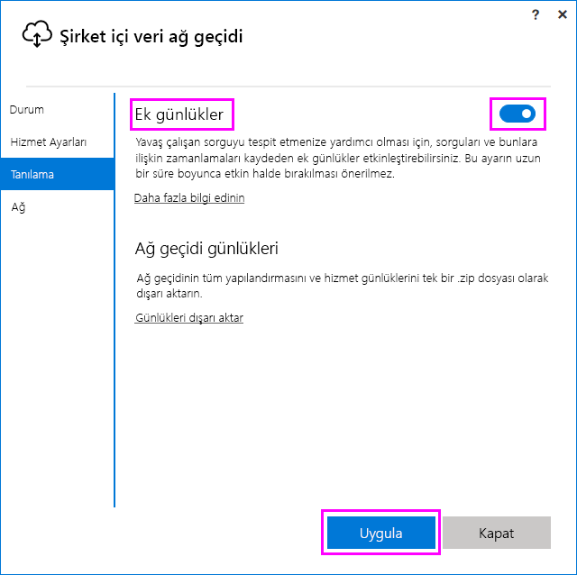

# <a name="troubleshooting-the-on-premises-data-gateway"></a>Şirket içi veri ağ geçidi sorunlarını giderme
Bu makalede, **Şirket içi veri ağ geçidini** kullanırken karşılaşabileceğiniz bazı yaygın sorunlar ele alınmıştır.

<!-- Shared Community & support links Include -->
[!INCLUDE [gateway-onprem-tshoot-support-links-include](./includes/gateway-onprem-tshoot-support-links-include.md)]

<!-- Shared Troubleshooting Install Include -->
[!INCLUDE [gateway-onprem-tshoot-install-include](./includes/gateway-onprem-tshoot-install-include.md)]

## <a name="configuration"></a>Yapılandırma
### <a name="how-to-restart-the-gateway"></a>Ağ geçidini yeniden başlatma
Ağ geçidi bir Windows hizmeti olarak çalıştırılır, böylece onu birçok şekilde başlatıp durdurabilirsiniz. Örneğin, ağ geçidinin çalıştırıldığı makinede, yükseltilmiş izinlerle bir komut istemi açabilir ve ardından bu komutlardan birini çalıştırabilirsiniz:

* Hizmeti durdurmak için şu komutu çalıştırın:
  
    '''   net stop PBIEgwService   '''
* Hizmeti başlatmak için şu komutu çalıştırın:
  
    '''   net start PBIEgwService   '''

### <a name="error-failed-to-create-gateway-please-try-again"></a>Hata: Ağ geçidi oluşturulamadı. Lütfen yeniden deneyin.
Tüm ayrıntılar mevcut olmasına rağmen Power BI hizmetine yönelik çağrı bir hata döndürmüştür. Hata ile birlikte bir etkinlik kimliği görüntülenir. Bu farklı nedenlerden kaynaklanıyor olabilir. Daha ayrıntılı bilgi edinmek için, aşağıda açıklandığı üzere günlükleri toplayabilir ve gözden geçirebilirsiniz.

Bu, ara sunucu yapılandırma sorunlarından kaynaklanıyor da olabilir. Kullanıcı arabirimi artık ara sunucu yapılandırmasına izin vermemektedir. [Ara sunucu yapılandırma işlemleri gerçekleştirme](service-gateway-proxy.md) hakkında daha fazla bilgi edinebilirsiniz

### <a name="error-failed-to-update-gateway-details--please-try-again"></a>Hata: Ağ geçidi ayrıntıları güncelleştirilemedi.  Lütfen tekrar deneyin.
Bilgiler Power BI hizmetinden alınıp ağ geçidine iletilmiştir. Bilgiler yerel Windows hizmetine iletilmiş ancak döndürülememiştir. Alternatif olarak, simetrik anahtar oluşturma işlemi başarısız olmuş olabilir. İç hata, **Ayrıntıları Göster** bölümünde görüntülenir. Daha ayrıntılı bilgi edinmek için, aşağıda açıklandığı üzere günlükleri toplayabilir ve gözden geçirebilirsiniz.

### <a name="error-power-bi-service-reported-local-gateway-as-unreachable-please-restart-the-gateway-and-try-again"></a>Hata: Power BI hizmeti yerel ağ geçidine erişilemediğini bildirdi. Lütfen ağ geçidini yeniden başlatıp tekrar deneyin.
Yapılandırma işleminin sonunda Power BI hizmeti, ağ geçidini doğrulamak için tekrar çağrılır. Power BI hizmeti, ağ geçidinin durumunu *canlı* olarak bildirmez. Windows hizmetinin yeniden başlatılması, iletişimin başarılı olmasını sağlayabilir. Daha ayrıntılı bilgi edinmek için, aşağıda açıklandığı üzere günlükleri toplayabilir ve gözden geçirebilirsiniz.

### <a name="script-error-during-sign-into-power-bi"></a>Power BI'da oturum açma sırasında karşılaşılan betik hatası
Şirket içi veri ağ geçidi yapılandırması sırasında Power BI’da oturum açmak istediğinizde bir betik hatası ile karşılaşabilirsiniz. Aşağıdaki güvenlik güncelleştirmesini yüklediğinizde sorun çözülebilir. Bu, Windows Güncelleştirmesi aracılığıyla yüklenebilir.

[MS16-051: Internet Explorer için güvenlik güncelleştirmesi: 10 Mayıs 2016 (KB 3154070)](https://support.microsoft.com/kb/3154070)

### <a name="gateway-configuration-failed-with-a-null-reference-exception"></a>Null başvuru özel durumu ile başarısız olan ağ geçidi yapılandırması
Aşağıdakine benzer bir hata ile karşılaşabilirsiniz.

        Failed to update gateway details.  Please try again.
        Error updating gateway configuration.

Buna bir yığın izlemesi de dahildir ve bu yığın izlemesi aşağıdakileri içerebilir.

        Microsoft.PowerBI.DataMovement.Pipeline.Diagnostics.CouldNotUpdateGatewayConfigurationException: Error updating gateway configuration. ----> System.ArgumentNullException: Value cannot be null.
        Parameter name: serviceSection

Eski bir ağ geçidi sürümünden yükseltme yapmanız durumunda, yapılandırma dosyanızı saklarız. Eksik bir bölüm olabilir. Ağ geçidi, bu yapılandırma dosyasını okumaya çalıştığında yukarıdaki null başvuru özel durumu ile karşılaşırız.

Bu sorunu gidermek için aşağıdakileri yapın.

1. Ağ geçidini kaldırın.
2. Aşağıdaki klasörü silin.
   
        c:\Program Files\On-premises data gateway
3. Ağ geçidini yeniden yükleyin.
4. İsterseniz mevcut bir ağ geçidini geri yüklemek için kurtarma anahtarını kullanabilirsiniz.

### <a name="support-for-tls-1112"></a>TLS 1.1/1.2 desteği
Ağustos 2017 güncelleştirmesinden bu yana şirket içi veri ağ geçidinde, **Power BI hizmeti** ile iletişim kurmak için varsayılan olarak Aktarım Katmanı Güvenliği (TLS) 1.1 veya 1.2 sürümü kullanılmaktadır. Şirket içi veri ağ geçidinin önceki sürümlerinde varsayılan olarak TLS 1.0 sürümü kullanılır. 1 Kasım 2017’de TLS 1.0 desteği sona ereceğinden, ağ geçitlerinizin çalışmaya devam etmesini sağlamak üzere bu tarihe kadar Şirket içi veri ağ geçidi yüklemelerinizi Ağustos 2017 veya sonraki bir sürümüne yükseltmeniz gerekmektedir.

TLS 1.0 sürümünün, şirket içi veri ağ geçidi tarafından 1 Kasım’a kadar desteklendiği ve ağ geçidi tarafından bir geri dönme mekanizması olarak kullanıldığı göz önünde bulundurulmalıdır. Tüm ağ geçidi trafiği için TLS 1.1 veya 1.2 sürümünün kullanılmasını (ve ağ geçidinizde TLS 1.0 sürümünün kullanılmasını önlemeyi) sağlamak üzere, ağ geçidi hizmetinin çalıştırıldığı makinede şu kayıt defteri anahtarlarını eklemeniz veya değiştirmeniz gerekmektedir:

        [HKEY_LOCAL_MACHINE\SOFTWARE\Microsoft\.NETFramework\v4.0.30319]"SchUseStrongCrypto"=dword:00000001
        [HKEY_LOCAL_MACHINE\SOFTWARE\Wow6432Node\Microsoft\.NETFramework\v4.0.30319]"SchUseStrongCrypto"=dword:00000001

> [!NOTE]
> Bu kayıt defteri anahtarları eklendiğinde veya değiştirildiğinde değişiklikler tüm .NET uygulamalarında geçerli olur. Diğer uygulamalar için TLS'yi etkileyen kayıt defteri değişiklikleri hakkında bilgi edinmek için bkz. [Transport Layer Security (TLS) registry settings (Aktarım Katmanı Güvenliği (TLS) kayıt defteri ayarları)](https://docs.microsoft.com/windows-server/security/tls/tls-registry-settings).
> 
> 

## <a name="data-sources"></a>Veri kaynakları
### <a name="error-unable-to-connect-details-invalid-connection-credentials"></a>Hata: Bağlanılamıyor. Ayrıntılar: "Bağlantı kimlik bilgileri geçersiz"
**Ayrıntıları Göster** bölümünde, veri kaynağından alınan hata iletisi görüntülenir. SQL Server için aşağıdakine benzer bir hata iletisiyle karşılaşırsınız.

    Login failed for user 'username'.

Doğru kullanıcı adına ve parolaya sahip olduğunuzdan emin olun. Ayrıca, bu kimlik bilgileriyle veri kaynağına başarılı bir şekilde bağlanabildiğinizi de doğrulayın. Kullanılmakta olan hesabın, **Kimlik Doğrulama Yöntemi** ile eşleştiğinden emin olun.

### <a name="error-unable-to-connect-details-cannot-connect-to-the-database"></a>Hata: Bağlanılamıyor. Ayrıntılar: "Veritabanına bağlanılamıyor"
Sunucuya bağlanabildiğimizi ancak, belirtilen veritabanına bağlanamadığımızı gösterir. Veritabanının adını ve kullanıcı kimlik bilgilerinin söz konusu veritabanına erişmek için uygun izinlere sahip olduğunu doğrulayın.

**Ayrıntıları Göster** bölümünde, veri kaynağından alınan hata iletisi görüntülenir. SQL Server için aşağıdakine benzer bir hata iletisiyle karşılaşırsınız.

    Cannot open database "AdventureWorks" requested by the login. The login failed. Login failed for user 'username'.

### <a name="error-unable-to-connect-details-unknown-error-in-data-gateway"></a>Hata: Bağlanılamıyor. Ayrıntılar: "Veri ağ geçidinde bilinmeyen hata"
Bu hata farklı nedenlerden kaynaklanıyor olabilir. Söz konusu veri kaynağına, ağ geçidini barındıran makineden bağlanabildiğinizi doğruladığınızdan emin olun. Bu, sunucuya erişilememesinden kaynaklanıyor olabilir.

**Ayrıntıları Göster** bölümünde şu hata kodunu görürsünüz: **DM_GWPipeline_UnknownError**.

Daha ayrıntılı bilgi için Olay Günlükleri > **Uygulama ve Hizmet Günlükleri** > **Şirket içi veri ağ geçidi hizmeti** bölümüne de göz atabilirsiniz.

### <a name="error-we-encountered-an-error-while-trying-to-connect-to-server-details-we-reached-the-data-gateway-but-the-gateway-cant-access-the-on-premises-data-source"></a>Hata: <server> öğesine bağlanmaya çalışırken bir hata ile karşılaştık. Ayrıntılar: "data gateway hizmetine eriştik ancak ağ geçidi, şirket içi veri kaynağına erişemiyor."
Belirtilen veri kaynağına bağlanamadığımızı gösterir. Söz konusu veri kaynağı için sağlanan bilgileri doğruladığınızdan emin olun.

**Ayrıntıları Göster** bölümünde şu hata kodunu görürsünüz: **DM_GWPipeline_Gateway_DataSourceAccessError**.

Temel alınan hata iletisi aşağıdakine benzerse bu, veri kaynağı için kullandığınız hesabın, ilgili Analysis Services örneği için bir sunucu yöneticisi olmadığı anlamına gelir. [Daha fazla bilgi](https://docs.microsoft.com/sql/analysis-services/instances/grant-server-admin-rights-to-an-analysis-services-instance)

    The 'CONTOSO\account' value of the 'EffectiveUserName' XML for Analysis property is not valid.

Temel alınan hata iletisi aşağıdakine benzerse bu, Analysis Services'e ilişkin hizmet hesabında [token-groups-global-and-universal](https://msdn.microsoft.com/library/windows/desktop/ms680300.aspx) (TGGAU) dizin özniteliğinin eksik olduğu anlamına gelebilir.

    The user name or password is incorrect.

Windows 2000 öncesi uyumluluk erişimine sahip etki alanlarında TGGAU özniteliği etkindir. Ancak, yeni oluşturulan etki alanlarının çoğunda bu öznitelik varsayılan olarak etkin değildir. Daha fazla bilgi edinmek için [bu sayfaya](https://support.microsoft.com/kb/331951) göz atabilirsiniz.

Bunu doğrulamak için aşağıdaki işlemleri gerçekleştirebilirsiniz.

1. SQL Server Management Studio'daki Analysis Services makinesine bağlanın. Gelişmiş bağlantı özellikleri bölümünde, söz konusu kullanıcı için EffectiveUserName özelliğini ekleyip hatanın yeniden oluşturulup oluşturulmadığına bakın.
2. Özniteliğin listelenip listelenmediğini doğrulamak için dsacls Active Directory aracını kullanabilirsiniz. Bu araç normalde bir etki alanı denetleyicisinde bulunur. Hesaba ilişkin ayırt edici etki alanı adının ne olduğunu bilmeniz ve bu bilgiyi araca iletmeniz gerekir.
   
        dsacls "CN=John Doe,CN=UserAccounts,DC=contoso,DC=com"
   
    Aşağıdakine benzer bir sonuç elde etmelisiniz.
   
            Allow BUILTIN\Windows Authorization Access Group
                                          SPECIAL ACCESS for tokenGroupsGlobalAndUniversal
                                          READ PROPERTY

Bu sorunu gidermek üzere, Analysis Services Windows hizmeti için kullanılan hesapta TGGAU özniteliğini etkinleştirmeniz gerekir.

**Kullanıcı adı veya parola yanlış olabilir**

Bu hata, Analysis Services sunucusunun kullanıcılardan farklı bir etki alanında olması ve iki yönlü bir güven ilişkisinin kurulmamış olmasından kaynaklanıyor olabilir.

Etki alanları arasındaki güven ilişkisini doğrulamak için etki alanı yöneticilerinizle iletişim kurmanız gerekir.

**Power BI hizmetinde Analysis Services'e yönelik "Veri Al" deneyiminde veri ağ geçidi veri kaynakları görüntülenmiyor**

Hesabınızın, ağ geçidi yapılandırmasındaki veri kaynağının **Kullanıcılar** sekmesinde listelendiğinden emin olun. Ağ geçidine erişiminiz yoksa ağ geçidi yöneticisiyle iletişime geçerek bu bilgiyi doğrulamasını isteyin. Analysis Services listesinde görüntülenen veri kaynağını yalnızca **Kullanıcılar** listesinde bulunan hesaplar görebilir.

## <a name="datasets"></a>Veri kümeleri
### <a name="error-there-is-not-enough-space-for-this-row"></a>Hata: Bu satır için yeterli alan yok.
Satırlarınızdan birinin boyutu 4 MB'tan fazlaysa bu hatayla karşılaşırsınız. Veri kaynağınızda söz konusu satırı belirleyip filtrelemeniz veya satırın boyutunu azaltmanız gerekir.

### <a name="error-the-server-name-provided-doesnt-match-the-server-name-on-the-sql-server-ssl-certificate"></a>Hata: Sağlanan sunucu adı SQL Server SSL sertifikasındaki sunucu adından farklı.
Sertifika genel adı olarak sunucunun tam etki alanı adı (FQDN) yerine yalnızca sunucunun NetBIOS adını sağladığınızda bu hata iletisiyle karşılaşabilirsiniz. Bu sertifikanın eşleşmemesine neden olabilir. Bu sorunu gidermek için ağ geçidi veri kaynağındaki ve PBIX dosyasındaki sunucu adını, sunucunun FQDN'sini kullanacak şekilde ayarlamanız gerekir.

### <a name="i-dont-see-the-on-premises-data-gateway-persent-when-configuring-scheduled-refresh"></a>Zamanlanmış yenilemeyi yapılandırırken Şirket içi veri ağ geçidi seçeneğini görmüyorum.
Bunun farklı nedenleri olabilir.

1. Power BI Desktop'ta ve ağ geçidi için yapılandırılan veri kaynağında girilen sunucu ve veritabanı adları eşleşmiyor olabilir. Bu değerlerin aynı olması gerekir. Bunlar büyük/küçük harfe duyarlı değildir.
2. Hesabınız, ağ geçidi yapılandırmasındaki veri kaynağının **Kullanıcılar** sekmesinde yer almıyor olabilir. Hesabınızın bu listeye eklenmesi için söz konusu ağ geçidinin yöneticisi ile iletişime geçmeniz gerekir.
3. Power BI Desktop dosyanızda birden fazla veri kaynağı vardır ve bu veri kaynaklarının tümü ağ geçidiyle yapılandırılmamış olabilir. Ağ geçidinin Zamanlanmış Yenileme'de görünmesi için veri kaynaklarından her birinin söz konusu ağ geçidiyle tanımlanmış olması gerekir.

### <a name="error-the-received-uncompressed-data-on-the-gateway-client-has-exceeded-limit"></a>Hata: Ağ geçidi istemcisindeki alınan sıkıştırılmamış veri, sınırı aştı.
Tablo başına sıkıştırılmamış veri sınırı tam olarak 10 GB'tır. Bu sorunla karşılaşmanız halinde, iyileştirme yapmak ve sorunu gidermek için tercih edebileceğiniz bazı iyi seçenekler vardır. Özel olarak belirtmek gerekirse, sık sık tekrarlanan, uzun dize değerlerini azaltıp normalleştirilmiş bir anahtar kullanmak veya sütunu kaldırmak (kullanılmıyorsa) sorunu gidermenize yardımcı olabilir.

## <a name="reports"></a>Raporlar
### <a name="report-could-not-access-the-data-source-because-you-do-not-have-access-to-our-data-source-via-an-on-premises-data-gateway"></a>Raporlar, Şirket içi veri ağ geçidi üzerinden veri kaynağımıza erişiminiz olmadığı için veri kaynağına erişemeyebilir.
Bu soruna genellikle aşağıdakilerden biri neden olur.

1. Veri kaynağı bilgileri, temel alınan veri kümesindeki bilgilerle eşleşmiyordur. Şirket içi veri ağ geçidi için tanımlanan veri kaynağındaki sunucu ve veritabanı adı bilgileriyle Power BI Desktop’ta sağlanan bilgilerin eşleşmesi gerekir. Power BI Desktop’ta bir IP Adresi kullanıyorsanız Şirket içi veri ağ geçidine ilişkin veri kaynağında da bir IP Adresi kullanılmalıdır.
2. Kuruluşunuzdaki herhangi bir ağ geçidinde veri kaynağı yoktur. Veri kaynağını yeni veya var olan bir ağ geçidinde ya da Şirket içi veri ağ geçidinde yapılandırabilirsiniz.

### <a name="error-data-source-access-error-please-contact-the-gateway-administrator"></a>Hata: Veri kaynağı erişim hatası. Lütfen ağ geçidi yöneticisiyle iletişime geçin.
Bu raporda canlı bir Analysis Services bağlantısı kullanılıyorsa sorun, EffectiveUserName özelliğine iletilen bir değerin geçerli olmamasından veya Analysis Services makinesinde izinlere sahip olmamasından kaynaklanıyor olabilir. Genellikle kimlik doğrulama sorunları, EffectiveUserName özelliğine iletilen değerin yerel bir kullanıcı asıl adı (UPN) ile eşleşmemesinden kaynaklanır.

Bunu doğrulamak için aşağıdaki işlemleri gerçekleştirin.

1. [Ağ geçidi günlüklerinde](#logs) etkin kullanıcı adını bulun.
2. Değeriniz iletilirken değerin doğru olduğunu onaylayın. Değer, kullanıcınıza aitse bir komut isteminde aşağıdaki komutu kullanarak kullanıcı asıl adının nasıl olması gerektiğini görebilirsiniz. Kullanıcı asıl adı bir e-posta adresi gibi görünür.
   
        whoami /upn

İsterseniz Power BI'ın Azure Active Directory'den alacağı değeri görebilirsiniz.

1. [https://graphexplorer.cloudapp.net](https://graphexplorer.cloudapp.net) adresine göz atın.
2. Sağ üst köşedeki **Sign in** (Oturum aç) seçeneğini belirleyin.
3. Aşağıdaki sorguyu çalıştırın. Daha kapsamlı bir JSON yanıtı alırsınız.
   
        https://graph.windows.net/me?api-version=1.5
4. **userPrincipalName** değerini bulun.

Azure Active Directory kullanıcı asıl adınız yerel Active Directory kullanıcı asıl adınızla eşleşmezse geçerli bir değerle değiştirmek için [Kullanıcı adlarını eşle](service-gateway-enterprise-manage-ssas.md#map-user-names) özelliğini kullanabilirsiniz. Alternatif olarak, kullanıcı asıl adınızı değiştirmek için kiracı yöneticinizle veya yerel Active Directory yöneticinizle iletişime geçebilirsiniz.

<!-- Shared Troubleshooting Firewall/Proxy Include -->
[!INCLUDE [gateway-onprem-tshoot-firewall-include](./includes/gateway-onprem-tshoot-firewall-include.md)]

Hangi veri merkezi bölgesinde yer aldığınızı bulmak için aşağıdaki işlemleri gerçekleştirebilirsiniz:

1. Power BI hizmetinin sağ üst köşesindeki **?** seçeneğini belirleyin.
2. **Power BI Hakkında**'yı seçin.
3. **Verilerinizin depolandığı yer** bölümünde, veri bölgenizi görebilirsiniz.
   
    

Herhangi bir ilerleme kaydedemediyseniz [fiddler](#fiddler) veya netsh gibi araçları kullanarak bir ağ izlemesi gerçekleştirmeyi deneyebilirsiniz ancak bunlar gelişmiş veri toplama yöntemleridir ve toplanan verileri çözümlemek için yardıma ihtiyacınız olabilir. Yardım almak için [destek](https://support.microsoft.com) bölümüyle iletişime geçebilirsiniz.

## <a name="performance"></a>Performans
<iframe width="560" height="315" src="https://www.youtube.com/embed/IJ_DJ30VNk4?showinfo=0" frameborder="0" allowfullscreen></iframe>

### <a name="performance-counters"></a>Performans Sayaçları
Ağ geçidine ilişkin etkinlikleri ölçer için kullanılabilecek çok sayıda performans sayacı vardır. Bunlar, etkinlik yükünüzün çok fazla olup olmadığını ve yeni bir ağ geçidine ihtiyaç duyup duymayacağınızı anlamanıza yardımcı olur. Bu sayaçlar işlemlerin ne kadar sürdüğünü göstermez.

Bu sayaçlara Windows Performans İzleyicisi aracı üzerinden erişilebilir.



Bu sayaçlara ilişkin genel gruplandırmalar yapılmıştır.

| Sayaç Türü | Açıklama |
| --- | --- |
| ADO.NET |Bu, herhangi bir DirectQuery bağlantısı için kullanılır. |
| ADOMD |Bu, Analysis Services 2014 ve önceki sürümleri için kullanılır. |
| OLEDB |Bu, belirli veri kaynakları için kullanılır. Buna SAP HANA ve Analysis Services 2016 veya sonraki sürümleri dahildir. |
| Mashup |Bu, içeri aktarılan tüm veri kaynaklarını içerir. Yenileme zamanlıyorsanız veya isteğe bağlı yenileme işlemi gerçekleştiriyorsanız Mashup altyapısı kullanılır. |

Performans sayaçlarının bir listesini aşağıda bulabilirsiniz.

| Sayaç | Açıklama |
| --- | --- |
| # of ADO.NET open connection executed / sec |Saniye başına yürütülen ADO.NET bağlantı açma işlemlerinin (başarılı veya başarısız) sayısı. |
| # of ADO.NET open connection failed / sec |Saniye başına başarısız olan ADO.NET bağlantı açma işlemlerinin sayısı. |
| # of ADO.NET queries executed / sec |Saniye başına yürütülen ADO.NET sorgularının (başarılı veya başarısız) sayısı. |
| # of ADO.NET queries failed / sec |Saniye başına yürütülen başarısız ADO.NET sorgularının sayısı. |
| # of ADOMD open connection executed / sec |Saniye başına yürütülen ADOMD bağlantı açma işlemlerinin (başarılı veya başarısız) sayısı. |
| # of ADOMD open connection failed / sec |Saniye başına başarısız olan ADOMD bağlantı açma işlemlerinin sayısı. |
| # of ADOMD queries executed / sec |Saniye başına yürütülen ADOMD sorgularının (başarılı veya başarısız) sayısı. |
| # of ADOMD queries failed / sec |Saniye başına yürütülen başarısız ADOMD sorgularının sayısı. |
| # of all open connection executed / sec |Saniye başına yürütülen bağlantı açma işlemlerinin (başarılı veya başarısız) sayısı. |
| # of all open connection failed / sec |Saniye başına yürütülen başarısız bağlantı açma işlemlerinin sayısı. |
| # of all queries executed / sec |Saniye başına yürütülen ADOMD sorgularının (başarılı veya başarısız) sayısı. |
| # of items in the ADO.NET connection pool |ADO.NET bağlantı havuzundaki öğelerin sayısı. |
| # of items in the OLEDB connection pool |OLEDB bağlantı havuzundaki öğelerin sayısı. |
| # of items in the Service Bus pool |Service Bus havuzundaki öğelerin sayısı. |
| # of Mashup open connection executed / sec |Saniye başına yürütülen Mashup bağlantı açma işlemlerinin (başarılı veya başarısız) sayısı. |
| # of Mashup open connection failed / sec |Saniye başına başarısız olan Mashup bağlantı açma işlemlerinin sayısı. |
| # of Mashup queries executed / sec |Saniye başına yürütülen Mashup sorgularının (başarılı veya başarısız) sayısı. |
| # of Mashup queries failed / sec |Saniye başına yürütülen başarısız Mashup sorgularının sayısı |
| # of multiple result set OLEDB queries failed / sec |Saniye başına yürütülen başarısız OLEDB çoklu sonuç kümesi sorgularının sayısı. |
| # of OLEDB multiple resultset queries executed / sec |Saniye başına yürütülen OLEDB çoklu sonuç kümesi sorgularının (başarılı veya başarısız) sayısı. |
| # of OLEDB open connection executed / sec |Saniye başına yürütülen OLEDB bağlantı açma işlemlerinin (başarılı veya başarısız) sayısı. |
| # of OLEDB open connection failed / sec |Saniye başına başarısız olan OLEDB bağlantı açma işlemlerinin sayısı. |
| # of OLEDB queries executed / sec |Saniye başına yürütülen OLEDB çoklu sonuç kümesi sorgularının (başarılı veya başarısız) sayısı. |
| # of OLEDB queries failed / sec |Saniye başına yürütülen başarısız OLEDB çoklu sonuç kümesi sorgularının sayısı. |
| # of OLEDB single resultset queries executed / sec |Saniye başına yürütülen OLEDB tekli sonuç kümesi sorgularının (başarılı veya başarısız) sayısı. |
| # of queries failed / sec |Saniye başına yürütülen başarısız sorgu sayısı. |
| # of single result set OLEDB queries failed / sec |Saniye başına yürütülen başarısız OLEDB tekli sonuç kümesi sorgularının sayısı. |

## <a name="reviewing-slow-performing-queries"></a>Yavaş performans sergileyen sorguları gözden geçirme
Ağ geçidinin yavaş olduğu sonucuna varabilirsiniz. Bu, DirectQuery sorguları veya içeri aktarılan veri kümelerinizi yenileme işlemleri için geçerli olabilir. Yavaş çalışan sorguyu tespit etmenize yardımcı olması için, sorguları ve bunlara ilişkin zamanlamaları kaydeden ek günlükler etkinleştirebilirsiniz. Uzun süre çalışan bir sorgu bulduğunuzda sorgu performansını ayarlamak için veri kaynağınızda ek değişiklikler yapmanız gerekebilir. Örneğin, bir SQL Server sorgusu için dizinleri ayarlama.

Bir sorgunun çalışma süresini belirlemek için iki yapılandırma dosyasını değiştirmeniz gerekir.

### <a name="microsoftpowerbidatamovementpipelinegatewaycoredllconfig"></a>Microsoft.PowerBI.DataMovement.Pipeline.GatewayCore.dll.config
*Microsoft.PowerBI.DataMovement.Pipeline.GatewayCore.dll.config* dosyasında `False` olan `EmitQueryTraces` değerini `True` olarak değiştirmeniz gerekir. Bu dosya varsayılan olarak *C:\Program Files\On-premises data gateway* konumunda bulunur. `EmitQueryTraces` etkinleştirildiğinde, ağ geçidinden bir veri kaynağına gönderilen sorgular günlüğe kaydedilir.

> [!IMPORTANT]
> EmitQueryTraces'in etkinleştirilmesi, ağ geçidi kullanımına bağlı olarak günlük boyutunu önemli ölçüde artırabilir. Günlükleri gözden geçirmeyi tamamladığınızda EmitQueryTraces değerini False olarak ayarlamanız gerekir. Bu ayarın uzun bir süre boyunca etkin halde bırakılması önerilmez.
> 
> 

```
<setting name="EmitQueryTraces" serializeAs="String">
    <value>True</value>
</setting>
```

**Örnek sorgu girişi**

```
DM.EnterpriseGateway Information: 0 : 2016-09-15T16:09:27.2664967Z DM.EnterpriseGateway    4af2c279-1f91-4c33-ae5e-b3c863946c41    d1c77e9e-3858-4b21-3e62-1b6eaf28b176    MGEQ    c32f15e3-699c-4360-9e61-2cc03e8c8f4c    FF59BC20 [DM.GatewayCore] Executing query (timeout=224) "<pi>
SELECT
TOP (1000001) [t0].[ProductCategoryName],[t0].[FiscalYear],SUM([t0].[Amount])
 AS [a0]
FROM
(
(select [$Table].[ProductCategoryName] as [ProductCategoryName],
    [$Table].[ProductSubcategory] as [ProductSubcategory],
    [$Table].[Product] as [Product],
    [$Table].[CustomerKey] as [CustomerKey],
    [$Table].[Region] as [Region],
    [$Table].[Age] as [Age],
    [$Table].[IncomeGroup] as [IncomeGroup],
    [$Table].[CalendarYear] as [CalendarYear],
    [$Table].[FiscalYear] as [FiscalYear],
    [$Table].[Month] as [Month],
    [$Table].[OrderNumber] as [OrderNumber],
    [$Table].[LineNumber] as [LineNumber],
    [$Table].[Quantity] as [Quantity],
    [$Table].[Amount] as [Amount]
from [dbo].[V_CustomerOrders] as [$Table])
)
 AS [t0]
GROUP BY [t0].[ProductCategoryName],[t0].[FiscalYear] </pi>"
```

### <a name="microsoftpowerbidatamovementpipelinediagnosticsdllconfig"></a>Microsoft.PowerBI.DataMovement.Pipeline.Diagnostics.dll.config
*Microsoft.PowerBI.DataMovement.Pipeline.Diagnostics.dll.config* dosyasında `4` olan `TracingVerbosity` değerini `5` olarak değiştirmeniz gerekir. Bu dosya varsayılan olarak *C:\Program Files\On-premises data gateway* konumunda bulunur. Bu ayar değiştirildiğinde, ağ geçidi günlüğüne ayrıntılı girişler kaydedilmeye başlanır. Buna, süreyi gösteren girişler de dahildir. Şirket İçi Ağ Geçidi uygulamasında "Ek Günlükler" düğmesini etkinleştirerek de ayrıntılı girişleri etkinleştirebilirsiniz.

   

> [!IMPORTANT]
> TraceVerbosity’nin `5` olarak ayarlanması, ağ geçidi kullanımına bağlı olarak günlük boyutunu önemli ölçüde artırabilir. Günlükleri gözden geçirmeyi tamamladığınızda TraceVerbosity değerini `4` olarak ayarlamanız gerekir. Bu ayarın uzun bir süre boyunca etkin halde bırakılması önerilmez.
> 
> 

```
<setting name="TracingVerbosity" serializeAs="String">
    <value>5</value>
</setting>
```

<a name="activities"></a>

### <a name="activity-types"></a>Etkinlik Türleri
| Etkinlik Türü | Açıklama |
| --- | --- |
| MGEQ |ADO.NET üzerinden yürütülen sorgular. Buna DirectQuery veri kaynakları dahildir. |
| MGEO |OLEDB üzerinden yürütülen sorgular. Buna SAP HANA ve Analysis Services 2016 sürümü dahildir. |
| MGEM |Mashup altyapısından yürütülen sorgular. Bu, zamanlanmış yenileme kullanan veya isteğe bağlı olarak yenilenen, içeri aktarılmış veri kümelerinde kullanılır. |

### <a name="determine-the-duration-of-a-query"></a>Bir sorgunun çalışma süresini belirleme
Veri kaynağını sorgulama işleminin ne kadar sürdüğünü belirlemek için aşağıdakileri yapabilirsiniz.

1. Ağ geçidi günlüğünü açın.
2. Sorguyu bulmak için bir [Etkinlik Türünü](#activities) arayın. MGEQ, buna örnek olarak verilebilir.
3. İkinci GUID değerini not edin; bu, istek kimliğidir.
4. Süre bilgisini içeren FireActivityCompletedSuccessfullyEvent girişini bulmak için MGEQ etkinliğini aramaya devam edin. Girişin, aynı istek kimliğine sahip olduğunu doğrulayabilirsiniz. Süre, milisaniye cinsinden belirtilir.
   
        DM.EnterpriseGateway Verbose: 0 : 2016-09-26T23:08:56.7940067Z DM.EnterpriseGateway    baf40f21-2eb4-4af1-9c59-0950ef11ec4a    5f99f566-106d-c8ac-c864-c0808c41a606    MGEQ    21f96cc4-7496-bfdd-748c-b4915cb4b70c    B8DFCF12 [DM.Pipeline.Common.TracingTelemetryService] Event: FireActivityCompletedSuccessfullyEvent (duration=5004)
   
   > [!NOTE]
   > FireActivityCompletedSuccessfullyEvent ayrıntılı bir giriştir. TraceVerbosity düzeyi 5 değilse bu giriş günlüğe kaydedilmez.
   > 
   > 

## <a name="kerberos"></a>Kerberos

Temel alınan veritabanı sunucusu ve Şirket içi veri ağ geçidi, [Kerberos Sınırlı Temsil](service-gateway-kerberos-for-sso-pbi-to-on-premises-data.md) için düzgün şekilde yapılandırılmadıysa, ağ geçidinde [ayrıntılı günlük kaydını](#microsoftpowerbidatamovementpipelinediagnosticsdllconfig) etkinleştirin ve sorun giderme için başlangıç noktası olarak ağ geçidinin günlük dosyalarındaki hatalara/izlere dayalı araştırma yapın.

### <a name="impersonationlevel"></a>ImpersonationLevel

ImpersonationLevel, SPN kurulumu veya yerel ilke ayarıyla ilgilidir.

```
[DataMovement.PipeLine.GatewayDataAccess] About to impersonate user DOMAIN\User (IsAuthenticated: True, ImpersonationLevel: Identification)
```

**Çözüm**

Sorunu çözmek için şu adımları izleyin:
1. Şirket İçi Ağ Geçidi için SPN Kurulumu
2. Active Directory’nizde (AD) sınırlı temsili ayarlama

### <a name="failedtoimpersonateuserexception-failed-to-create-windows-identity-for-user-userid"></a>FailedToImpersonateUserException:Kullanıcının kullanıcı kimliği için Windows kimliği oluşturulamadı

Başka bir kullanıcı adına kimliğe bürünemiyorsanız FailedToImpersonateUserException oluşur. Kimliğine bürünmeye çalıştığınız hesap, ağ geçidi hizmeti etki alanının bulunduğu etki alanından başka bir etki alanından geliyorsa (bu bir sınırlamadır) bu durum oluşabilir.

**Çözüm**
* Yapılandırmanın, yukarıdaki ImpersonationLevel bölümünde yer alan adımlara göre doğru olduğundan emin olun
* Kimliğine bürünmeye çalıştığı kullanıcı kimliğinin geçerli bir AD Hesabı olduğundan emin olun

### <a name="general-error-1033-error-while-parsing-protocol"></a>Genel hata; Protokol ayrıştırılırken 1033 hatası oluştu

UPN (alias@domain.com) kullanılarak kullanıcının kimliğine bürünüldüyse, SAP HANA’da yapılandırılan dış kimliğiniz oturum açma adıyla eşleşmezse 1033 hatasını alırsınız. Günlüklerde, “'alias@domain.com' olan Özgün UPN’nin, aşağıda görüldüğü gibi hata günlüklerinin üst kısmında yeni 'alias@domain.com' UPN’si ile değiştirildiğini” görürsünüz.

```
[DM.GatewayCore] SingleSignOn Required. Original UPN 'alias@domain.com' replaced with new UPN 'alias@domain.com'.
```

**Çözüm**
* SAP HANA, kimliğine bürünülen kullanıcının kullanıcı diğer adında sAMAccountName özniteliğini kullanmasını gerektirir. Bu doğru değilse, 1033 hatasını görürsünüz.

    

* Günlüklerde, etki alanının takip ettiği diğer ad (alias@doimain.com) olan UPN’yi değil, sAMAccountName (diğer ad) adını görmeniz gerekir

    

```
      <setting name="ADUserNameReplacementProperty" serializeAs="String">
        <value>sAMAccount</value>
      </setting>
      <setting name="ADServerPath" serializeAs="String">
        <value />
      </setting>
      <setting name="CustomASDataSource" serializeAs="String">
        <value />
      </setting>
      <setting name="ADUserNameLookupProperty" serializeAs="String">
        <value>AADEmail</value>
```

### <a name="sap-aglibodbchdb-dllhdbodbc-communication-link-failure-10709-connection-failed-rte-1-kerberos-error-major-miscellaneous-failure-851968-minor-no-credentials-are-available-in-the-security-package"></a>[SAP AG][LIBODBCHDB DLL][HDBODBC] İletişim bağlantısı hatası;-10709 Bağlantı başarısız oldu (RTE:[-1] Kerberos hatası. Önemli: "Diğer hata [851968]", İkincil: "Güvenlik paketinde kimlik bilgisi yok

AD’de temsilciniz düzgün şekilde yapılandırılmadıysa -10709 Bağlantı başarısız oldu hata iletisini alırsınız.

**Çözüm**
* Ağ geçidi hizmet hesabı için AD’de temsilci sekmesinde SAP Hana sunucunuzun olduğundan emin olun

   

<!-- Shared Troubleshooting tools Include -->
[!INCLUDE [gateway-onprem-tshoot-tools-include](./includes/gateway-onprem-tshoot-tools-include.md)]

### <a name="refresh-history"></a>Yenileme Geçmişi
Zamanlanmış yenileme için ağ geçidini kullandığınız sırada **Yenileme Geçmişi** seçeneği, oluşan hataları görmenizi sağlamanın yanı sıra bir destek isteği oluşturmanız gerekmesi halinde size faydalı veriler sunabilir. Hem zamanlanmış yenilemeleri hem de isteğe bağlı yenilemeleri görüntüleyebilirsiniz. **Yenileme Geçmişi**'ne ulaşmak için aşağıdaki adımları uygulayın.

1. Power BI gezinti bölmesindeki **Veri Kümeleri** bölümünde bir veri kümesi seçin ve ardından&gt; Menüyü Aç &gt; **Yenilemeyi Zamanla** seçeneğini belirleyin.
   
    
2. **Ayarlar: ...** &gt; **Yenilemeyi Zamanla** bölümündeki **Yenileme geçmişi** seçeneğini belirleyin.
   
    
   
    

Yenileme senaryoları ile ilgili sorunları giderme hakkında ek bilgi için [Yenileme ile ilgili sorun giderme senaryoları](refresh-troubleshooting-refresh-scenarios.md) başlıklı makaleye göz atın.

## <a name="next-steps"></a>Sonraki adımlar
[Power BI ağ geçitleri için ara sunucu ayarlarını yapılandırma](service-gateway-proxy.md)  
[Şirket içi veri ağ geçidi](service-gateway-onprem.md)  
[Şirket içi veri ağ geçidi ayrıntıları](service-gateway-onprem-indepth.md)  
[Veri kaynağınızı yönetme - Analysis Services](service-gateway-enterprise-manage-ssas.md)  
[Veri kaynağınızı yönetme - SAP HANA](service-gateway-enterprise-manage-sap.md)  
[Veri kaynağınızı yönetme - SQL Server](service-gateway-enterprise-manage-sql.md)  
[Veri kaynağınızı yönetme - İçeri aktarma/Zamanlanmış yenileme](service-gateway-enterprise-manage-scheduled-refresh.md)  
Başka bir sorunuz mu var? [Power BI Topluluğu'na başvurun](http://community.powerbi.com/)
