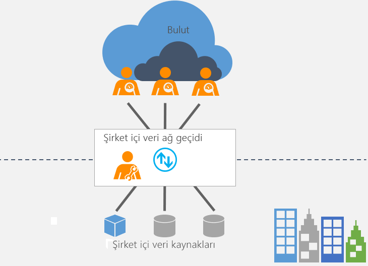

# Şirket içi veri ağ geçidi nedir?

[!INCLUDE [gateway-rewrite](includes/gateway-rewrite.md)]

Şirket içi veri ağ geçidi bir köprü işlevi görerek şirket içi veriler (bulutta olmayan veriler) ile çeşitli Microsoft bulut hizmetleri arasında hızlı ve güvenli veri aktarımı sağlar. Bu bulut hizmetleri Power BI, PowerApps, Power Automate, Azure Analysis Services ve Azure Logic Apps'tir. Bir ağ geçidi kullanarak, kuruluşlar veritabanlarını ve diğer veri kaynaklarını şirket içi ağlarında tutabilir ve diğer yandan da bu şirket içi verileri bulut hizmetlerinde güvenli bir şekilde kullanabilir.

## Ağ geçidi nasıl çalışır?

Ağ geçidinin nasıl çalıştığı hakkında daha fazla bilgi için bkz. [Şirket içi veri ağ geçidi mimarisi](/data-integration/gateway/service-gateway-onprem-indepth).

## Ağ geçidi türleri

Her biri farklı bir senaryoya yönelik olan iki farklı türde ağ geçidi bulunur:

* **Şirket içi veri ağ geçidi** birden fazla kullanıcının birden fazla şirket içi veri kaynağına bağlanmasını sağlar. Tek ağ geçidi kurulumuyla, tüm desteklenen hizmetler ile bir şirket içi veri ağ geçidi kullanabilirsiniz. Bu ağ geçidi birden fazla kullanıcının birden fazla veri kaynağına eriştiği karmaşık senaryolara çok uygundur.

* **Şirket içi veri ağ geçidi (kişisel mod)** tek kullanıcının kaynaklara bağlantı kurmasını sağlar ve başkalarıyla paylaşılamaz. Şirket içi veri ağ geçidi (kişisel mod) sadece Power BI ile kullanılabilir. Bu ağ geçidi, rapor oluşturan tek kişinin siz olduğunuz ve herhangi bir veri kaynağını başkalarıyla paylaşmak zorunda olmadığınız senaryolara çok uygundur.

## Ağ geçidi kullan

Ağ geçidi kullanmanın dört ana adımı vardır.

1. Bir yerel bilgisayara [Ağ geçidini indirme ve yükleme](/data-integration/gateway/service-gateway-install).
1. Güvenlik duvarınızı ve diğer ağ gereksinimlerini temel alarak ağ geçidini [Yapılandırma](/data-integration/gateway/service-gateway-app).
1. Diğer ağ gereksinimlerini yönetebilen [Ağ geçidi yöneticileri ekleme](/data-integration/gateway/service-gateway-manage).
1. Şirket içi veri kaynağını yenilemek için [ağ geçidini kullanın](service-gateway-sql-tutorial.md).
1. Hata oluştuğunda [Sorun giderme](service-gateway-onprem-tshoot.md).

## Sonraki adımlar

* [Şirket içi veri ağ geçidini yükleme](/data-integration/gateway/service-gateway-install)

Başka bir sorunuz mu var? [Power BI Topluluğu'na başvurun](https://community.powerbi.com/)
