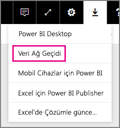
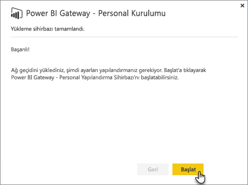
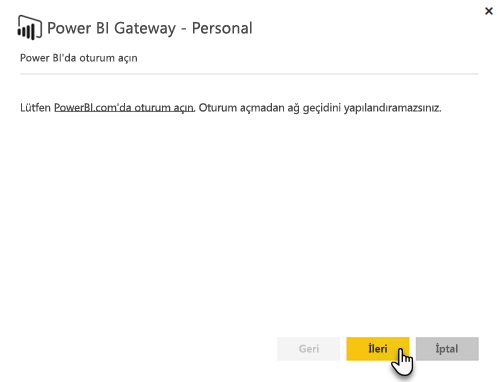
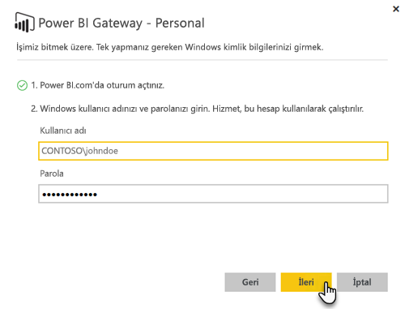

# Şirket içi veri ağ geçidi

Şirket içi veri ağ geçidi bir köprü işlevi görerek şirket içi veriler (bulutta olmayan veriler) ile Power BI, Microsoft Flow, Logic Apps ve PowerApps hizmetleri arasında hızlı ve güvenli veri aktarımı sağlar.

Tek bir ağ geçidini aynı anda farklı hizmetlerle kullanabilirsiniz. Power BI'ın yanı sıra PowerApps hizmetini kullanıyorsanız her iki hizmet için tek bir ağ geçidi kullanılabilir. Bu, oturum açmak için kullandığınız hesaba bağlıdır.

> [!NOTE]
> Şirket içi veri ağ geçidi, tüm modlarda veri sıkıştırma ve aktarım şifrelemesi uygular.
> 
> 

<!-- Shared Requirements Include -->
[!INCLUDE [gateway-onprem-requirements-include](./includes/gateway-onprem-requirements-include.md)]

### Analysis Services canlı bağlantılarına ilişkin sınırlamalar
Tablolu veya çok boyutlu örnekler için canlı bağlantı kullanabilirsiniz.

| **Sunucu sürümü** | **Gerekli SKU** |
| --- | --- |
| 2012 SP1 CU4 veya sonraki sürümler |İş Zekası ve Enterprise SKU'su |
| 2014 |İş Zekası ve Enterprise SKU'su |
| 2016 |Standart SKU veya sonraki sürümler |

* Hücre düzeyinde Biçimlendirme ve çeviri özellikleri desteklenmez.
* Eylemler ve Adlandırılmış Kümeler Power BI için açık değildir ancak Eylemleri veya Adlandırılmış kümeleri de içeren çok boyutlu küplere yine de bağlanabilir, görseller ve raporlar oluşturabilirsiniz.

<!-- Shared Install steps Include -->
[!INCLUDE [gateway-onprem-datasources-include](./includes/gateway-onprem-datasources-include.md)]

## Şirket içi veri ağ geçidini indirme ve yükleme
Ağ geçidini indirmek için İndir menüsü altında **Data Gateway**'i seçin. [Şirket içi veri ağ geçidini](http://go.microsoft.com/fwlink/?LinkID=820925) indirin.

<!-- Shared Install steps Include -->
[!INCLUDE [gateway-onprem-install-include](./includes/gateway-onprem-install-include.md)]

## Ağ geçidini kişisel modda yükleme
> [!NOTE]
> Kişisel ağ geçidi yalnızca Power BI ile çalışır.
> 
> 

Kişisel ağ geçidi yüklendikten sonra **Power BI Gateway - Personal Yapılandırma Sihirbazı**'nı başlatmalısınız.

Ardından, ağ geçidini bulut hizmetinde kaydetmek için Power BI'da oturum açmanız gerekir.

Ayrıca, Windows hizmetinin çalışacağı Windows kullanıcı adını ve parolayı sağlamanız gerekir. Size ait farklı bir Windows hesabı belirtebilirsiniz. Ağ geçidi hizmeti bu hesabı kullanarak çalışacaktır.

Yükleme tamamlandıktan sonra, Power BI içindeki veri kümelerinize gitmeniz ve şirket içi veri kaynaklarınıza yönelik kimlik bilgilerinin girildiğinden emin olmanız gerekir.

## Şifrelenmiş kimlik bilgilerini bulutta depolama
Ağ geçidine bir veri kaynağı eklediğinizde bu veri kaynağına yönelik kimlik bilgilerini sağlamanız gerekir. Veri kaynağına yönelik tüm sorgular bu kimlik bilgileri kullanılarak çalıştırılır. Kimlik bilgileri bulutta depolanmadan önce, bulutta şifrelerinin çözülmesini önlemek için asimetrik şifreleme kullanılarak güvenli bir şekilde şifrelenir. Kimlik bilgileri, şirket içinde ağ geçidini çalıştıran, veri kaynaklarına erişildiği zaman şifrelerinin çözüldüğü makineye gönderilir.

<!-- Account and Port information -->
[!INCLUDE [gateway-onprem-accounts-ports-more](./includes/gateway-onprem-accounts-ports-more.md)]

<!-- How the gateway works -->
[!INCLUDE [gateway-onprem-how-it-works-include](./includes/gateway-onprem-how-it-works-include.md)]

## Sınırlamalar ve Önemli Noktalar
* [Azure Information Protection](https://docs.microsoft.com/en-us/microsoft-365/enterprise/protect-files-with-aip
) şu anda desteklenmiyor
* [Access Online](https://products.office.com/en-us/access) şu anda desteklenmiyor

## Kiracı düzeyinde yönetim 

Şu anda kiracı yöneticilerinin, diğer kullanıcıların yükleyip yapılandırdığı tüm ağ geçitlerini yönetebileceği tek bir platform yoktur.  Kiracı yöneticisiyseniz, kuruluşunuzdaki kullanıcıların yükledikleri her ağ geçidine sizi yönetici olarak eklemesini istemenizi öneririz. Bu sayede, Ağ Geçidi Ayarları üzerinden veya [PowerShell komutları](https://docs.microsoft.com/power-bi/service-gateway-high-availability-clusters#powershell-support-for-gateway-clusters) ile kuruluşunuzdaki tüm ağ geçitlerini yönetebilirsiniz. 

## Sorun giderme
Bir ağ geçidini yüklerken ve yapılandırırken sorun yaşıyorsanız [Şirket içi veri ağ geçidiyle ilgili sorunları giderme](service-gateway-onprem-tshoot.md) makalesini mutlaka inceleyin. Güvenlik duvarınızla ilgili bir sorun yaşadığınızı düşünüyorsanız sorun giderme makalesindeki [güvenlik duvarı veya ara sunucu](service-gateway-onprem-tshoot.md#firewall-or-proxy) bölümüne bakın.

Ara sunucu sorunlarıyla karşılaştığınızı düşünüyorsanız bkz. [Power BI ağ geçitleri için ara sunucu ayarlarını yapılandırma](service-gateway-proxy.md).

## Sonraki adımlar
[Veri kaynağınızı yönetme - Analysis Services](service-gateway-enterprise-manage-ssas.md)  
[Veri kaynağınızı yönetme - SAP HANA](service-gateway-enterprise-manage-sap.md)  
[Veri kaynağınızı yönetme - SQL Server](service-gateway-enterprise-manage-sql.md)  
[Veri kaynağınızı yönetme - Oracle](service-gateway-onprem-manage-oracle.md)  
[Veri kaynağınızı yönetme - İçeri aktarma/Zamanlanmış yenileme](service-gateway-enterprise-manage-scheduled-refresh.md)  
[Şirket içi veri ağ geçidi ayrıntıları](service-gateway-onprem-indepth.md)  
[Şirket içi veri ağ geçidi (kişisel mod) - kişisel ağ geçidinin yeni sürümü](service-gateway-personal-mode.md)
[Şirket içi veri ağ geçidi için ara sunucu ayarlarını yapılandırma](service-gateway-proxy.md)  
Başka bir sorunuz mu var? [Power BI Topluluğu'na başvurun](http://community.powerbi.com/)

