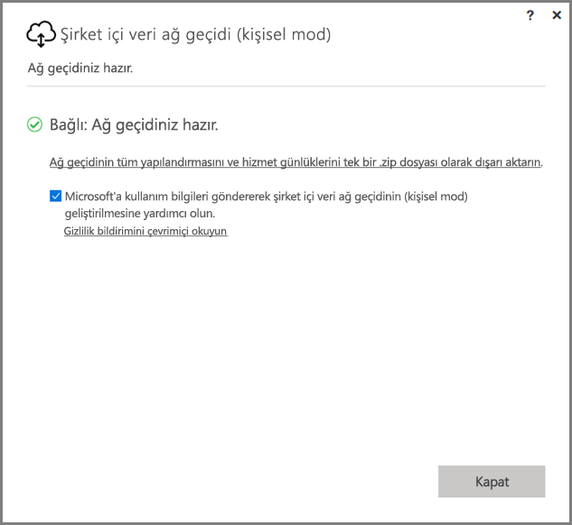
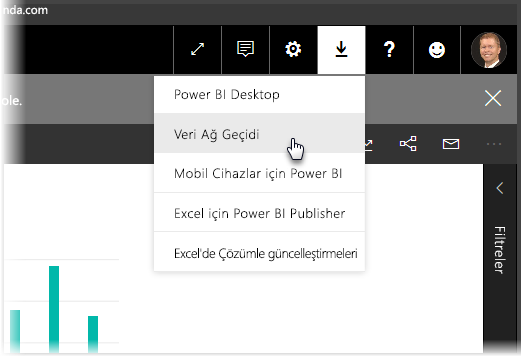
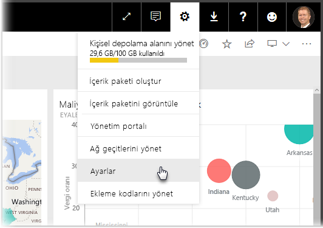
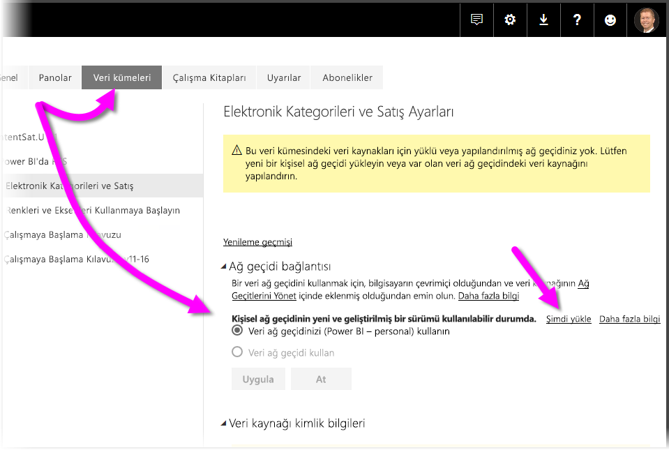
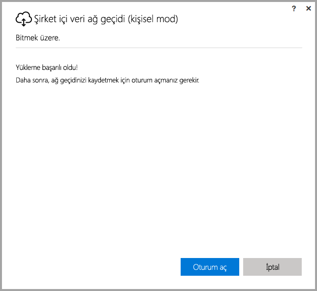
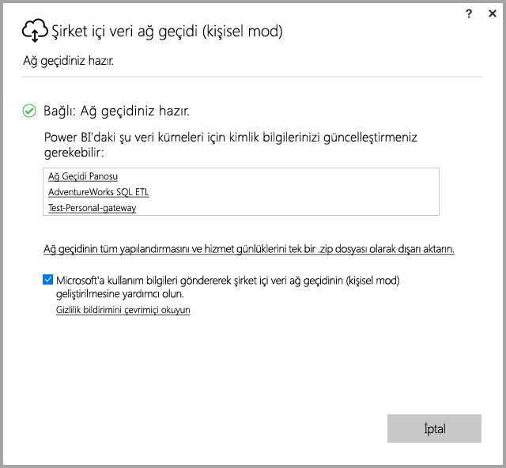

# <a name="on-premises-data-gateway-personal-mode"></a>Şirket içi veri ağ geçidi (kişisel mod)
Bir ağ geçidiyle şirket içi veri kaynaklarını kullanabilir ve Power BI raporları ve panoları oluşturabilirsiniz. Bir **ağ geçidi,** özel, şirket içi ağda depolanan verilere erişimi kolaylaştıran ve ardından bu verileri **Power BI hizmeti** gibi çevrimiçi hizmetlerde kullanabilmenizi sağlayan bir yazılımdı. **Şirket içi veri ağ geçidi (kişisel mod)** kısa süre önce kullanıma sunulan bir Power BI ağ geçidi güncelleştirmesidir ve kullanıcıların kendi bilgisayarlarına bir ağ geçidi yüklemesine ve şirket içi verilere erişim sağlayabilmesine olanak tanır.



> [!NOTE]
> **Şirket içi veri ağ geçidi (kişisel mod)**, **Power BI Gateway - Personal** adlı daha önce desteklenen kişisel ağ geçidi sürümünün yerine geçer. Önceki kişisel ağ geçidinin 31 Temmuz 2017 tarihinde kullanımdan kaldırılması planlanmıştır. Yeni sürümü güncelleştirme konusunda bilgi edinmek için aşağıdaki bölümlere bakın.
> 
> 

## <a name="features-of-the-on-premises-data-gateway-personal-mode"></a>Şirket içi veri ağ geçidi (kişisel mod) özellikleri
**Şirket içi veri ağ geçidinin (kişisel mod)** kullanıma sunulmasıyla birlikte bir dizi iyileştirme ve özellik sunulmaktadır. Kişisel ağ geçidinin önceki sürümünde (**Power BI Gateway - Personal**), uygulanması bazı sınırlamalara neden olmuştur. Birçok Power BI ürününde olduğu gibi müşterilerin ihtiyaçlarına, isteklerine ve ürünü nasıl kullandıklarına dikkat ettik. Sonuç olarak, **Şirket içi veri ağ geçidi (kişisel mod)** sıfırdan yeniden tasarlandı ve artık aşağıdaki özellikleri ve iyileştirmeleri içeriyor:

* **Gelişmiş güvenilirlik**: Kişisel ağ geçidinin yeni sürümü, kod ve yapısal yazılım iyileştirmeleri sayesinde güvenilirlik açısından önceki sürümden üstündür.
* **Gelişmiş genişletilebilirlik**: Yapısal yazılım iyileştirmeleri kapsamında ek özellikler sunulduğunda kolayca kişisel ağ geçidine eklenebilir.
* **Power BI hizmetinden kişisel ağ geçidini silme**: Yeni sürümle birlikte kişisel ağ geçidinizi **Power BI hizmetinden** silebilirsiniz.
* **Yapılandırma ve hizmet günlükleri**: Yeni sürüm sayesinde yapılandırma ve hizmet günlüklerini tek bir tıklamayla kolayca bir .zip dosyasına aktarabilirsiniz.

## <a name="installing-on-premises-data-gateway-personal-mode"></a>Şirket içi veri ağ geçidini (kişisel mod) yükleme
Ağ geçidinin önceki sürümü yüklü değilken **Şirket içi veri ağ geçidini (kişisel mod)** yüklemek için **Power BI hizmetinde** dişli simgesini ve **Data Gateway** öğesini seçin.



Ağ geçidini [bu konumdan](https://go.microsoft.com/fwlink/?LinkId=820925&clcid=0x409) da indirebilirsiniz. Yükleme adımlarını uygulayabilirsiniz. Yükleme işlemi, ağ geçidinin iki sürümünü de yüklemenize izin verdiğinden (başkalarıyla paylaşılabilen standart ağ geçidi veya kişisel mod) ağ geçidinin hangi sürümünü yükleyeceğinizi belirtmeniz istendiğinde **Şirket içi veri ağ geçidi (kişisel mod)** seçeneğini belirlediğinizden emin olun.

### <a name="updating-from-the-previous-personal-gateway"></a>Önceki kişisel ağ geçidinden güncelleştirme
**Power BI Gateway - personal** ağ geçidi yüklüyse **Power BI hizmetinde** **Ayarlar** bölümündeki **Veri Kümeleri** öğesini görüntülediğinizde kişisel ağ geçidinin yeni ve geliştirilmiş sürümünü yüklemeniz istenir.



Bir veri kümesini ve **Ağ geçidi bağlantısı**'nı seçtiğinizde kişisel ağ geçidinin yeni ve geliştirilmiş sürümünün mevcut olduğu bildirilir. Bu durumda **Şimdi yükle** seçeneğini belirleyin.



> [!NOTE]
> Yükseltilmiş bir işlem olarak **Power BI Gateway - personal** önceki sürümünü çalıştırıyorsanız veri kümesi kimlik bilgilerinizin otomatik olarak güncelleştirilebilmesi için yeni ağ geçidi yükleme işlemini de mutlaka yükseltilmiş olarak başlatın. Aksi halde, veri kümesi kimlik bilgilerini el ile güncelleştirmeniz gerekir.
> 
> 

Güncelleştirme işlemine yönlendirilecek ve ardından yükleme işleminin başarıyla tamamlandığını görürsünüz. Pencereleri henüz kapatmayın, son bir adım daha var.



İşte son adım. Yeni kişisel ağ geçidi yüklendikten sonra (ve son yükleme ekranı halen açıkken), **Power BI hizmetinde** oturum açın ve aşağıdaki görüntüde gösterildiği şekilde ağ geçidinin çevrimiçi olduğunu görene dek bekleyin.



Kişisel ağ geçidini önceki ağ geçidinin yüklü olduğu makinede güncelleştirdiyseniz kimlik bilgileriniz otomatik olarak güncelleştirilir ve tüm yenileme aktiviteleri yeni ağ geçidine geçer. Önceki ağ geçidi farklı bir makinede yüklüyse belirli veri kümelerinde kimlik bilgilerinizi güncelleştirmeniz istenir. Önceki görüntüde pencerede yer alan veri kümesi listesine bakın; bu listede, kimlik bilgilerinin güncelleştirilmesinin gerekebileceği veri kümeleri gösterilir. Listelenen her veri kümesi doğrudan bir bağlantıdır ve kimlik bilgilerinizi güncelleştirmek için üzerine tıklamanız yeterlidir.

Neredeyse bitti. Yeni ağ geçidini yükledikten sonra makinenizdeki önceki sürüme ihtiyacınız kalmaz. Bu nedenle, önceki sürümü kaldırmanız gerekir. Bunun için makinenizde **Power BI Gateway - personal** öğesini aratabilir ve daha sonra kaldırabilirsiniz.

### <a name="determining-which-version-of-the-personal-gateway-you-have-installed"></a>Kişisel ağ geçidinin hangi sürümünü yüklediğinizi belirleme
Kişisel ağ geçidinin hangi sürümünün yüklü olduğunu belirlemek için aşağıdakileri yapabilirsiniz:

* Kişisel ağ geçidinin önceki sürümünün adı **Power BI Gateway - Personal** şeklindedir ve yükleme iletişim kutusunda Power BI simgesi bulunur.
* Kişisel ağ geçidinin yeni sürümünün adı **Şirket içi veri ağ geçidi (kişisel mod)** şeklindedir ve ağ geçidi simgesi (alt kısmı boyunca bir yukarı ve aşağı ok bulunan bulut) bulunur.

**Program Ekle/Kaldır** bölümüne gidip listede **Power BI Gateway - Personal** programının görüntülenip görüntülenmediğine bakabilirsiniz. Listede yer alıyorsa kişisel ağ geçidinin önceki sürümü yüklüdür.

## <a name="using-fast-combine-with-the-personal-gateway"></a>Kişisel ağ geçidi ile Hızlı Birleştirmeyi kullanma
Önceki ağ geçidi ile **Hızlı Birleştirme** özelliğini kullandıysanız aşağıdaki adımları uygulayarak **Hızlı Birleştirme** özelliğini **Şirket içi veri ağ geçidi (kişisel mod)** ile çalışmak üzere yeniden etkinleştirebilirsiniz:

1. Dosya Gezgini'ni kullanarak aşağıdaki dosyayı açın:
   
   ```
   %localappdata%\Microsoft\On-premises data gateway (personal mode)\Microsoft.PowerBI.DataMovement.Pipeline.GatewayCore.dll.config
   ```
2. Dosyanın alt kısmına aşağıdaki metni ekleyin:
   
       ```
       <setting name="EnableFastCombine" serializeAs="String">```
       <value>true</value>
       </setting>
       ```
3. Bu işlemin ardından ayar, yaklaşık bir dakika içinde etkinleşir. Düzgün çalışıp çalışmadığını kontrol etmek için **Hızlı Birleştirme** özelliğinin çalıştığını onaylamak üzere **Power BI hizmetinde** isteğe bağlı yenileme işlemi yapın.

## <a name="limitations-and-considerations"></a>Sınırlamalar ve önemli noktalar
Aşağıdaki listede açıklandığı şekilde **Şirket içi veri ağ geçidini (kişisel mod)** kullanırken göz önünde bulundurmanız gereken bazı önemli noktalar vardır.

* Windows oturumu açmak için bir PIN veya **Windows Hello** kullanıyorsanız aşağıdaki hata ile karşılaşabilirsiniz: 
  * *Seçtiğiniz kullanıcı hesabı, uygulamanın gereksinimleriyle eşleşmiyor. Lütfen farklı bir hesap kullanın.*
  * Bu hatayı düzeltmek için *Farklı bir hesap kullan* seçeneğini belirleyin ve yeniden oturum açın. 

Aşağıdaki veri kaynakları şu anda **Şirket içi veri ağ geçidinde (kişisel mod)** desteklenmemektedir:

* ADO.NET 
* CurrentWorkbook
* FTP
* HDFS
* SAP BusinessObjects         
* Spark

Spark desteğinin 2017 takvim yılının ikinci yarısında sunulması planlanmaktadır.

## <a name="frequently-asked-questions-faq"></a>Sık Sorulan Sorular (SSS)
* **Şirket içi veri ağ geçidini (kişisel mod)** **Şirket içi veri ağ geçidi** (önceki adıyla ağ geçidinin Kurumsal sürümü) ile yan yana çalıştırabilir miyim?
  
  * **Cevap**: Evet, yeni sürüm ile birlikte her ikisini aynı anda çalıştırabilirsiniz.
* **Şirket içi veri ağ geçidini (kişisel mod)** bir hizmet olarak çalıştırabilir miyim?
  
  * **Cevap**: Hayır. **Şirket içi veri ağ geçidi (kişisel mod)** yalnızca bir uygulama olarak çalıştırılabilir. Ağ geçidini bir hizmet olarak ve/veya yönetici modda çalıştırmanız gerekirse [**Şirket içi veri ağ geçidini**](service-gateway-onprem.md) (önceki adıyla ağ geçidinin Kurumsal sürümü) çalıştırmayı düşünebilirsiniz.
* **Şirket içi veri ağ geçidi (kişisel mod)** ne sıklıkla güncelleştirilir?
  
  * **Cevap**: Kişisel ağ geçidini aylık olarak güncelleştirmeyi planlıyoruz.
* Neden kimlik bilgilerimi güncelleştirmem isteniyor?
  
  * **Cevap**: Birçok durumda kimlik bilgileriniz istenebilir. En yaygın olarak, **Şirket içi veri ağ geçidini (kişisel mod)** **Power BI - personal** ağ geçidinizden farklı bir makinede yeniden yüklediğinizde karşılaşırsınız. Veya veri kaynağında bir sorun olabilir, Power BI bir test bağlantısını gerçekleştirememiş olabilir ya da zaman aşımı veya bir sistem hatası meydana gelmiş olabilir. **Power BI hizmetinde** **dişli simgesine** gidip **Ayarlar** öğesini ve ardından **Veri Kümeleri** seçeneğini belirleyerek ve söz konusu veri kümesini bulup *kimlik bilgilerini güncelleştir* öğesine tıklayarak kimlik bilgilerinizi güncelleştirebilirsiniz.
* Yükseltme sırasında önceki kişisel ağ geçidim ne kadar süreyle çevrimdışı olacak?
  
  * **Cevap**: Kişisel ağ geçidinizi yeni sürüme yükseltmek yalnızca birkaç dakika sürer. 
* 31 Temmuz 2017 tarihine kadar yeni kişisel ağ geçidine geçmezsem ne olur?
  
  * **Cevap**: Raporlarınızı geçerli ağ geçidi ile yeniliyorsanız yenilemeleriniz durur. Yeni bir yenileme zamanlamasını, yalnızca yeni ağ geçidini yükleyip yapılandırarak ayarlayabilirsiniz.
* R betiği kullanıyorum. Bu destekleniyor mu?
  
  * **Yanıt**: R betikleri kişisel mod için desteklenir.
* Neden **Power BI hizmetinde** ağ geçidimi güncelleştirme mesajını göremiyorum?
  
  * **Cevap**: Büyük olasılıkla henüz desteklenmeyen bir veri kaynağı içeren bir veya daha fazla veri kümeniz olduğu içindir.

## <a name="next-steps"></a>Sonraki adımlar
[Power BI Gateways için ara sunucu ayarlarını yapılandırma](service-gateway-proxy.md)  
Başka bir sorunuz mu var? [Power BI Topluluğu'na başvurun](http://community.powerbi.com/)

