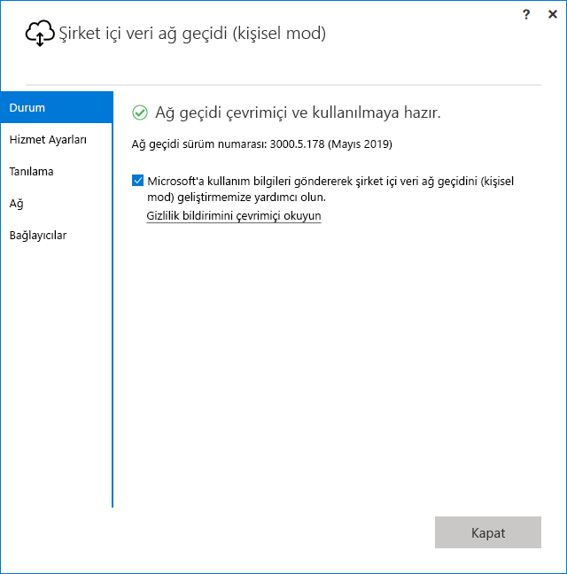

# <a name="use-personal-gateways-in-power-bi"></a>Power BI 'de kişisel ağ geçitleri kullanma

[!INCLUDE [gateway-rewrite](includes/gateway-rewrite.md)]

Şirket içi veri ağ geçidi (kişisel mod) şirket içi veri ağ geçidinin sadece Power BI ile çalışan bir sürümüdür. Kişisel ağ geçidi, kişilerin kendi bilgisayarlarına bir ağ geçidi yükleyip şirket içi verilere erişim sağlamasına olanak tanır.

> [!NOTE]
> Her Power BI kullanıcısı için kişisel modda çalışan yalnızca bir ağ geçidine sahip olabilirsiniz. Başka bir bilgisayarda bile olsa aynı kullanıcı için ikinci bir kişisel mod ağ geçidi yüklediğinizde en son yapılan yükleme önceki yüklemelerin yerini alır.

## <a name="on-premises-data-gateway-vs-on-premises-data-gateway-personal-mode"></a>Şirket içi veri ağ geçidi ve şirket içi veri ağ geçidi (kişisel mod) karşılaştırması

Aşağıdaki tablo, şirket içi veri ağ geçidi ve şirket içi veri ağ geçidi (kişisel mod) arasındaki farkları açıklanmaktadır.

|   |Şirket içi veri ağ geçidi | Şirket içi veri ağ geçidi (kişisel mod) |
| ---- | ---- | ---- |
|Desteklenen bulut hizmetleri |Power BI, PowerApps, Azure Logic Apps, Microsoft Flow, Azure Analysis Services, Data Flows |Power BI |
|Çalıştırmalar |Ağ geçidine erişimi olan kullanıcılar tarafından yapılandırıldığı gibi |Windows kimlik doğrulaması için ve diğer kimlik doğrulaması türleri için sizin tarafınızdan yapılandırıldığı gibi |
|Sadece bilgisayar yöneticisi olarak yüklenebilir |Evet |Hayır |
|Merkezi ağ geçidi ve veri kaynağı yönetimi |Evet |Hayır |
|Verileri içeri aktar ve yenilemeyi zamanla |Evet |Evet |
|DirectQuery desteği |Evet |Hayır |
|Analysis Services için LiveConnect desteği |Evet |Hayır |

## <a name="install-the-on-premises-data-gateway-personal-mode"></a>Şirket içi veri ağ geçidini (kişisel mod) yükleme

Şirket içi veri ağ geçidini (kişisel mod) yüklemek için:

1. [Şirket içi veri ağ geçidini indirin](https://go.microsoft.com/fwlink/?LinkId=820925&clcid=0x409).

2. Yükleyicide, şirket içi veri ağ geçidini (kişisel mod) belirleyip **İleri** düğmesini seçin.

   

Yükleme başarıyla tamamlandıktan ve oturumunuz açıldıktan sonra aşağıdaki ekranı görürsünüz.



## <a name="using-fast-combine-with-the-personal-gateway"></a>Kişisel ağ geçidi ile Hızlı Birleştirmeyi kullanma

Bir kişisel ağ geçidinde Hızlı Birleştirme yapma, sorguları yürütürken belirtilen gizlilik düzeylerini yoksaymanıza olanak tanır. Hızlı Birleştirmenin şirket içi veri ağ geçidiyle (kişisel mod) çalışmasını etkinleştirmek için:

1. Dosya Gezgini'ni kullanarak aşağıdaki dosyayı açın:

   `%localappdata%\Microsoft\On-premises data gateway (personal mode)\Microsoft.PowerBI.DataMovement.Pipeline.GatewayCore.dll.config`

2. Dosyanın alt kısmına aşağıdaki metni ekleyin:

    ```xml
    <setting name="EnableFastCombine" serializeAs="String">
       <value>true</value>
    </setting>
    ```

3. Bu işlemin ardından ayar, yaklaşık bir dakika içinde etkinleşir. Düzgün çalışıp çalışmadığını kontrol etmek için **Hızlı Birleştirme** özelliğinin çalıştığını onaylamak üzere **Power BI hizmetinde** isteğe bağlı yenileme işlemi yapın.

## <a name="frequently-asked-questions-faq"></a>Sık Sorulan Sorular (SSS)

**Soru:** **Şirket içi veri ağ geçidini (kişisel mod)** **şirket içi veri ağ geçidi** (önceki adıyla ağ geçidinin Kurumsal sürümü) ile yan yana çalıştırabilir miyim?
  
**Cevap:** Evet, ikisi de aynı anda çalışabilir.

**Soru:** **Şirket içi veri ağ geçidini (kişisel mod)** bir hizmet olarak çalıştırabilir miyim?
  
**Cevap:** Hayır. **Şirket içi veri ağ geçidi (kişisel mod)** yalnızca bir uygulama olarak çalıştırılabilir. Ağ geçidini bir hizmet olarak ve/veya yönetici modda çalıştırmanız gerekirse [**şirket içi veri ağ geçidini**](/data-integration/gateway/service-gateway-onprem) (önceki adıyla ağ geçidinin Kurumsal sürümü) çalıştırmayı düşünebilirsiniz.

**Soru:** **Şirket içi veri ağ geçidi (kişisel mod)** ne sıklıkla güncelleştirilir?
  
**Cevap:** Kişisel ağ geçidini her ay güncelleştirmeyi planlıyoruz.

**Soru:** Neden kimlik bilgilerimi güncelleştirmem isteniyor?
  
**Cevap:** Birçok durumda kimlik bilgileriniz istenebilir. En yaygın olarak, **şirket içi veri ağ geçidini (kişisel mod)** **Power BI - personal** ağ geçidinizden farklı bir makinede yeniden yüklediğinizde karşılaşırsınız. Veya veri kaynağında bir sorun olabilir, Power BI bir test bağlantısını gerçekleştirememiş olabilir ya da zaman aşımı veya bir sistem hatası meydana gelmiş olabilir. **Power BI hizmetinde** **dişli simgesine** gidip **Ayarlar** öğesini ve ardından **Veri Kümeleri** seçeneğini belirleyerek ve söz konusu veri kümesini bulup **Veri kaynağı kimlik bilgileri** öğesini seçerek kimlik bilgilerinizi güncelleştirebilirsiniz.

**Soru:** Yükseltme sırasında önceki kişisel ağ geçidim ne kadar süreyle çevrimdışı olacak?
  
**Cevap:** Kişisel ağ geçidinizi yeni sürüme yükseltmek yalnızca birkaç dakika sürer.

**Soru:** R ve Python betiklerini kullanıyorum. Bu destekleniyor mu?
  
**Cevap:** R ve Python betikleri kişisel mod için desteklenir.

## <a name="next-steps"></a>Sonraki adımlar

* [Şirket içi veri ağ geçidi için proxy ayarlarını yapılandırma](/data-integration/gateway/service-gateway-proxy)  

Başka bir sorunuz mu var? [Power BI Topluluğu'na başvurun](http://community.powerbi.com/)

