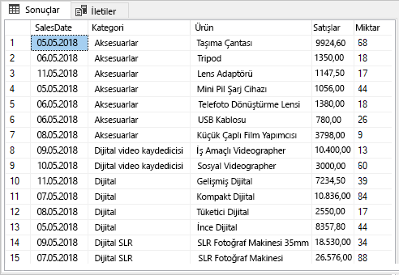
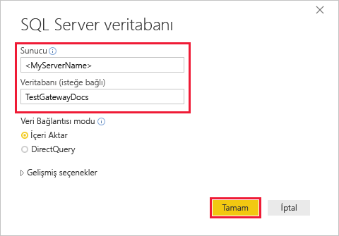
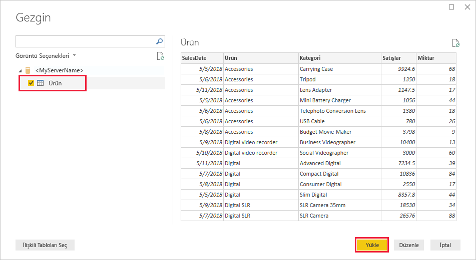
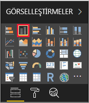
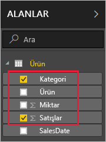
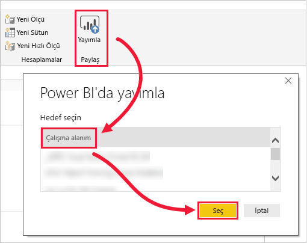
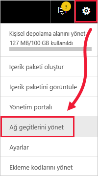
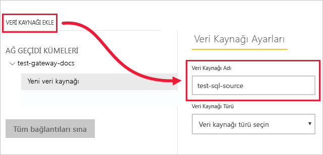
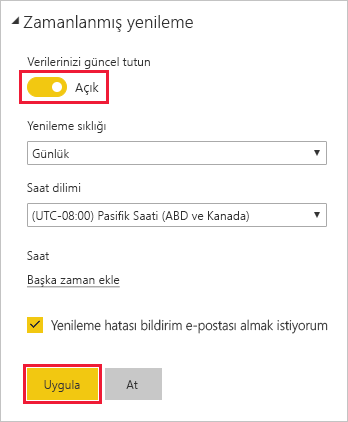

# <a name="tutorial-connect-to-on-premises-data-in-sql-server"></a>Öğretici: SQL Server’da şirket içi verilere bağlanma

Şirketi içi veri ağ geçidi, şirket içi ağı içine yüklediğiniz bir yazılımdır ve bu ağda verilere erişimi kolaylaştırır. Bu öğreticide, Power BI Desktop’ta SQL Server’dan içeri aktarılmış örnek verileri temel alarak bir rapor oluşturacaksınız. Daha sonra, raporu Power BI hizmetinde yayımlayacak ve hizmetin şirket içi verilere erişebilmesi için bir ağ geçidi yapılandıracaksınız. Bu erişim, hizmetin raporu güncel tutmak için verileri yenileyebileceği anlamına gelir.

Bu öğreticide aşağıdakilerin nasıl yapılacağını öğreneceksiniz:
> [!div class="checklist"]
> * SQL Server'da verilerden rapor oluşturma
> * Raporu Power BI Hizmetinde yayımlama
> * SQL Server’ı ağ geçidi veri kaynağı olarak ekleme
> * Rapordaki verileri yenileme

Power BI’ya kaydolmadıysanız başlamadan önce [ücretsiz deneme için kaydolun](https://app.powerbi.com/signupredirect?pbi_source=web).


## <a name="prerequisites"></a>Önkoşullar

* [Power BI Desktop uygulamasını yükleme](https://powerbi.microsoft.com/desktop/)
* Yerel bir bilgisayara [SQL Server yükleme](https://docs.microsoft.com/sql/database-engine/install-windows/install-sql-server) 
* Aynı yerel bilgisayara [şirket içi veri ağ geçidi yükleme](service-gateway-install.md) (üretimde, genellikle farklı bir bilgisayardır)


## <a name="set-up-sample-data"></a>Örnek verileri ayarlama

İlk olarak, öğreticinin geri kalanında bu verileri kullanabilmek için SQL Server’a örnek verileri ekleyin.

1. SQL Server Management Studio’da (SSMS), SQL Server örneğinize bağlanın ve bir test veritabanı oluşturun.

    ```sql
    CREATE DATABASE TestGatewayDocs
    ```

2. Oluşturduğunuz veritabanında bir tablo ekleyin ve verileri ekleyin.

    ```sql
    USE TestGatewayDocs

    CREATE TABLE Product (
        SalesDate DATE,
        Category  VARCHAR(100),
        Product VARCHAR(100),
        Sales MONEY,
        Quantity INT
    )

    INSERT INTO Product VALUES('2018-05-05','Accessories','Carrying Case',9924.60,68)
    INSERT INTO Product VALUES('2018-05-06','Accessories','Tripod',1350.00,18)
    INSERT INTO Product VALUES('2018-05-11','Accessories','Lens Adapter',1147.50,17)
    INSERT INTO Product VALUES('2018-05-05','Accessories','Mini Battery Charger',1056.00,44)
    INSERT INTO Product VALUES('2018-05-06','Accessories','Telephoto Conversion Lens',1380.00,18)
    INSERT INTO Product VALUES('2018-05-06','Accessories','USB Cable',780.00,26)
    INSERT INTO Product VALUES('2018-05-08','Accessories','Budget Movie-Maker',3798.00,9)
    INSERT INTO Product VALUES('2018-05-09','Digital video recorder','Business Videographer',10400.00,13)
    INSERT INTO Product VALUES('2018-05-10','Digital video recorder','Social Videographer',3000.00,60)
    INSERT INTO Product VALUES('2018-05-11','Digital','Advanced Digital',7234.50,39)
    INSERT INTO Product VALUES('2018-05-07','Digital','Compact Digital',10836.00,84)
    INSERT INTO Product VALUES('2018-05-08','Digital','Consumer Digital',2550.00,17)
    INSERT INTO Product VALUES('2018-05-05','Digital','Slim Digital',8357.80,44)
    INSERT INTO Product VALUES('2018-05-09','Digital SLR','SLR Camera 35mm',18530.00,34)
    INSERT INTO Product VALUES('2018-05-07','Digital SLR','SLR Camera',26576.00,88)
    ```

3. Verileri doğrulamak için tablodan seçin.

    ```sql
    SELECT * FROM Product
    ```

    


## <a name="build-and-publish-a-report"></a>Rapor oluşturma ve yayımlama

Birlikte çalışacağınız örnek verileri elde ettikten sonra, Power BI Desktop’ta SQL Server’a bağlanın ve bu verilere temel alarak bir rapor oluşturun. Daha sonra raporu Power BI hizmetinde yayımlayın.

1. Power BI Desktop **Giriş** sekmesinde **Veri Al** > **SQL Server** öğesini seçin.

2. **Sunucu** altında sunucu adınızı girin ve **Veritabanı** altında "TestGatewayDocs" ifadesini girin. **Tamam**'ı seçin. 

    

3. Kimlik bilgilerinizi doğrulayın, ardından **Bağlan**’ı seçin.

4. **Gezgin** altında **Ürün** tablosunu ve sonra **Yükle**’yi seçin.

    

5. Power BI Desktop **Rapor** görünümündeki **Görselleştirmeler** bölmesinde, **Yığılmış sütun grafik**’i seçin.

        

6. Rapor tuvalinde sütun grafiği seçiliyken, **Alanlar** bölmesindeki **Kategori** ve **Satış** alanlarını seçin.  

    

    Grafik şimdi aşağıdaki gibi görünür.

    

    Mevcut satış liderinin **SLR Camera** olduğuna dikkat edin. Bu öğreticinin sonraki kısımlarında verileri güncelleştirdiğinizde ve raporu yenilediğinizde bu değer değişir.

7. Raporu "TestGatewayDocs.pbix" adıyla kaydedin.

8. **Giriş** sekmesinde **Yayımla** > **Çalışma Alanım** > **Seç** öğesini seçin. Sizden istenmesi durumunda Power BI hizmetinde oturum açın. 

    

9. **Başarılı** ekranında **'TestGatewayDocs.pbix' dosyasını Power BI’da aç**’ı seçin.


## <a name="add-sql-server-as-a-gateway-data-source"></a>SQL Server’ı ağ geçidi veri kaynağı olarak ekleme

Power BI Desktop’ta doğrudan SQL Server’a bağlanabilirsiniz ancak Power BI hizmetinin köprü olarak görev yapması için bir ağ geçidi gerekir. Şimdi, önceki bir makalede oluşturduğunuz ağ geçidi için veri kaynağı olarak SQL Server örneğinizi ekleyin ([Önkoşullar](#prereqisites) altında listelenmiştir). 

1. Power BI hizmetinin sağ üst köşesinde  > **Ağ geçitlerini yönet** öğesini seçin.

    

2. **Veri kaynağı ekle**’yi seçin ve **Veri Kaynağı Adı** için "test-sql-source" girin.

    

3. **SQL Server** için **Veri Kaynağı Türü** seçin, ardından diğer değerleri gösterilen şekilde girin.

    

    | Seçenek | Değer |
    | ---    | ---   |
    | **Veri Kaynağı Adı**       | test-sql-source      |
    | **Veri Kaynağı Türü**       | SQL Server      |
    | **Sunucu**       |  SQL Server örneğinizin adı (Power BI Desktop’ta belirttiğiniz adla aynı olmalıdır)    |
    | **Veritabanı**       | TestGatewayDocs      |
    | **Kimlik Doğrulama Yöntemi**       | Windows      |
    | **Kullanıcı adı**        |  SQL Server'a bağlanmak için kullandığınız michael@contoso.com gibi hesap     |
    | **Parola**       |  SQL Server’a bağlanmak için kullandığınız hesabın parolası    |

4. **Ekle**'yi seçin. İşlem başarılı olduğunda *Bağlantı Başarılı* ifadesini görürsünüz.

    

    Şimdi bu veri kaynağını kullanarak SQL Server verilerinizi Power BI pano ve raporlarına ekleyebilirsiniz.


## <a name="configure-and-use-data-refresh"></a>Veri yenilemeyi yapılandırma ve kullanma

Raporunuzu Power BI hizmetinde yayımladınız ve SQL Server veri kaynağını yapılandırdınız. Bunlarla birlikte, Ürün tablosunda bir değişiklik yapacaksınız ve bu değişiklik, ağ geçidi üzerinden yayımlanan rapora akacak. Ayrıca, gelecekteki değişiklikleri işlemek için zamanlanmış bir yenileme yapılandıracaksınız.

1. SSMS’de, Ürün tablosundaki verileri güncelleştirin.

    ```sql
    UPDATE Product
    SET Sales = 32508, Quantity = 252
    WHERE Product='Compact Digital'     

    ```

2. Power BI Hizmetinin sol gezinti bölmesinde **Çalışma Alanım**’ı seçin.

3. **Veri Kümeleri** altında, **TestGatewayDocs** veri kümesi için **Diğer** (**. . .**) > **Şimdi yenile** öğesini seçin.

    

4. **Çalışma Alanım** > **Raporlar** > **TestGatewayDocs** öğesini seçin. Güncelleştirmenin nasıl uygulandığına ve satış liderinin artık **Compact Digital** olduğuna dikkat edin. 

    

5. **Çalışma Alanım** > **Raporlar** > **TestGatewayDocs** öğesini seçin. **Diğer** (**. . .**) > **Yenileme zamanla**’yı seçin.

6. **Yenileme zamanla** altında, yenilemeyi **Açık** olarak ayarlayın, ardından **Uygula**’yı seçin. Veri kümesi varsayılan olarak günde bir kez yenilenir.

    

## <a name="clean-up-resources"></a>Kaynakları temizleme
Örnek verileri artık kullanmak istemiyorsanız SSMS’de `DROP DATABASE TestGatewayDocs` komutunu çalıştırın. SQL Server veri kaynağını kullanmak istemiyorsanız, [veri kaynağını kaldırın](service-gateway-manage.md#remove-a-data-source). 


## <a name="next-steps"></a>Sonraki adımlar
Bu öğreticide aşağıdakilerin nasıl yapıldığını öğrendiniz:
> [!div class="checklist"]
> * SQL Server'da verilerden rapor oluşturma
> * Raporu Power BI Hizmetinde yayımlama
> * SQL Server’ı ağ geçidi veri kaynağı olarak ekleme
> * Rapordaki verileri yenileme

Daha fazla bilgi için sonraki makaleye ilerleyin
> [!div class="nextstepaction"]
> [Power BI ağ geçidi yönetme](service-gateway-manage.md)

