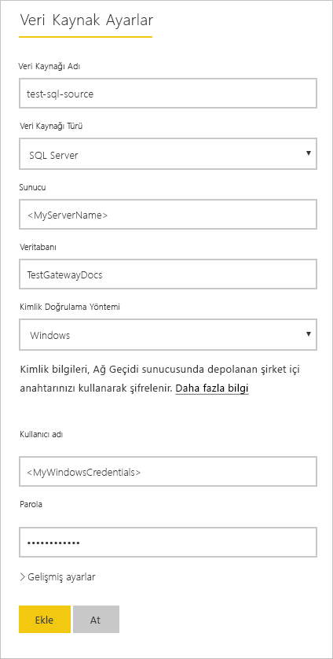
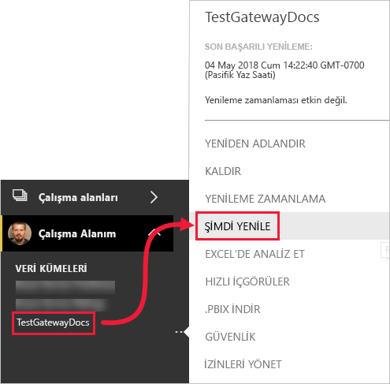

# <a name="refresh-data-from-an-on-premises-sql-server-database"></a>Şirket içi SQL Server veritabanından verileri yenileme

Bu öğreticide, şirket içinde yerel ağınızda mevcut olan bir Power BI veri kümesinin nasıl yenileneceğini keşfedeceksiniz. Özellikle, bu öğreticide Power BI’nin bir şirket içi veri ağ geçidi üzerinden erişmesi gereken örnek bir SQL Server veritabanı kullanılmaktadır.

Bu öğreticide aşağıdaki adımları tamamlarsınız:

> [!div class="checklist"]
> * Şirket içi SQL Server veritabanından verileri içeri aktaran bir Power BI Desktop (.pbix) dosyası oluşturup yayımlayın.
> * Bir veri ağ geçidi aracılığıyla SQL Server bağlantısı için Power BI’da veri kaynağı ve veri kümesi ayarlarını yapılandırın.
> * Power BI veri kümenizdeki verilerin güncel olduğundan emin olmak için bir yenileme zamanlaması yapılandırın.
> * Veri kümenizin isteğe bağlı bir yenilemesini gerçekleştirin.
> * Geçmiş yenileme döngülerinin sonuçlarını analiz etmek için yenileme geçmişini gözden geçirin.
> * Bu öğreticide oluşturulan yapıtları silerek kaynakları temizleyin.

## <a name="prerequisites"></a>Önkoşullar

- Henüz yoksa, başlamadan önce [ücretsiz Power BI deneme sürümüne](https://app.powerbi.com/signupredirect?pbi_source=web) kaydolun.
- Yerel bir bilgisayara [Power BI Desktop uygulamasını yükleyin](https://powerbi.microsoft.com/desktop/).
- Yerel bir bilgisayara [SQL Server yükleyin](/sql/database-engine/install-windows/install-sql-server) ve [örnek veritabanını yedekten geri yükleyin](https://github.com/Microsoft/sql-server-samples/releases/download/adventureworks/AdventureWorksDW2017.bak). AdventureWorks hakkında daha fazla bilgi için bkz. [AdventureWorks yükleme ve yapılandırma](/sql/samples/adventureworks-install-configure).
- SQL Server ile aynı yerel bilgisayara [şirket içi veri ağ geçidi yükleyin](service-gateway-onprem.md) (üretimde, genellikle farklı bir bilgisayardır).

> [!NOTE]
> Ağ geçidi yöneticisi değilseniz ve kendiniz bir ağ geçidi yüklemek istemiyorsanız, kuruluşunuzdaki bir ağ geçidi yöneticisi ile iletişime geçin. Ağ geçidi yöneticisi, veri kümenizi SQL Server veritabanınıza bağlamak için gereken veri kaynağı tanımını oluşturabilir.

## <a name="create-and-publish-a-power-bi-desktop-file"></a>Power BI Desktop dosyası oluşturma ve yayımlama

AdventureWorksDW örnek veritabanını kullanarak temel bir Power BI raporu oluşturmak için aşağıdaki yordamı kullanın. Power BI’da sonraki adımlarda yapılandırıp yenileyebileceğiniz bir veri kümesi elde edebilmek için raporu Power BI hizmetinde yayımlayın.

1. Power BI Desktop **Giriş** sekmesinde **Veri Al** \> **SQL Server** seçeneğini belirleyin.

2. **SQL Server veritabanı** iletişim kutusuna **Sunucu** ve **Veritabanı (isteğe bağlı)** adlarını girin, **Veri Bağlantısı modu**’nun **İçeri Aktarma** olduğundan emin olun ve sonra **Tamam**’ı seçin.

    

    Bu öğreticide **Gelişmiş seçenekleri** kullanmıyoruz ama bir SQL deyimi belirtebileceğinizi ve [SQL Server Yük Devretme](/sql/database-engine/availability-groups/windows/failover-clustering-and-always-on-availability-groups-sql-server) kullanımı gibi başka seçenekler ayarlayabileceğinizi aklınızda bulundurun.

    

3. **Kimlik bilgilerinizi** doğrulayın, ardından **Bağlan**’ı seçin.

    > [!NOTE]
    > Kimlik doğrulaması yapamıyorsanız doğru kimlik doğrulama yöntemini seçtiğinizden ve veritabanı erişimi olan bir hesap kullandığınızdan emin olun. Test ortamlarında açık bir kullanıcı adı ve parola ile Veritabanı kimlik doğrulamasını kullanabilirsiniz. Üretim ortamlarında genellikle Windows kimlik doğrulaması kullanırsınız. Daha fazla yardım için [Yenileme ile ilgili sorun giderme senaryoları](refresh-troubleshooting-refresh-scenarios.md)’na bakın ve veritabanı yöneticinizle iletişime geçin.

1. **Şifreleme Desteği** iletişim kutusu görüntülenirse **Tamam**’ı seçin.

2. **Gezgin** iletişim kutusunda **DimProduct** tablosunu, ardından **Yükle**’yi seçin.

    

3. Power BI Desktop **Rapor** görünümündeki **Görselleştirmeler** bölmesinde, **Yığılmış sütun grafik**’i seçin.

    

4. Rapor tuvalinde sütun grafiği seçiliyken, **Alanlar** bölmesindeki **EnglishProductName** ve **ListPrice** alanlarını seçin.

    

5. **EndDate** öğesini **Rapor düzeyi filtreleri**’nin üzerine sürükleyin ve **Temel filtreleme** altında yalnızca **(Boş)** onay kutusunu seçin.

    

    Grafik şimdi aşağıdaki gibi görünür.

    

    Beş **Road-250** ürününün en yüksek liste fiyatıyla listelendiğine dikkat edin. Bu öğreticinin sonraki kısımlarında verileri güncelleştirdiğinizde ve raporu yenilediğinizde bu değer değişecektir.

6. Raporu "AdventureWorksProducts.pbix" adıyla kaydedin.

7. **Giriş** sekmesinde **Yayımla** \> **Çalışma Alanım** \> **Seç** seçeneğini belirleyin. Sizden istenmesi durumunda Power BI hizmetinde oturum açın.

8. **Başarılı** ekranında **'AdventureWorksProducts.pbix' dosyasını Power BI’da aç**’ı seçin.

    [Power BI'da yayımla](./media/service-gateway-sql-tutorial/publish-to-power-bi.png)

## <a name="connect-a-dataset-to-a-sql-server-database"></a>Veri kümesini SQL Server veritabanına bağlama

Power BI Desktop’ta doğrudan SQL Server veritabanınıza bağlandınız ancak Power BI hizmetinin bulut ile şirket içi ağınız arasında bir köprü olarak görev yapması için bir veri ağ geçidi gereklidir. Şirket içi SQL Server veritabanınızı veri kaynağı olarak bir ağ geçidine eklemek ve sonra veri kümenizi bu veri kaynağına bağlamak için bu adımları izleyin.

1. Power BI'da oturum açın. Sağ üst köşedeki ayarlar dişli simgesini seçin ve ardından **Ayarlar**’ı seçin.

    

2. Şirket içi SQL Server veritabanınıza bir veri ağ geçidi aracılığıyla bağlanabilmek için **Veri Kümeleri** sekmesinde **AdventureWorksProducts** veri kümesini seçin.

3. **Ağ geçidi bağlantısı**’nı genişletin ve en az bir ağ geçidinin listelendiğini doğrulayın. Bir ağ geçidiniz yoksa, ağ geçidi yükleme ve yapılandırmaya ilişkin ürün belgelerinin bağlantısı için bu öğreticinin önceki kısımlarında bulunan [Önkoşullar](#prerequisites) bölümüne bakın.

    

4. **Eylemler** altında, veri kaynaklarını görüntülemek için iki durumlu düğmeyi genişletip **Ağ geçidine ekle** bağlantısını seçin.

    

    > [!NOTE]
    > Ağ geçidi yöneticisi değilseniz ve kendiniz bir ağ geçidi yüklemek istemiyorsanız, kuruluşunuzdaki bir ağ geçidi yöneticisi ile iletişime geçin. Ağ geçidi yöneticisi, veri kümenizi SQL Server veritabanınıza bağlamak için gereken veri kaynağı tanımını oluşturabilir.

5. **Ağ Geçitleri** yönetim sayfasındaki **Veri Kaynağı Ayarları** sekmesinde, aşağıdaki bilgileri girip doğrulayın ve **Ekle**’yi seçin.

    | Seçenek | Value |
    | --- | --- |
    | Data Source Name | AdventureWorksProducts |
    | Veri Kaynağı Türü | SQL Server |
    | Sunucu | SQL Server örneğinizin adı, örneğin SQLServer01 (Power BI Desktop’ta belirttiğiniz adla aynı olmalıdır). |
    | Veritabanı | SQL Server veritabanınızın adı, örneğin AdventureWorksDW (Power BI Desktop’ta belirttiğiniz adla aynı olmalıdır). |
    | Kimlik Doğrulama Yöntemi | Windows veya Temel (genellikle Windows). |
    | Kullanıcı adı | SQL Server'a bağlanmak için kullandığınız kullanıcı hesabı. |
    | Parola | SQL Server’a bağlanmak için kullandığınız hesabın parolası. |

    

6. **Veri kümeleri** sekmesinde **Ağ geçidi bağlantısı** bölümünü tekrar genişletin. Yüklediğiniz makinede çalışma **Durumu** gösteren yapılandırdığınız veri ağ geçidini ve **Uygula** öğesini seçin.

    

## <a name="configure-a-refresh-schedule"></a>Yenileme zamanlaması yapılandırma

Power BI’daki veri kümenizi bir veri ağ geçidi aracılığıyla şirket içindeki SQL Server veritabanınıza bağladıktan sonra bir yenileme zamanlaması yapılandırmak için aşağıdaki adımları izleyin. Veri kümenizin belirli bir zamanlamaya göre yenilenmesi, rapor ve panolarınızın en güncel verileri içermesine yardımcı olur.

1. Gezinti bölmesinde **Çalışma Alanım** \> **Veri Kümeleri**’ni açın. **AdventureWorksProducts** veri kümesi için üç noktayı ( **. . .** ), ardından **Yenileme zamanla**’yı seçin.

    > [!NOTE]
    > Aynı ada sahip raporun üç noktasını değil, **AdventureWorksProducts** veri kümesinin üç noktasını seçtiğinizden emin olun. **AdventureWorksProducts** raporunun bağlam menüsünde **Yenileme zamanla** seçeneği bulunmaz.

2. **Zamanlanmış yenileme** bölümündeki **Verilerinizi güncel tutun** altında yenilemeyi **Açık** olarak ayarlayın.

3. Uygun bir **Yenileme sıklığı** (bu örnek için **Günlük**) seçin ve sonra **Saat** altında **Başka bir saat seç**’i seçerek istediğiniz yenileme saatini belirtin (bu örnekte sabah ve akşam 06.30).

    

    > [!NOTE]
    > Veri kümeniz paylaşılan kapasitedeyse 8, Power BI Premium’da ise 48’e kadar yenileme sıklığı yapılandırabilirsiniz.

4. **Yenileme hatası bildirim e-postalarını bana gönder** onay kutusunu etkin bırakın ve **Uygula**’yı seçin.

## <a name="perform-an-on-demand-refresh"></a>İsteğe bağlı yenileme gerçekleştirme

Bir yenileme zamanlaması yapılandırdıktan sonra, Power BI 15 dakikalık bir toleransla sonraki zamanlanmış saatte veri kümenizi yeniler. Örneğin, ağ geçidi ve veri kaynağı yapılandırmanız için veriyi daha erken yenilemek istiyorsanız, gezinti bölmesindeki veri kümesi menüsünde bulunan **Şimdi Yenile** seçeneğini kullanarak isteğe bağlı yenileme gerçekleştirin. İsteğe bağlı yenilemeler bir sonraki zamanlanmış yenileme saatini etkilemez ancak önceki bölümde açıklandığı gibi günlük yenileme sınırınızdan düşülür.

Gösterim amacıyla, SQL Server Management Studio’yu (SSMS) kullanarak AdventureWorksDW veritabanında .DimProduct tablosunu güncelleştirerek örnek verilerde bir değişikliğin benzetimini yapın.

```sql

UPDATE [AdventureWorksDW].[dbo].[DimProduct]
SET ListPrice = 5000
WHERE EnglishProductName ='Road-250 Red, 58'

```

Şimdi de güncelleştirilen verilerin ağ bağlantısı aracılığıyla veri kümesine ve Power BI’daki raporlara akabilmesi için aşağıdaki adımları izleyin.

1. Power BI Hizmetinin gezinti bölmesinde **Çalışma Alanım**’ı seçip genişletin.

2. **Veri Kümeleri** altında, **AdventureWorksProducts** veri kümesinin üç noktasını ( **. . .** ), ardından **Şimdi yenile**’yi seçin.

    

    Sağ üst köşede Power BI’ın istenen yenilemeyi gerçekleştirmeye hazırlandığına dikkat edin.

3. **Çalışma Alanım \> Raporlar \> AdventureWorksProducts** öğesini seçin. Güncelleştirilen verilerin nasıl aktığına ve en yüksek liste fiyatına sahip ürünün artık **Road-250 Red, 58** olduğuna bakın.

    

## <a name="review-the-refresh-history"></a>Yenileme geçmişini gözden geçirme

Yenileme geçmişindeki geçmiş yenileme döngülerinin sonuçlarını düzenli aralıklarla denetlemek iyi bir fikirdir. Zamanlanmış bir yenilemenin zamanı geldiğinde veritabanı kimlik bilgilerinin süresi dolmuş veya seçili ağ geçidi çevrimdışı olabilir. Yenileme geçmişini incelemek ve sorunları kontrol etmek için aşağıdaki adımları izleyin.

1. Power BI kullanıcı arabiriminin sağ üst köşesinde ayarlar dişli simgesini seçin ve ardından **Ayarlar**’ı seçin.

2. **Veri Kümeleri**’ne geçiş yapın ve **AdventureWorksProducts** gibi incelemek istediğiniz veri kümesini seçin.

3. **Yenileme geçmişi** iletişim kutusunu açmak için **Yenileme geçmişi** bağlantısını seçin.

    

4. **Zamanlanmış** sekmesinde, **Başlangıç** ve **Bitiş** saatleri ve Power BI’ın yenilemeleri başarıyla yaptığını belirten **Tamamlandı** **Durumu** ile birlikte geçmiş zamanlanmış ve isteğe bağlı yenilemelere dikkat edin. Başarısız yenilemeler için hata iletisini görüntüleyebilir ve hata ayrıntılarını inceleyebilirsiniz.

    

    > [!NOTE]
    > [Power BI’da veri yenileme](refresh-data.md) bölümünde daha ayrıntılı açıklandığı gibi, OneDrive sekmesi yalnızca Power BI Desktop dosyalarına, Excel çalışma kitaplarına veya OneDrive ya da SharePoint Online üzerindeki CSV dosyalarına bağlı veri kümeleri için geçerlidir.

## <a name="clean-up-resources"></a>Kaynakları temizleme

Örnek verileri artık kullanmak istemiyorsanız, veritabanını SQL Server Management Studio’ya (SSMS) bırakın. SQL Server veri kaynağını kullanmak istemiyorsanız veri kaynağınızı veri ağ geçidinizden kaldırın. Ayrıca, veri ağ geçidini yalnızca bu öğreticiyi tamamlamak için yüklediyseniz kaldırmayı düşünün. AdventureWorksProducts.pbix dosyasını karşıya yüklediğinizde Power BI tarafından oluşturulan AdventureWorksProducts veri kümesini ve AdventureWorksProducts raporunu da silmeniz gerekir.

## <a name="next-steps"></a>Sonraki adımlar

Bu öğreticide, şirket içindeki bir SQL Server veritabanından bir Power BI veri kümesine verileri aktarmayı ve bu veri kümesini kullanan raporları ve panoları Power BI’da güncel tutmak için bu veri kümesini zamanlanmış ve isteğe bağlı olarak nasıl yenileyeceğinizi incelediniz. Şimdi Power BI’da veri ağ geçitlerini ve veri kaynaklarını yönetme hakkında daha fazla bilgi edinebilirsiniz. Power BI'da Veri Yenileme başlıklı kavramsal makaleyi incelemek de iyi bir fikir olabilir.

- [Şirket içi veri ağ geçidini yönetme](/data-integration/gateway/service-gateway-manage)
- [Veri kaynağınızı yönetme - İçeri Aktarma/Zamanlanmış Yenileme](service-gateway-enterprise-manage-scheduled-refresh.md)
- [Power BI'da veri yenileme](refresh-data.md)
