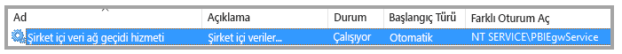
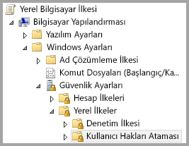
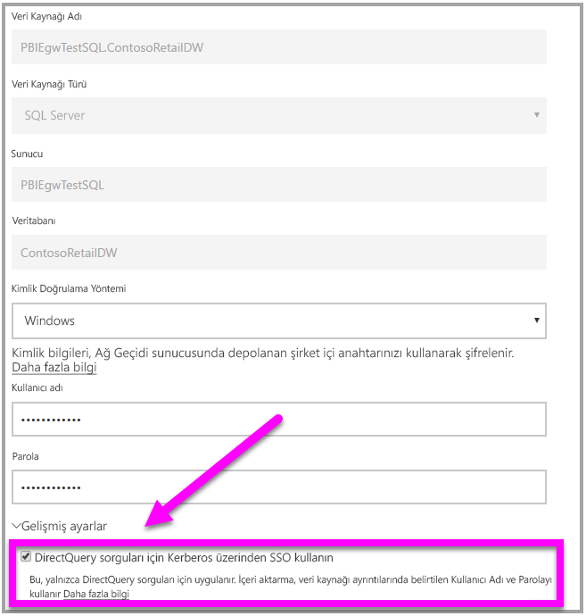

# <a name="use-resource-based-kerberos-for-single-sign-on-sso-from-power-bi-to-on-premises-data-sources"></a>Power BI’dan şirket içi veri kaynaklarına kadar çoklu oturum açma (SSO) için kaynak tabanlı Kerberos’u kullanma

Windows Server 2012 ve sonraki sürümlerinde çoklu oturum açma bağlantısına olanak sağlamak için, ön uç ile arka uç hizmetlerin farklı etki alanlarında bulunmasına izin veren [kaynak tabanlı Kerberos kısıtlanmış temsilini](/windows-server/security/kerberos/kerberos-constrained-delegation-overview) kullanın. Bu çalışma için, arka uç hizmeti etki alanın ön uç hizmeti etki alanına güvenmesi gerekir.

## <a name="preparing-for-resource-based-kerberos-constrained-delegation"></a>Kaynak tabanlı Kerberos kısıtlanmış temsili için hazırlanma

Kerberos Kısıtlanmış Temsil'in düzgün bir şekilde çalışması için, hizmet hesaplarındaki _Hizmet Asıl Adlarının_ (SPN) ve temsilci seçme ayarlarının da dahil olduğu belirli öğelerin yapılandırılması gerekir. 

### <a name="prerequisite-1-operating-system-requirements"></a>1. Önkoşul: İşletim sistemi gereksinimleri

Kaynak tabanlı kısıtlanmış temsil yalnızca Windows Server 2012 R2, Windows Server 2012 veya üstünü çalıştıran etki alanı denetleyicilerinde yapılandırılabilir.

### <a name="prerequisite-2-install-and-configure-the-on-premises-data-gateway"></a>2. Önkoşul: Şirket içi veri ağ geçidini yükleme ve yapılandırma

Şirket içi veri ağ geçidinin bu sürümü, yerinde yükseltmeyi ve mevcut ağ geçitlerinin _ayarlarını devralma_ özelliğini destekler.

### <a name="prerequisite-3-run-the-gateway-windows-service-as-a-domain-account"></a>3. Önkoşul: Ağ geçidi Windows hizmetini bir etki alanı hesabı olarak çalıştırma

Standart bir yüklemede, ağ geçidi, aşağıdaki görüntüde gösterildiği gibi bir makine yerel hizmet hesabı olarak (özel olarak belirtmek gerekirse, _NT Service\PBIEgwService_) çalıştırılır:



Azure AD'niz yerel Active Directory hesabınız ile eşitlenmediği (Azure AD DirSync/Connect kullanılarak) sürece, **Kerberos Kısıtlanmış Temsili'nin etkinleştirilebilmesi için ağ geçidinin bir etki alanı hesabı olarak çalıştırılması gerekir. Hesabı bir etki alanı hesabı olarak değiştirmeniz gerekiyorsa bkz. [Ağ geçidini bir etki alanı hesabına geçirme](service-gateway-sso-kerberos.md).

Azure AD DirSync / Connect yapılandırıldıysa ve kullanıcı hesapları eşitlendiyse, ağ geçidi hizmetinin çalışma zamanında yerel AD aramaları yapması gerekmez. Ağ geçidi hizmeti için yerel Hizmet Service SID'sini kullanabilirsiniz (etki alanı hesabı gerektirmek yerine). Bu belgede açıklanan Kerberos Kısıtlanmış Temsil yapılandırmasına ilişkin adımlar söz konusu yapılandırmaya yönelik olanlarla aynıdır. (Tek değişiklik, etki alanı hesabı yerine Active Directory içindeki ağ geçidi bilgisayar nesnesine uygulanmış olmasıdır).

### <a name="prerequisite-4-have-domain-admin-rights-to-configure-spns-setspn-and-kerberos-constrained-delegation-settings"></a>4. Önkoşul: SPN'leri (SetSPN) ve Kerberos kısıtlanmış temsili ayarlarını yapılandırmak için etki alanı yöneticisi haklarını alma

Bir etki alanı yöneticisinin SPN'leri ve Kerberos temsilci seçme ayarlarını yapılandırma (etki alanı yöneticisi hakları gerekmeden) haklarını geçici veya kalıcı olarak başka bir kişiye vermesi teknik olarak mümkün olsa da bu yaklaşım önerilmez. Aşağıdaki bölümde, **3. Önkoşul** için gereken yapılandırma adımları ayrıntılı bir şekilde sunulmuştur.

## <a name="configuring-kerberos-constrained-delegation-for-the-gateway-and-data-source"></a>Ağ geçidi ve veri kaynağı için Kerberos kısıtlanmış temsilini yapılandırma

Sistemi düzgün bir şekilde yapılandırmak için şu iki öğeyi yapılandırmamız veya doğrulamamız gerekir:

1. Gerekirse, ağ geçidi hizmeti etki alanı hesabı için bir SPN yapılandırın.

1. Ağ geçidi hizmeti etki alanı hesabında temsilci seçme ayarlarını yapılandırın.

Bu iki yapılandırma adımını uygulamak için bir etki alanı yöneticisi olmanız gerektiğini unutmayın.

Aşağıdaki bölümlerde bu adımlar sırasıyla açıklanmıştır.

### <a name="configure-an-spn-for-the-gateway-service-account"></a>Ağ geçidi hizmet hesabı için SPN yapılandırma

Öncelikle aşağıdaki adımları uygulayarak, ağ geçidi hizmet hesabı olarak kullanılan etki alanı hesabı için bir SPN yapılandırılmış olup olmadığını belirleyin:

1. **Active Directory Kullanıcıları ve Bilgisayarları**'nı etki alanı yöneticisi olarak başlatın.

1. Etki alanına sağ tıklayın, **Bul** seçeneğini belirleyin ve ağ geçidi hizmet hesabına ilişkin hesap adını yazın

1. Arama sonucunda, ağ geçidi hizmet hesabına sağ tıklayıp **Özellikler**'i seçin.

1. **Özellikler** iletişim kutusunda **Temsilci Seçme** sekmesi görünüyorsa SPN zaten oluşturulmuştur ve Temsilci Seçme ayarlarını yapılandırma ile ilgili bir sonraki alt bölüme geçebilirsiniz.

    **Özellikler** iletişim kutusunda **Temsilci Seçme** sekmesi bulunmuyorsa söz konusu hesapta elle SPN oluşturarak, **Temsilci Seçme** sekmesinin eklenmesini sağlayabilirsiniz (Bu, temsilci seçme ayarlarının yapılandırılması için izlenebilecek en kolay yoldur). SPN oluşturma işlemi, Windows ile birlikte gelen [SetSPN aracı](https://technet.microsoft.com/library/cc731241.aspx) kullanılarak gerçekleştirilebilir. (SPN'yi oluşturmak için etki alanı yöneticisi haklarına sahip olmanız gerekir.)

    Örneğin, ağ geçidi hizmet hesabının "PBIEgwTest\GatewaySvc", ağ geçidi hizmetinin çalıştırıldığı makinenin adının ise **Machine1** olduğunu varsayalım. Bu örnekteki makineye ilişkin ağ geçidi hizmet hesabına yönelik SPN'yi ayarlamak için aşağıdaki komutu çalıştırırsınız:

      

    Adım tamamlandığına göre, temsilci seçme ayarlarını yapılandırmaya geçebiliriz.

### <a name="configure-delegation-settings"></a>Temsilci seçme ayarlarını yapılandırma

Sıradaki adımlar için bir ağ geçidi makinesi ve SQL Server çalıştıran bir veritabanı olmak üzere farklı etki alanlarında iki makine içeren bir şirket içi ortamını kullanacağız. Bu örnek için ayrıca şu ayarların ve adların geçerli olduğunu varsayıyoruz:

- Ağ geçidi makine adı: **PBIEgwTestGW**
- Ağ geçidi hizmet hesabı: **PBIEgwTestFrontEnd\GatewaySvc** (hesap görünen adı: Gateway Connector)
- SQL Server veri kaynağı makine adı: **PBIEgwTestSQL**
- SQL Server veri kaynağı hizmet hesabı: **PBIEgwTestBackEnd\SQLService**

Bu örnek adlar ve ayarlar doğrultusunda aşağıdaki yapılandırma adımlarını kullanın:

1. **PBIEgwTestFront-end** etki alanının etki alanı denetleyicisinde bir Microsoft Yönetim Konsolu (MMC) ek bileşeni olan **Active Directory Kullanıcıları ve Bilgisayarları**'nı kullanarak, ağ geçidi hizmet hesabına hiçbir temsil ayarı uygulanmadığından emin olun.

    

1. **PBIEgwTestBack-end** etki alanının etki alanı denetleyicisinde **Active Directory Kullanıcıları ve Bilgisayarları**'nı kullanarak, arka uç hizmet hesabına hiçbir temsil ayarı uygulanmadığından emin olun. Buna ek olarak, bu hesap için "msDS-AllowedToActOnBehalfOfOtherIdentity" özniteliğinin de ayarlanmadığından emin olun. Bu özniteliği, aşağıdaki resimde gösterildiği gibi "Öznitelik Düzenleyicisi"nde bulabilirsiniz:

    

1. **PBIEgwTestBack-end** etki alanının etki alanı denetleyicisinde, **Active Directory Kullanıcıları ve Bilgisayarları**'nda bir grup oluşturun. Aşağıdaki görüntüde gösterildiği gibi ağ geçidi hizmet hesabını bu gruba ekleyin. Görüntüde _ResourceDelGroup_ adlı yeni bir grup ve bu gruba eklenen **GatewaySvc** ağ geçidi hizmet hesabı gösterilir.

    

1. Komut istemini açın ve **PBIEgwTestBack-end** etki alanının etki alanı denetleyicisinde aşağıdaki komutları çalıştırarak arka uç hizmet hesabının msDS-AllowedToActOnBehalfOfOtherIdentity özniteliğini güncelleştirin:

    ```powershell
    $c = Get-ADGroup ResourceDelGroup
    Set-ADUser SQLService -PrincipalsAllowedToDelegateToAccount $c
    ```

1. **Active Directory Kullanıcıları ve Bilgisayarları**'nda arka uç hizmet hesabının özelliklerindeki "Öznitelik Düzenleyicisi" sekmesinde güncelleştirmenin yansıtıldığını doğrulayabilirsiniz.

Son olarak, ağ geçidi hizmetinin çalıştırıldığı makinede (bizim örneğimizde, **PBIEgwTestGW**), ağ geçidi hizmet hesabına "Kimlik doğrulamasından sonra istemcinin özelliklerini al" yerel ilkesinin uygulanması gerekir. Bunu gerçekleştirmek/doğrulamak için Yerel Grup İlkesi Düzenleyicisi'ni (**gpedit**) kullanmanız gerekir.

1. Ağ geçidi makinesinde şunu çalıştırın: _gpedit.msc_.

1. Aşağıdaki görüntüde gösterildiği gibi, **Yerel Bilgisayar İlkesi > Bilgisayar Yapılandırması > Windows Ayarları > Güvenlik Ayarları > Yerel İlkeler > Kullanıcı Hakları Ataması**'na gidin.

    

1. **Kullanıcı Hakları Ataması** bölümündeki ilke listesindeki **Kimlik doğrulamasından sonra istemcinin özelliklerini al** seçeneğini belirleyin.

    

1. **Kimlik doğrulamasından sonra istemcinin özelliklerini al**'a sağ tıklayıp bu ilkenin **Özellikler**'ini açın ve hesap listesini kontrol edin. Ağ geçidi hizmet hesabını ( **PBIEgwTestFront-end**  **\GatewaySvc**) içermesi gerekir.

1. **Kullanıcı Hakları Ataması** bölümündeki ilke listesinde bulunan **İşletim sisteminin parçası gibi davran (SeTcbPrivilege)** seçeneğini belirleyin. Ağ geçidi hizmet hesabının da hesap listesinde yer aldığından emin olun.

1. **Şirket içi veri ağ geçidi** hizmet işlemini yeniden başlatın.

## <a name="running-a-power-bi-report"></a>Power BI raporu çalıştırma

Bu makalede daha önce açıklanan tüm yapılandırma adımları tamamlandıktan sonra, veri kaynağını yapılandırmak için Power BI'daki **Ağ Geçitlerini Yönet** sayfasını kullanabilirsiniz. Sayfadaki **Gelişmiş Ayarlar** bölümünde SSO'yu etkinleştirip söz konusu veri kaynağına bağlı raporlar ve veri kümeleri yayımlayabilirsiniz.



Bu yapılandırma çoğu durumda çalışır. Ancak, ortamınıza bağlı olarak Kerberos ile farklı yapılandırmalar da söz konusu olabilir. Rapor hâlâ yüklenmiyorsa sorunun daha ayrıntılı bir şekilde incelenmesi için etki alanı yöneticinizle iletişime geçmeniz gerekir.

## <a name="next-steps"></a>Sonraki adımlar

**Şirket içi veri ağ geçidi** ve **DirectQuery** hakkında daha fazla bilgi için aşağıdaki kaynaklara göz atın:

- [Şirket içi veri ağ geçidi](service-gateway-onprem.md)
- [Power BI'da DirectQuery](desktop-directquery-about.md)
- [DirectQuery tarafından desteklenen veri kaynakları](desktop-directquery-data-sources.md)
- [DirectQuery ve SAP BW](desktop-directquery-sap-bw.md)
- [DirectQuery ve SAP HANA](desktop-directquery-sap-hana.md)