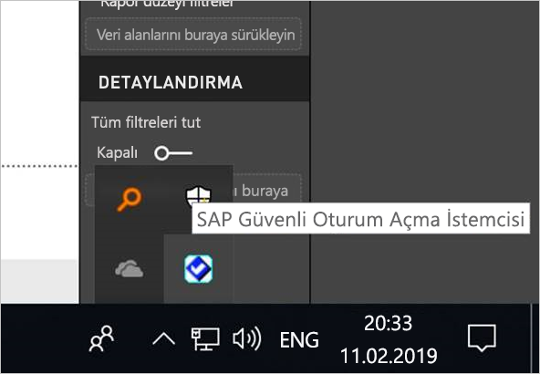
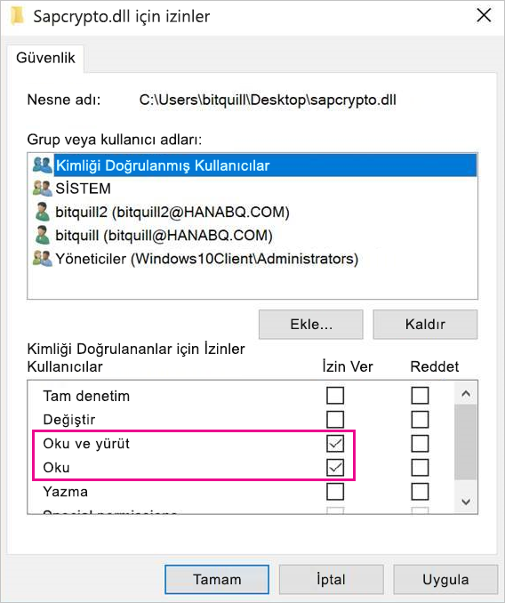
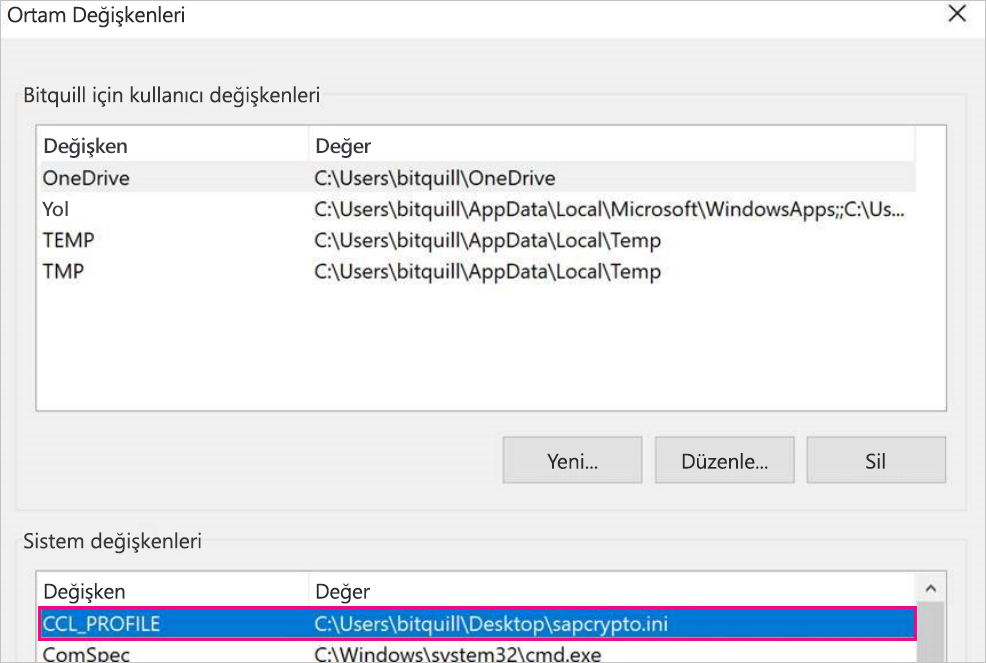
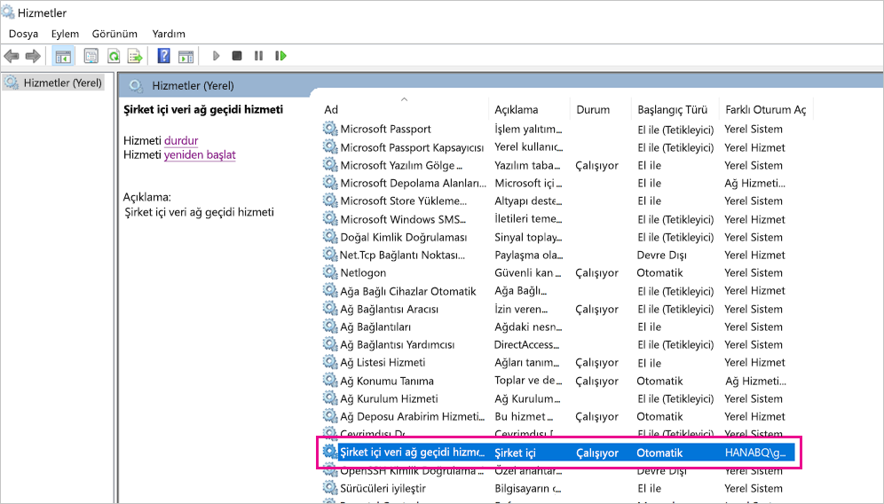
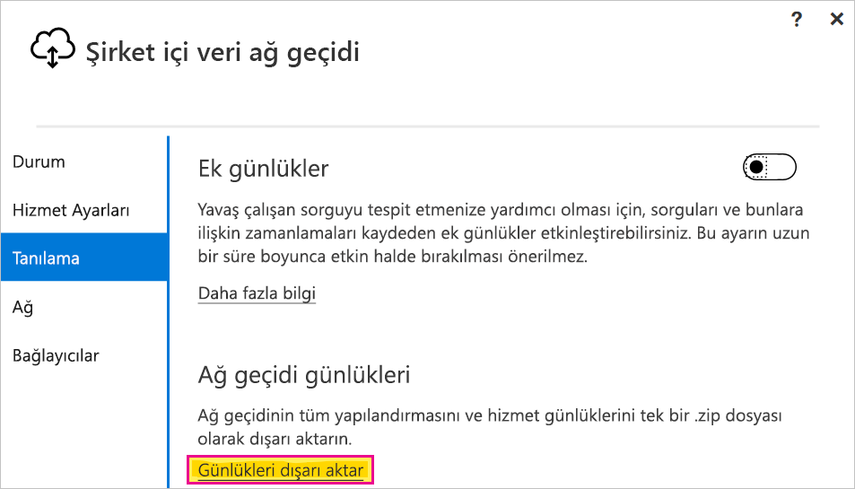

# <a name="use-kerberos-single-sign-on-for-sso-to-sap-bw-using-commoncryptolib-sapcryptodll"></a>CommonCryptoLib (sapcrypto.dll) kullanarak SSO için SAP BW’de Kerberos çoklu oturum açma kullanma

Bu makalede, CommonCryptoLib (sapcrypto.dll) kullanılarak Power BI hizmetinden SSO'yu etkinleştirmek için SAP BW veri kaynağınızın nasıl yapılandırılacağı açıklanır.

> [!NOTE]
> Kerberos SSO’su kullanan SAP BW tabanlı bir raporu yenilemeyi denemeden önce bu makaledeki adımlara ek olarak [Kerberos SSO’yu Yapılandırma](service-gateway-sso-kerberos.md) bölümündeki adımları tamamlayın. SNC kitaplığı olarak CommonCryptoLib kullanmak, hem SAP BW Uygulama Sunucuları hem de SAP BW İleti Sunucuları ile SSO bağlantıları kurmayı sağlar.

## <a name="configure-sap-bw-to-enable-sso-using-commoncryptolib"></a>CommonCryptoLib kullanarak SSO’yu etkinleştirmek için SAP BW'yi yapılandırma

> [!NOTE]
> Şirket içi veri ağ geçidi 64 bit yazılımdır ve bu nedenle BW SSO gerçekleştirmek için CommonCryptoLib’in (sapcrypto.dll) 64 bit sürümünü gerektirir. Ağ geçidi aracılığıyla bir SSO bağlantısı denemeden önce SAP GUI’de SAP BW sunucunuzla SSO bağlantısını test etmeyi planlıyorsanız (önerilir), SAP GUI bir 32 bit yazılım olduğu için CommonCryptoLib’in 32 bit sürümü de gerekli olacaktır.

1. BW sunucunuzun CommonCryptoLib kullanarak Kerberos SSO için doğru yapılandırıldığından emin olun. Doğru yapılandırılmışsa, CommonCryptoLib kullanacak şekilde yapılandırılmış SAP GUI’si gibi bir SAP aracı ile BW sunucunuza erişmek için (doğrudan veya bir SAP BW İleti Sunucusu üzerinden) SSO kullanabilirsiniz. 

   Kurulum adımları hakkında daha fazla bilgi için bkz. [Sap Çoklu Oturum Açma: Kerberos/SPNEGO ile kimlik doğrulama](https://blogs.sap.com/2017/07/27/sap-single-sign-on-authenticate-with-kerberosspnego/). BW sunucunuzun CommonCryptoLib’i SNC Kitaplığı olarak kullanması ve *CN=BW1* gibi *CN=* ile başlayan bir SNC adının olması gerekir. SNC ad gereksinimleri (özellikle snc/kimlik/parametre olarak) hakkında daha fazla bilgi için bkz. [Kerberos Yapılandırması için SNC Parametreleri](https://help.sap.com/viewer/df185fd53bb645b1bd99284ee4e4a750/3.0/360534094511490d91b9589d20abb49a.html).

1. Daha önce yapmadıysanız, [SAP .NET Bağlayıcısının](https://support.sap.com/en/product/connectors/msnet.html) x64 sürümünü, ağ geçidinin yüklü olduğu bilgisayara yükleyin. 
   
   Ağ geçidi bilgisayarından Power BI Desktop’taki BW sunucunuza bağlanmayı deneyerek bileşenin yüklenip yüklenmediğini denetleyebilirsiniz. 2\.0 uygulamasını kullanarak bağlanamıyorsanız, .NET Connector yüklü değildir veya GAC'ye yüklenmemiştir.

1. SAP Güvenli Oturum Açma İstemcisi’nin (SLC) ağ geçidinin yüklü olduğu bilgisayarda çalışmadığından emin olun. 

   SLC, Kerberos biletlerini ağ geçidinin çoklu oturum açma için Kerberos’u kullanma özelliğini engelleyebilecek şekilde önbelleğe alır. 

1. SLC yüklüyse kaldırın veya SAP Güvenli Oturum Açma İstemcisi’nden çıktığınızdan emin olun. Ağ geçidini kullanarak SSO bağlantısı kurmayı denemeden önce sistem tepsisindeki simgeye sağ tıklayıp **Oturumu Kapat** ve **Çıkış**’ı seçin. 

   SLC, Windows Server makinelerinde kullanım için desteklenmez. Daha fazla bilgi için bkz. [SAP Notu 2780475](https://launchpad.support.sap.com/#/notes/2780475) (s-user gerekir).

   

1. SLC’yi kaldırırsanız veya **Oturumu Kapat** ve **Çıkış**’ı seçerseniz, ağ geçidi aracılığıyla bir çoklu oturum açma bağlantısı kurmayı denemeden önce önbellekteki tüm Kerberos biletlerini temizlemek için bir komut penceresi açıp pencereye şunu girin: `klist purge`.

1. SAP Launchpad’den 64 bit CommonCryptoLib’in (sapcrypto.dll) *8.5.25 veya daha yeni sürümünü* indirip bunu ağ geçidi makinenizdeki bir klasöre kopyalayın. sapcrypto.dll dosyasını kopyaladığınız dizinde sapcrypto.ini adlı bir dosya oluşturup aşağıdaki içeriklere sahip olmasını sağlayın:

    ```
    ccl/snc/enable_kerberos_in_client_role = 1
    ```

    .ini dosyası, CommonCryptoLib’in ağ geçidi senaryosunda çoklu oturum açmayı etkinleştirmek için gerek duyduğu yapılandırma bilgilerini içerir.

    > [!NOTE]
    > Bu dosyalar aynı konumda depolanmalıdır. Farklı bir deyişle, _/path/to/sapcrypto/_ dizini hem sapcrpyto.ini hem de sapcrypto.dll dosyasını içermelidir.

    Hem ağ geçidi hizmet kullanıcısı hem de hizmet kullanıcısının kimliğine bürüneceği Active Directory (AD) kullanıcısı her iki dosya için okuma ve yürütme izinlerine ihtiyaç duyar. Kimliği Doğrulanmış Kullanıcılar grubuna hem .ini hem de .dll dosyalarında izin vermenizi öneririz. Test amacıyla, bu izinleri hem ağ geçidi hizmet kullanıcısına hem de test edeceğiniz Active Directory kullanıcısına açıkça verebilirsiniz. Aşağıdaki ekran görüntüsünde, sapcrypto.dll dosyası için Kimliği Doğrulanmış Kullanıcılar grubuna **Okuma &amp; Yürütme** izinlerinin verilmiş olduğunu görebilirsiniz:

    

1. Henüz SSO bağlantısının üzerinden akıtılmasını istediğiniz ağ geçidiyle ilişkilendirilmiş bir SAP BW veri kaynağınız yoksa, Power BI hizmetinde **Ağ geçitlerini yönet** sayfasına bir veri kaynağı ekleyin. Zaten böyle bir veri kaynağınız varsa düzenleyin: 
    - BW Uygulama Sunucusu ile SSO bağlantısı oluşturmak istiyorsanız **Veri Kaynağı Türü** olarak **SAP Business Warehouse**’u seçin. 
    - BW İleti Sunucusu ile SSO bağlantısı oluşturmak istiyorsanız **Sap Business Warehouse İleti Sunucusu**’nu seçin.

1. **SNC Kitaplığı** için **SNC\_LIB** veya **SNC\_LIB\_64** ortam değişkenini veya **Özel**’i seçin. 

   - **SNC\_LIB** seçerseniz, ağ geçidinde **SNC\_LIB\_64** ortam değişkenin değerini, ağ geçidindeki sapcrypto.dll dosyasının 64 bit kopyasının mutlak yoluna ayarlamanız gerekir. Örneğin, *C:\Users\Test\Desktop\sapcrypto.dll*.

   - **Özel**’i seçerseniz, **Ağ geçitlerini yönet** sayfasında görüntülenen *sapcrypto.dll* için mutlak yolu Custom SNC Kitaplığı Yol alanına yapıştırın. 

1. **SNC İş Ortağı Adı** için BW sunucusunun SNC Adını girin. **Gelişmiş ayarlar** altından, **DirectQuery sorguları için Kerberos üzerinden SSO kullanın** kutusunun işaretlendiğinden emin olun. Diğer alanları, PBI Desktop'tan bir Windows Kimlik Doğrulama bağlantısı kurarken yaptığınız gibi doldurun.

1. Bir **CCL\_PROFILE** sistemi ortam değişkeni oluşturup değerini sapcrypto.ini yoluna ayarlayın.

    

    sapcrypto.dll ve .ini dosyalarının aynı konumda bulunması gerekir. Yukarıdaki örnekte sapcrypto.ini ve sapcrypto.dll dosyalarının her ikisi de masaüstünde bulunmaktadır.

1. Ağ geçidi hizmetini yeniden başlatın.

    

1. [Power BI raporu çalıştırma](service-gateway-sso-kerberos.md#run-a-power-bi-report)

## <a name="troubleshooting"></a>Sorun giderme

Power BI hizmetindeki raporu yenileyemiyorsanız, bu sorunu tanılamak olması için ağ geçidi izleme, CPIC izleme ve CommonCryptoLib izleme özelliklerini kullanabilirsiniz. CPIC izleme ve CommonCryptoLib, SAP ürünleri olduğu için Microsoft bunlar için destek sağlayamaz. Bazı Active Directory yapılandırmaları, BW’ye çoklu oturum açma erişimi verilen Active Directory kullanıcıları için kullanıcıların ağ geçidinin kurulu olduğu makinede Yöneticiler grubunun üyesi olmasını gerektirebilir.

### <a name="gateway-logs"></a>Ağ geçidi günlükleri

1. Sorunu yeniden üretin.

2. [Ağ geçidi uygulamasını](https://docs.microsoft.com/data-integration/gateway/service-gateway-app) açın ve **Tanılama** sekmesinden **Günlükleri dışarı aktar**’ı seçin.

      

### <a name="cpic-tracing"></a>CPIC izleme

1. CPIC izlemeyi etkinleştirmek için iki ortam değişkeni ayarlayın: **CPIC\_TRACE** ve **CPIC\_TRACE\_DIR**. 

   İlk değişken izleme düzeyini, ikinci değişken de izleme dosyası dizinini ayarlar. Dizin, Kimliği Doğrulanmış Kullanıcılar grubunun yazma izninin bulunduğu bir konum olmalıdır. 
 
2. Set **CPIC\_TRACE** parametresini *3* olarak belirleyip **CPIC\_TRACE\_DIR** parametresini izleme dosyalarının yazılmasını istediğiniz dizine ayarlayın. Örnek:

   

 3. Sorunları yeniden üretip **CPIC\_TRACE\_DIR** parametresinin izleme dosyalarını içerdiğinden emin olun.

### <a name="commoncryptolib-tracing"></a>CommonCryptoLib izleme 

1. Önceden oluşturduğunuz sapcrypto.ini dosyasına aşağıdaki satırları ekleyerek CommonCryptoLib izlemeyi açın:

    ```
    ccl/trace/level=5
    ccl/trace/directory=<drive>:\logs\sectrace
    ```

2. `ccl/trace/directory` seçeneğini, Kimliği Doğrulanmış Kullanıcılar grubunun üyeleri tarafından yazılabilen bir konuma geçirin. 

3. Alternatif olarak, bu davranışı değiştirmek için yeni bir .ini dosyası oluşturun. sapcrypto.ini ve sapcrypto.dll ile aynı dizinde sectrace.ini adlı bir dosya oluşturup aşağıdaki içeriklere sahip olmasını sağlayın. `DIRECTORY` seçeneğini, makinenizde Authenticated Users grubu üyelerinin yazma izninin olduğu bir konumla değiştirin:

    ```
    LEVEL = 5
    DIRECTORY = <drive>:\logs\sectrace
    ```

4. Sorunu yeniden üretin ve **DIRECTORY**'nin işaret ettiği konumun izleme dosyalarını içerdiğini doğrulayın. 

5. İşiniz bittiğinde CPIC ve CCL izlemeyi kapatın.

    CommonCryptoLib izleme hakkında daha fazla bilgi için bkz. [SAP Notu 2491573](https://launchpad.support.sap.com/#/notes/2491573) (SAP s-user gerekir).

## <a name="next-steps"></a>Sonraki adımlar

Şirket içi veri ağ geçidi ve DirectQuery hakkında daha fazla bilgi için aşağıdaki kaynaklara bakın:

* [Şirket içi veri ağ geçidi nedir?](/data-integration/gateway/service-gateway-onprem)
* [Power BI'da DirectQuery](desktop-directquery-about.md)
* [DirectQuery tarafından desteklenen veri kaynakları](desktop-directquery-data-sources.md)
* [DirectQuery ve SAP BW](desktop-directquery-sap-bw.md)
* [DirectQuery ve SAP HANA](desktop-directquery-sap-hana.md)
