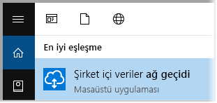
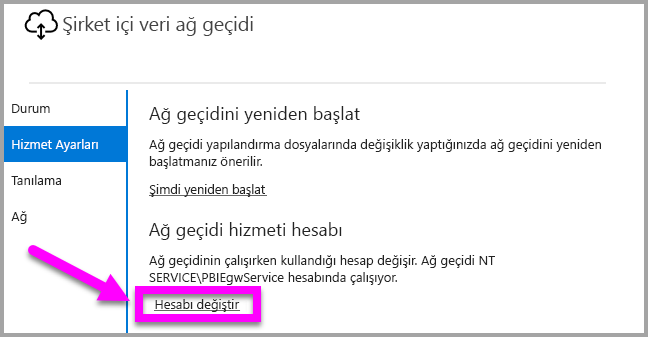
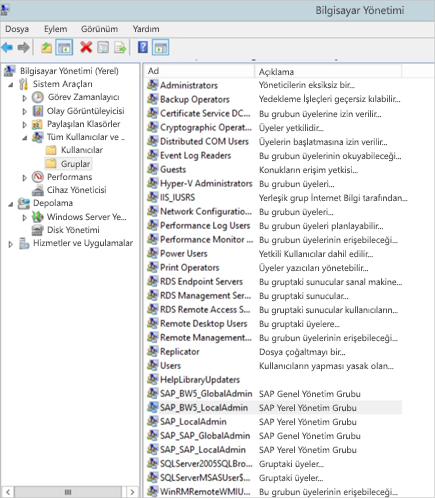
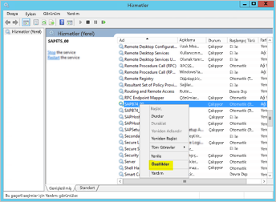
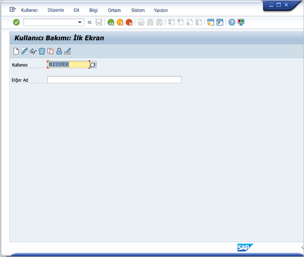
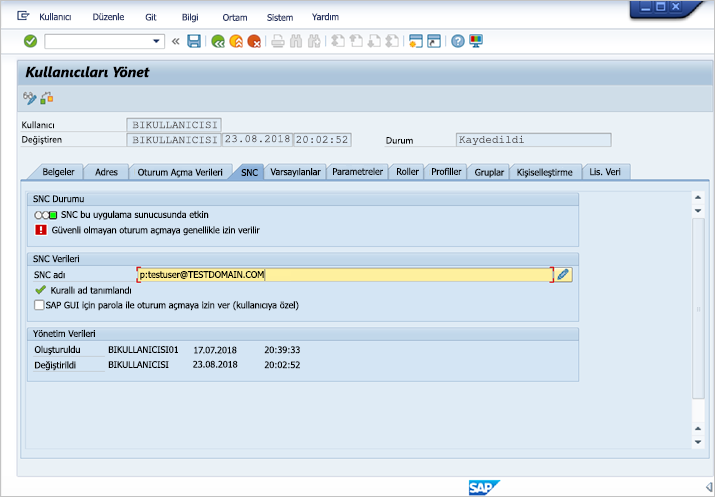
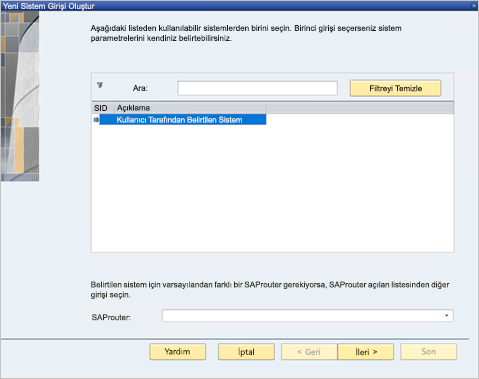
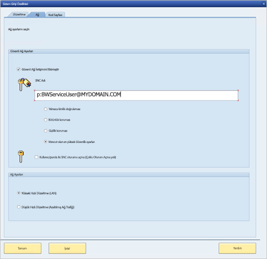
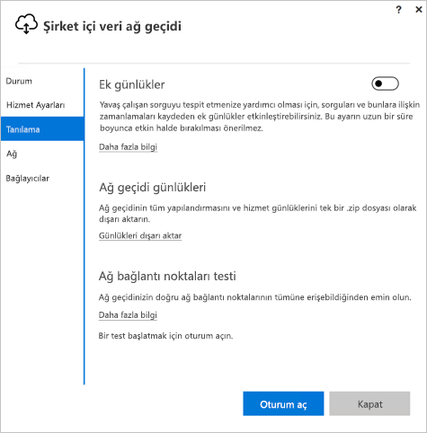
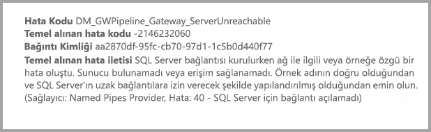

# <a name="use-kerberos-for-single-sign-on-sso-from-power-bi-to-on-premises-data-sources"></a>Power BI’dan şirket içi veri kaynaklarına kadar SSO (çoklu oturum açma) için Kerberos’u kullanma

Sorunsuz çoklu oturum açma bağlantısını etkinleştirmek için [Kerberos kısıtlanmış temsili](/windows-server/security/kerberos/kerberos-constrained-delegation-overview) kullanın. SSO'yu etkinleştirmek, Power BI raporlarının ve panolarının şirket içi kaynaklardan alınan verileri yenilemesini kolaylaştırır.

## <a name="supported-data-sources"></a>Desteklenen veri kaynakları

Şu an için aşağıdaki veri kaynakları desteklenmektedir:

* SQL Server
* SAP HANA
* SAP BW
* Teradata
* Spark
* Impala

[Security Assertion Markup Language (SAML)](service-gateway-sso-saml.md) ile SAP HANA desteği de sunuyoruz.

### <a name="sap-hana"></a>SAP HANA

SAP HANA için SSO'yu etkinleştirmek için öncelikle şu adımları gerçekleştirin:

* SAP HANA sunucusunun, gerekli olan en düşük sürümü çalıştırdığından emin olun. Bu sürüm, SAP HANA sunucusu platform düzeyinize bağlıdır:
  * [HANA 2 SPS 01 Rev 012.03](https://launchpad.support.sap.com/#/notes/2557386)
  * [HANA 2 SPS 02 Rev 22](https://launchpad.support.sap.com/#/notes/2547324)
  * [HANA 1 SP 12 Rev 122.13](https://launchpad.support.sap.com/#/notes/2528439)
* Ağ geçidi makinesine SAP'nin en son HANA ODBC sürücüsünü yükleyin.  Yükleyebileceğiniz minimum sürüm Ağustos 2017'de kullanıma sunulan HANA ODBC 2.00.020.00 sürümüdür.

Kerberos kullanarak SAP HANA için çoklu oturum açma işlemini ayarlama ve yapılandırmayla ilgili daha fazla bilgi edinmek üzere SAP HANA Güvenlik Kılavuzu’ndaki [Kerberos Kullanarak Çoklu Oturum Açma](https://help.sap.com/viewer/b3ee5778bc2e4a089d3299b82ec762a7/2.0.03/en-US/1885fad82df943c2a1974f5da0eed66d.html) konusuna ve bu sayfadaki bağlantılara (özellikle SAP Note 1837331 – HOWTO HANA DBSSO Kerberos/Active Directory]) bakın.

## <a name="preparing-for-kerberos-constrained-delegation"></a>Kerberos Kısıtlanmış Temsil için hazırlanma

Kerberos Kısıtlanmış Temsil'in düzgün bir şekilde çalışması için, hizmet hesaplarındaki *Hizmet Asıl Adlarının* (SPN) ve temsilci seçme ayarlarının da dahil olduğu belirli öğelerin yapılandırılması gerekir.

### <a name="prerequisite-1-install--configure-the-on-premises-data-gateway"></a>1. Önkoşul: Şirket içi veri ağ geçidini yükleme ve yapılandırma

Şirket içi veri ağ geçidinin bu sürümü, mevcut ağ geçitlerinin ayarlarını devralma özelliğinin yanı sıra yerinde yükseltmeyi destekler.

### <a name="prerequisite-2-run-the-gateway-windows-service-as-a-domain-account"></a>2. Önkoşul: Ağ geçidi Windows hizmetini bir etki alanı hesabı olarak çalıştırma

Standart bir yüklemede, ağ geçidi, aşağıdaki görüntüde gösterildiği gibi bir makine yerel hizmet hesabı olarak (özel olarak belirtmek gerekirse, *NT Service\PBIEgwService*) çalıştırılır:


Azure AD'niz yerel Active Directory hesabınız ile eşitlenmediği (Azure AD DirSync/Connect kullanılarak) sürece, **Kerberos Kısıtlanmış Temsil**'in etkinleştirilebilmesi için ağ geçidinin bir etki alanı hesabı olarak çalıştırılması gerekir. Hesabı bir etki alanı hesabı olarak değiştirmeniz gerekiyorsa bu makalenin [Ağ geçidini bir etki alanı hesabına geçirme](#switching-the-gateway-to-a-domain-account) bölümüne bakın.

> [!NOTE]
> Azure AD DirSync/Connect yapılandırılmış ve kullanıcı hesapları eşitlenmişse ağ geçidi hizmetinin çalışma zamanında yerel AD aramaları gerçekleştirmesi gerekmez ve ağ geçidi hizmeti için yerel Hizmet SID'sini (etki alanı hesabı gerekmeden) kullanabilirsiniz. Bu belgede açıklanan Kerberos Kısıtlanmış Temsil yapılandırmasına ilişkin adımlar söz konusu yapılandırmaya yönelik olanlarla aynıdır. (Tek değişiklik, etki alanı hesabı yerine Active Directory içindeki ağ geçidi bilgisayar nesnesine uygulanmış olmasıdır).

### <a name="prerequisite-3-have-domain-admin-rights-to-configure-spns-setspn-and-kerberos-constrained-delegation-settings"></a>3. Önkoşul: SPN'leri (SetSPN) ve Kerberos Kısıtlanmış Temsili ayarlarını yapılandırmak için etki alanı yöneticisi haklarını alma

Bir etki alanı yöneticisinin SPN'leri ve Kerberos temsilci seçme ayarlarını yapılandırma (etki alanı yöneticisi hakları gerekmeden) haklarını geçici veya kalıcı olarak başka bir kişiye vermesi teknik olarak mümkün olsa da bu yaklaşım önerilmez. Aşağıdaki bölümde, **3. Önkoşul** için gereken yapılandırma adımları ayrıntılı bir şekilde sunulmuştur.

## <a name="configuring-kerberos-constrained-delegation-for-the-gateway-and-data-source"></a>Ağ geçidi ve veri kaynağı için Kerberos Kısıtlanmış Temsil'i yapılandırma

Sistemi düzgün bir şekilde yapılandırmak için şu iki öğeyi yapılandırmamız veya doğrulamamız gerekir:

1. Gerekirse, ağ geçidi hizmeti etki alanı hesabı için bir SPN yapılandırın.

2. Ağ geçidi hizmeti etki alanı hesabında temsilci seçme ayarlarını yapılandırın.

Bu iki yapılandırma adımını uygulamak için bir etki alanı yöneticisi olmanız gerektiğini unutmayın.

Aşağıdaki bölümlerde bu adımlar sırasıyla açıklanmıştır.

### <a name="configure-an-spn-for-the-gateway-service-account"></a>Ağ geçidi hizmet hesabı için SPN yapılandırma

Öncelikle aşağıdaki adımları uygulayarak, ağ geçidi hizmet hesabı olarak kullanılan etki alanı hesabı için bir SPN yapılandırılmış olup olmadığını belirleyin:

1. **Active Directory Kullanıcıları ve Bilgisayarları**'nı etki alanı yöneticisi olarak başlatın.

2. Etki alanına sağ tıklayın, **Bul** seçeneğini belirleyin ve ağ geçidi hizmet hesabına ilişkin hesap adını yazın

3. Arama sonucunda, ağ geçidi hizmet hesabına sağ tıklayıp **Özellikler**'i seçin.

4. **Özellikler** iletişim kutusunda **Temsilci Seçme** sekmesi görünüyorsa SPN zaten oluşturulmuştur ve Temsilci Seçme ayarlarını yapılandırma ile ilgili bir sonraki alt bölüme geçebilirsiniz.

    **Özellikler** iletişim kutusunda **Temsilci Seçme** sekmesi bulunmuyorsa söz konusu hesapta elle SPN oluşturarak, **Temsilci Seçme** sekmesinin eklenmesini sağlayabilirsiniz (Bu, temsilci seçme ayarlarının yapılandırılması için izlenebilecek en kolay yoldur). SPN oluşturma işlemi, Windows ile birlikte gelen [SetSPN aracı](https://technet.microsoft.com/library/cc731241.aspx) kullanılarak gerçekleştirilebilir. (SPN'yi oluşturmak için etki alanı yöneticisi haklarına sahip olmanız gerekir.)

    Örneğin, ağ geçidi hizmet hesabının "PBIEgwTest\GatewaySvc", ağ geçidi hizmetinin çalıştırıldığı makinenin adının ise **Machine1** olduğunu varsayalım. Bu örnekteki makineye ilişkin ağ geçidi hizmet hesabına yönelik SPN'yi ayarlamak için aşağıdaki komutu çalıştırırsınız:

    

    Adım tamamlandığına göre, temsilci seçme ayarlarını yapılandırmaya geçebiliriz.

### <a name="configure-delegation-settings-on-the-gateway-service-account"></a>Ağ geçidi hizmet hesabında temsilci seçme ayarlarını yapılandırma

Ağ geçidi hizmet hesabındaki temsilci seçme ayarları ikinci yapılandırma gereksinimini oluşturur. Bu adımları uygulamak için kullanabileceğiniz birçok araç vardır. Bu makalede, dizindeki bilgileri yönetmek ve yayımlamak için kullanabileceğiniz bir Microsoft Yönetim Konsolu (MMC) ek bileşeni olan **Active Directory Kullanıcıları ve Bilgisayarları**'nı kullanacağız. Bu özellik etki alanı denetleyicilerinde varsayılan olarak bulunur. Bunu diğer makinelerdeki **Windows Özellikleri** yapılandırması aracılığıyla da etkinleştirebilirsiniz.

Protokol geçişi ile **Kerberos Kısıtlanmış Temsil**'i yapılandırmamız gerekir. Kısıtlanmış temsilde, temsilci olarak seçeceğiniz hizmetleri açıkça belirtmeniz gerekir. Örneğin ağ geçidi hizmet hesabınızdan yapılan temsilci çağrılarını yalnızca SQL Server veya SAP HANA sunucunuz kabul edecektir.

Bu bölümde, temel alınan veri kaynaklarınız (SQL Server, SAP HANA, Teradata, Spark vb.) için zaten SPN'ler yapılandırmış olduğunuz varsayılır. Söz konusu veri kaynağı sunucusu SPN'lerinin nasıl yapılandırılacağını öğrenmek için ilgili veritabanı sunucusuna yönelik teknik belgelere bakın. [*Uygulamanızın hangi SPN'yi gerektirdiği*](https://blogs.msdn.microsoft.com/psssql/2010/06/23/my-kerberos-checklist/) konusuna açıklık getiren blog gönderisine de göz atabilirsiniz.

Sıradaki adımlar için bir ağ geçidi makinesi ve SQL Server çalıştıran bir veritabanı olmak üzere iki makine içeren bir şirket içi ortamını kullanacağız. Bu örnek için ayrıca şu ayarların ve adların geçerli olduğunu varsayacağız:

* Ağ geçidi makine adı: **PBIEgwTestGW**
* Ağ geçidi hizmeti hesabı: **PBIEgwTest\GatewaySvc** (hesap görünen adı: Gateway Connector)
* SQL Server veri kaynağı makine adı: **PBIEgwTestSQL**
* SQL Server veri kaynağı hizmet hesabı: **PBIEgwTest\SQLService**

Bu örnek adlar ve ayarlar doğrultusunda yapılandırma adımları aşağıdaki gibi olur:

1. **Active Directory Kullanıcıları ve Bilgisayarları**'nı etki alanı yönetici haklarıyla başlatın.

2. Ağ geçidi hizmet hesabına (**PBIEgwTest\GatewaySvc**) sağ tıklayıp **Özellikler**'i seçin.

3. **Temsilci Seçme** sekmesini seçin.

4. **Bu bilgisayara yalnızca belirtilen hizmetlere temsilci seçmek için güven**'i seçin.

5. **Herhangi bir kimlik doğrulama protokolünü kullan**'ı seçin.

6. **Bu hesabın temsilci seçilen kimlik bilgilerini sunacağı hizmetler** bölümünde **Ekle**'yi seçin.

7. Yeni iletişim kutusunda **Kullanıcı/Bilgisayar**'ı seçin.

8. SQL Server Veritabanı hizmeti için hizmet hesabını (**PBIEgwTest\SQLService**) girin ve **Tamam**'ı seçin.

9. Veritabanı sunucusu için oluşturduğunuz SPN'yi seçin. Bizim örneğimizde, SPN **MSSQLSvc** ile başlar. Veritabanı hizmeti için hem FQDN hem de NetBIOS SPN'sini eklediyseniz her ikisini de seçin. Yalnızca birini görebilirsiniz.

10. **Tamam**'ı seçin. SPN'nin listede görünmesi gerekir.

11. İsterseniz **Genişletilmiş**'i seçerek hem FQDN hem de NetBIOS SPN'sini listede görebilirsiniz.

12. **Genişletilmiş**'i seçtiyseniz iletişim kutusu aşağıdakine benzer şekilde görünür. **Tamam**'ı seçin.

    

Son olarak, ağ geçidi hizmetinin çalıştırıldığı makinede (bizim örneğimizde, **PBIEgwTestGW**), ağ geçidi hizmet hesabına "Kimlik doğrulamasından sonra istemcinin özelliklerini al" yerel ilkesinin uygulanması gerekir. Bunu gerçekleştirmek/doğrulamak için Yerel Grup İlkesi Düzenleyicisi'ni (**gpedit**) kullanmanız gerekir.

1. Ağ geçidi makinesinde şunu çalıştırın: *gpedit.msc*.

1. Aşağıdaki görüntüde gösterildiği gibi, **Yerel Bilgisayar İlkesi > Bilgisayar Yapılandırması > Windows Ayarları > Güvenlik Ayarları > Yerel İlkeler > Kullanıcı Hakları Ataması** yolunu izleyin.

    

1. **Kullanıcı Hakları Ataması** bölümündeki ilke listesindeki **Kimlik doğrulamasından sonra istemcinin özelliklerini al** seçeneğini belirleyin.

    

    **Kimlik doğrulamasından sonra istemcinin özelliklerini al**'a sağ tıklayıp bu ilkenin **Özellikler**'ini açın ve hesap listesini kontrol edin. Ağ geçidi hizmet hesabını (**PBIEgwTest\GatewaySvc**) içermesi gerekir.

1. **Kullanıcı Hakları Ataması** bölümündeki ilke listesinde bulunan **İşletim sisteminin parçası gibi davran (SeTcbPrivilege)** seçeneğini belirleyin. Ağ geçidi hizmet hesabının da hesap listesinde yer aldığından emin olun.

1. **Şirket içi veri ağ geçidi** hizmet işlemini yeniden başlatın.

SAP HANA kullanıyorsanız az da olsa performans artışı sağlayabilecek aşağıdaki ek adımları gerçekleştirmenizi öneririz.

1. Ağ geçidi yükleme dizininde şu yapılandırma dosyasını bulun ve açın: *Microsoft.PowerBI.DataMovement.Pipeline.GatewayCore.dll.config*.

1. *FullDomainResolutionEnabled* özelliğini bulun ve değerini *True* olarak değiştirin.

    ```xml
    <setting name=" FullDomainResolutionEnabled " serializeAs="String">
          <value>True</value>
    </setting>
    ```

## <a name="running-a-power-bi-report"></a>Power BI raporu çalıştırma

Bu makalede daha önce açıklanan tüm yapılandırma adımları tamamlandıktan sonra, veri kaynağını yapılandırmak için Power BI'daki **Ağ Geçitlerini Yönet** sayfasını kullanabilirsiniz. Sayfadaki **Gelişmiş Ayarlar** bölümünde SSO'yu etkinleştirip söz konusu veri kaynağına bağlı raporlar ve veri kümeleri yayımlayabilirsiniz.


Bu yapılandırma çoğu durumda çalışır. Ancak, ortamınıza bağlı olarak Kerberos ile farklı yapılandırmalar da söz konusu olabilir. Rapor hâlâ yüklenmiyorsa sorunun daha ayrıntılı bir şekilde incelenmesi için etki alanı yöneticinizle iletişime geçmeniz gerekir.

## <a name="switching-the-gateway-to-a-domain-account"></a>Ağ geçidini bir etki alanı hesabına geçirme

Bu makalenin önceki bölümlerinde, **Şirket içi veri ağ geçidi** kullanıcı arabirimini kullanarak ağ geçidini, yerel bir hizmet hesabı yerine etki alanı hesabı olarak çalıştırılacak şekilde değiştirme konusuna değinmiştik. Bunu gerçekleştirmek için gereken adımlar aşağıda verilmiştir.

1. **Şirket içi veri ağ geçidi** yapılandırma aracını başlatın.

   

2. Ana sayfadaki **Oturum aç** düğmesini seçin ve Power BI hesabınızla oturum açın.

3. Oturum açma işlemi tamamlandıktan sonra **Hizmet Ayarları** sekmesini seçin.

4. Aşağıdaki görüntüde gösterildiği gibi **Hesabı değiştir** seçeneğini belirleyerek destekli kılavuzu başlatın.

   

## <a name="configuring-sap-bw-for-sso"></a>SAP BW'de SSO yapılandırması

Kerberos'un bir ağ geçidiyle nasıl çalıştığını anladığınıza göre artık SAP Business Warehouse (SAP BW) ortamınız için SSO yapılandırması gerçekleştirebilirsiniz. Aşağıdaki adımlarda bu makalenin önceki bölümlerinde anlatılan şekilde [Kerberos kısıtlanmış temsili için hazırlandığınız](#preparing-for-kerberos-constrained-delegation) kabul edilmektedir.

Bu kılavuz mümkün olduğunca kapsamlı olmaya çalışır. Bu adımlardan bazılarını önceden tamamladıysanız, atlayabilirsiniz: Örneğin BW sunucunuz için zaten bir Hizmet Kullanıcısı oluşturup kullanıcıya bir SPN eşlemiş veya gsskrb5 kitaplığını zaten yüklemiş olabilirsiniz.

### <a name="setup-gsskrb5-on-client-machines-and-the-bw-server"></a>İstemci makinelerinde ve BW sunucusunda gsskrb5 kurulumu

> [!NOTE]
> gsskrb5 artık SAP tarafından etkin olarak desteklenmiyor. Daha fazla bilgi için bkz. [SAP Notu 352295](https://launchpad.support.sap.com/#/notes/352295). Ayrıca gsskrb5'in Veri Ağ Geçidi'nden BW İleti Sunucularına SSO bağlantılarına izin vermediğini de aklınızda bulundurun. Yalnızca BW Uygulama Sunucularıyla bağlantı kurulabilir.

Ağ geçidi üzerinden bir SSO bağlantısını tamamlamak için gsskrb5’in hem istemci hem de sunucu tarafından kullanımda olması gerekir. Ortak Şifreleme Kitaplığı (sapcrypto) şu anda desteklenmemektedir.

1. gsskrb5/gx64krb5 bileşenlerini [SAP Note 2115486](https://launchpad.support.sap.com/) sayfasından indirin (SAP s-user gerekir). gsskrb5.dll ve gx64krb5.dll dosyalarının en az 1.0.11.x sürümüne sahip olduğunuzdan emin olun.

1. Kitaplığı ağ geçidi makinenizde ağ geçidi örneğinizin erişebileceği bir yere yerleştirin (SSO bağlantısını SAP GUI/Logon kullanarak test etmek istiyorsanız SAP GUI tarafından da erişilebilir durumda olması gerekir).

1. Bir kopyasını da BW sunucusu makinenize, BW sunucusu tarafından erişilebilecek bir konuma yerleştirin.

1. İstemci ve sunucu makinelerinde SNC\_LIB ve SNC\_LIB\_64 ortam değişkenlerini gsskrb5.dll ve gx64krb5.dll dosyalarının konumlarını gösterecek şekilde ayarlayın.

### <a name="create-a-bw-service-user-and-enable-snc-communication-using-gsskrb5-on-the-bw-server"></a>BW Hizmet Kullanıcısı oluşturma ve BW sunucusundaki gsskrb5’i kullanarak SNC iletişimini etkinleştirme

Tamamladığınız ağ geçidi yapılandırmasına ek olarak gerçekleştirmeniz gereken SAP BW hizmetine özgü birkaç adım vardır. Belgenin [**Ağ geçidi hizmet hesabında temsilci seçme ayarlarını yapılandırma**](#configure-delegation-settings-on-the-gateway-service-account) bölümünde bağlı veri kaynaklarınız için SPN yapılandırmasını tamamlamış olduğunuz kabul edilmektedir. Bu SAP BW yapılandırmasını tamamlamak için:

1. Active Directory Etki Alanı Denetleyicisi sunucusunda, Active Directory ortamınızdaki BW Uygulama Sunucusu için bir Hizmet Kullanıcısı (başlangıçta normal bir Active Directory kullanıcısı) oluşturun. Ardından bu kullanıcıya bir SPN atayın.

    SAP, SPN’nin SAP/ ile başlatılmasını önerir ancak HTTP/ gibi diğer ön eklerin kullanılması da mümkündür. SAP/ ifadesinin sonrasını istediğiniz şekilde belirleyebilirsiniz. Seçeneklerden biri, BW hizmetinin Hizmet Kullanıcısı kullanıcı adını kullanmaktır. Örneğin Hizmet Kullanıcısı olarak BWServiceUser@\<ETKİ ALANI\> adlı bir kullanıcı oluşturuyorsanız SPN SAP/BWServiceUser girişini kullanabilirsiniz. SPN eşlemesini ayarlama yöntemlerinden biri setspn komutudur. Örneğin yeni oluşturduğunuz hizmet kullanıcısında SPN ayarlamak için Etki Alanı Denetleyicisi makinesindeki bir komut penceresinden şu komutu yürütmeniz gerekir: `setspn -s SAP/ BWServiceUser DOMAIN\ BWServiceUser`. Daha fazla bilgi için SAP BW belgelerine bakın.

1. Hizmet Kullanıcısına BW Uygulama Sunucusu için erişim verin:

    1. BW sunucu makinesinde Hizmet Kullanıcısını BW sunucunuzun Yerel Yönetici grubuna ekleyin: Bilgisayar Yönetimi programını açıp sunucunuzun Yerel Yönetici grubuna çift tıklayın.

        

    1. Yerel Yönetici grubuna çift tıklayın ve ardından **Ekle**'yi seçerek BW Hizmet Kullanıcınızı gruba ekleyin. Adı doğru yazdığınızdan emin olmak için **Adları Denetle** düğmesini kullanın. **Tamam**'ı seçin.

1. BW sunucusunun Hizmet Kullanıcısını, BW sunucusu makinesinde BW sunucusu hizmetini başlatan kullanıcı olarak ayarlayın.

    1. "Çalıştır" programını açıp "Services.msc" yazın. BW Uygulama Sunucusu örneğinize karşılık gelen hizmeti bulun. Sağ tıklayıp **Özellikler**'i seçin.

        

    1. **Oturum aç** sekmesine geçin ve kullanıcıyı yukarıda belirtilen şekilde BW Hizmet Kullanıcınız olarak değiştirin. Kullanıcının parolasını girin ve **Tamam**'ı seçin.

1. SAP GUI/Logon uygulamasında sunucunuzda oturum açın ve RZ10 işlemini kullanarak aşağıdaki profil parametrelerini ayarlayın:

    1. snc/identity/as profil parametresini p:\<oluşturduğunuz BW hizmeti kullanıcısı\> olarak ayarlayın, örneğin: p:BWServiceUser@MYDOMAIN.COM. Hizmet Kullanıcısının UPN’sinden önce gelen p: değerini not edin; bu değer, Ortak Şifreleme Kitaplığı SNC kitaplığı olarak kullanıldığında görülen p:CN= değildir.

    1. snc/gssapi\_lib profil parametresini \<sunucu makinesindeki gsskrb5.dll/gx64krb5.dll dosyasının yolu (kullanacağınız kitaplık işletim sisteminin bit değerine göre değişir\> olarak ayarlayın. Kitaplığı BW Uygulama Sunucusunun erişebileceği bir konuma yerleştirmeyi unutmayın.

    1. Ayrıca aşağıdaki ek profil parametrelerini de ayarlayın ve değerleri ihtiyaçlarınıza uyacak şekilde değiştirin. Son beş seçeneğin, istemcilerin SNC yapılandırılmadan SAP Logon/GUI aracılığıyla BW sunucusuna bağlanmasını sağlayacağını unutmayın.

        | **Ayar** | **Değer** |
        | --- | --- |
        | snc/data\_protection/max | 3 |
        | snc/data\_protection/min | 1 |
        | snc/data\_protection/use | 9 |
        | snc/accept\_insecure\_cpic | 1 |
        | snc/accept\_insecure\_gui | 1 |
        | snc/accept\_insecure\_r3int\_rfc | 1 |
        | snc/accept\_insecure\_rfc | 1 |
        | snc/permit\_insecure\_start | 1 |

    1. snc/enable özelliğini 1 olarak ayarlayın.

1. Bu profil parametrelerini ayarladıktan sonra sunucu makinesinde SAP Management Console uygulamasını açın ve BW örneğini yeniden başlatın. Sunucu başlatılmazsa profil parametrelerini kontrol edip doğru ayarladığınızdan emin olun. Profil parametresi ayarları hakkında daha fazla bilgi için [SAP belgelerine](https://help.sap.com/saphelp_nw70ehp1/helpdata/en/e6/56f466e99a11d1a5b00000e835363f/frameset.htm) bakın. Sorunla karşılaşmanız halinde bu bölümün sonraki kısımlarında yer alan sorun giderme bilgilerine de başvurabilirsiniz.

### <a name="map-a-bw-user-to-an-active-directory-user"></a>BW kullanıcısını Active Directory kullanıcısıyla eşleme

Bir Active Directory kullanıcısını bir SAP BW Uygulama Sunucusu kullanıcısıyla eşleşin ve SAP GUI/Logon ile SSO bağlantısını test edin.

1. SAP GUI/Logon uygulamasını kullanarak BW sunucunuzda oturum açın. SU01 işlemini yürütün.

1. **Kullanıcı** alanına SSO bağlantılarını etkinleştirmek istediğiniz BW kullanıcısını girin (yukarıdaki ekran görüntüsünde BIUSER kullanıcısının izinleri ayarlanmaktadır). SAP Logon penceresinin sol üst köşesindeki **Düzenle** simgesini (kalem görüntüsü) seçin.

    

1. **SNC** sekmesini seçin. SNC ad giriş kutusuna p:\<Active Directory kullanıcınız\>@\<etki alanınız\> şeklinde giriş yapın. Active Directory kullanıcısının UPN değerinden önce p: ifadesinin kullanılması gerektiğini unutmayın. Belirttiğiniz Active Directory kullanıcısının BW Uygulama Sunucusu için SSO erişimini etkinleştirmek istediğiniz kişiye veya kuruluşa ait olması gerekir. Örneğin [testuser@TESTDOMAIN.COM](mailto:testuser@TESTDOMAIN.COM) adlı kullanıcı için SSO erişimini etkinleştirmek istiyorsanız p:testuser@TESTDOMAIN.COM yazın.

    

1. Kaydetme simgesini (ekranın sol üst köşesindeki disket) seçin.

### <a name="test-sign-in-using-sso"></a>SSO kullanarak oturum açmayı sınama

SSO erişimini etkinleştirmiş olduğunuz Active Directory kullanıcısı olarak SAP Logon/SAP GUI kullanarak SSO aracılığıyla sunucuda oturum açabildiğinizi doğrulayın.

1. SAP Logon uygulamasının yüklü olduğu makinede *SSO erişimini etkinleştirmiş olduğunuz Active Directory kullanıcısı olarak* oturum açın ve SAP GUI/Logon uygulamasını çalıştırın. Yeni bağlantı oluşturun.

1. **Yeni Sistem Girişi Oluştur** penceresinde **Kullanıcı Tarafından Belirtilen Sistem**'i ve **İleri**'yi seçin.

    

1. Sonraki sayfada uygulama sunucusu, örnek sayısı ve sistem kimliği gibi gerekli bilgileri girdikten sonra **Son**'u seçin.

1. Yeni bağlantıya sağ tıklayın ve **Özellikler**'i seçin. **Ağ** sekmesini seçin. **SNC Adı** penceresinde p:BWServiceUser@MYDOMAIN.COM gibi bir p:\<BW hizmet kullanıcısı UPN'si\> girin, ardından **Tamam**’ı seçin.

    

1. Yeni oluşturduğunuz bağlantıya çift tıklayarak BW sunucunuzla bir SSO bağlantısı kurmayı deneyin. Bu bağlantı başarılı olursa bir sonraki adıma geçin. Aksi takdirde belgenin önceki adımlarını gözden geçirerek doğru şekilde tamamlandığından emin olun veya aşağıdaki sorun giderme bölümünü inceleyin. Bu bağlamda SSO ile BW sunucusuna bağlanamıyorsanız ağ geçidi bağlamında da SSO ile BW sunucusuna bağlanamazsınız.

### <a name="troubleshoot-installation-and-connections"></a>Yükleme ve bağlantı sorunlarını giderme

Herhangi bir sorunla karşılaşırsanız aşağıdaki gsskrb5 yükleme ve SAP GUI/Logon uygulamasından SSO bağlantısı sorun giderme adımlarını izleyin.

1. Sunucu günlüklerini (sunucu makinesinde …work\dev\_w0 dizini) gsskrb5 kurulum adımlarını tamamlama sırasında karşılaştığınız hataları giderme konusunda yardımcı olabilir. Günlükler özellikle profil parametreleri değiştirildikten sonra BW sunucusunun başlatılmaması konusunda destek sunabilir.

1. "Oturum açma hatası" nedeniyle BW hizmetini başlatamıyorsanız BW "başlatma kullanıcısı" ayarlarında yanlış parolayı kullanmış olabilirsiniz. Active Directory ortamınızdaki bir makinede BW hizmet kullanıcısı olarak oturum açarak parolayı doğrulayın.

1. Sunucunun başlatılmasını önleyen SQL kimlik bilgileriyle ilgili hata alıyorsanız Hizmet Kullanıcısına BW veritabanına erişim izni verdiğinizi doğrulayın.

1. "(GSS-API) belirtilen hedef bilinmiyor veya erişilemiyor": Bu hata genellikle hatalı SNC Adı değerinin belirtildiğini gösterir. İstemci uygulamasında "p:CN=" değil yalnızca "p:" ve Hizmet Kullanıcısının UPN bilgisini kullandığınızdan emin olun.

1. "(GSS-API) Geçersiz bir ad sağlandı": Sunucunun SNC kimlik profili parametresindeki değerde "p:" ifadesinin bulunduğundan emin olun.

1. "(SNC hatası) Belirtilen modül bulunamadı": Bu hata genellikle gsskrb5.dll/gx64krb5.dll dosyasının erişim için yükseltilmiş ayrıcalık (yönetici hakları) gereken bir yere yerleştirilmesinden kaynaklanır.

### <a name="add-registry-entries-to-the-gateway-machine"></a>Ağ geçidi makinesine kayıt defteri girişleri ekleme

Ağ geçidinin yüklü olduğu makinenin kayıt defterine gerekli kayıt defteri girişlerini ekleyin.

1. Bir cmd penceresinde şu komutları yürütün:

    1. REG ADD HKLM\SOFTWARE\Wow6432Node\SAP\gsskrb5 /v ForceIniCredOK /t REG\_DWORD /d 1 /f

    1. REG ADD HKLM\SOFTWARE\SAP\gsskrb5 /v ForceIniCredOK /t REG\_DWORD /d 1 /f

### <a name="set-configuration-parameters-on-the-gateway-machine"></a>Ağ geçidi makinesinde yapılandırma parametrelerini ayarlama

Kullanıcıların Power BI hizmetinde bir Azure AD kullanıcısı olarak oturum açabilmesi için yapılandırılmış bir Azure AD DirSync olup olmadığına bağlı olarak, yapılandırma parametrelerini iki şekilde ayarlayabilirsiniz.

Azure AD DirSync yapılandırılmışsa aşağıdaki adımları izleyin.

1. Ana Ağ Geçidi yapılandırma dosyası olan *Microsoft.PowerBI.DataMovement.Pipeline.GatewayCore.dll* dosyasını açın. Bu dosya varsayılan olarak *C:\Program Files\On-premises data gateway* konumunda bulunur.

1. **FullDomainResolutionEnabled** özelliğinin True ve **SapHanaSsoRemoveDomainEnabled** değerinin False olarak ayarlandığından emin olun.

1. Yapılandırma dosyasını kaydedin.

1. Görev Yöneticisi'nin Hizmetler sekmesinden Ağ geçidi hizmetini başlatın (sağ tıklayıp Yeniden başlat'a tıklayın)

    

Azure AD DirSync yapılandırılmamışsa, **bir Azure AD kullanıcısıyla eşlemek istediğiniz her Power BI hizmeti kullanıcısı** için bu adımları izleyin. Bu adımlar bir Power BI Hizmeti kullanıcısını, BW’de oturum açma iznine sahip bir Active Directory kullanıcısına el ile bağlar.

1. Ana ağ geçidi yapılandırma dosyası olan Microsoft.PowerBI.DataMovement.Pipeline.GatewayCore.dll dosyasını açın. Bu dosya varsayılan olarak C:\Program Files\On-premises data gateway konumunda bulunur.

1. **ADUserNameLookupProperty** özelliğini msDS-cloudExtensionAttribute1, **ADUserNameReplacementProperty** özelliğini de SAMAccountName değerine ayarlayın. Yapılandırma dosyasını kaydedin.

1. Görev Yöneticisi'nin **Hizmetler** sekmesinden Ağ geçidi hizmetini başlatın (sağ tıklayıp **Yeniden başlat**'a tıklayın).

    

1. Bir BW kullanıcısıyla eşlemiş olduğunuz Active Directory kullanıcısının msDS-cloudExtensionAttribute1 özelliğini Kerberos SSO hizmetini etkinleştirmek istediğiniz Power BI hizmeti kullanıcısı olarak ayarlayın. msDS-cloudExtensionAttribute1 özelliğini ayarlama yöntemlerinden biri, Active Directory Kullanıcılar ve Bilgisayarlar MMC ek bileşenidir (başka yöntemler de kullanılabilir).

    1. Etki Alanı Denetleyicisi makinesinde yönetici kullanıcı olarak oturum açın.

    1. Ek bileşen penceresinde **Kullanıcılar** klasörünü açın ve bir BW kullanıcısıyla eşlemiş olduğunuz Active Directory kullanıcısına çift tıklayın.

    1. **Öznitelik Düzenleyicisi** sekmesini seçin.

        Bu sekmeyi görmüyorsanız etkinleştirme yönergelerini izlemeniz veya msDS-cloudExtensionAttribute1 özelliğini ayarlamak için başka bir yöntem kullanmanız gerekir. Özniteliklerden birini seçtikten sonra 'm' tuşuna basarak 'm' harfiyle başlayan Active Directory özelliklerine gidin. msDS-cloudExtensionAttribute1 özelliğini bulun ve çift tıklayın. Değeri, Power BI hizmetinde oturum açmak için kullandığınız YourUser@YourDomain biçimindeki kullanıcı adıyla değiştirin.

    1. **Tamam**'ı seçin.

        

    1. **Apply** (Uygula) seçeneğini belirleyin. Değer sütununda doğru değerin göründüğünden emin olun.

### <a name="add-a-new-bw-application-server-data-source-to-the-power-bi-service"></a>Power BI hizmetine yeni bir BW Uygulama Sunucusu veri kaynağı ekleme

BW veri kaynağını ağ geçidinize ekleyin: Bu makalenin önceki bölümlerinde yer alan [rapor çalıştırma](#running-a-power-bi-report) yönergelerini izleyin.

1. Veri kaynağı yapılandırma penceresinde Uygulama Sunucusunun **Ana bilgisayar adı**, **Sistem Numarası** ve **İstemci Kimliği** bilgilerini Power BI Desktop'tan BW sunucusunda oturum açar gibi girin. **Kimlik Doğrulama Yöntemi** olarak **Windows**'u seçin.

1. **SNC İş Ortağı Adı** alanına p:\<BW Hizmet Kullanıcınızla eşlediğiniz SPN\> değerini girin. Örneğin, SPN SAP/BWServiceUser@MYDOMAIN.COM ise **SNC İş Ortağı Adı** alanına p:SAP/BWServiceUser@MYDOMAIN.COM girmeniz gerekir.

1. SNC Kitaplığı alanında SNC\_LIB veya SNC\_LIB\_64 değerini seçin.

1. **Kullanıcı Adı** ve **Parola**, BW sunucusunda SSO aracılığıyla oturum açma izinlerine sahip olan bir Active Directory kullanıcısının kullanıcı adı ve parolası olmalıdır (SU01 işlemiyle bir BW kullanıcısıyla eşlenmiş bir Active Directory kullanıcısı). Bu kimlik bilgileri yalnızca **DirectQuery sorguları için Kerberos üzerinden SSO kullanın** kutusu işaretli *olmadığında* kullanılır.

1. **DirectQuery sorguları için Kerberos üzerinden SSO kullanın** kutusunu ve **Uygula**'yı seçin. Bağlantı testi başarılı olmazsa önceki kurulum ve yapılandırma adımlarının doğru şekilde tamamlandığından emin olun.

    Ağ geçidi, sunucuyla bir test bağlantısı kurmak ve içeri aktarma temelli raporların planlı yenilemelerini yapmak için her zaman girilen kimlik bilgilerini kullanır. Ağ geçidi yalnızca **DirectQuery sorguları için Kerberos üzerinden SSO kullanın** seçeneği işaretliyse bir SSO bağlantısı kurmaya çalışır.

### <a name="test-your-setup"></a>Ayarları test etme

Ayarlarınızı test etmek için Power BI Desktop'tan Power BI hizmetine bir DirectQuery raporu yayımlayın. Power BI hizmetinde bir Azure AD kullanıcısı ya da bir Azure AD kullanıcısının msDS-cloudExtensionAttribute1 özelliğine eşlediğiniz kullanıcı olarak oturum açtığınızdan emin olun. Kurulum başarıyla tamamlandıysa Power BI hizmetinde yayımlanan veri kümesiyle bir rapor oluşturabilmeniz ve rapordaki görseller aracılığıyla veri çekebilmeniz gerekir.

### <a name="troubleshooting-gateway-connectivity-issues"></a>Ağ Geçidi Bağlantı Sorunlarını Giderme

1. Ağ geçidi günlüklerini kontrol edin. Ağ Geçidi Yapılandırması uygulamasını açın, **Tanılama**'yı ve ardından **Günlükleri dışarı aktar**'ı seçin. En güncel hatalar, incelediğiniz günlük dosyalarının el altında olacaktır.

    

1. BW izlemeyi açın ve oluşturulan günlük dosyalarını inceleyin. Birçok farklı BW izleme türü vardır. Daha fazla bilgi için SAP belgelerine başvurun.

## <a name="errors-from-an-insufficient-kerberos-configuration"></a>Yetersiz bir Kerberos yapılandırmasından kaynaklanan hatalar

Temel alınan veritabanı sunucusu ve ağ geçidi **Kerberos Kısıtlanmış Temsil** için düzgün bir şekilde yapılandırılmamışsa şu hata iletisini alabilirsiniz:


Hata iletisiyle (DM_GWPipeline_Gateway_ServerUnreachable) ilişkili teknik ayrıntılar ise aşağıdaki gibi görünebilir:



Bu ağ geçidinin kaynak kullanıcının kimliğine düzgün bir şekilde bürünememesinden ve veritabanı bağlantısı girişiminin başarısız olmasından kaynaklanır.

## <a name="next-steps"></a>Sonraki adımlar

**Şirket içi veri ağ geçidi** ve **DirectQuery** hakkında daha fazla bilgi için aşağıdaki kaynaklara göz atın:

* [Şirket içi veri ağ geçidi](service-gateway-onprem.md)
* [Power BI'da DirectQuery](desktop-directquery-about.md)
* [DirectQuery tarafından desteklenen veri kaynakları](desktop-directquery-data-sources.md)
* [DirectQuery ve SAP BW](desktop-directquery-sap-bw.md)
* [DirectQuery ve SAP HANA](desktop-directquery-sap-hana.md)