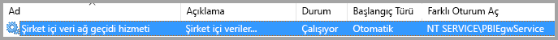
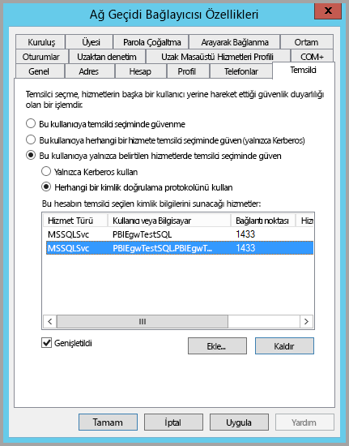
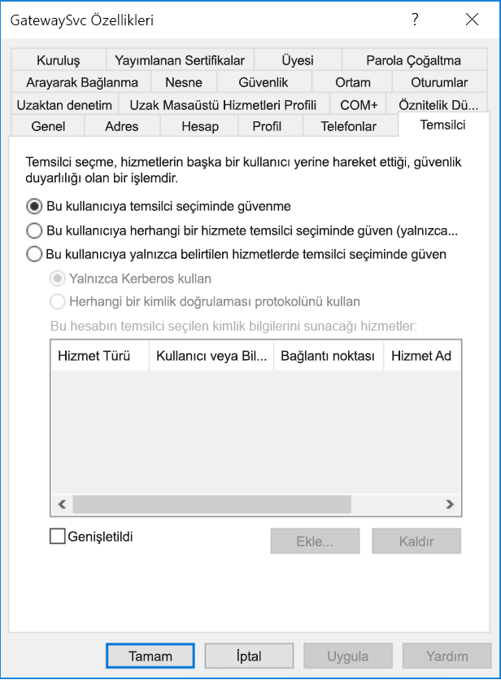
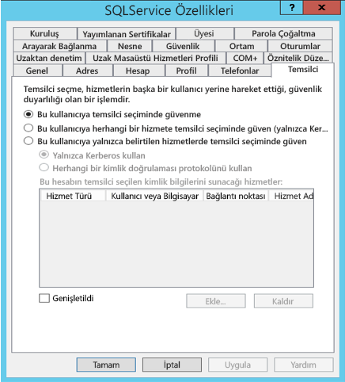
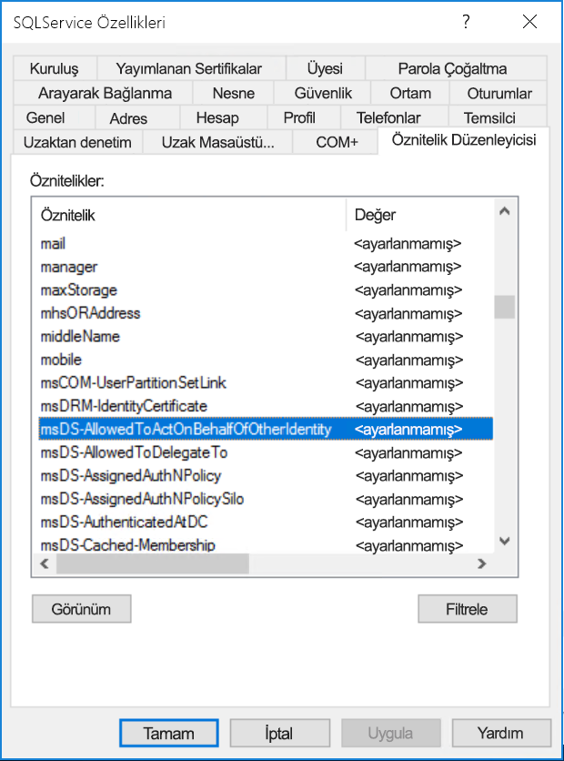
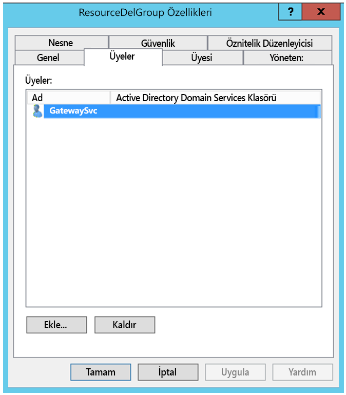
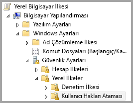
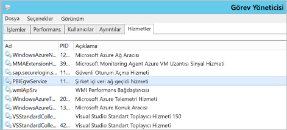
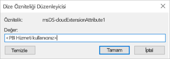
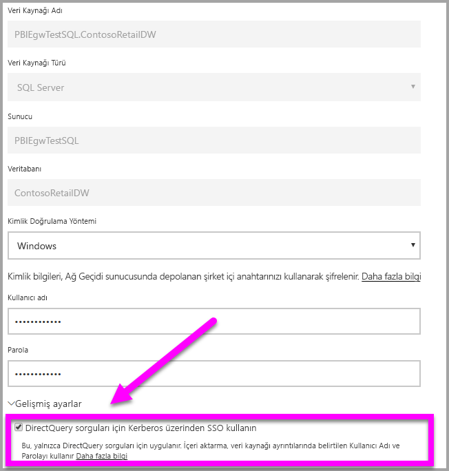

# <a name="configure-kerberos-based-sso-from-power-bi-service-to-on-premises-data-sources"></a>Power BI hizmetinden şirket içi veri kaynaklarına Kerberos tabanlı SSO yapılandırma

SSO'yu etkinleştirmek, Power BI raporlarının ve panolarının şirket içi kaynaklardan alınan verileri yenilemesini kolaylaştırırken bu kaynaklarda yapılandırılmış kullanıcı düzeyi izinlerine de uyar. [Kerberos kısıtlanmış temsili](/windows-server/security/kerberos/kerberos-constrained-delegation-overview) kullanarak, sorunsuz SSO bağlantısını etkinleştirin. 

## <a name="prerequisites"></a>Önkoşullar

Kerberos kısıtlanmış temsilinin düzgün bir şekilde çalışması için, hizmet hesaplarındaki _Hizmet Asıl Adlarının_ (SPN) ve temsilci seçme ayarlarının da dahil olduğu belirli öğelerin yapılandırılması gerekir.

### <a name="install-and-configure-the-microsoft-on-premises-data-gateway"></a>Microsoft şirket içi veri ağ geçidini yükleme ve yapılandırma

Şirket içi veri ağ geçidi, yerinde yükseltmeyi ve mevcut ağ geçitlerinin _ayarlarını devralma_ özelliğini destekler.

### <a name="run-the-gateway-windows-service-as-a-domain-account"></a>Ağ geçidi Windows hizmetini bir etki alanı hesabı olarak çalıştırma

Standart bir yüklemede, ağ geçidi bir makine yerel hizmet hesabı (**NT Service\PBIEgwService**) olarak çalıştırılır.



Azure Active Directory (Azure AD) örneğiniz (Azure AD DirSync/Connect kullanılarak) yerel Active Directory örneğiniz ile eşitlenmediği sürece, Kerberos kısıtlanmış temsilinin etkinleştirilebilmesi için ağ geçidinin bir etki alanı hesabı olarak çalıştırılması gerekir. Bir etki alanı hesabına geçmek için bkz. [Ağ geçidi hizmeti hesabını değiştirme](/data-integration/gateway/service-gateway-service-account).

> [!NOTE]
> Azure AD Connect yapılandırıldıysa ve kullanıcı hesapları eşitlendiyse, ağ geçidi hizmetinin çalışma zamanında yerel Azure AD aramaları yapması gerekmez. Bunun yerine, Azure AD'de gerekli olan tüm yapılandırmayı tamamlamak için ağ hizmetinin yerel hizmet SID’sini de kullanabilirsiniz. Bu belgede açıklanan Kerberos kısıtlanmış temsili yapılandırmasına ilişkin adımlar, Azure AD bağlamında gereken yapılandırma adımlarıyla aynıdır. Bunlar, etki alanı hesabının yerine Azure AD’deki ağ geçidinin bilgisayar nesnesine (yerel hizmet SID’si ile tanımlanır) uygulanır.

## <a name="obtain-domain-admin-rights-to-configure-spns-setspn-and-kerberos-constrained-delegation-settings"></a>SPN'leri (SetSPN) ve Kerberos kısıtlanmış temsili ayarlarını yapılandırmak için etki alanı yöneticisi haklarını alma

SPN'leri ve Kerberos temsili ayarlarını yapılandırmak için, etki alanı yöneticisinin etki alanı yöneticisi haklarına sahip olmayan bir kişiye haklar vermekten kaçınması gerekir. Aşağıdaki bölümde, önerilen yapılandırma adımlarını daha ayrıntılı bir biçimde inceleyeceğiz.

## <a name="configure-kerberos-constrained-delegation-for-the-gateway-and-data-source"></a>Ağ geçidi ve veri kaynağı için Kerberos kısıtlanmış temsilini yapılandırma

Gerekirse, etki alanı yöneticisi olarak ağ geçidi hizmeti etki alanı hesabı için bir SPN yapılandırın ve ağ geçidi hizmeti etki alanı hesabında temsilci seçme ayarlarını yapılandırın.

### <a name="configure-an-spn-for-the-gateway-service-account"></a>Ağ geçidi hizmet hesabı için SPN yapılandırma

Öncelikle, ağ geçidi hizmet hesabı olarak kullanılan etki alanı hesabı için bir SPN yapılandırılmış olup olmadığını belirleyin:

1. Etki alanı yöneticisi olarak, **Active Directory Kullanıcıları ve Bilgisayarları** Microsoft Yönetim Konsolu (MMC) ek bileşenini başlatın.

2. Sol bölmeden etki alanı adına sağ tıklayın, **Bul** seçeneğini belirleyin ve ağ geçidi hizmet hesabına ilişkin hesap adını girin.

3. Arama sonucunda, ağ geçidi hizmet hesabına sağ tıklayın ve **Özellikler**'i seçin.

4. **Özellikler** iletişim kutusunda **Temsilci Seçme** sekmesi görünüyorsa SPN zaten oluşturulmuştur ve [Kullanılacak Kerberos kısıtlanmış temsilinin türüne karar verme](#decide-on-the-type-of-kerberos-constrained-delegation-to-use) bölümüne geçebilirsiniz.

5. **Özellikler** iletişim kutusunda **Temsilci Seçme** sekmesi yoksa, bu hesapta elle SPN oluşturarak etkinleştirebilirsiniz. Windows ile birlikte gelen [setspn aracını](https://technet.microsoft.com/library/cc731241.aspx) kullanın. (SPN'yi oluşturmak için etki alanı yöneticisi haklarına sahip olmanız gerekir.)

   Örneğin, ağ geçidi hizmet hesabının **Contoso\GatewaySvc**, ağ geçidi hizmetinin çalıştığı makinenin adının ise **MyGatewayMachine** olduğunu kabul edelim. Ağ geçidi hizmet hesabına yönelik SPN'yi ayarlamak için aşağıdaki komutu çalıştırın:

   ```setspn -a gateway/MyGatewayMachine Contoso\GatewaySvc```

   **Active Directory Kullanıcıları ve Bilgisayarları** MMC ek bileşenini kullanarak SPN ayarı da yapabilirsiniz.
   
### <a name="add-gateway-service-account-to-windows-authorization-and-access-group-if-required"></a>Gerekirse Windows Yetkilendirme ve Erişim Grubu'na ağ geçidi hizmet hesabı ekleme

Bazı senaryolarda Windows Yetkilendirme ve Erişim Grubu'na ağ geçidi hizmet hesabı eklenmesi gerekir. Bu senaryolar Active Directory ortamının güvenliğini güçlendirme çalışması ve ağ geçidi hizmet hesabıyla ağ geçidinin kimliğine bürüneceği kullanıcı hesaplarının ayrı etki alanlarında veya ormanlarda olduğu durumlardır. Ayrıca etki alanının / ormanın güçlendirilmediği ama bunun gerekli olmadığı durumlarda da Windows Yetkilendirme ve Erişim Grubu'na ağ geçidi hizmet hesabını ekleyebilirsiniz.

Daha fazla bilgi için bkz. [Windows Yetkilendirme ve Erişim Grubu](/windows/security/identity-protection/access-control/active-directory-security-groups#bkmk-winauthaccess).

Bu yapılandırma adımını tamamlamak için, Active Directory kullanıcılarını içeren her etki alanında ağ geçidi hizmet hesabının kimliğe bürünebilmesini istersiniz:
1. Etki alanındaki bilgisayarda oturum açın ve Active Directory Kullanıcıları ve Bilgisayarları MMC ek bileşenini başlatın.
2. Normalde **Builtin** kapsayıcısında bulunan **Windows Yetkilendirme ve Erişim Grubu**'nun yerini belirleyin.
3. Gruba çift tıklayın ve **Üyeler** sekmesine tıklayın.
4. **Ekle**'ye tıklayın ve etki alanının konumunu ağ geçidi hizmet hesabının bulunduğu etki alanıyla değiştirin.
5. Ağ geçidi hizmet hesabının adını yazın ve **Adları Denetle**'ye tıklayarak ağ geçidi hizmet hesabının erişilebilir olduğunu doğrulayın.
6. **Tamam**'a tıklayın.
7. **Uygula**'ya tıklayın.
8. Ağ geçidi hizmetini yeniden başlatın.

### <a name="decide-on-the-type-of-kerberos-constrained-delegation-to-use"></a>Kullanılacak Kerberos kısıtlanmış temsilinin türüne karar verme

Standart Kerberos kısıtlanmış temsili veya kaynak temelli Kerberos kısıtlanmış temsili için temsil ayarlarını yapılandırabilirsiniz. Veri kaynağınız ağ geçidinizden farklı bir etki alanına aitse kaynak temelli temsili kullanın (Windows Server 2012 veya sonraki bir sürümü gerektirir). Temsile yönelik iki yaklaşım arasındaki farklar hakkında daha fazla bilgi için bkz. [Kerberos kısıtlanmış temsiline genel bakış](/windows-server/security/kerberos/kerberos-constrained-delegation-overview).

 Kullanmak istediğiniz yaklaşıma bağlı olarak, aşağıdaki bölümlerden birine ilerleyin. Her iki bölümü de tamamlamayın:
 - [Ağ geçidi hizmet hesabını standart Kerberos kısıtlanmış temsili için yapılandırma](#configure-the-gateway-service-account-for-standard-kerberos-constrained-delegation)
- [Ağ geçidi hizmet hesabını kaynak temelli Kerberos kısıtlanmış temsili için yapılandırma](#configure-the-gateway-service-account-for-resource-based-kerberos-constrained-delegation). 

## <a name="configure-the-gateway-service-account-for-standard-kerberos-constrained-delegation"></a>Ağ geçidi hizmet hesabını standart Kerberos kısıtlanmış temsili için yapılandırma

> [!NOTE]
> [Standart Kerberos kısıtlanmış temsilini](/windows-server/security/kerberos/kerberos-constrained-delegation-overview) etkinleştirmek istiyorsanız bu bölümdeki adımları tamamlayın. Aksi takdirde, kaynak temelli Kerberos kısıtlanmış temsilciyi etkinleştirmek istiyorsanız, [Ağ geçidi hizmet hesabını kaynak temelli Kerberos kısıtlanmış temsili için yapılandırma](#configure-the-gateway-service-account-for-resource-based-kerberos-constrained-delegation) adımlarını tamamlayın.

Şimdi ağ geçidi hizmet hesabı için temsilci ayarlarını belirleyeceğiz. Bu adımları uygulamak için kullanabileceğiniz birçok araç vardır. Burada, dizindeki bilgileri yönetmek ve yayımlamak için **Active Directory Kullanıcıları ve Bilgisayarları** MMC ek bileşenini kullanacağız. Bu ayar etki alanı denetleyicilerinde varsayılan olarak mevcuttur. Diğer makinelerde Windows Özellik yapılandırması aracılığıyla etkinleştirebilirsiniz.

Protokol geçişi ile Kerberos kısıtlanmış temsilini yapılandırmamız gerekir. Kısıtlanmış temsilde, ağ geçidinin temsilci kimlik bilgilerini sunmasına izin vereceğiniz hizmetleri açıkça belirtmeniz gerekir. Örneğin, ağ geçidi hizmet hesabından yapılan temsilci seçme çağrılarını yalnızca SQL Server veya SAP HANA sunucusu kabul eder.

Bu bölümde, temel alınan veri kaynaklarınız (SQL Server, SAP HANA, SAP BW, Teradata veya Spark vb.) için daha önce SPN yapılandırmış olduğunuz varsayılır. Bu veri kaynağı sunucusu SPN'lerini nasıl yapılandıracağınızı öğrenmek için ilgili veritabanı sunucusunun teknik belgelerine ve *Kerberos Denetim Listem* blog gönderisindeki [Uygulamanız hangi SPN’yi gerektiriyor](https://techcommunity.microsoft.com/t5/SQL-Server-Support/My-Kerberos-Checklist-8230/ba-p/316160) bölümüne bakın.

Sıradaki adımlar için bir ağ geçidi makinesi ve daha önce Kerberos tabanlı SSO için yapılandırılmış SQL Server çalıştıran bir veritabanı olmak üzere aynı etki alanında iki makine içeren bir şirket içi ortamını kullanacağız. Bu adımlar, veri kaynağı Kerberos tabanlı çoklu oturum açma için zaten yapılandırılmışsa desteklenen diğer veri kaynaklarından biri için benimsenebilir. Bu örnek için, aşağıdaki ayarları kullanacağız:

* Active Directory Etki Alanı (Netbios): **Contoso**
* Ağ geçidi makine adı: **MyGatewayMachine**
* Ağ geçidi hizmeti hesabı: **Contoso\GatewaySvc**
* SQL Server veri kaynağı makine adı: **TestSQLServer**
* SQL Server veri kaynağı hizmet hesabı: **Contoso\SQLService**

Temsilci seçme ayarlarını yapılandırmak için şunları yapabilirsiniz:

1. Etki alanı yöneticisi hakları ile **Active Directory Kullanıcıları ve Bilgisayarları** MMC ek bileşenini açın.

2. Ağ geçidi hizmet hesabına (**Contoso\GatewaySvc**) sağ tıklayın ve **Özellikler**'i seçin.

3. **Temsilci Seçme** sekmesini seçin.

4. **Bu bilgisayara yalnızca belirtilen hizmetlere temsilci seçmek için güven** > **Herhangi bir kimlik doğrulama protokolünü kullan** seçeneğini belirleyin.

5. **Bu hesabın temsilci seçilen kimlik bilgilerini sunacağı hizmetler** bölümünde **Ekle**'yi seçin.

6. Yeni iletişim kutusunda **Kullanıcı/Bilgisayar**'ı seçin.

7. Veri kaynağı için hizmet hesabını girin ve ardından **Tamam**'ı seçin.

   Örneğin, SQL Server veri kaynağının *Contoso\SQLService* gibi bir hizmet hesabı olabilir. Bu hesapta veri kaynağı için uygun bir SPN zaten ayarlanmış olmalıdır. 

8. Veritabanı sunucusu için oluşturduğunuz SPN'yi seçin. 

   Örneğimizde SPN, *MSSQLSvc* ile başlar. Veritabanı hizmeti için hem FQDN hem de NetBIOS SPN'sini eklediyseniz her ikisini de seçin. Yalnızca bir tane görebilirsiniz.

9. **Tamam**'ı seçin. 

   Şimdi hizmet listesinde ağ geçidi hizmet hesabının temsilci kimlik bilgilerini gösterebileceği SPN'yi görüyor olmalısınız.

    

10. Şimdi kurulum işlemine devam etmek için [Ağ geçidi makinesinde ağ geçidi hizmet hesabına yerel ilke hakları verme](#grant-the-gateway-service-account-local-policy-rights-on-the-gateway-machine) bölümüne geçin.

## <a name="configure-the-gateway-service-account-for-resource-based-kerberos-constrained-delegation"></a>Ağ geçidi hizmet hesabını kaynak temelli Kerberos kısıtlanmış temsili için yapılandırma

> [!NOTE]
> [Kaynak temelli Kerberos kısıtlanmış temsilini](/windows-server/security/kerberos/kerberos-constrained-delegation-overview#resource-based-constrained-delegation-across-domains) etkinleştirmek istiyorsanız bu bölümdeki adımları tamamlayın. Aksi takdirde, standart Kerberos kısıtlanmış temsilciyi etkinleştirmek istiyorsanız, [Ağ geçidi hizmet hesabını standart Kerberos kısıtlanmış temsili için yapılandırma](#configure-the-gateway-service-account-for-standard-kerberos-constrained-delegation) adımlarını tamamlayın.

Windows Server 2012 ve sonraki sürümlerinde çoklu oturum açma bağlantısına olanak sağlamak için, [kaynak temelli Kerberos kısıtlanmış temsilini](/windows-server/security/kerberos/kerberos-constrained-delegation-overview#resource-based-constrained-delegation-across-domains) kullanın. Bu temsil türü, ön uç ve arka uç hizmetlerinin farklı etki alanlarında olmasına izin verir. Bunun gerçekleşmesi için, arka uç hizmeti etki alanın ön uç hizmeti etki alanına güvenmesi gerekir.

Sıradaki adımlar için bir ağ geçidi makinesi ve daha önce Kerberos tabanlı SSO için yapılandırılmış SQL Server çalıştıran bir veritabanı olmak üzere farklı etki alanlarında iki makine içeren bir şirket içi ortamını kullanacağız. Bu adımlar, veri kaynağı Kerberos tabanlı çoklu oturum açma için zaten yapılandırılmışsa desteklenen diğer veri kaynaklarından biri için benimsenebilir. Bu örnek için, aşağıdaki ayarları kullanacağız:

* Active Directory frontend Domain (Netbios): **ContosoFrontEnd**
* Active Directory backend Domain (Netbios): **ContosoBackEnd**
* Ağ geçidi makine adı: **MyGatewayMachine**
* Ağ geçidi hizmeti hesabı: **ContosoFrontEnd\GatewaySvc**
* SQL Server veri kaynağı makine adı: **TestSQLServer**
* SQL Server veri kaynağı hizmet hesabı: **ContosoBackEnd\SQLService**

Aşağıdaki yapılandırma adımlarını tamamlayın:

1. **ContosoFrontEnd** etki alanı için etki alanı denetleyicisi üzerinde **Active Directory Kullanıcıları ve Bilgisayarları** MMC ek bileşenini kullanın ve ağ geçidi hizmet hesabı için hiçbir temsil ayarının uygulanmadığını doğrulayın.

    

2. **ContosoBackEnd** etki alanının etki alanı denetleyicisinde **Active Directory Kullanıcıları ve Bilgisayarları**'nı kullanın ve arka uç hizmet hesabına hiçbir temsil ayarının uygulanmadığını doğrulayın.

    

3. Hesap özelliklerinin **Öznitelik Düzenleyicisi** sekmesinde **msDS-AllowedToActOnBehalfOfOtherIdentity** özniteliğinin ayarlanmadığını doğrulayın.

    

4. **Active Directory Kullanıcıları ve Bilgisayarları** menüsünde, **ContosoBackEnd** etki alanının etki alanı denetleyicisi üzerinde bir grup oluşturun. **GatewaySvc** ağ geçidi hizmet hesabını **ResourceDelGroup** grubuna ekleyin. 

    

5. Bir komut istemi açın ve **ContosoBackEnd** etki alanının etki alanı denetleyicisinde aşağıdaki komutları çalıştırarak arka uç hizmet hesabının **msDS-AllowedToActOnBehalfOfOtherIdentity** özniteliğini güncelleştirin:

    ```powershell
    $c = Get-ADGroup ResourceDelGroup
    Set-ADUser SQLService -PrincipalsAllowedToDelegateToAccount $c
    ```

6. **Active Directory Kullanıcıları ve Bilgisayarları**'nda arka uç hizmet hesabının özelliklerindeki **Öznitelik Düzenleyicisi** sekmesinde güncelleştirmenin yansıtıldığını doğrulayabilirsiniz. 

## <a name="grant-the-gateway-service-account-local-policy-rights-on-the-gateway-machine"></a>Ağ geçidi makinesinde ağ geçidi hizmet hesabına yerel ilke hakları verme

Son olarak, ağ geçidi hizmetinin çalıştırıldığı makinede (örneğimizde **MyGatewayMachine**), ağ geçidi hizmet hesabına **Kimlik doğrulamasından sonra istemcinin özelliklerini al** ve **İşletim sisteminin bir parçası olarak davran (SeTcbPrivilege)** yerel ilkelerini uygulayın. Bu yapılandırmayı Yerel Grup İlkesi Düzenleyicisi (**gpedit.msc**) ile gerçekleştirin.

1. Ağ geçidi makinesinde **gpedit.msc** dosyasını çalıştırın.

2. **Yerel Bilgisayar İlkesi** &gt; **Bilgisayar Yapılandırması** &gt; **Windows Ayarları** &gt; **Güvenlik Ayarları** &gt; **Yerel İlkeler** &gt; **Kullanıcı Hakları Ataması**'na gidin.

    

3. **Kullanıcı Hakları Ataması**’nın altındaki ilke listesinden **Kimlik doğrulamasından sonra istemcinin özelliklerini al** seçeneğini belirleyin.

    
    
4. İlkeye sağ tıklayın, **Özellikler**’i açın ve sonra hesap listesini görüntüleyin. 

    Liste, ağ geçidi hizmet hesabını içermelidir (kısıtlanmış temsilin türüne bağlı olarak **Contoso\GatewaySvc** veya **ContosoFrontEnd\GatewaySvc**).

5. **Kullanıcı Hakları Ataması** altındaki ilke listesinden **İşletim sisteminin bir parçası gibi davran (SeTcbPrivilege)** öğesini seçin. Ağ Geçidi hizmet hesabının hesap listesine eklendiğinden emin olun.

6. **Şirket içi veri ağ geçidi** hizmet işlemini yeniden başlatın.

### <a name="set-user-mapping-configuration-parameters-on-the-gateway-machine-if-necessary"></a>Ağ geçidi makinesinde kullanıcı eşleme yapılandırma parametrelerini ayarlama (gerekirse)

Azure AD Connect yapılandırılmamışsa, bir Power BI hizmeti kullanıcısını yerel bir Active Directory kullanıcısına eşlemek için bu adımları izleyin. Bu şekilde eşlenen her Active Directory kullanıcısının veri kaynağınıza ilişkin SSO izinlerine sahip olması gerekir. Daha fazla bilgi için bkz. [Guy in a Cube videosu](https://www.youtube.com/watch?v=NG05PG9aiRw).

1. Ana ağ geçidi yapılandırma dosyası olan Microsoft.PowerBI.DataMovement.Pipeline.GatewayCore.dll dosyasını açın. Bu dosya varsayılan olarak C:\Program Files\On-premises data gateway konumunda bulunur.

1. **ADUserNameLookupProperty** değerini kullanılmayan bir Active Directory özniteliğine ayarlayın. Sonraki adımlarda `msDS-cloudExtensionAttribute1` kullanacağız. Bu öznitelik yalnızca Windows Server 2012 ve sonraki sürümlerde kullanılabilir. 

1. **ADUserNameReplacementProperty** özelliğini `SAMAccountName` olarak ayarlayıp yapılandırma dosyasını kaydedin.

1. Görev Yöneticisi'nin **Hizmetler** sekmesinden ağ geçidi hizmetine sağ tıklayın ve **Yeniden Başlat**’ı seçin.

    

1. Kerberos SSO'yu etkinleştirmek istediğiniz her Power BI hizmeti kullanıcısı için yerel bir Active Directory kullanıcısına (veri kaynağınıza ilişkin SSO iznine sahip olmalıdır) ait `msDS-cloudExtensionAttribute1` özelliğini Power BI hizmeti kullanıcısının tam kullanıcı adına (UPN) ayarlayın. Örneğin, Power BI hizmetinde test@contoso.com olarak oturum açıp bu kullanıcıyı test@LOCALDOMAIN.COM gibi SSO izinleri olan yerel bir Active Directory kullanıcısına eşlemek istiyorsanız, bu kullanıcının `msDS-cloudExtensionAttribute1` özniteliğini test@contoso.com olarak ayarlayın.

    `msDS-cloudExtensionAttribute1` özelliğini Active Directory Kullanıcıları ve Bilgisayarları MMC ek bileşenine ayarlayabilirsiniz:
    
    1. **Active Directory Kullanıcıları ve Bilgisayarları**'nı etki alanı yöneticisi olarak başlatın.
    
    1. Etki alanına sağ tıklayın, **Bul**’u seçin ve eşlenecek yerel Active Directory kullanıcının hesap adını girin.
    
    1. **Öznitelik Düzenleyicisi** sekmesini seçin.
    
        `msDS-cloudExtensionAttribute1` özelliğini bulun ve çift tıklayın. Değeri, Power BI Hizmetinde oturum açmak için kullandığınız kullanıcının tam kullanıcı adı (UPN) olarak ayarlayın.
    
    1. **Tamam**'ı seçin.
    
        
    
    1. **Apply** (Uygula) seçeneğini belirleyin. **Değer** sütununda doğru değerin ayarlandığından emin olun.

## <a name="complete-data-source-specific-configuration-steps"></a>Veri kaynağına özgü yapılandırma adımlarını tamamlayın

SAP HANA ve SAP BW, ağ geçidi aracılığıyla bu veri kaynaklarına yönelik bir SSO bağlantısı kurmadan önce karşılamanız veri kaynağına özgü ek yapılandırma gereksinimleri ve önkoşullara sahiptir. Daha fazla bilgi için [SAP HANA yapılandırma](service-gateway-sso-kerberos-sap-hana.md) ve [SAP BW - CommonCryptoLib (sapcrypto.dll) yapılandırma sayfasına](service-gateway-sso-kerberos-sap-bw-commoncryptolib.md) bakın. [SAP BW’yu gx64krb5 SNC kitaplığı ile kullanmak üzere yapılandırmak](service-gateway-sso-kerberos-sap-bw-gx64krb.md) da mümkündür ancak bu kitaplık artık SAP tarafından desteklenmediği için önerilmez. SNC kitaplığı olarak CommonCryptoLib _veya_ gx64krb5 kullanmanız gerekir. Her iki kitaplık için yapılandırma adımlarını tamamlamayın.

> [!NOTE]
> Diğer SNC kitaplıkları BW SSO için de çalışabilse de Microsoft tarafından resmi olarak desteklenmemektedir.

## <a name="run-a-power-bi-report"></a>Bir Power BI raporunu çalıştırma

Tüm yapılandırma adımları tamamlandıktan sonra, SSO için kullanacağınız veri kaynağını yapılandırmak üzere Power BI'daki **Ağ Geçidini Yönet** sayfasını kullanın. Birden fazla ağ geçidiniz varsa, Kerberos SSO için yapılandırdığınız ağ geçidini seçtiğinizden emin olun. Daha sonra **Gelişmiş Ayarlar** altından, **DirectQuery sorguları için Kerberos üzerinden SSO kullanın** kutusunun işaretlendiğinden emin olun.



 Power BI Desktop’tan DirectQuery tabanlı bir rapor yayımlayın. Bu rapor, Power BI hizmetinde oturum açan (Azure) Active Directory kullanıcısına eşlenmiş kullanıcı için erişilebilir olan verileri kullanmalıdır. Yenileme bu şekilde çalıştığı için içeri aktarma yerine DirectQuery kullanmanız gerekir. Ağ geçidi içeri aktarma tabanlı raporları yenilediğinde, veri kaynağını oluştururken **Kullanıcı Adı** ve **Parola** alanlarına girdiğiniz kimlik bilgileri kullanılır. Farklı bir deyişle, Kerberos SSO *kullanılmaz*. Birden fazla ağ geçidiniz varsa, yayımlarken SSO için yapılandırdığınız ağ geçidini seçtiğinizden emin olun. Power BI hizmetinde artık raporu yenileyebilir veya yayımlanan veri kümesini temel alarak yeni bir rapor oluşturabilirsiniz.

Bu yapılandırma çoğu durumda çalışır. Ancak, ortamınıza bağlı olarak Kerberos ile farklı yapılandırmalar da söz konusu olabilir. Rapor yüklenmiyorsa sorunun daha ayrıntılı bir şekilde incelenmesi için etki alanı yöneticinizle iletişime geçin. Veri kaynağınız SAP BW ise, hangi SNC kitaplığını seçtiğinize bağlı olarak [CommonCryptoLib](service-gateway-sso-kerberos-sap-bw-commoncryptolib.md#troubleshooting) ve [gx64krb5/gsskrb5](service-gateway-sso-kerberos-sap-bw-gx64krb.md#troubleshooting) için veri kaynağına özgü yapılandırma sayfalarının sorun giderme bölümlerine bakın.

## <a name="next-steps"></a>Sonraki adımlar

Şirket içi veri ağ geçidi ve DirectQuery hakkında daha fazla bilgi için aşağıdaki kaynaklara bakın:

* [Şirket içi veri ağ geçidi nedir?](/data-integration/gateway/service-gateway-onprem)
* [Power BI'da DirectQuery](desktop-directquery-about.md)
* [DirectQuery tarafından desteklenen veri kaynakları](desktop-directquery-data-sources.md)
* [DirectQuery ve SAP BW](desktop-directquery-sap-bw.md)
* [DirectQuery ve SAP HANA](desktop-directquery-sap-hana.md)
