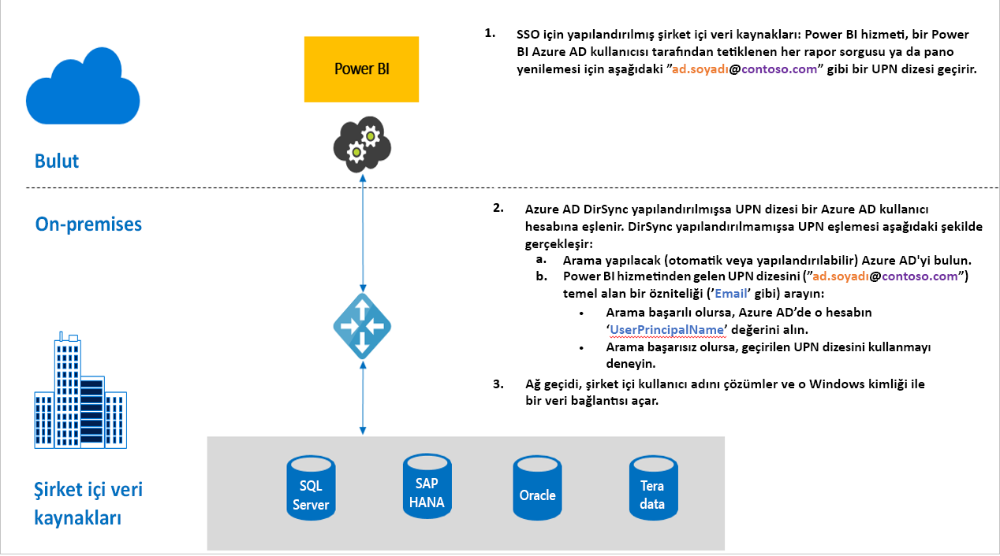

# Power BI'daki ağ geçitleri için çoklu oturum açmaya (SSO) genel bakış

Şirket içi veri ağ geçidinizi yapılandırıp Power BI raporlarının ve panoların şirket içi verilerle gerçek zamanlı olarak güncelleştirilmesini sağlayarak sorunsuz çoklu oturum açma bağlantısından yararlanabilirsiniz. Ağ geçidinizi [Kerberos](service-gateway-sso-kerberos.md) kısıtlanmış temsili veya Security Assertion Markup Language ([SAML](service-gateway-sso-saml.md)) ile yapılandırma seçeneğiniz vardır. Şirket içi veri ağ geçidi, şirket içi veri kaynaklarına bağlanan [DirectQuery](desktop-directquery-about.md) kullanarak SSO’yu destekler.

Power BI aşağıdaki veri kaynaklarını destekler:

* SQL Server (Kerberos)
* SAP HANA (Kerberos ve SAML)
* SAP BW Uygulama Sunucusu (Kerberos)
* SAP BW İleti Sunucusu (Kerberos) - genel önizleme
* Oracle (Kerberos) - genel önizleme
* Teradata (Kerberos)
* Spark (Kerberos)
* Impala (Kerberos)

Şu anda [M uzantıları](https://github.com/microsoft/DataConnectors/blob/master/docs/m-extensions.md) için SSO desteklenmemektedir.

Bir kullanıcı Power BI Hizmeti'ndeki bir DirectQuery raporuyla etkileşime geçtiğinde; her bir çapraz filtreleme, dilimleme, sıralama ve rapor düzenleme işlemi, temel alınan şirket içi veri kaynağında sorguların canlı olarak yürütülmesine neden olabilir. Veri kaynağı için SSO’yu yapılandırdığınızda, sorgular, Power BI ile etkileşime geçen kullanıcının kimliği altında (web deneyimi veya Power BI mobil uygulamaları aracılığıyla) yürütülür. Bu nedenle, her kullanıcı temel alınan veri kaynağında izinli olduğu verileri tam olarak görür. Çoklu oturum açma yapılandırıldığında, farklı kullanıcılar arasında paylaşılan bir veri önbelleği olmaz.

## SSO çalıştırırken gerçekleştirilen sorgu adımları

SSO ile çalıştırılan bir sorgu, aşağıdaki diyagramda da gösterildiği gibi üç adımdan oluşur.

Aşağıda, her adımla ilgili ayrıntılar verilmiştir:

1. Her sorgu için, Power BI hizmeti yapılandırılmış ağ geçidine sorgu isteği gönderirken, o anda Power BI hizmetinde oturum açmış olan kullanıcının tam kullanıcı adı olan *kullanıcı asıl adını (UPN)* içerir.

2. Ağ geçidinin Azure Active Directory UPN'sini yerel bir Active Directory kimliği ile eşlemesi gerekir:

   a. Azure AD DirSync (*Azure AD Connect* olarak da bilinir) yapılandırılmışsa eşleme işlemi ağ geçidinde otomatik olarak gerçekleştirilir.

   b.  Aksi halde ağ geçidi, yerel Active Directory etki alanında arama gerçekleştirerek Azure AD UPN'sini bir yerel AD kullanıcısıyla eşleyebilir.

3. Ağ geçidi hizmeti işlemi, eşlenen yerel kullanıcının kimliğine bürünür, temel alınan veritabanına yönelik bağlantıyı açar ve sonra sorguyu gönderir. Ağ geçidini veritabanıyla aynı makineye yüklemeniz gerekmez.

## Sonraki adımlar

Ağ geçidi aracılığıyla SSO etkinleştirme ile ilgili temel bilgileri kavradığınıza göre Kerberos ve SAML hakkında daha ayrıntılı bilgilere göz atabilirsiniz:

* [Çoklu oturum açma (SSO) - Kerberos](service-gateway-sso-kerberos.md)
* [Çoklu oturum açma (SSO) - SAML](service-gateway-sso-saml.md)
