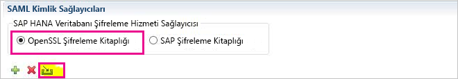
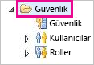
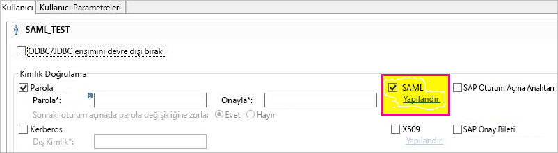
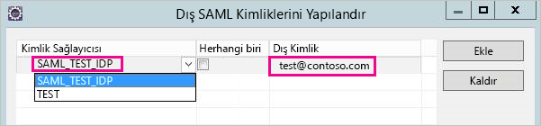
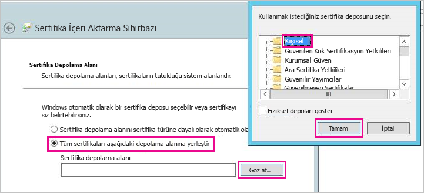
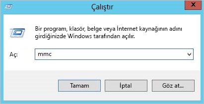
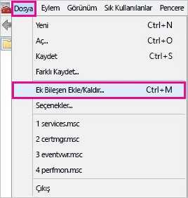
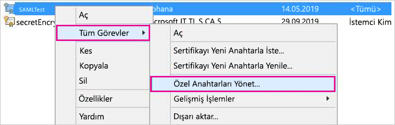
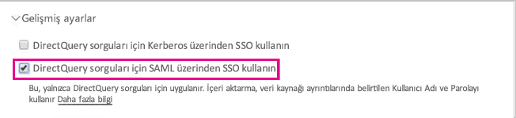

# <a name="use-security-assertion-markup-language-saml-for-single-sign-on-sso-from-power-bi-to-on-premises-data-sources"></a>Power BI'dan şirket içi veri kaynaklarına çoklu oturum açma (SSO) ile erişmek için ağ geçidinizde Security Assertion Markup Language (SAML) protokolünü kullanma

Sorunsuz çoklu oturum açma deneyimi için [Security Assertion Markup Language (SAML)](https://www.onelogin.com/pages/saml) protokolünü kullanın. SSO'yu etkinleştirmek, Power BI raporlarının ve panolarının şirket içi kaynaklardan alınan verileri yenilemesini kolaylaştırır.

## <a name="supported-data-sources"></a>Desteklenen veri kaynakları

Şu anda SAML ile SAP HANA desteği sunuyoruz. SAML kullanarak SAP HANA için çoklu oturum açma ayarlarını ve yapılandırmasını gerçekleştirme hakkında daha fazla bilgi için SAP HANA belgelerindeki [SAML SSO for BI Platform to HANA](https://wiki.scn.sap.com/wiki/display/SAPHANA/SAML+SSO+for+BI+Platform+to+HANA) (BI Platformundan HANA bağlantısı yapmak için SAML SSO) konusuna bakın.

[Kerberos](service-gateway-sso-kerberos.md) ile ek veri kaynakları için destek sunuyoruz.

HANA için şifrelemenin bir SAML SSO bağlantısı kurulmadan önce etkinleştirilmesinin **önemle** önerildiğine dikkat edin (yani, HANA sunucunuzu şifreli bağlantıları kabul etmek için yapılandırmanız ve ayrıca Ağ Geçidini HANA sunucunuzla iletişim kurarken şifreleme kullanmak için yapılandırmanız gerekir). HANA ODBC sürücüsü varsayılan olarak SAML onaylamalarını **şifreleyemez**. Şifreleme etkinleştirilmediğinde, imzalı SAML onaylaması Ağ Geçidinden HANA sunucusuna “açıktan” gönderilir ve üçüncü taraflarca durdurulup yeniden kullanılması mümkündür.

## <a name="configuring-the-gateway-and-data-source"></a>Ağ geçidini ve veri kaynağını yapılandırma

SAML kullanmak için, SSO’yu etkinleştirmek istediğiniz HANA sunucuları ile bu senaryoda SAML Kimlik Sağlayıcısı (IdP) görevi gören Ağ Geçidi arasında bir güven ilişkisi kurmanız gerekir. Bu ilişkiyi kurmanın Ağ Geçidi IdP’sinin x509 sertifikasını HANA sunucularının güven merkezine aktarmak veya Ağ Geçidinin X509 sertifikasını HANA sunucuları tarafından güvenilen bir kök Sertifika Yetkilisine (CA) imzalatmak gibi çeşitli yolları vardır. İkinci yaklaşım bu kılavuzda açıklanmaktadır ancak sizin için daha kullanışlı olan başka bir yaklaşımı kullanabilirsiniz.

Ayrıca, bu kılavuzda HANA sunucusunun şifreleme sağlayıcısı olarak OpenSSL kullanılsa da, güven ilişkisi kurulurken kurulum adımlarını tamamlamak için OpenSSL yerine SAP Şifreleme Kitaplığı (CommonCryptoLib veya sapcrypto olarak da bilinir) kullanmanız da mümkündür. Daha fazla bilgi için resmi SAP belgelerine bakın.

Aşağıdaki adımlarda, HANA sunucusu tarafından güvenilen bir Kök CA ile Ağ Geçidi IdP’sinin X509 sertifikası imzalanarak bir HANA sunucusu ile Ağ Geçidi IdP’si arasında güven ilişkisi kurma açıklanmaktadır.

1. Kök CA’nın X509 sertifikasını ve özel anahtarı oluşturun. Örneğin, Kök CA’nın X509 sertifikasını ve özel anahtarı .pem biçiminde oluşturmak için:

```
openssl req -new -x509 -newkey rsa:2048 -days 3650 -sha256 -keyout CA_Key.pem -out CA_Cert.pem -extensions v3_ca
```

HANA sunucusunun oluşturduğunuz Kök CA tarafından imzalanan sertifikalara güvenmesi için sertifikayı (örneğin, CA_Cert.pem) HANA sunucusunun Güven Deposuna ekleyin. HANA sunucunuzun Güven Deposunun konumunu **ssltruststore** yapılandırma ayarını inceleyerek öğrenebilirsiniz. OpenSSL’yi yapılandırmayı kapsayan SAP belgelerini takip ettiyseniz, HANA sunucunuz zaten yeniden kullanabileceğiniz bir Kök CA’ya güveniyor olabilir. Ayrıntılar için bkz. [SAP HANA Studio’dan SAP HANA Sunucusuna Open SSL yapılandırma](https://archive.sap.com/documents/docs/DOC-39571). SAML SSO’yu etkinleştirmek istediğiniz birden çok HANA sunucusu varsa, sunucuların her birinin bu Kök CA’ya güvendiğinden emin olun.

1. Ağ Geçidi IdP’sinin X509 sertifikasını oluşturun. Örneğin, bir yıl boyunca geçerli bir sertifika imzalama isteği (IdP_Req.pem) ve bir özel anahtar (IdP_Key.pem) oluşturmak için aşağıdaki komutu yürütün:

```
 openssl req -newkey rsa:2048 -days 365 -sha256 -keyout IdP_Key.pem -out IdP_Req.pem -nodes
```


HANA sunucularınızın güvenmesi için yapılandırdığınız Kök CA’yı kullanarak sertifika imzalama isteğini imzalayın. Örneğin, CA_Cert.pem ve CA_Key.pem dosyalarını (Kök CA sertifikası ve anahtarı) kullanarak IdP_Req.pem dosyasını imzalamak için, aşağıdaki komutu yürütün:

  ```
openssl x509 -req -days 365 -in IdP_Req.pem -sha256 -extensions usr_cert -CA CA_Cert.pem -CAkey CA_Key.pem -CAcreateserial -out IdP_Cert.pem
```
Sonuçta elde edilen IdP sertifikası bir yıl boyunca geçerli olur (-days seçeneğine bakın). Şimdi, yeni bir SAML Kimlik Sağlayıcısı oluşturmak için HANA Studio’da IdP’nizin sertifikasını içeri aktarın.

1. SAP HANA Studio'da SAP HANA sunucunuza sağ tıklayıp **Güvenlik** > **Güvenlik Konsolunu Aç** > **SAML Kimlik Sağlayıcısı** > **OpenSSL Şifreleme Kitaplığı** yolunu izleyin.

    

1. **İçeri aktar**’ı seçin, IdP_Cert.pem dosyasını bulun ve içeri aktarın.

1. SAP HANA Studio'da **Güvenlik** klasörünü seçin.

    

1. **Kullanıcılar**'ı genişletin ve Power BI kullanıcınızı eşlemek istediğiniz kullanıcıyı seçin.

1. **SAML** ve ardından **Yapılandır**'ı seçin.

    

1. 2. adımda oluşturduğunuz kimlik sağlayıcısını seçin. İçin **Dış kimlik**, Power BI kullanıcının UPN (genellikle kullanıcı oturum açtığında Power bı'a e-posta adresi) girin ve ardından seçin **Ekle**. ADUserNameReplacementProperty yapılandırma seçeneğini kullanmak için ağ geçidi yapılandırdıysanız Power BI kullanıcının özgün UPN'nin yerini alacak değer girmeniz unutmayın. Örneğin, SAMAccountName için ADUserNameReplacementProperty ayarlarsanız kullanıcı SAMAccountName girmeniz gerekir.

    

Sertifikayı ve kimliği yapılandırdığınıza göre sertifikayı pfx biçimine dönüştürüp ağ geçidi makinesini sertifikayı kullanacak şekilde yapılandırmanız gerekir.

1. Sertifikayı pfx biçimine dönüştürmek için aşağıdaki komutu çalıştırın. Bu komutun pfx dosyasının parolası olarak "root" değerini ayarladığını unutmayın.

    ```
    openssl pkcs12 -export -out samltest.pfx -in IdP_Cert.pem -inkey IdP_Key.pem -passin pass:root -passout pass:root
    ```

1. pfx dosyasını ağ geçidi makinesine kopyalayın:

    1. samltest.pfx dosyasına çift tıklayıp **Yerel Makine** > **İleri**'yi seçin.

    1. Parolayı girin ve **İleri**'yi seçin.

    1. **Tüm sertifikaları aşağıdaki depolama alanına yerleştir**'i seçip **Gözat** > **Kişisel** > **Tamam** yolunu izleyin.

    1. **İleri**'yi ve ardından **Son**'u seçin.

    

1. Ağ geçidi hizmet hesabına sertifikanın özel anahtarına erişim izni verin:

    1. Ağ geçidi makinesinde Microsoft Yönetim Konsolu'nu (MMC) çalıştırın.

        

    1. **Dosya** menüsünde **Ek Bileşen Ekle/Kaldır**'ı seçin.

        

    1. **Sertifikalar** > **Ekle**'yi ve ardından **Bilgisayar hesabı** > **İleri**'yi seçin.

    1. **Yerel Bilgisayar** > **Son** > **Tamam**'ı seçin.

    1. **Sertifikalar** > **Kişisel** > **Sertifikalar**'ı genişletin ve sertifikayı bulun.

    1. Sertifikaya sağ tıklayın ve **Tüm Görevler** > **Özel Anahtarları Yönet** yolunu izleyin.

        

    1. Ağ geçidi hizmet hesabını listeye ekleyin. Bu hesap varsayılan olarak **NT SERVICE\PBIEgwService** şeklindedir. **services.msc** komutunu çalıştırıp **Şirket içi veri ağ geçidi hizmeti**'ni bularak ağ geçidi hizmetini çalıştıran hesabı bulabilirsiniz.

        

Son olarak aşağıdaki adımları izleyerek sertifika parmak izini ağ geçidi yapılandırmasına ekleyin.

1. Makinenizdeki sertifikaları listelemek için aşağıdaki PowerShell komutunu çalıştırın.

    ```powershell
    Get-ChildItem -path cert:\LocalMachine\My
    ```
1. Oluşturduğunuz sertifikanın parmak izini kopyalayın.

1. Ağ geçidi dizinine gidin, varsayılan dizin: C:\Program Files\On-premises data gateway.

1. PowerBI.DataMovement.Pipeline.GatewayCore.dll.config dosyasını açın ve \*SapHanaSAMLCertThumbprint\* bölümünü bulun. Kopyaladığınız parmak izini yapıştırın.

1. Ağ geçidi hizmetini yeniden başlatın.

## <a name="running-a-power-bi-report"></a>Power BI raporu çalıştırma

Artık Power BI'daki **Ağ Geçidini Yönet** sayfasından veri kaynağını yapılandırabilir ve **Gelişmiş Ayarlar** sayfasından SSO özelliğini etkinleştirebilirsiniz. Ardından bu veri kaynağında raporları ve veri kümesi bağlamasını yayımlayabilirsiniz.



## <a name="troubleshooting"></a>Sorun giderme

SSO'yu yapılandırdıktan sonra Power BI portalında şu hatayı görebilirsiniz: "Sağlanan kimlik bilgileri SapHana kaynağı için kullanılamaz." Bu hata SAML kimlik bilgilerinin SAP HANA tarafından reddedildiğini gösterir.

Kimlik doğrulama izlemeleri SAP HANA'da kimlik bilgisi sorunlarını giderme hakkında ayrıntılı bilgi sağlar. SAP HANA sunucunuzda izlemeyi yapılandırmak için bu adımları izleyin.

1. SAP HANA sunucusunda aşağıdaki sorguyu çalıştırarak kimlik doğrulama izlemesini açın.

    ```
    ALTER SYSTEM ALTER CONFIGURATION ('indexserver.ini', 'SYSTEM') set ('trace', 'authentication') = 'debug' with reconfigure 
    ```

1. Karşılaştığınız sorunu yeniden oluşturun.

1. HANA Studio'da yönetim konsolunu açın ve **Diagnosis Files** (Tanılama Dosyaları) sekmesine gidin.

1. En son indexserver izlemesini açın ve SAMLAuthenticator.cpp dosyasını arayın.

    Aşağıdaki örnekte olduğu gibi kök nedeni gösteren ayrıntılı bir hata iletisi bulmalısınız.

    ```
    [3957]{-1}[-1/-1] 2018-09-11 21:40:23.815797 d Authentication   SAMLAuthenticator.cpp(00091) : Element '{urn:oasis:names:tc:SAML:2.0:assertion}Assertion', attribute 'ID': '123123123123123' is not a valid value of the atomic type 'xs:ID'.
    [3957]{-1}[-1/-1] 2018-09-11 21:40:23.815914 i Authentication   SAMLAuthenticator.cpp(00403) : No valid SAML Assertion or SAML Protocol detected
    ```

1. Sorun giderme işlemi tamamlandıktan sonra, aşağıdaki sorguyu çalıştırarak kimlik doğrulama izlemesini kapatın.

    ```
    ALTER SYSTEM ALTER CONFIGURATION ('indexserver.ini', 'SYSTEM') UNSET ('trace', 'authentication');
    ```

## <a name="next-steps"></a>Sonraki adımlar

**Şirket içi veri ağ geçidi** ve **DirectQuery** hakkında daha fazla bilgi için aşağıdaki kaynaklara göz atın:

* [On-premises data gateway (Şirket içi veri ağ geçidi)](service-gateway-onprem.md)
* [Power BI'da DirectQuery](desktop-directquery-about.md)
* [DirectQuery tarafından desteklenen veri kaynakları](desktop-directquery-data-sources.md)
* [DirectQuery ve SAP BW](desktop-directquery-sap-bw.md)
* [DirectQuery ve SAP HANA](desktop-directquery-sap-hana.md)
