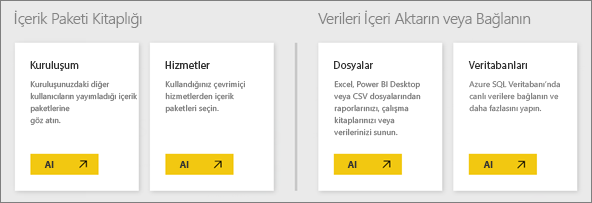
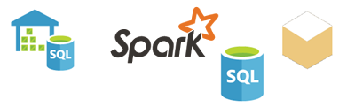

# Power BI hizmeti için veri kaynakları
Veriler Power BI'ın temelini oluşturur. Veri araştırırken, grafik ve pano oluştururken veya Soru-Cevap özelliğini kullanarak sorularınızı sorarken gördüğünüz görselleştirmelerin ve yanıtların tümüne ilişkin bağlantılı veriler veri kümelerinden alınır. Peki bu veri kümelerinin kaynağı nedir? Veri kaynakları.

Bu makalede, Power BI hizmetinden bağlanabileceğiniz farklı türde veri kaynaklarını inceleyeceğiz. Veri alabileceğiniz başka birçok veri kaynağı türünün de mevcut olduğunu unutmayın. Ancak bunlar için öncelikle Power BI Desktop'ı veya Excel'in gelişmiş veri sorgusu ve modelleme özelliklerini kullanmanız gerekebilir. Sonraki kısımlarda bu konuyu daha ayrıntılı olarak ele alacağız. Şimdilik, Power BI hizmeti sitesinden doğrudan bağlanabileceğiniz farklı türde veri kaynaklarına göz atalım.

Power BI'da **Çalışma Alanım** > **Veri Al**'a tıklayarak, aşağıdaki veri kaynaklarının herhangi birinden veri alabilirsiniz.

## Dosyalar

**Excel** (.xlsx, .xlxm): Excel, çalışma kitaplarının, hem çalışma sayfalarına girmiş olduğunuz verileri hem de Power Query (Excel 2016'daki Al ve Dönüştür) veya Power Pivot eklentisini kullanarak harici veri kaynaklarından sorgulayıp yüklediğiniz verileri içerebilmesi bakımından diğerlerinden farklı bir veri kaynağıdır. Çalışma sayfalarında bulunan tablolardaki (veriler bir tabloda *olmalıdır*) veya bir veri modeline yüklenmiş olan verileri içeri aktarabilirsiniz. Daha fazla bilgi edinmek için bkz. [Excel'den veri alma](service-get-data-from-files.md).

**Power BI Desktop** (.pbix): Harici veri kaynaklarından veri sorgulayıp yüklemek, ölçüler ve ilişkilerle veri modelinizi genişletmek ve rapor oluşturmak için Power BI Desktop'ı kullanabilirsiniz. Power BI Desktop dosyanızı Power BI sitenize aktarabilirsiniz. Sahip oldukları veri kaynaklarının yanı sıra veri sorgusu, veri dönüştürme ve veri modelleme kavramları konusunda bilgi sahibi olan daha ileri düzey kullanıcılar için Power BI Desktop en iyi seçenektir. Daha fazla bilgi için bkz. [Power BI Desktop'ta verilere bağlanma](desktop-connect-to-data.md).

**Virgülle Ayrılmış Değer** (.csv): Bu tür dosyalar, veri satırları içeren basit metin dosyalarıdır. Her satırda bir veya birden fazla (her biri virgülle ayrılmış) değer bulunur. Örneğin, ad ve adres verileri içeren bir .csv dosyasında her biri ad, soyadı, posta adresi, şehir ve eyalet gibi değerler içeren bir dizi satır bulunabilir. .csv dosyalarına veri aktaramazsınız ancak Excel gibi birçok uygulama basit tablo verilerini .csv dosyası olarak kaydedebilir.

XML Tablosu (.xml) veya metin (.txt) dosyaları gibi diğer dosya türleri için, Al ve Dönüştür seçeneklerini kullanarak söz konusu verileri sorgulayabilir, dönüştürebilir ve öncelikle bir Excel ya da Power BI Desktop dosyasına yükleyebilirsiniz. Ardından, söz konusu Excel veya Power BI Desktop dosyasını Power BI'a aktarabilirsiniz.

Dosyalarınızın nerede depolandığı da çok önemlidir. OneDrive İş, Power BI için en yüksek düzeyde esneklik ve tümleştirme olanağı sunar. Dosyalarınızı yerel sürücünüzde tutarsanız da herhangi bir sorunla karşılaşmazsınız ancak verilerinizi yenilemeniz gerektiğinde fazladan birkaç adımla daha uğraşmanız gerekir. Daha ayrıntılı bilgiye, bağlantısı verilen makalelerden ulaşabilirsiniz.

## İçerik paketleri

İhtiyacınız olan tüm veriler ve raporlar, içerik paketlerinde hazır olarak bulunur. Power BI'da iki tür içerik paketi vardır: Google Analytics, Marketo veya Salesforce gibi hizmetlerden alınanlar ve kuruluşunuzdaki diğer kullanıcılar tarafından oluşturulup paylaşılanlar.

**Hizmetler**: Power BI için içerik paketi sunan onlarca hizmet mevcuttur ve bunlara sürekli olarak yenileri eklenmektedir. Çoğu hizmet için bir hesabınız olmasına gerek yoktur. Daha fazla bilgi edinmek için bkz. [Hizmetlere bağlanma](service-connect-to-services.md).

**Kuruluş**: Kuruluşunuzdaki diğer kullanıcılarla birlikte bir Power BI Pro hesabına sahipseniz içerik paketleri oluşturabilir, paylaşabilir ve kullanabilirsiniz. Daha fazla bilgi edinmek için bkz. [Kurumsal içerik paketleri](service-organizational-content-pack-introduction.md).

## Veritabanları

**Buluttaki veritabanları**: DirectQuery ile Power BI hizmetinden Azure SQL Veritabanı, Azure SQL Veri Ambarı, Azure HD Insight'ta Spark ve SQL Server Analysis Services'e canlı bağlanabilirsiniz. Power BI ile bu veritabanları arasında kurulan bağlantılar canlıdır. Örneğin, bir Azure SQL Veritabanı'na bağlanıp Power BI'da raporlar oluşturarak bu veritabanına ilişkin verileri araştırmaya başladıktan sonra verilerinizi her dilimlediğinizde veya bir görselleştirmeye her alan eklediğinizde doğrudan veritabanına yönelik bir sorgu gerçekleştirilir. Daha fazla bilgi edinmek için bkz. [Azure ve Power BI](service-azure-and-power-bi.md).

**Şirket içi veritabanları**: Power BI hizmetinden SQL Server Analysis Services Tablo modelli veritabanlarına doğrudan bağlanabilirsiniz. Bu işlem için bir Power BI Enterprise ağ geçidi gereklidir. Kuruluşunuzun tablo modelli veritabanına nasıl bağlanacağınızdan emin değilseniz yöneticinizle veya BT departmanınızla iletişime geçin. Daha fazla bilgi edinmek için bkz. [Power BI'da SQL Server Analysis Tablo verileri](sql-server-analysis-services-tabular-data.md).

Kuruluşunuzdaki diğer veritabanı türleri söz konusu olduğunda verilere bağlanmak, verileri sorgulamak ve bir veri modeline yüklemek için öncelikle Power BI Desktop'ı veya Excel'i kullanırsınız. Ardından dosyanızı Power BI'a aktarabilirsiniz ve burada bir veri kümesi oluşturulur. Zamanlanmış yenileme ayarlamanız halinde Power BI, doğrudan veri kaynağına bağlanmak ve güncelleştirme olup olmadığını sorgulamak üzere dosyadaki bağlantı bilgilerinin yanı sıra yapılandırdığınız yenileme ayarlarını kullanır. Daha sonra bu güncelleştirmeler Power BI'daki veri kümesine yüklenir. Daha fazla bilgi için bkz. [Power BI Desktop'ta verilere bağlanma](desktop-connect-to-data.md).

## Verilerim farklı bir kaynaktan geliyorsa ne olur?
Power BI ile kullanabileceğiniz yüzlerce farklı veri kaynağı mevcuttur. Kaynağı ne olursa olsun verileriniz, Power BI'ın raporlar ve panolar oluşturmak, Soru-Cevap özelliğiyle sorulan soruları yanıtlamak ve başka işlemler gerçekleştirmek için kullanabileceği bir biçimde olmalıdır.

Bazı veri kaynaklarındaki veriler Power BI hizmeti ile kullanıma hazır biçimdedir. Google Analytics ve Twilio gibi hizmet sağlayıcılarına ait içerik paketleri bunlara örnek olarak verilebilir. SQL Server Analysis Services Tablo modelli veritabanları da kullanıma hazırdır. Ayrıca, Azure SQL Veritabanı ve Spark on HDInsight gibi buluttaki veritabanlarına canlı olarak bağlanabilirsiniz.

Diğer durumlarda verileri sorgulayıp bir dosyaya yüklemeniz gerekebilir. Örneğin, kuruluşunuzdaki bir sunucuda bulunan veri ambarı veritabanlarından birinde lojistik verilerinizin olduğunu varsayalım. Tablo modelli bir veritabanı değilse Power BI hizmetinde bu veritabanına doğrudan bağlanıp verileri araştırmaya başlayamazsınız. Ancak, Power BI Desktop'ı veya Excel'i kullanarak söz konusu lojistik verilerini sorgulayıp bir veri modeline yükledikten sonra bu veri modelini bir dosya olarak kaydedebilirsiniz. Ardından bu dosyayı Power BI'a aktarabilirsiniz ve Power BI'da bir veri kümesi oluşturulur.

Aklınızdan, "Bu veritabanındaki lojistik verileri her gün değişiyor. Power BI'daki veri kümemin yenilenmesini nasıl sağlayabilirim?" sorusu geçmiş olabilir. Power BI Desktop veya Excel dosyasındaki bağlantı bilgileri, verilerle birlikte söz konusu veri kümesine aktarılır. Veri kümesi için zamanlanmış yenileme ayarlar veya veri elle yenileme işlemi gerçekleştirirseniz Power BI, veritabanına doğrudan bağlanmak, güncelleştirme olup olmadığını sorgulamak ve güncelleştirmeleri veri kümesine yüklemek için diğer birkaç ayarla birlikte bu veri kümesindeki bağlantı bilgilerini kullanır. Şirket içi sunucunuz ile Power BI arasında gerçekleşecek herhangi bir veri aktarımının güvenliğini sağlamak için bir Power BI ağ geçidine ihtiyacınız olabilir. Raporlardaki ve panolardaki tüm görselleştirmeler otomatik olarak yenilenir.

Gördüğünüz üzere, veri kaynağınıza Power BI hizmetinden doğrudan bağlanamıyor olmanız söz konusu verileri Power BI'a aktaramayacağınız anlamına gelmez. Yalnızca birkaç işlem daha gerçekleştirmeniz ve bazı durumlarda BT departmanınızdan yardım almanız yeterlidir. Daha fazla bilgi edinmek için bkz. [Power BI Desktop'taki veri kaynakları](desktop-data-sources.md).

## Daha fazla ayrıntı
Power BI'da veri kümesi ve veri kaynağı terimlerinin sıkça kullanıldığına tanık olacaksınız. Bu terimler genelde eş anlamlı gibi kullanılıyor ve ilişkili olsalar da aslında farklı iki anlama sahip olduklarını söyleyebiliriz.

***Veri kümeleri***, Veri Al seçeneğini kullanarak bir içerik paketine veya dosyaya bağlanıp bunlardan veri aktardığınızda ya da canlı bir veri kaynağına bağlandığınızda Power BI hizmetinde otomatik olarak oluşturulur. Veri kümelerinde veri kaynakları, veri kaynağı kimlik bilgileri ve çoğunlukla, veri kaynağından kopyalanan veri alt kümeleri ile ilgili bilgiler bulunur. Raporlarda ve panolarda görselleştirme oluştururken çoğunlukla veri kümesindeki verilere bakarsınız.

***Veri kaynakları***, veri kümelerindeki verilerin kaynağıdır. Örneğin, Google Analytics veya QuickBooks gibi bir çevrimiçi hizmet, Azure SQL Veritabanı gibi bulut ortamındaki bir veritabanı veya kuruluşunuzdaki yerel bir bilgisayar ya da sunucuda bulunan bir veritabanı veya dosya.

### Veri yenileme
Dosyalarınızı yerel sürücünüze veya kuruluşunuzdaki bir sürücüye kaydederseniz Power BI'daki veri kümesinin yenilenmesi için bir Power BI ağ geçidine ihtiyacınız olabilir. Bununla birlikte, yenileme işleminin gerçekleştiği sırada, dosyanın kaydedildiği bilgisayarın açık olması gerekir. Ayrıca, dosyanızı yeniden içeri aktarabilir veya Excel'den ya da Power BI Desktop'tan yayımlayabilirsiniz ancak bu işlemlerin hiçbiri otomatik olarak gerçekleşmez.

Dosyalarınızı OneDrive İş'e veya SharePoint - Ekip Siteleri'ne kaydeder ve dosyalarınıza bağlanıp onları Power BI'a aktarırsanız veri kümeniz, raporlarınız ve panonuz her zaman güncel kalır. Hem OneDrive hem de Power BI bulutta olduğundan Power BI, kaydettiğiniz dosyaya hemen hemen her saatte bir doğrudan bağlanarak güncelleştirmeleri denetleyebilir. Herhangi bir güncelleştirme varsa veri kümesi ve tüm görselleştirmeler otomatik olarak yenilenir.

Hizmetlerden alınan içerik paketleri de otomatik olarak güncelleştirilir. Bu işlemler çoğu durumda günlük olarak gerçekleşir. Yenileme işlemini kendiniz de gerçekleştirebilirsiniz ancak, güncelleştirilmiş veriler görüp görmeyeceğiniz hizmet sağlayıcısına bağlıdır. Kuruluşunuzdaki diğer kullanıcılara ait içerik paketleri için bu işlem, kullanılan veri kaynaklarına ve içerik paketini oluşturan kişinin yenilemeyi nasıl ayarladığına bağlıdır.

Azure SQL Veritabanı, Azure SQL Veri Ambarı ve Spark on Azure HDInsight'ın Bulutta olması onları diğer veri kaynaklarından ayırır. Power BI hizmeti de bulutta olduğundan Power BI, DirectQuery'yi kullanıp bu veri kaynaklarına canlı olarak bağlanabilir. Power BI'da gördüğünüz her şey her zaman eşitlenir ve yenileme zamanlamanıza gerek kalmaz.

Power BI'dan SQL Server Analysis Services'e bağlandığınızda tıpkı buluttaki bir Azure veritabanıyla olduğu gibi canlı bir bağlantı kurulur ancak veritabanının kendisi, kuruluşunuzdaki bir sunucuda yer alır. Bu da SQL Server Analysis Services'i diğer veri kaynaklarından ayıran özelliktir. Bu tür bağlantılar için, genellikle BT departmanları tarafından yapılandırılmış bir Power BI ağ geçidi gereklidir.

Veri yenileme Power BI'ın çok önemli bir parçasıdır ve bu makalede ele alamayacağımız kadar ayrıntılı bir konudur. Kapsamlı bilgi edinmek istiyorsanız [Power BI'da veri yenileme](refresh-data.md) makalesine mutlaka göz atın.

## Önemli Noktalar ve Sınırlamalar
Aşağıdaki önemli noktalar ve sınırlamalar, Power BI hizmetinde kullanılan tüm veri kaynakları için geçerlidir. Belirli özellikler için geçerli başka sınırlamalar da mevcuttur ancak aşağıdaki liste, Power BI hizmetinin tamamı için geçerlidir:

* **Veri kümesi boyutu sınırı**: Power BI hizmetindeki her veri kümesi için 1 GB'lık bir sınır mevcuttur.
* **Satır sınırı**: Veri kümenizde bulunabilecek maksimum satır sayısı (DirectQuery kullanılmadığında) 2 milyardır. Bu satırlardan üçü ayrılmış olduğundan kullanılabilecek maksimum satır sayısı 1.999.999.997'dir. DirectQuery kullanıldığında ise maksimum satır sayısı 1 milyondur.
* **Sütun sınırı**: Bir veri kümesinde (tüm tablolarda) izin verilen maksimum sütun sayısı 16.000'dir. Bu, Power BI Desktop'ta kullanılan veri kümeleri ve Power BI hizmeti için geçerlidir. Power BI, veri kümesinde bulunan her tablo için bir dahili satır numarası sütunu kullanır. Bu durumda maksimum sütun sayısı, 16.000'den, veri kümesinde kullanılan her tablo için 1 çıkarıldığında elde edilen sayıdır.

