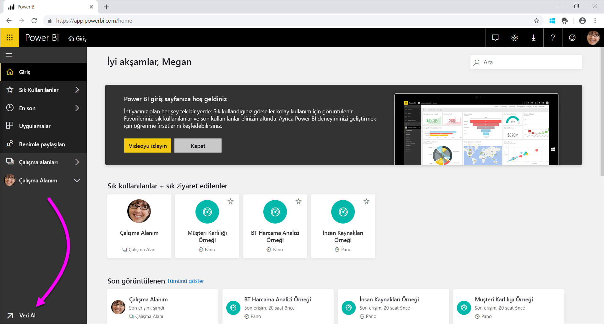
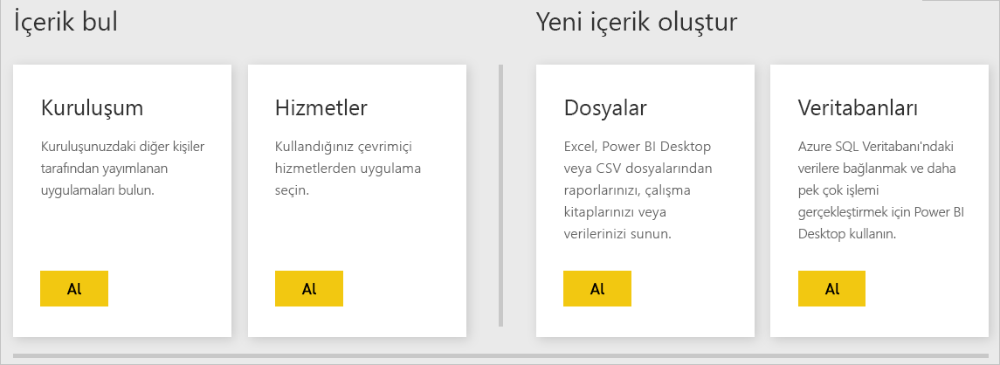

# Power BI hizmeti için veri kaynakları
Veriler Power BI'ın temelini oluşturur. Verileri araştırdığınızı düşünelim. Grafikler ve panolar oluşturarak veya **Soru-Cevap** ile sorular sorarak bunu yapabilirsiniz. Gördüğünüz görselleştirmeler ve yanıtların temel verileri bir veri kümesinden alınır. Peki bu veri kümelerinin kaynağı nedir? İşte bunlar bir veri kaynağından gelir.

Bu makalede, Power BI hizmetinden bağlanabileceğiniz veri kaynağı türlerini inceleyeceğiz. Veri alabileceğiniz başka birçok veri kaynağı türünün de olduğunu unutmayın. Bu veri kaynaklarını seçerseniz, önce Power BI Desktop'ı veya Excel'in gelişmiş veri sorgulama ve modelleme özelliklerini kullanmanız gerekebilir. Daha sonra bu seçenekleri daha ayrıntılı olarak ele alacağız. Şimdilik, doğrudan Power BI hizmeti sitesinden kullanılabilen farklı türde veri kaynaklarını gözden geçirelim.

Sayfanın sol alt köşesindeki **Veri Al**'ı seçerek Power BI'daki tüm veri kaynaklarından veri alabilirsiniz.

 

**Veri Al**'ı seçtikten sonra erişmek istediğiniz verileri seçebilirsiniz

## İçerik bul

**İçerik bul** bölümünde ihtiyacınız olan tüm veriler ve raporlar önceden sizin için hazırlanmıştır. Power BI'da iki tür içerik paketi vardır: Kurumsal ve Hizmetler. 

**Kurumsal**: Kuruluşunuzdaki diğer kullanıcılarla birlikte bir Power BI Pro hesabınız varsa, içerik paketlerini oluşturabilir, paylaşabilir ve kullanabilirsiniz. Daha fazla bilgi edinmek için bkz. [Kurumsal içerik paketlerine giriş](service-organizational-content-pack-introduction.md).

**Hizmetler**: Power BI için içerik paketi sunan onlarca hizmet vardır ve bunlara sürekli olarak yenileri eklenmektedir. Çoğu hizmet için bir hesabınız olmasına gerek yoktur. Daha fazla bilgi edinmek için bkz. [Power BI ile kullandığınız hizmetlere bağlanma](service-connect-to-services.md).

## Yeni içerik oluştur

**Yeni içerik oluştur** bölümünde kendiniz içerik oluşturabilmeniz ve içeri aktarabilmeniz için seçenekler bulunur. Power BI'da kendi içeriğinizi oluşturmanın veya içeri aktarmanın iki yolu vardır: Dosyalar ve Veritabanları. 

### Dosyalar

**Excel** ( *.xlsx*, *.xlsm*) - Excel’de, bir çalışma kitabı farklı veri türleri içeriyor olabilir. Örneğin çalışma sayfalarına sizin girdiğiniz verileri içerebilir. Ayrıca Power Query'yi kullanarak sorguladığınız ve dış veri kaynaklarından yüklediğiniz verileri de içerebilir. Power Query, Excel 2016'da veya Power Pivot'ta **Al ve Dönüştür** seçeneğiyle sağlanır. Verileri çalışma sayfalarındaki tablolardan veya bir veri modelinden içeri aktarabilirsiniz. Daha fazla bilgi edinmek için bkz. [Power BI için dosyalardan veri alma](service-get-data-from-files.md).

**Power BI Desktop** ( *.pbix*): Harici veri kaynaklarından verileri sorgulayıp yüklemek ve rapor oluşturmak için Power BI Desktop'ı kullanabilirsiniz. Ayrıca ölçüler ve ilişkilerle veri modelinizi genişletebilir veya Power BI Desktop dosyanızı Power BI sitenize içeri aktarabilirsiniz. Power BI Desktop ileri düzey kullanıcılar için idealdir. Normalde bu kullanıcılar veri kaynaklarını iyi anlayan kişilerdir. Ayrıca veri sorgulama, dönüştürme ve veri modelleme kavramlarını da bilirler. Daha fazla bilgi için bkz. [Power BI Desktop'ta verilere bağlanma](desktop-connect-to-data.md).

**Virgülle Ayrılmış Değer** ( *.csv*): Bunlar veri satırları içeren basit metin dosyalarıdır. Her satırda bir veya birden fazla (her biri virgülle ayrılmış) değer bulunabilir. Örneğin, ad ve adres verileri içeren bir *.csv* dosyasında birçok satır bulunabilir. Her satırda ad, soyadı, posta adresi, ilçe ve il gibi değerler olabilir. *.csv* dosyalarına veri aktaramazsınız ancak Excel gibi birçok uygulama basit tablo verilerini *.csv* dosyası olarak kaydedebilir.

XML Tablosu ( *.xml*) veya metin ( *.txt*) dosyaları gibi diğer dosya türleri için, **Al ve Dönüştür** özelliğini kullanarak söz konusu verileri sorgulayabilir, dönüştürebilir ve öncelikle bir Excel veya Power BI Desktop dosyasına yükleyebilirsiniz. Ardından, söz konusu Excel veya Power BI Desktop dosyasını Power BI'a aktarabilirsiniz.

Dosyalarınızın nerede depolandığı da önemli bir fark yaratır. OneDrive İş, Power BI için en yüksek düzeyde esneklik ve tümleştirme olanağı sunar. Dosyalarınızı yerel sürücünüzde de tutabilirsiniz. Ama verilerinizi yenilemeniz gerekirse fazladan birkaç adım uygulamanız gerekir. Daha fazla bilgi için aşağıdaki makale bağlantılarını inceleyin.

### Veritabanları

**Buluttaki Veritabanları**: Power BI hizmetinden şunlara canlı bağlanabilirsiniz:

* Azure SQL Veritabanı
* Azure SQL Veri Ambarı
* Azure HDInsight Spark Hizmeti

Power BI'dan bu veritabanlarına kurulan bağlantılar canlıdır. Bir Azure SQL Veritabanına bağlandığınızı düşünün. Ardından Power BI'da raporlar oluşturarak veritabanının verilerini incelemeye başlarsınız. Verilerinizi her dilimlere ayırdığınızda veya görselleştirmeye başka bir alan eklediğinizde Power BI doğrudan veritabanında bir sorgu yapar. Daha fazla bilgi edinmek için bkz. [Azure ve Power BI](service-azure-and-power-bi.md).

**Şirket içi veritabanları**: Power BI hizmetinden SQL Server Analysis Services Tablo modelli veritabanlarına doğrudan bağlanabilirsiniz. Bunu yapmak için Power BI Enterprise ağ geçidine ihtiyacınız olacaktır. Kuruluşunuzun tablo modelli veritabanına nasıl bağlanacağınızdan emin değilseniz yöneticinizle veya BT departmanınızla iletişime geçin. Daha fazla bilgi edinmek için bkz. [Power BI'da SQL Server Analysis Services canlı verileri](sql-server-analysis-services-tabular-data.md).

Kuruluşunuzdaki diğer veritabanı türleri söz konusu olduğunda verilere bağlanmak, verileri sorgulamak ve bir veri modeline yüklemek için Power BI Desktop’ı veya Excel’i kullanırsınız. Ardından dosyanızı veri kümesinin bulunduğu Power BI'da içeri aktarabilirsiniz. Zamanlanmış yenileme yapılandırıyorsanız, Power BI doğrudan veri kaynağına bağlanmak ve güncelleştirme olup olmadığını sorgulamak üzere dosyadaki bu yapılandırma ve bağlantı bilgilerini kullanır. Ardından Power BI bu güncelleştirmeleri veri kümesine yükler. Daha fazla bilgi için bkz. [Power BI Desktop'ta verilere bağlanma](desktop-connect-to-data.md).

## Verilerim farklı bir kaynaktan geliyorsa ne olur?
Power BI ile kullanabileceğiniz yüzlerce farklı veri kaynağı vardır. O veri kaynaklarından verilerinizi her aldığınızda, bu verilerin Power BI hizmeti tarafından tüketilebilir bir biçimde olması gerekir. Tüketilebilir verilerle Power BI hizmeti raporlar ve panolar oluşturma, **Soru-Cevap** ile soruları yanıtlama gibi çeşitli işlemler yapabilir.

Bazı veri kaynaklarında zaten Power BI hizmeti için biçimlendirilmiş veriler bulunur. Bu kaynaklar Google Analytics ve Twilio gibi hizmet sağlayıcılarından gelen içerik paketleri gibidir. SQL Server Analysis Services Tablo modelli veritabanları da kullanıma hazırdır. Azure SQL Veritabanı ve Spark on HDInsight gibi buluttaki veritabanlarına da canlı bağlantı kurabilirsiniz.

Diğer durumlarda verileri sorgulayıp bir dosyaya yüklemeniz gerekebilir. Örneğin, kuruluşunuzda lojistik verilerinizin olduğunu varsayalım. Bu verileri sunucudaki bir veri ambarı veritabanında depolarsınız. Tablo modelli bir veritabanı değilse Power BI hizmetinde bu veritabanına bağlanıp verileri araştırmaya başlayamazsınız. Ama Power BI Desktop'ı veya Excel'i kullanarak söz konusu lojistik verilerini sorgulayıp bir veri modeline yükledikten sonra bu veri modelini de dosya olarak kaydedebilirsiniz. Ardından bu dosyayı veri kümesinin bulunduğu Power BI'da içeri aktarabilirsiniz.

"Bu veritabanındaki lojistik verileri her gün değişiyor. Power BI veri kümemi nasıl yenileyebilirim?" diye düşünüyor olabilirsiniz. Veri kümesine verileri aktardığınızda Power BI Desktop veya Excel dosyasından bağlantı bilgilerini de içeri aktarırsınız.

Veri kümesinde zamanlanmış bir yenileme yapılandırdığınızı veya el ile yenileme yaptığınızı varsayalım. Power BI veritabanına doğudan bağlanmak için veri kümesindeki bağlantı bilgileriyle birkaç başka ayarı kullanır. Ardından güncelleştirmeleri sorgular ve bu güncelleştirmeleri veri kümesine yükler. Bunlara ek olarak, şirket içi sunucunuz ile Power BI arasında gerçekleşecek herhangi bir veri aktarımının güvenliğini sağlamak için büyük olasılıkla bir Power BI ağ geçidine ihtiyacınız olacaktır. Aktarım tamamlandığında raporlardaki ve panolardaki tüm görselleştirmeler otomatik olarak yenilenir.

Gördüğünüz üzere, veri kaynağınıza Power BI hizmetinden doğrudan bağlanamıyor olsanız da söz konusu verileri Power BI’a alabilirsiniz. Yalnızca birkaç işlem daha gerçekleştirmeniz ve bazı durumlarda BT departmanınızdan yardım almanız yeterlidir. Daha fazla bilgi edinmek için bkz. [Power BI Desktop'taki veri kaynakları](desktop-data-sources.md).

## Daha fazla ayrıntı
Power BI’da veri kümesi ve veri kaynağı terimlerinin sıkça kullanıldığına tanık olacaksınız. Bunlar çoğunlukla eş anlamlı kullanılır. Ama ilişkili olsalar da bunlar aslında farklı anlamlara gelir.

**Veri Al**'ı kullandığınızda Power BI'da otomatik olarak bir **veri kümesi** oluşturursunuz. **Veri Al** ile içerik paketine veya dosyaya bağlanıp verileri içeri aktarır ya da canlı bir veri kaynağına bağlanırsınız. Veri kümesinde veri kaynağı hakkında bilgiler ve veri kaynağının kimlik bilgileri bulunur. Birçok durumda veri kaynağından kopyalanan verilerin bir alt kümesini de içerir. Raporlarda ve panolarda görselleştirme oluştururken çoğunlukla veri kümesindeki verilere bakarsınız.

**Veri kaynakları**, veri kümelerindeki verilerin kaynağıdır. Örneğin veriler şu kaynaklardan gelebilir:

* Google Analytics veya QuickBooks gibi bir çevrimiçi hizmet
* Azure SQL Veritabanı gibi buluttaki bir veritabanı
* Kendi kuruluşunuzdaki bir yerel bilgisayarda veya sunucuda yer alan veritabanı veya dosya

## Veri yenileme
Dosyalarınızı yerel sürücünüze veya kuruluşunuzdaki herhangi bir sürücüye kaydediyor olabilirsiniz. Power BI'da veri kümesini yenileyebilmek için bir Power BI ağ geçidine ihtiyacınız olabilir. Dosyanın depolandığı bilgisayar yenileme gerçekleşirken açık olmalıdır. Dosyanızı yeniden içeri aktarabilir ya da Excel'den veya Power BI Desktop'tan Yayımlama seçeneğini kullanabilirsiniz ama bu seçeneklerin hiçbiri otomatik olarak gerçekleşmez.

Dosyalarınızı OneDrive İş'e veya SharePoint - Ekip Siteleri'ne kaydederseniz, dosyalarınıza bağlanabilir veya onları Power BI'da içeri aktarabilirsiniz. Bundan sonra veri kümeniz, raporlarınız ve panonuz her zaman güncel kalır. Hem OneDrive hem de Power BI bulutta olduğundan, Power BI kaydettiğiniz dosyaya doğrudan bağlanabilir. Yaklaşık olarak saatte bir bağlanır ve güncelleştirmeleri denetler. Güncelleştirme varsa, veri kümesi ve tüm görselleştirmeler otomatik olarak yenilenir.

Hizmetlerden alınan içerik paketleri de otomatik olarak güncelleştirilir. Çoğu durumda, günde bir kez güncelleştirilirler. Yenileme işlemini kendiniz de yapabilirsiniz ama güncelleştirilmiş verileri görüp görmeyeceğiniz hizmet sağlayıcısına bağlıdır. Kuruluşunuzdaki kişilerin içerik paketlerindeki güncelleştirmeleri, kullanılan veri kaynaklarına bağlı olacaktır. Ayrıca içerik paketini oluşturan kişinin yenilemeyi nasıl yapılandırdığına da bağlıdır.

Azure SQL Veritabanı, Azure SQL Veri Ambarı ve Spark on Azure HDInsight, Buluttaki veri kaynaklarıdır. Power BI hizmeti de bulutta olduğundan, Power BI **DirectQuery**'yi kullanıp söz konusu veri kaynaklarına canlı olarak bağlanabilir. Power BI’da gördüğünüz her şey her zaman eşitlenir ve zamanlanmış bir yenileme ayarlamanıza gerek kalmaz.

Power BI’dan SQL Server Analysis Services’a bağlandığınızda, bu aynı buluttaki bir Azure veritabanı gibi canlı bağlantı olur. Aralarındaki fark veritabanının kendisinin kuruluşunuzdaki sunucuda yer almasıdır. Bu tür bağlantılar için genellikle BT departmanının yapılandırdığı bir Power BI ağ geçidi gereklidir.

Veri yenileme Power BI'ın çok önemli bir parçasıdır ve bu makalede ele alamayacağımız kadar ayrıntılı bir konudur. Ayrıntılı bilgi edinmek istiyorsanız [Power BI'da Veri Yenileme](refresh-data.md) makalesine mutlaka göz atın.

## Önemli noktalar ve sınırlamalar
Power BI hizmetinde kullanılan tüm veri kaynakları için aşağıdaki sınırlamaları göz önünde bulundurun. Belirli özellikler için geçerli başka sınırlamalar da vardır ama aşağıdaki liste Power BI hizmetinin tamamı için geçerlidir:

* **Veri kümesi boyutu sınırı**: Power BI hizmetinde Paylaşılan kapasitelerde depolanan veri kümeleri için 1 GB sınırı vardır. Daha büyük veri kümelerine ihtiyacınız varsa [Power BI Premium](service-premium-what-is.md)’u kullanabilirsiniz.

* **Sütundaki benzersiz değerler**: Power BI veri kümesinde verileri önbelleğe kaydederken (bazen ‘İçeri Aktarma’ modu olarak adlandırılır), bir sütunda depolanabilecek benzersiz değer sayısı üzerinde 1.999.999.997 sınırı vardır.

* **Satır sınırı**: **DirectQuery** kullanıldığında Power BI, temel veri kaynağınıza gönderilen sorgu sonuçlarına bir sınır uygular. Veri kaynağına gönderilen sorgu bir milyondan fazla satır döndürürse, bir hata görürsünüz ve sorgu başarısız olur. Temel verileriniz halen bir milyondan fazla satır içerebilir. Çoğu rapor, verileri daha küçük sonuç kümeleri halinde topladığından bu sınıra ulaşma ihtimaliniz çok düşüktür.

* **Sütun sınırı**: Bir veri kümesinde (tüm tablolarda) izin verilen maksimum sütun sayısı 16.000'dir. Bu sınır Power BI Desktop'ta kullanılan veri kümeleri ve Power BI hizmeti için geçerlidir. Power BI, veri kümesindeki sütun ve tablo sayısını bu şekilde izler. Bu durumda maksimum sütun sayısı, 16.000'den veri kümesindeki her tablo için 1 çıkarıldığında elde edilen sayıdır.

