# Öğretici: Power BI hizmeti ile çalışmaya başlama
Bu öğretici, *Power BI hizmetinin* bazı özelliklerine giriş niteliğindedir. Bu öğreticide, verilere bağlanır, bir rapor ve bir pano oluşturur ve verileriniz hakkında sorular sorarsınız. Power BI hizmetinde çok daha fazlasını yapabilirsiniz. Bu öğretici yalnızca başlangıç niteliğindedir. Power BI hizmetinin, diğer Power BI teklifleriyle nasıl bir uyum içinde çalıştığını anlamanız için [Power BI nedir?](fundamentals/power-bi-overview.md) makalesini okumanızı öneririz.

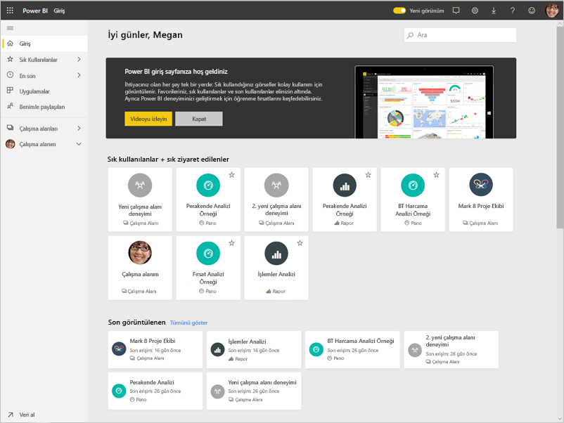

Bu öğreticide aşağıdaki adımları tamamlarsınız:

> [!div class="checklist"]
> * Power BI çevrimiçi hesabınızda oturum açın veya Power BI hesabınız yoksa Power BI hesabına kaydolun.
> * Power BI hizmetini açın.
> * Bazı verileri alın ve rapor görünümünde açın.
> * Bu verileri kullanarak görselleştirmeler oluşturun ve rapor olarak kaydedin.
> * Rapordan kutucukları sabitleyerek bir pano oluşturun.
> * Soru-Cevap doğal dil aracını kullanarak panonuza başka görselleştirmeler ekleyin.
> * Panodaki kutucukları yeniden boyutlandırın, yeniden düzenleyin ve bunlarla etkileşime geçin.
> * Veri kümesini, raporu ve panoyu silerek kaynakları temizleyin.

> [!TIP]
> Bunun yerine kendi kendinize ilerleyebileceğiniz ücretsiz bir eğitim almayı mı tercih edersiniz? [EdX'teki Analyzing and Visualizing Data (Verileri Çözümleme ve Görselleştirme) kursumuza kaydolun](http://aka.ms/edxpbi).

## Power BI hizmetine kaydolma
Bir Power BI hesabınız yoksa, başlamadan önce [ücretsiz Power BI Pro deneme sürümüne kaydolun](https://app.powerbi.com/signupredirect?pbi_source=web).

Bir hesap oluşturduktan sonra, Power BI hizmetini açmak için tarayıcınızda *app.powerbi.com* adresini girin. 

## 1\. Adım: Veri al

Genellikle Power BI bir raporu oluşturmak istediğinizde çalışmaya Power BI Desktop’ta başlarsınız. Bu kez, Power BI hizmetinde bir rapor oluşturmaya sıfırdan başlayacağız.

Bu öğreticide, verileri bir CSV dosyasından alacağız. Birlikte ilerlemek ister misiniz? [Financial Sample CSV dosyasını indirin](http://go.microsoft.com/fwlink/?LinkID=521962).

1. [Power BI'da oturum açın](http://www.powerbi.com/). Hesabınız yok mu? Endişelenmeyin, ücretsiz denemeye kaydolabilirsiniz.
2. Power BI, tarayıcınızda açılır. Sol gezinti çubuğunun alt kısmında bulunan **Veri al**'ı seçin.

    **Veri Al** sayfası açılır.   

3. **Yeni içerik oluştur** bölümünde **Dosyalar**'ı seçin. 
   
   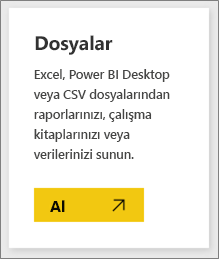
4.  **Yerel dosya**’yı seçin.
   
    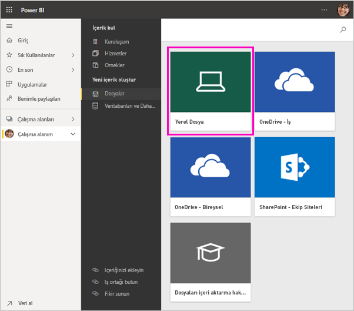

5. Bilgisayarınızda dosyanın bulunduğu konuma gidin ve **Aç** düğmesini seçin.

5. Bu öğreticide Excel dosyasını, rapor ve pano oluşturmak için kullanabileceğimiz bir veri kümesi olarak eklemek için **İçeri aktar** seçeneğini belirleyeceğiz. **Karşıya yükle** seçeneğini belirlerseniz Excel çalışma kitabının tamamı Power BI'a yüklenir. Daha sonra çalışma kitabını Excel Online'da açıp düzenleyebilirsiniz.
   
   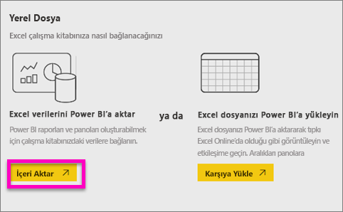
6. Veri kümeniz hazır olduğunda **Veri kümeleri**’ni seçin ve ardından rapor düzenleyicisini açmak için veri kümesi **Finansal örneğinin** yanındaki **Rapor oluştur**’u seçin. 

    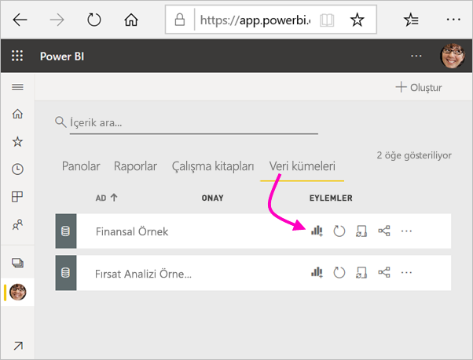

    Rapor tuvali boş olur. Sağ tarafta **Filtreler**, **Görsel Öğeler** ve **Alanlar** bölmeleri bulunur.

    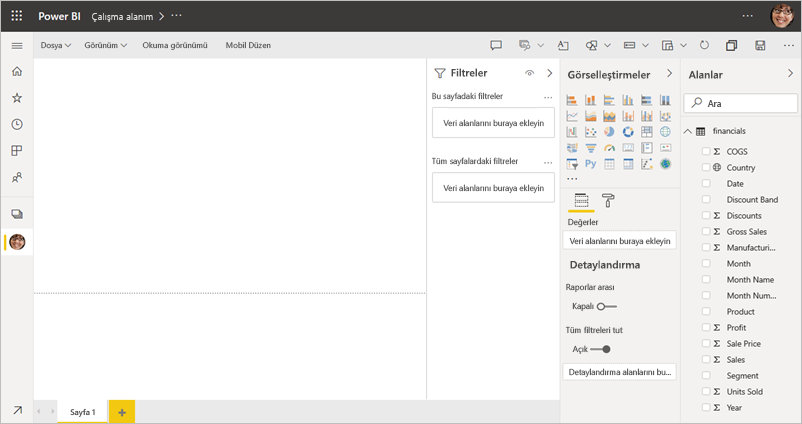

7. Üst gezinti çubuğunda **Okuma görünümü** için bir seçenek olduğuna dikkat edin. Bu seçeneğe sahip olmanız şu anda Düzenleme görünümünde olduğunuz anlamına gelir. Rapor düzenleyicisi ile ilgili bilgi edinmenin en iyi yollarından biri de [tura katılmaktır](service-the-report-editor-take-a-tour.md).

    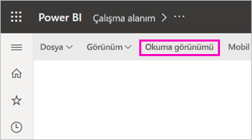

    Raporun *sahibi* olduğunuz için Düzenleme görünümünde rapor oluşturabilir ve değiştirebilirsiniz. Yani, bir *oluşturucu* olursunuz. Raporunuzu paylaştığınızda iş arkadaşlarınız *tüketici* olarak raporla yalnızca Okuma görünümü'nde etkileşim kurabilir. [Okuma görünümü ve Düzenleme görünümü](consumer/end-user-reading-view.md) hakkında daha fazla bilgi edinin.

## 2\. Adım: Raporda grafik oluşturma
Verilere bağlandığınıza göre keşfetmeye başlayabilirsiniz.  İlginizi çeken bir öğe bulduğunuzda izlemek ve zaman içindeki değişimini görmek için pano oluşturabilirsiniz. Şimdi bunun nasıl çalıştığına bakalım.
    
1. Rapor düzenleyicisinde bir görselleştirme oluşturmak için öncelikle sayfanın sağ tarafındaki **Alanlar** bölmesini kullanırız. **Gross Sales** ve **Date** onay kutularını işaretleyin.
   
   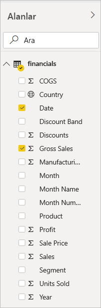

    Power BI, verileri çözümler ve bir görselleştirme oluşturur. İlk olarak **Date**'i seçtiyseniz bir tablo görürsünüz. İlk olarak **Gross Sale**'i seçtiyseniz bir sütun grafiği görürsünüz. 

2. Verilerinizi farklı şekillerde görüntüleyin. Şimdi bu verilere çizgi grafik üzerine göz atalım. **Görselleştirmeler** bölmesinden çizgi grafiği simgesini seçin.
   
   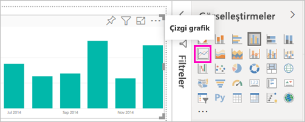

3. Bu grafik ilginç görünüyor, bunu bir panoya *sabitleyelim*. Görselleştirmenin üzerine gelin ve raptiye simgesini seçin. Görselleştirme sabitlendiğinde panonuzda depolanır ve güncelleştirilir. Böylece, en güncel değerleri bir bakışta izleyebilirsiniz.
   
   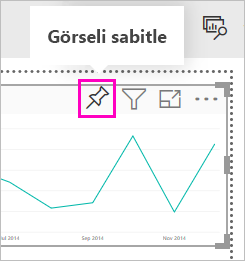

4. Bu rapor yeni olduğundan, görselleştirmeyi panoya sabitleyebilmeniz için öncelikle raporu kaydetmeniz istenir. Raporunuza bir ad verin (örn. *Sales over time*), ardından **Kaydet**'i seçin. 

5. **Yeni pano**’yu seçip *Financial sample for tutorial* adını verin. 
   
   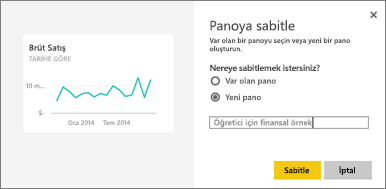
   
6. **Sabitle**'yi seçin.
   
    Sağ üst köşeye yakın bir noktada çıkan Başarılı iletisi, görselleştirmenin bir kutucuk olarak panonuza eklendiğini bildirir.
   
    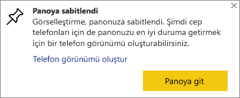

7. **Panoya git**'i seçtiğinizde çizgi grafiğin yeni panonuza kutucuk olarak sabitlendiğini görebilirsiniz. 
   
   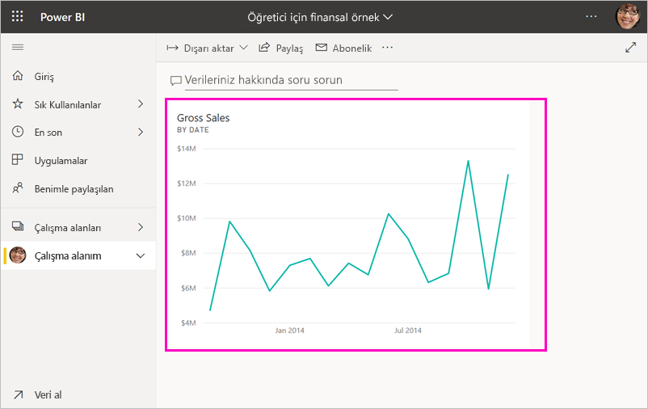
   
8. Rapora geri dönmek için panonuzdaki yeni kutucuğu seçin. Power BI, raporu Okuma görünümü'nde açar. 

1. Düzenleme görünümüne geri dönmek için üst gezin çubuğu > **Düzenle** menüsünde **Diğer seçenekler**’i (...) seçin. Düzen görünümü'ne döndükten sonra kutucukları keşfetmeye ve sabitlemeye devam edebilirsiniz.

    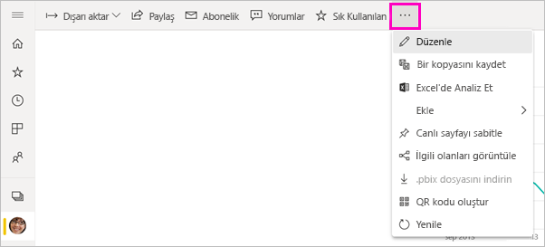

## 3\. Adım: Soru-Cevap ile araştırma

Verilerinizi hızla araştırmak için Soru-Cevap soru kutusunda soru sormayı deneyin. Soru-Cevap, verileriniz hakkında doğal dil sorguları oluşturur. Bir panoda Soru-Cevap kutusu en üst kısımdadır (**Verileriniz hakkında soru sorun**). Bir raporda, üst gezinti çubuğunda bulunur (**Bir soru sorun**).

1. Panoya geri dönmek için siyah **Power BI** çubuğunda **Çalışma alanım**’ı seçin.

    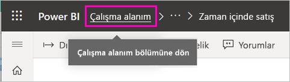

1. **Panolar** sekmesinde panonuzu seçin.

    

1. **Verilerinizle ilgili bir soru sorun**’u seçin. Soru-Cevap, otomatik olarak bir dizi öneri sunar.

    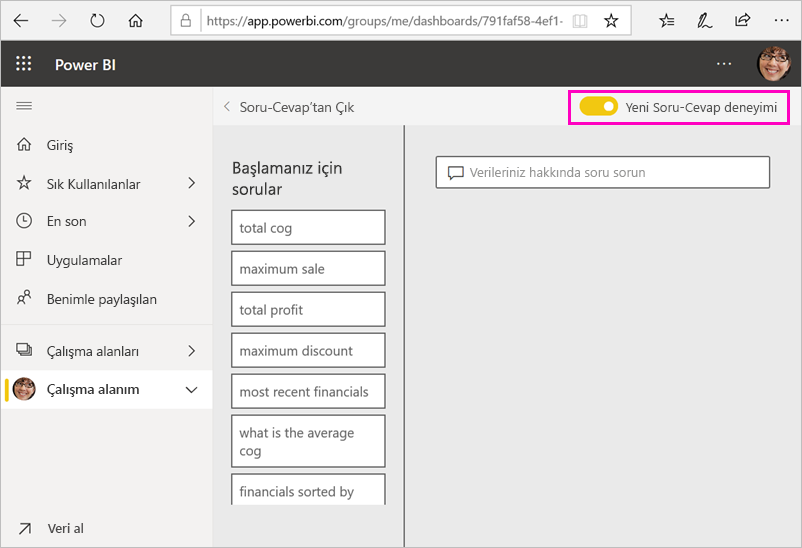

    > [!NOTE]
    > Önerileri görmüyorsanız **Yeni Soru-Cevap deneyimini** açın.

2. Bazı öneriler tek bir değer döndürür. Örneğin **maksimum satış** seçeneğini belirleyin.

    Soru-Cevap yanıt arar ve *kart* görselleştirmesi biçiminde sunar.

    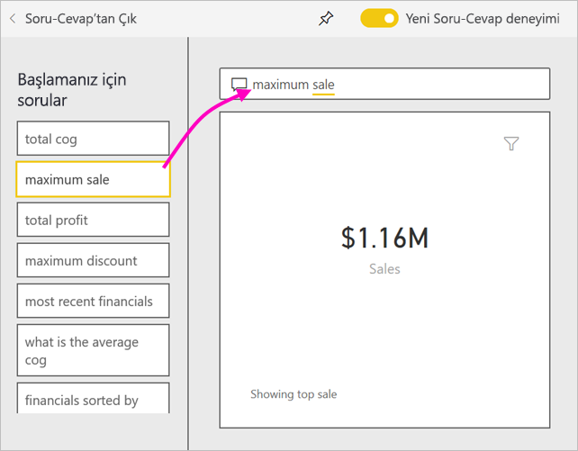

3. Bu görselleştirmenin panonuzda da gösterilmesi için raptiye simgesini  seçerek Financial Sample for tutorial panosuna sabitleyin.

1. **Başlamanıza yardımcı olan sorular** listesinde aşağı kaydırın ve **her ay için ortalama satılan malların maliyetini** seçin. 

    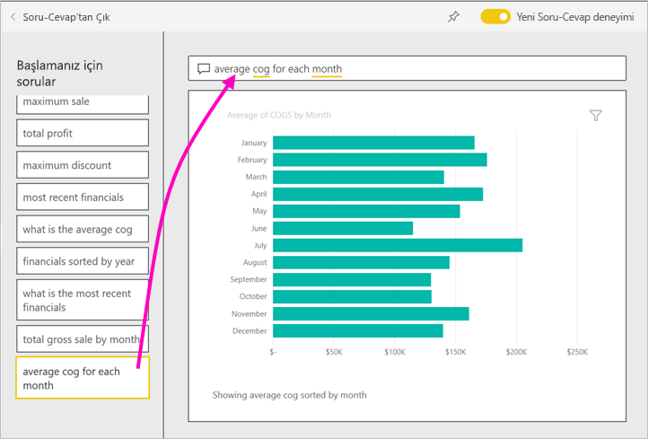

1. Çubuk grafiği de **Financial Sample for tutorial** panosuna sabitleyin.

1. İmleci Soru-Cevap kutusunda *by month* ifadesinin sonuna yerleştirin ve *as line* yazın. **Satır (Görselleştirme Türü)** seçeneğini belirleyin. 

    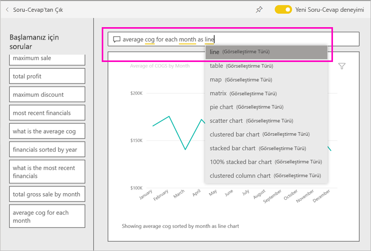

4. Oluşturduğunuz yeni kutucukları göreceğiniz panonuza geri dönmek için **Soru-Cevap'tan çık** seçeneğini belirleyin. 

   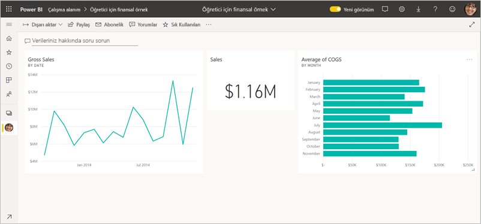

   Grafiği bir çizgi grafik olarak değiştirdiğiniz halde, kutucuk sabitlediğiniz sırada bir çubuk grafik olduğu için kutucuğun bir çubuk grafik olarak kaldığını görürsünüz. 

## 4\. Adım: Kutucukları yeniden konumlandırma

Pano geniştir. Pano alanını daha iyi kullanmak için kutucukları yeniden düzenleyebiliriz.

1. *Gross Sales* çizgi grafik kutucuğunun sağ alt köşesini, Sales kutucuğu ile aynı yüksekliğe gelene kadar yukarı doğru sürükleyip bırakın.

    

    Artık iki kutucuk aynı yükseklikte.

    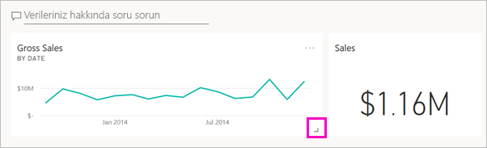

1. *Gross Sales* çizgi grafiğine sığana kadar, *Ortalama SMM* çubuk grafik kutucuğunun ortalamasını sürükleyin.

    Şimdi daha iyi görünüyor.

    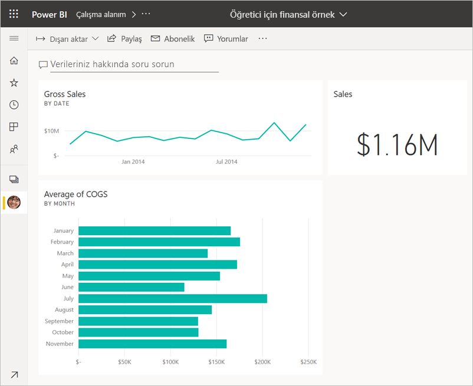

## 5 Adım: Kutucuklarla etkileşim kurma

Kendi panolarınızı ve raporlarınızı oluşturmaya başlamadan önce, görmeniz gereken son bir etkileşim aşağıda verilmiştir. Farklı kutucukları seçmek farklı sonuçlar sunar. 

1. Daha önce rapordan sabitlediğiniz *Gross Sales* çizgi grafik kutucuğunu seçin. 

    Power BI, raporu Okuma görünümünde açar. 

2. Tarayıcı geri düğmesini seçin. 

1. Şimdi Soru-Cevap’ta oluşturduğunuz *Ortalama SMM* çubuk grafik kutucuğunu seçin. 

    Power BI raporu açmaz. Bu grafiği Soru-Cevap’ta oluşturduğunuz için, grafik burada açılır.

## Kaynakları temizleme
Öğreticiyi bitirdiğinize göre şimdi veri kümesini, raporu ve panoyu silebilirsiniz. 

1. Sol gezinti çubuğunda, **Çalışma Alanım**’da olduğunuzdan emin olun.
2. **Veri Kümeleri** sekmesini seçin ve bu öğretici için içeri aktardığınız veri kümesini bulun.  
3. **Diğer seçenekler** (...) > **Sil**’i seçin.

    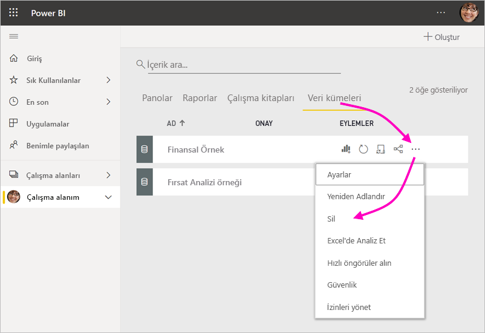

    Veri kümesini sildiğinizde, **Bu veri kümesine ilişkin verilerin bulunduğu tüm raporlar ve pano kutucukları da silinir** uyarısını görürsünüz.

4. **Sil**’i seçin.

## Sonraki adımlar

Daha fazla görselleştirme kutucuğu ekleyip [kutucukları yeniden adlandırma, yeniden boyutlandırma, bağlantılı hale getirme ve yeniden konumlandırma](service-dashboard-edit-tile.md) yoluyla panoları iyileştirin.

