# Power BI hizmeti (app.powerbi.com) ile çalışmaya başlama
Bu eğitim, ***Power BI hizmeti*** ile çalışmaya başlamanıza yardımcı olur. Power BI hizmetinin, diğer Power BI teklifleri ile nasıl bir uyum içinde çalıştığını anlamanız için ilk olarak [Power BI nedir?](guided-learning/gettingstarted.yml#step-1) makalesini okumanızı öneririz.

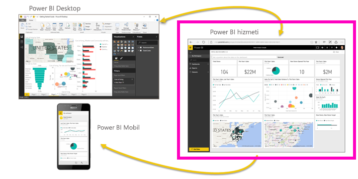

Power BI hizmetinin ücretsiz ve Pro sürümleri mevcuttur. Hangi sürümü kullanıyor olursanız olun *hesabınız varsa* tarayıcı penceresi açıp app.powerbi.com adresini girerek Power BI hizmetini açın. Yeni kullanıcıysanız www.powerbi.com adresinden başlamanızı öneririz. Bu sayfadan hizmette oturum açmadan önce Power BI hakkında daha fazla bilgi edinebilirsiniz.  Denemeye hazır olduğunuzda sağ üst köşedeki **Sign up free** (Ücretsiz kaydolun) bağlantısına tıklayın. Yöneticiniz Power BI hizmetini sizin için etkinleştirdiyse Sign up free düğmesini kullanmadan doğrudan app.powerbi.com adresine gidin. 

Power BI Desktop ile ilgili yardım almak isterseniz bkz. [Desktop ile çalışmaya başlama](desktop-getting-started.md). Power BI Mobil ile ilgili yardım almak isterseniz bkz. [Mobil cihazlar için Power BI uygulamaları](mobile-apps-for-mobile-devices.md).

> [!TIP]
> Bunun yerine kendi kendinize ilerleyebileceğiniz ücretsiz bir eğitim almayı mı tercih edersiniz? [EdX'teki Analyzing and Visualizing Data (Verileri Çözümleme ve Görselleştirme) kursumuza kaydolun](http://aka.ms/edxpbi).

[YouTube'daki oynatma listemizi](https://www.youtube.com/playlist?list=PL1N57mwBHtN0JFoKSR0n-tBkUJHeMP2cP) ziyaret edin. Introduction to Power BI service (Power BI hizmetine giriş) başlangıç için uygun bir videodur:
> 
> <iframe width="560" height="315" src="https://www.youtube.com/embed/B2vd4MQrz4M" frameborder="0" allowfullscreen></iframe>
> 
> 
> 

Microsoft Power BI, önem verdiğiniz bilgileri edinmenize ve her zaman en güncel bilgilere sahip olmanıza yardımcı olur.  Power BI hizmetindeki ***panolar***, işletmenizin nabzını tutmanıza yardımcı olur.  Panolarınızda görüntülenen ***kutucuklara*** tıkladığınızda ***raporlar*** açılır ve böylece daha fazla araştırma yapabilirsiniz.  Birden çok ***veri kümesine*** bağlanarak tüm ilgili verileri bir yerde toplayın. Power BI'ı oluşturan yapı taşlarını anlamak için yardıma mı ihtiyacınız var?  Bkz. [Power BI - Temel Kavramlar](service-basic-concepts.md).

Excel veya CSV dosyalarında önemli verileriniz varsa, bilgilere her yerden erişmek ve öngörülerinizi başkalarıyla paylaşmak için bir Power BI panosu oluşturabilirsiniz.  Salesforce gibi bir SaaS uygulaması aboneliğiniz var mı?  Salesforce'a bağlanıp ilgili verilerden otomatik olarak bir pano oluşturarak başlayın veya bağlanabileceğiniz [diğer tüm SaaS uygulamalarına göz atın](service-get-data.md). Bir kuruluşa bağlıysanız sizin için yayımlanan herhangi bir [uygulama](service-create-distribute-apps.md) olup olmadığına bakın.

[Power BI'a veri almak](service-get-data.md) için kullanabileceğiniz diğer tüm yöntemlerle ilgili bilgi edinin.

## 1. Adım: Veri alma
Aşağıda, CSV dosyasından veri almaya ilişkin bir örnek verilmiştir. Bu eğitimle birlikte ilerlemek ister misiniz? [Bu örnek CSV dosyasını indirin](http://go.microsoft.com/fwlink/?LinkID=521962).

1. [Power BI'da oturum açın](http://www.powerbi.com/). Hesabınız yok mu? Endişelenmeyin, ücretsiz kaydolabilirsiniz.
2. Power BI, tarayıcınızda açılır. Sol gezinti çubuğunun alt kısmında bulunan **Veri Al**'ı seçin.
   
   
3. **Dosyalar**'ı seçin. 
   
   
4. Bilgisayarınızda dosyanın bulunduğu konuma gidin ve **Aç** düğmesini seçin. Dosyayı OneDrive İş'e kaydettiyseniz bu seçeneği belirleyin. Yerel ortama kaydettiyseniz **Yerel dosya**'yı seçin. 
   
   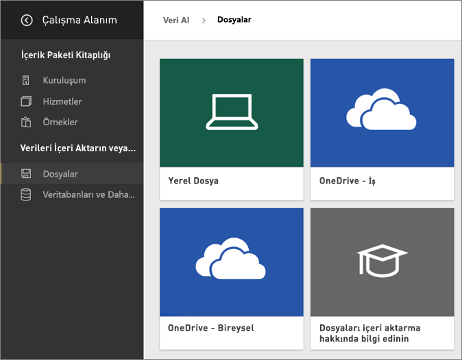
5. Bu eğitimde; Excel dosyasını, raporlar ve panolar oluşturmak için kullanabileceğimiz bir veri kümesi olarak eklemek için **İçeri aktar** seçeneğini belirleyeceğiz. **Karşıya yükle** seçeneğini belirlerseniz Excel çalışma kitabının tamamı Power BI'a yüklenir. Daha sonra çalışma kitabını Excel Online'da açıp düzenleyebilirsiniz.
   
   
6. Veri kümeniz hazır olduğunda, **Veri kümesini görüntüle**'yi seçerek veri kümesini rapor düzenleyicisinde açın. 

    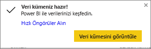

    Henüz görselleştirme oluşturmadığımız için tuval boş olacaktır.

    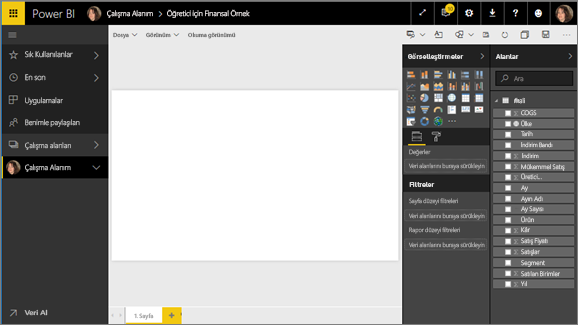

6. Üstteki menü çubuğuna baktığınızda **Okuma görünümü** seçeneğini göreceksiniz. Okuma görünümü seçeneğinin görünmesi, **Düzenleme görünümü**'nün etkin olduğunu gösterir. 

    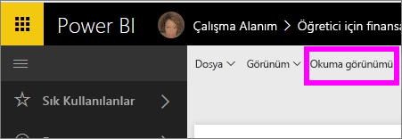

    Düzenleme görünümü'nde raporun *sahibi*, içerik *oluşturan* olduğunuz için rapor oluşturabilir ve değiştirebilirsiniz. Raporunuzu paylaştığınızda iş arkadaşlarınız *tüketici* olarak raporla yalnızca Okuma görünümü'nde etkileşim kurabilir. [Okuma görünümü ve Düzenleme görünümü](service-reading-view-and-editing-view.md) hakkında daha fazla bilgi edinin.
    
    Rapor düzenleyicisi ile ilgili bilgi edinmenin en iyi yollarından biri de [tura katılmaktır](service-the-report-editor-take-a-tour.md)
   > 
 

## 2. Adım: Veri kümenizi araştırmaya başlama
Verilere bağlandığınıza göre keşfetmeye başlayabilirsiniz.  İlginizi çeken bir öğe bulduğunuzda izlemek ve zaman içindeki değişimini görmek için pano oluşturabilirsiniz. Şimdi bunun nasıl çalıştığına bakalım.
    
1. Rapor düzenleyicisinde sayfanın sağ tarafındaki **Alanlar** bölmesini kullanarak bir görselleştirme oluşturacağız.  **Gross Sales** ve **Date** alanlarının yanındaki onay kutusunu işaretleyin.
   
   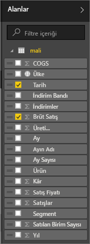

2. Power BI, verileri çözümler ve bir görselleştirme oluşturur.  İlk olarak **Date**'i seçtiyseniz bir tablo görürsünüz.  **Gross Sale**'i daha önce seçtiyseniz bir grafik görüntülenir. Verilerinizi farklı şekillerde görüntüleyin. Şimdi bu verilere çizgi grafik üzerine göz atalım. **Görsel öğeler bölmesinden** çizgi grafik simgesini (şablon olarak da bilinir) seçin.
   
   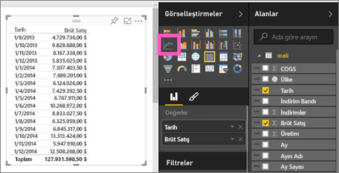

3. Veriler ilginç görünüyor, bunu bir panoya *sabitleyelim*. Görselleştirmenin üzerine gelin ve **Raptiye** simgesini seçin.  Görselleştirme sabitlendiğinde panonuzda depolanır ve güncelleştirilir. Böylece, en güncel değerleri bir bakışta izleyebilirsiniz.
   
   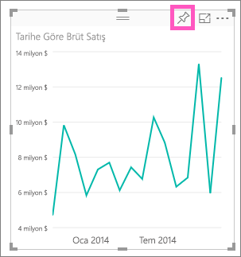

5. Bu yeni bir rapor olduğundan, görselleştirmeyi panoya sabitleyebilmeniz için öncelikle raporu kaydetmeniz istenir. Raporunuza bir ad verin (ör. *Sales over time*), ardından **Kaydet ve Devam Et**'i seçin. 
   
   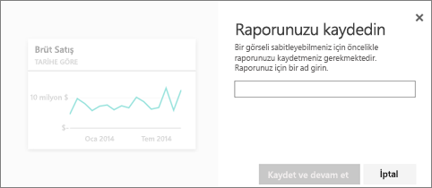
   
6. Şimdi çizgi grafiği yeni panoya sabitleyip "Financial sample for tutorial" adını verelim. 
   
   
   
 1. **Sabitle**'yi seçin.
   
    Sağ üst köşeye yakın bir noktada çıkan Başarılı iletisi, görselleştirmenin bir kutucuk olarak panonuza eklendiğini bildirir.
   
    

8. **Panoya git**'i seçtiğinizde çizgi grafiğin yeni panonuza kutucuk olarak sabitlendiğini görebilirsiniz. Daha fazla görselleştirme kutucuğu ekleyip [kutucukları yeniden adlandırma, yeniden boyutlandırma, bağlantılı hale getirme ve yeniden konumlandırma](service-dashboard-edit-tile.md) yoluyla panonuzu iyileştirin.
   
   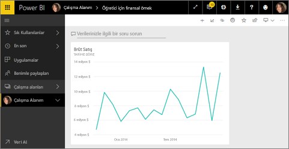
   
   İstediğiniz zaman rapora geri dönmek için panonuzdaki yeni kutucuğu seçin. Power BI rapor düzenleyicisi Okuma görünümü'nde açılır. Düzenleme görünümü'ne geçmek için üst menü çubuğundan **Raporu düzenle**'yi seçin. Düzenleme görünümü'ne geçtikten sonra kutucukları keşfetmeye ve sabitlemeye devam edin. 

## 3. Adım: Soru-Cevap ile araştırmaya devam etme (doğal dil sorgusu)
1. Verilerinizi hızla araştırmak için Soru-Cevap kutusunda soru sormayı deneyin. Soru-Cevap soru kutusu panonuzun en üstünde (**Verileriniz hakkında soru sorun** ) ve raporunuzun üstündeki menü çubuğunda (**Bir soru sorun**) yer alır. Örneğin, "what segment had the most revenue" (en çok gelir elde eden segment) yazın.
   
   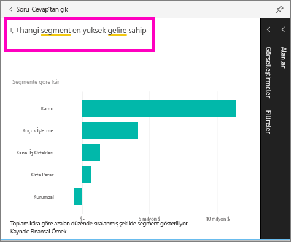

2. Soru-Cevap yanıt arar ve görselleştirme biçiminde sunar. Bu görselleştirmeyi de panonuzda göstermek için raptiye simgesini  seçin.
3. Görselleştirmeyi "Financial Sample for tutorial" panosuna sabitleyin.
   
    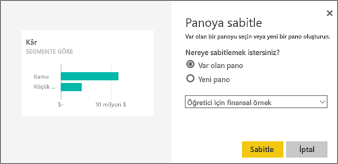

4. Panonuza döndüğünüzde yeni kutucuğu görebilirsiniz.

   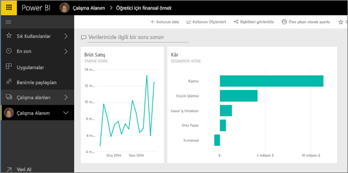

## Sonraki adımlar
Daha fazlasını denemeye hazır mısınız?  Power BI ile ilgili keşif yapmak için uygulayabileceğiniz bazı harika yöntemler.

* [Başka bir veri kümesine bağlanın](service-get-data.md).
* İş arkadaşlarınızla [panonuzu paylaşın](service-share-dashboards.md).
* [Pano tasarlamaya ilişkin ipuçlarını](service-dashboards-design-tips.md) okuyun.
* Panolarınızı [mobil cihazdaki bir Power BI uygulamasında](mobile-apps-for-mobile-devices.md) görüntüleyin.

Henüz hazır değil misiniz? Power BI ile kolayca çalışmanıza yardımcı olmak için tasarlanan şu konu başlıklarına göz atın:

* [Raporların, veri kümelerinin, panoların ve kutucukların nasıl bir uyum içinde çalıştığı hakkında bilgi edinin](service-basic-concepts.md)
* [Power BI Destekli Öğrenim](guided-learning/index.md) sitesini ziyaret edin ve birkaç (çok kısa) derse katılın
* Bazı [Power BI videolarını](videos.md) izleyin
* [Kullanımınıza sunulan örnek verilere bakın](sample-datasets.md)

### Power BI ile bağlantıda kalın
* [Twitter'da @MSPowerBI hesabını takip edin](https://twitter.com/mspowerbi)
* [YouTube video kanalımıza](https://www.youtube.com/channel/UCy--PYvwBwAeuYaR8JLmrfg) abone olun
* İsteğe bağlı olarak sunulan, [Power BI ile Çalışmaya Başlama web seminerlerimizi](webinars.md) izleyin
* Yardım için nereye başvuracağınızdan emin değil misiniz? [Yardım almaya yönelik 10 ipucu ](service-tips-for-finding-help.md) sayfamıza başvurun

Başka bir sorunuz mu var? [Power BI Topluluğu'na sorun](http://community.powerbi.com/)

