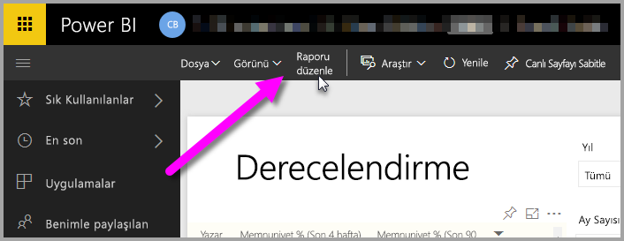
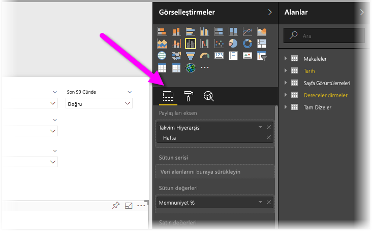
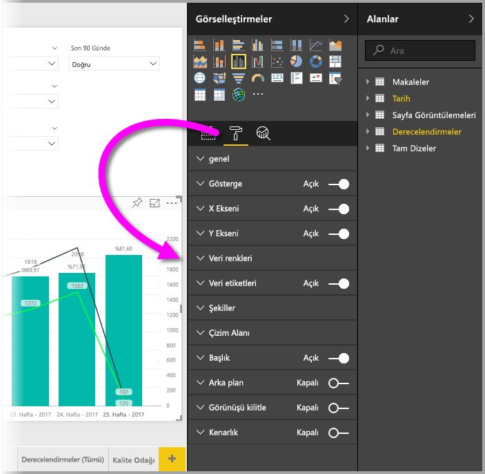
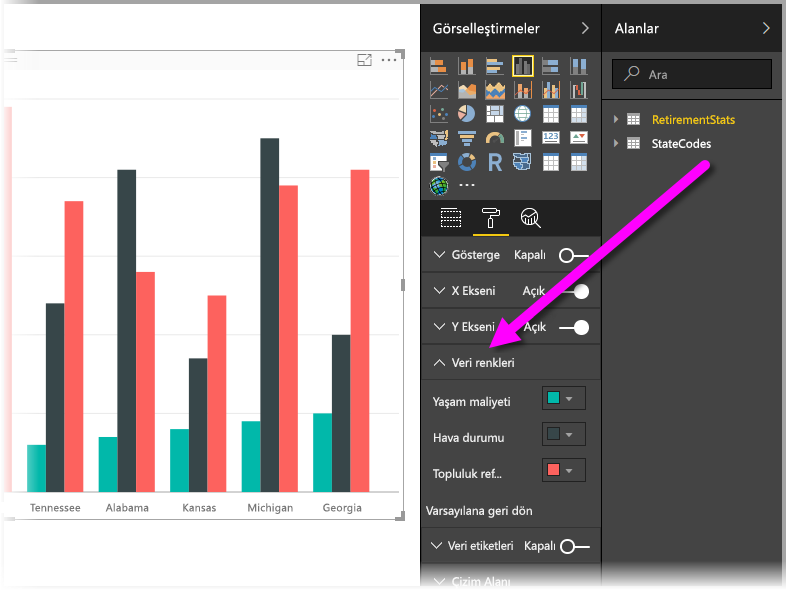
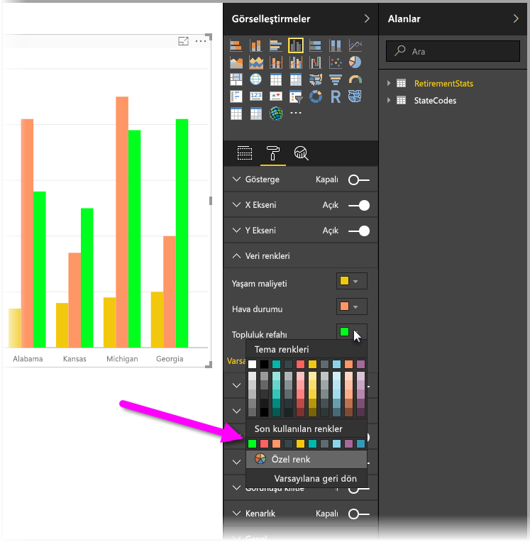
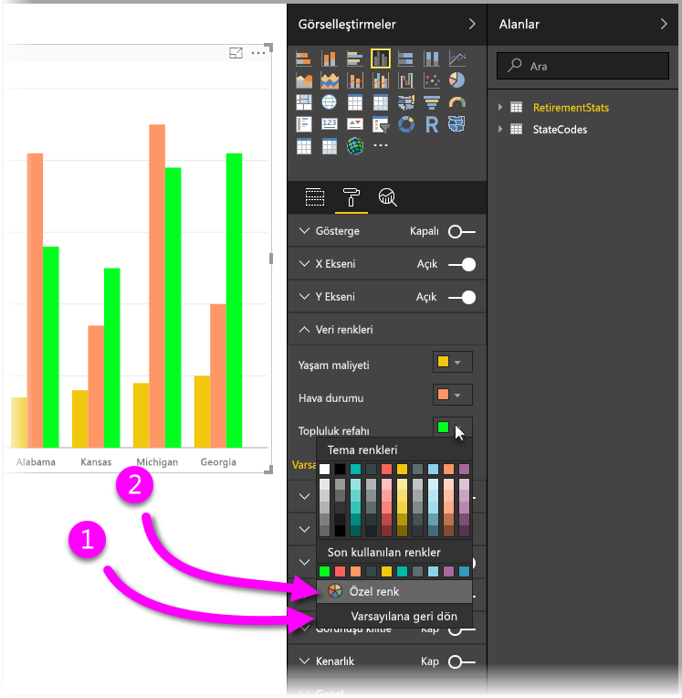
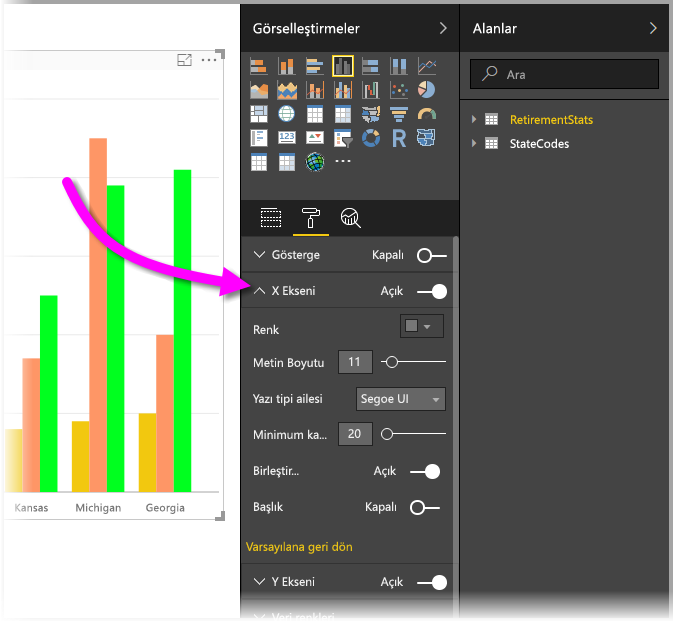

# Renk biçimlendirme ve eksen özelliklerini kullanmaya başlama
**Power BI**'da veri serilerinin ve veri noktalarının rengini ve hatta görselleştirmelerin arka planını değiştirebilirsiniz. Ayrıca, panolarınızın ve raporlarınızın görünümünü denetlemenize olanak sağlayan x ve y eksenlerinin görünümünü de değiştirebilirsiniz.

Başlamak için **Çalışma Alanım** bölmesinden bir **Rapor** seçin. Ardından, üstteki menü alanından **Raporu düzenle** seçeneğini belirleyin.  

Raporları düzenlerken bir görselleştirme seçtiğinizde, görselleştirme eklemenize veya değiştirmenize olanak sağlayan **Görsel Öğeler** bölmesi görünür. Kullanılabilir görselleştirmelerin hemen altında üç simge bulunur: **Alanlar** simgesi (üst üste iki çubuk), **Biçim** simgesi (rulo fırça) ve **Analiz** simgesi (büyüteç). Aşağıdaki görüntüde **Alanlar** simgesi seçilidir ve bu seçim, simgenin altında sarı bir çizgi ile gösterilir.

**Biçim**'i seçtiğinizde simgenin altındaki alanda, geçerli durumda seçili olan görselleştirme için kullanılabilir renk ve eksen özelleştirmeleri görüntülenir.  

Her bir görselleştirme için birden çok öğeyi özelleştirebilirsiniz:

* Açıklama
* X ekseni
* Y ekseni
* Veri renkleri
* Veri etiketleri
* Şekiller
* Çizim alanı
* Başlık
* Arka plan
* Görünüşü kilitle
* Kenarlık

> [!NOTE]
>  
> Bu öğelerin hepsini her görselleştirme türünde göremezsiniz. Kullanabileceğiniz özelleştirme türleri, seçtiğiniz görselleştirmeye göre değişir; örneğin, pasta grafiklerinde X ekseni bulunmadığı için pasta grafiği seçtiğinizde X ekseni öğesini göremezsiniz.
> 
> 

Ayrıca, seçili bir görselleştirmeniz yoksa simgelerin yerinde, sayfadaki tüm görselleştirmelere filtre uygulamanıza olanak sağlayan **Filtreler** bölümü görünür.

Şimdi, renklerle çalışma ve eksenlerin özelliklerini değiştirme ile ilgili iki örnek inceleyelim. Bu makaleyi okumayı bitirdiğinizde renkler, eksenler ve etiketleri istediğiniz ölçüde özelleştirebileceksiniz.

## Renklerle çalışma
Bir grafikteki renkleri özelleştirmek için gerekli adımlara göz atalım.

1. Rapor tuvalinden bir **Kümelenmiş Sütun Grafik** seçiyoruz.
2. Daha sonra, kullanılabilir özelleştirmeleri göstermek için **Biçim** simgesini seçiyoruz.
3. Ardından, **Veri Renkleri** özelleştirmesinin solundaki aşağı oka tıklıyoruz. Böylece, seçtiğimiz görselleştirmeye özgü seçenekleri içeren ve Veri Renklerinin nasıl özelleştirilebileceğini gösteren bir alan açılır.
4. **Veri Renkleri**, kullanılabilir özelleştirmeleri gösterecek şekilde aşağıya doğru genişler.  
   

Şimdi birkaç değişiklik yapalım. Rengin yanındaki aşağı oku seçerek, kullanılabilir olan her bir veri serisinde değişiklik yapabiliriz. **Cost of living** bölümünü sarı, **Weather** bölümünü turuncu ve **Community well-being** bölümünü yeşil yapalım. Aşağıdaki ekranda **Cost of living** rengini değiştirdiğimiz son adım gösterilmektedir.  

Değişiklikler yandaki görüntüde gösterilmektedir. İşte size çok renkli bir grafik! Renklerle çalışırken aklınızda bulunması gereken birkaç faydalı öğeden bahsedelim. Aşağıdaki listede verilen rakamlar, alttaki ekranda bu faydalı öğelere nereden erişebileceğinizi veya bunları nereden değiştirebileceğinizi de göstermektedir.

1. Renkleri sevmediniz mi? Sorun değil, varsayılan ayarlara geri dönmek için **Varsayılana geri dön** seçeneğini belirlemeniz yeterlidir. Bunu sadece bir renk için yapabileceğiniz gibi görselleştirmenin tamamı için de yapabilirsiniz.
2. Palette olmayan bir rengi mi uygulamak istiyorsunuz? **Özel renk** seçeneğini belirleyip renk yelpazesinden istediğiniz rengi seçin.  
   

Yaptığınız değişikliği sevmediniz mi? Zaten alışkın olduğunuz bir yöntem olan **CTRL+Z** ile değişikliğinizi geri alabilirsiniz.

## Eksen özelliklerini değiştirme
X ekseni ve Y eksenini değiştirmek genellikle kullanışlı bir işlemdir. Renkleri değiştirirken yaptığınız gibi bir ekseni de, aşağıdaki görüntüde gösterilen şekilde eksenin solundaki aşağı ok simgesini seçerek değiştirebilirsiniz.  

**X Ekseni** seçeneklerini daraltmak isterseniz **X Ekseni**'nin yanındaki yukarı oku seçin.

**X Ekseni**'nin yanındaki radyo düğmesini açıp kapatarak X ekseni etiketlerini tamamen kaldırabilirsiniz. Ayrıca, **Başlık**'ın yanındaki radyo düğmesini seçerek eksen başlıklarını etkinleştirmeyi veya devre dışı bırakmayı tercih edebilirsiniz.  

Geniş renk yelpazesinin yanı sıra Power BI raporlarına ve panolarına uygulayabileceğiniz çok daha fazla özelleştirme bulunur.

> [!NOTE]
>  
> **Biçim** simgesi seçiliyken kullanılabilen bu renkler, eksenler ve ilgili özelleştirmeler Power BI Desktop'ta da kullanılabilir.
> 
> 

## Sonraki adım
Daha fazla bilgi için aşağıdaki makaleyi inceleyin:  

* [Power BI'da renk biçimlendirmeye ilişkin ipuçları ve püf noktaları](service-tips-and-tricks-for-color-formatting.md)  

