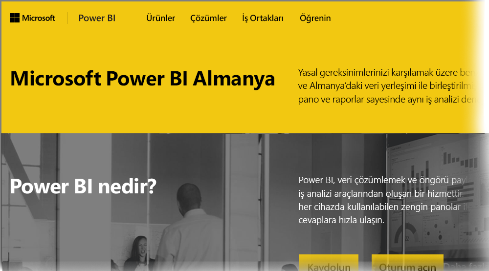

# Almanya Bulut müşterileri için Power BI hakkında Sık Sorulan Sorular
**Power BI hizmeti**, Avrupa Birliği/Avrupa Serbest Ticaret Birliği (EU/EFTA) müşterilerine yönelik genelde Microsoft Cloud Deutschland (MCD) olarak adlandırılan bir sürüme sahiptir. Bu makalede ele alınan **Power BI hizmeti** sürümü, EU/EFTA müşterileri için özellikle tasarlanmıştır ve **Power BI hizmetinin** ticari sürümünden veya kamu müşterilerine sunulan Power BI hizmetlerinden farklıdır.

## Sorular ve cevaplar

Aşağıdaki sorular ve cevaplar, EU/EFTA müşterilerine özel olarak sunulan Power BI hizmet bulutu olan Microsoft Cloud Deutschland (MCD) içindeki Power BI Pro Hizmeti hakkında önemli bilgiler vermektedir.

1. **Almanya Bulutu için Power BI hizmeti nedir?**
   
   Microsoft Cloud Deutschland (MCD) olarak da adlandırılan EU/EFTA müşterilerine yönelik Power BI hizmeti, Alman veri merkezlerinden sunulan Power BI hizmeti içeren EU/EFTA uyumlu bir buluttur. EU/EFTA bulutuna yönelik Power BI hizmetindeki tüm müşteri verileri, bekleme durumundayken Almanya'da depolanır ve bağımsız Alman veri güvenilen kurumu olarak T-Systems hizmet vermekte, verilere fiziksel ve mantıksal erişim ise Alman yasaları çerçevesinde denetlenmektedir. EU/EFTA bulutuna yönelik Power BI hizmeti için Power BI hizmetinin ticari sürümünden bağımsız ve ayrı bir hesap gerekir. Microsoft Cloud Deutschland hakkında daha fazla bilgiye [buradan](https://www.microsoft.com/trustcenter/cloudservices/nationalcloud) ulaşabilirsiniz.
2. **Power BI Almanya Bulutu hakkında fiyat ve kayıt bilgilerine nereden ulaşabilirim?**
   
   [Power BI Almanya Bulutu ana sayfasından](https://powerbi.microsoft.com/power-bi-germany/) fiyat bilgileri dahil olmak üzere birçok bilgiye ulaşabilirsiniz. Bu sayfada 25 kullanıcı lisansına sahip 30 günlük **Power BI Pro hizmeti** deneme sürümüne kaydolma bağlantısı da yer almaktadır. Deneme sürümüne kaydolurken ihtiyacınız doğrultusunda lisans satın alabilir veya ekleyebilirsiniz. Ayrıca Kurumsal Sözleşme (EA), Kamu ve kâr amacı gütmeyen kuruluş fiyatları da sunuyoruz. Daha fazla bilgi için lütfen Microsoft müşteri temsilcinize ulaşın.
3. **Azure Almanya ve/veya Office 365 Almanya aboneliklerimin bir parçası olarak Almanya Bulutu kiracım var. Power BI Almanya'ya kaydolmak için mevcut kiracımı kullanabilir miyim?**
   
   Evet. Kaydolma işlemi sırasında var olan Almanya Bulutu kiracınızın yönetici hesabıyla oturum açarak Almanya Bulutu'ndaki mevcut kiracınıza Power BI Pro lisansı ekleyebilirsiniz. Almanya Bulutu kiracılarının ve kullanıcı hesaplarının Almanya bulutu Power BI hizmetinden farklı olduğunu unutmayın.
4. **Almanya bulutu için Power BI hizmetinde ücretsiz hizmet seçeneği var mı?**
   
   Hayır. Almanya bulutu için Power BI hizmetinde ücretsiz lisans sürümü sunmuyoruz. Ancak, işletmenizin ihtiyaçları Power BI ücretsiz sürümüne uygunsa [genel bulutumuzdaki Power BI ücretsiz teklifine](https://powerbi.microsoft.com/get-started/) kaydolmanızı öneriyoruz.
5. **Power BI Desktop, Power BI Mobil, Şirket içi veri ağ geçidi ve Excel için Publisher uygulamalarını Almanya için Power BI hizmeti bulutu ile kullanabilir miyim?**
   
   Evet. Power BI istemci ürünlerimizi Almanya bulutu için Power BI hizmetiyle sorunsuz çalışacak şekilde güncelleştirdik. Aynı hizmetleri Almanya bulutu için Power BI hizmetiyle kullanmaya başlamak istiyorsanız lütfen Almanya bulutu için Power BI hizmeti hesabınızda oturum açın. İstemci ürünlerinin son sürümünü şu konumlardan indirebilirsiniz:
   
   * [Power BI Desktop](https://powerbi.microsoft.com/desktop/)
   * [Power BI Mobil](https://powerbi.microsoft.com/mobile/)
   * [Şirket içi veri ağ geçidi](https://powerbi.microsoft.com/gateway/)
   * [Excel için Power BI Publisher](https://powerbi.microsoft.com/excel-dashboard-publisher/)
6. **Almanya bulutu için Power BI hizmetinde özellik sınırlamaları var mı?**
   
   Aşağıdaki hizmet özellikleri şu anda Almanya bulutu için Power BI hizmetinde mevcut değildir:
   
   * Web'de yayımla
   * ArcGIS maps by Esri
   * Power BI Embedded (ayrı ölçülen ISV lisansı, ileride [Microsoft Azure Almanya](https://azure.microsoft.com/overview/clouds/germany/) tarafından sunulacak)
7. **Uygulamalarımda kullanmak ve tümleştirmek üzere Almanya bulutu için Power BI hizmetine özel yapılandırma bilgilerini nerede bulabilirim?**
   
   [SaaS Embedding geliştirici örneklerimizi](https://github.com/Microsoft/PowerBI-Developer-Samples) Almanya ve diğer Power BI bulutlarına özgü yapılandırma bilgileriyle güncelleştirdik. Buluta özgü yapılandırma uç noktaları için lütfen örneklerdeki **Bulut Yapılandırmaları** klasörüne bakın. Aşağıdaki tabloda Almanya bulutu için Power BI hizmetine yönelik farklı yapılandırma uç noktaları yer almaktadır (çapraz başvuru için Genel Bulut karşılıkları da verilmiştir).

| **Uç nokta adı ve/veya kullanımı** | **Almanya bulutu için Power BI hizmeti URL'si** | **Genel Buluttaki eşdeğer URL (çapraz başvuru için)** |
| --- | --- | --- |
| Giriş Sayfası, Kaydolma ve Oturum Açma |[https://powerbi.microsoft.com/power-bi-germany/](https://powerbi.microsoft.com/power-bi-germany/) |[https://powerbi.microsoft.com/](https://powerbi.microsoft.com/) |
| Power BI Hizmetinde doğrudan oturum açma |[https://app.powerbi.de/?noSignUpCheck=1](https://app.powerbi.de/?noSignUpCheck=1) |[https://app.powerbi.com/?noSignUpCheck=1](https://app.powerbi.com/?noSignUpCheck=1) |
| Hizmet API'si |[https://api.powerbi.de/](https://api.powerbi.de/) |[https://api.powerbi.com/](https://api.powerbi.com/) |
| Kullanıcı lisansı yönetimi, hizmet durumu ve yönetici destek istekleri için Office portalı |[https://portal.office.de/](https://portal.office.de/) |[https://portal.office.com/](https://portal.office.com/) |
| AAD Yetki URI'si |[https://login.microsoftonline.de/common/oauth2/authorize/](https://login.microsoftonline.de/common/oauth2/authorize/) |[https://login.microsoftonline.com/common/oauth2/authorize/](https://login.microsoftonline.com/common/oauth2/authorize/) |
| Power BI Hizmeti Kaynak URI'si |[https://analysis.cloudapi.de/powerbi/api](https://analysis.cloudapi.de/powerbi/api) |[https://analysis.windows.net/powerbi/api](https://analysis.windows.net/powerbi/api) |
| Özel Görsel Kitaplığı |[https://app.powerbi.de/visuals/](https://app.powerbi.de/visuals/) |[https://app.powerbi.com/visuals/](https://app.powerbi.com/visuals/) |
| Power BI'a Uygulama Kaydetme (Embedded için) |[https://app.powerbi.de/apps](https://app.powerbi.de/apps) |[https://app.powerbi.com/apps](https://app.powerbi.com/apps) |
| Azure Portal (Embedded için) |[https://portal.microsoftazure.de/](https://portal.microsoftazure.de/) |[https://portal.azure.com/](https://portal.azure.com/) |
| Topluluk |[https://community.powerbi.com/](https://community.powerbi.com/) |[https://community.powerbi.com/](https://community.powerbi.com/) |

## Sonraki adımlar
Power BI ile yapabileceğiniz çok şey vardır. Daha fazla bilgi için, hizmete nasıl kaydolacağınızı açıklayan bir makaleyi de içeren aşağıdaki kaynaklara başvurun:

* [Power BI için Destekli Öğrenme](guided-learning/gettingstarted.yml?tutorial-step=1)
* [Power BI hizmeti ile çalışmaya başlama](service-get-started.md)
* [Power BI Desktop nedir?](desktop-what-is-desktop.md)

