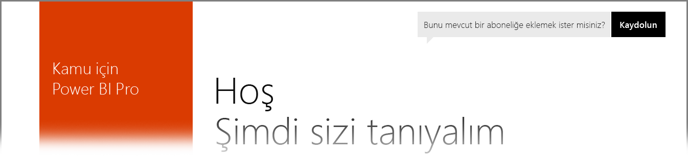

# Power BI US Government müşterileri
**Power BI hizmetinin**, **Office 365 US Government Community** aboneliklerinin bir parçası olarak ABD Kamu müşterilerine yönelik bir sürümü bulunmaktadır. Bu makalede ele alınan **Power BI hizmeti** sürümü, ABD Kamu müşterileri için özellikle tasarlanmıştır ve **Power BI hizmetinin** ticari sürümünden farklıdır.

Aşağıdaki bölümlerde, **Power BI hizmetinin** US Government sürümündeki *özellikler* tanımlanmış, buna ilişkin bazı *sınırlamalar* açıklanmış, Sıkça Sorulan Sorular (**SSS**) ve bunların cevapları listelenmiş ve daha fazla bilgi için bağlantılar sağlanmıştır.

## Power BI US Government hizmetinin özellikleri
Lütfen **Power BI US Government** hizmetinin yalnızca **Pro lisansı** olarak sunulduğunu ve Ücretsiz lisans olarak kullanılamadığını unutmayın. Power BI hizmetinin belirli özellikleri, hizmetin **Power BI US Government** sürümünde de kullanılabilir.

**Pro** lisansı işlevleri için geçerli olan ve **Power BI US Government** müşterilerine sunulan özellikler şunlardır:

* Pano ve rapor oluşturma ve bunları görüntüleme
* [Veri kapasitesi sınırları](service-admin-manage-your-data-storage-in-power-bi.md)
* [Zamanlanmış veri yenileme](refresh-data.md)
* Yenilenebilir ekip panoları
* Paylaşım ve erişim denetimi yönetimine ilişkin Active Directory grupları
* Excel, CSV ve Power BI Desktop dosyalarından rapor ve [veri aktarma](service-get-data.md)
* Veri Yönetimi Ağ Geçidi
* Tüm veriler hem Azure SQL hem de Blob Depolama Alanı'nda şifrelenir
* [İçerik paketleri](service-connect-to-services.md) ile hizmetlere bağlanma

## Kamuya ve Genel kullanıma sunulan Azure Bulut hizmetleri arasında bağlantı 

Azure birçok bulutta dağıtılmaktadır. Varsayılan olarak kiracıların, buluta özgü bir örnek için güvenlik duvarı kurallarını açmasına izin verilir ancak bulutlar arası ağlar farklıdır ve hizmetler arasında iletişim kurulabilmesi için belirli güvenlik duvarı kurallarının açılması gerekir. Power BI müşterisiyseniz ve genel bulutta erişmeniz gereken SQL örnekleriniz varsa aşağıdaki veri merkezleri için SQL'de Azure Kamu Bulutu IP alanı için belirli güvenlik duvarı kurallarını açmanız gerekir:

* USGov Iowa
* USGov Virginia
* USGov Texas
* USGov Arizona

Genel bulutta IP alanları kullanılabilir ancak kamu bulutunda, yukarıda listelenen veri merkezlerine ilişkin IP aralıklarını istemek için bir Azure Destek bileti oluşturmanız gerekir. 

## Power BI US Government hizmetine ilişkin sınırlamalar
**Power BI hizmetinin** ticari sürümünde sunulan özelliklerden bazıları, ABD Kamu müşterilerine yönelik **Power BI hizmetinde** *sunulmamaktadır*. Power BI ekibi, söz konusu özelliklerin ABD Kamu müşterilerine de sunulması için aktif olarak çalışarak ilgili özellikler kullanılabilir olduğunda bu makaleyi güncelleştirecektir.

* **SharePoint Online'da ekleme** - Power BI web bölümünü kullanarak SharePoint Online’a içerik eklemek mümkün değildir.
* **Power BI US Government**, yalnızca **Pro** lisans olarak kullanılabilir. Bir yönetim portalında (veya kullanıcılar olarak) Power BI (Ücretsiz) lisanslarına yapılan tüm başvurular, ticari bir Power BI hizmet bulutunda çalışmaktadır.
* **Denetim** - Denetim, Office 365 Güvenlik ve Uyumluluk portalı aracılığıyla kullanılamaz.
* **Cortana'da Power BI içeriği**: Cortana arama sonuçlarında Power BI sonuçları gösterilmez. Buna, Power BI içeriğinizin (panolar, raporlar, uygulamalar) yanı sıra belirli anahtar sözcüklere göre, Cortana için en iyi duruma getirilmiş rapor sayfalarına ilişkin sonuçlar da dahildir.
* **Dış kullanıcı paylaşımı** - Yalnızca bir Power BI kiracısı içinde paylaşıma izin verilir; Power BI kiracınız dışındaki kullanıcılarla paylaşım yapamazsınız.

Hesabınıza atanmış Ücretsiz **Power BI** lisansları varsa bu lisanslar, **Power BI** hizmetinin ticari bir sürümünde çalıştırılmaktadır ve **Power BI US Government** teklifinin bir parçası değildir. Bu Ücretsiz hesaplar ile ilgili olarak aşağıdaki sorunlarla karşılaşabilirsiniz:

* Gateway, Mobil ve Desktop kimlik doğrulaması yapamaz
* Azure ticari veri kaynaklarına erişemezsiniz
* PBIX dosyaları, ticari sürümden el ile karşıya yüklenmelidir
* Power BI mobil uygulamaları kullanılamaz

Bu sorunları gidermek için lütfen hesap temsilciniz ile iletişim kurun.

## Power BI hizmetinin US Government sürümü ile ilgili olarak Sıkça Sorulan Sorular (SSS)
Aşağıdaki sorular (ve cevapları), hizmet ile ilgili ihtiyacınız olan bilgileri hızla almanıza yardımcı olmak için verilmiştir.

**Soru:** Ticari **Power BI** verilerimi ABD Kamu müşterileri için **Power BI hizmetine** nasıl aktarabilirim?

**Cevap:** Yöneticinizin US Government'a özel ayrı bir abonelik altında yeni bir **Power BI** örneği oluşturması gerekir. Ardından, ticari verilerinizi ABD Kamu müşterileri için **Power BI hizmetinde** çoğaltabilir, ticari lisansınızı kaldırabilir ve mevcut etki alanınızı US Government'a özel yeni hizmet ile ilişkilendirebilirsiniz.

**Soru:** Belirli bir içerik paketine neden bağlanamıyorum?

**Cevap:** Bir içerik paketine bağlanmadan önce ilgili içerik paketine ilişkin aboneliğinizin etkinleştirildiğinden emin olmalısınız.

**Soru:** ABD Kamu kuruluşum için **Power BI** hizmeti almakla ilgileniyorum. Nereden başlamalıyım?

**Cevap:** Kaydolma (genellikle *ekleme* olarak adlandırılır) işlemi, mevcut lisansınıza ve aboneliğinize göre farklılık gösterebilir. Daha fazla bilgi için [Power BI US Government'a kaydolma](service-govus-signup.md) makalesine bakın.

**Soru:** **Power BI** US Government'a bağlanmak için kullanılan URL ticari **Power BI** URL'sinden farklı mı?

**Cevap:** Evet, URL'ler farklıdır. URL'ler aşağıdaki tabloda gösterilmiştir:

| Ticari sürüm URL'si | US Government sürümü URL'si |
| --- | --- |
| https://app.powerbi.com/ |[https://app.powerbigov.us](https://app.powerbigov.us) |

## Sonraki adımlar
Power BI ile yapabileceğiniz çok şey vardır. Daha fazla bilgi için, hizmete nasıl kaydolacağınızı açıklayan bir makaleyi de içeren aşağıdaki kaynaklara başvurun:

* [Power BI US Government'a kaydolma](service-govus-signup.md)
* <a href="https://channel9.msdn.com/Blogs/Azure/Cognitive-Services-HDInsight-and-Power-BI-on-Azure-Government">Power BI US Government Demosu</a>
* [Power BI için Destekli Öğrenme](guided-learning/gettingstarted.yml?tutorial-step=1)
* [Power BI hizmeti ile çalışmaya başlama](service-get-started.md)
* [Power BI Desktop ile çalışmaya başlama](desktop-getting-started.md)

