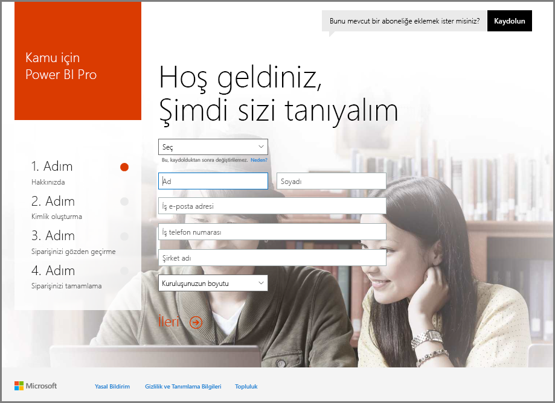
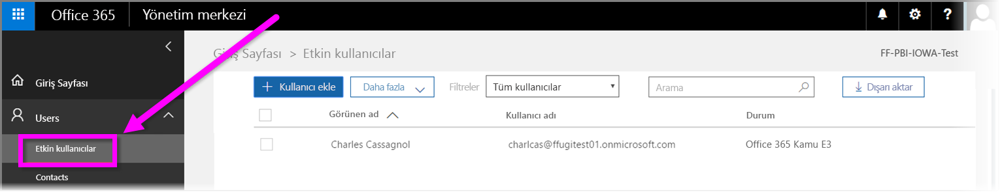

# ABD Kamu kuruluşunuzu Power BI hizmetine kaydetme
**Power BI hizmetinin**, **Office 365 US Government Community** aboneliklerinin bir parçası olarak ABD Kamu müşterilerine yönelik bir sürümü bulunmaktadır. Bu makalede ele alınan **Power BI hizmeti** sürümü, ABD Kamu müşterileri için tasarlanmıştır ve **Power BI hizmetinin** ticari sürümünden farklıdır.

Özellikler ve sınırlamalar dahil olmak üzere ABD Kamu kuruluşlarına yönelik **Power BI hizmeti** hakkında daha fazla bilgi için bkz. [Power BI US Government - Genel Bakış](service-govus-overview.md).

> [!NOTE]
> Bu makale ABD Kamu kuruluşlarını Power BI'a kaydetme yetkisine sahip olan yöneticiler için yazılmıştır. Son kullanıcıysanız Power BI US Government aboneliğine sahip olma hakkında bilgi almak üzere yöneticinize başvurun.
> 
> 

## ABD Kamu kuruluşunuz için doğru kaydolma sürecini seçme
ABD Kamu kuruluşunuz, **Office Kamu Bulutu**'nda yeni veya abonelik sahibi olabilir. Aşağıdaki bölümlerde Office Kamu Bulutu ve Power BI durumlarınıza göre belirlenen ve var olan aboneliğinize göre farklılık gösteren kaydolma adımlarına yer verilmiştir.

Power BI US Government hizmetine kaydolduktan sonra satış veya destek temsilciniz katılım sürecinizi tamamlayana kadar bazı özellikler çalışmayabilir. Bu özellikler hakkında bilgi edinmek için bkz. [Power BI US Government - Genel Bakış](service-govus-overview.md). Bu özellikleri etkinleştirmek üzere katılım sürecini tamamlamak için satış veya destek temsilcinize başvurun.

### Yeni Office Bulutu müşterileri olan ABD Kamu kuruluşları
Kuruluşunuz yeni bir **Office Kamu Bulutu** müşterisiyse aşağıdaki adımları uygulayın:

> [!NOTE]
> Bu adımların portal yöneticisi tarafından gerçekleştirilmesi gerekir.
>

1. [https://products.office.com/government/office-365-web-services-for-government](https://products.office.com/government/office-365-web-services-for-government) adresine gidin.

>[!NOTE]
>Bu adımda Office Kamu Bulutu'na kaydolmak istemiyorsanız lütfen satış temsilcinize ulaşın.
>

2. Office G3'ü seçin ve Office deneme sürümü formunu doldurun
3. Office Bulutu müşterisi olduktan sonra aşağıdaki "Mevcut Office Kamu Bulutu müşterileri" bölümündeki adımlara geçin

### Mevcut Office Kamu Bulutu müşterileri
Kuruluşunuz **Office Kamu Bulutu** müşterisiyse ancak **Power BI** aboneliğiniz (Ücretsiz veya diğer) yoksa şu adımları uygulayın:

> [!NOTE]
> Bu adımların portal yöneticisi tarafından gerçekleştirilmesi gerekir.
> 
> 

1. Mevcut Office Kamu Bulutu hesabınızda oturum açın ve yönetim portalına gidin
2. **Fatura**'yı seçin.
3. **Hizmeti Satın Al**'ı seçin.
4. Power BI Pro Kamu seçeneğini belirleyip **Dene** ve **Hemen satın al** seçeneklerinden birini tercih edin
5. Siparişinizi tamamlayın
6. Hesaba kullanıcı atayın.
   
   
7. ABD Kamu müşterileri için **Power BI hizmetinde** oturum açmak üzere [https://app.powerbigov.us](https://app.powerbigov.us) adresine gidin

## Ek Kayıt Bilgileri
Aşağıda çeşitli lisans geçiş durumlarında **Power BI US Government** sürümüne kaydolmak için gerekli ek bilgilere yer verilmiştir.

### Power BI Deneme Sürümünden Doğrudan Pro Müşteri Sürümüne Geçiş
* Fatura > Hizmeti Satın Al > Power BI Pro Gov adımlarını izleyip deneme sürümünü değil satın almayı tercih edin
* Gerekli bilgileri doldurup lisansları alın
* Power BI Pro Deneme Sürümünü veya eski lisansları kaldırın ve kullanıcılara yeni lisansları atayın
* [https://app.powerbigov.us](https://app.powerbigov.us) oturumunu açın

### Satıcı Aracılığıyla Power BI Deneme Sürümünden Pro Müşteri Sürümüne Geçiş
**Fatura > Abonelikler**'e gidin ve **Power BI Pro Kamu** aboneliğini seçin. Burada şu seçenekleri görürsünüz:

* Mevcut
* Atanan
* Kullanıcılara atama bağlantıları
* Deneme sürümü lisansları atanmış durumdaysa:
  * Deneme sürümü aboneliğinin altındaki **Atanan**'ı seçip ücretli sürüme eklemek istediğiniz kullanıcıları kaldırın
  * Ücretli aboneliğe gidip bu kullanıcılara lisans atayın

### Beyaz Listeye Ekleme Yönergeleri
*Beyaz listeye ekleme*, Power BI mühendislik ekibinin ticari bulut ortamındaki müşterilerini güvenli Kamu bulutu ortamına taşımak için kullandığı bir işlemdir. Bu işlem ABD Kamu bulutundaki özelliklerin beklenen şekilde çalışmasını sağlar. ABD Kamu **Power BI** hizmetlerini ilk kez satın alan tüm mevcut (veya yeni) ABD Kamu müşterilerinin, aşağıdaki beyaz listeye ekleme işlemini başlatması *gereklidir*. Bu işlemin ABD Kamu **Power BI** hizmetleri kurulmadan veya geçişi yapılmadan önce gerçekleştirilmesi gerekir. 

Kiracınızı ABD Kamu bulutu için *izin verilenler listesine eklemek* için, izin verilenler listesine ekleme yardımı almak üzere Microsoft hesabı ekibine başvurun. Bu isteği yalnızca yöneticiler yapabilir. *Beyaz listeye ekleme* işlemi yaklaşık üç hafta sürer ve Power BI mühendislik ekibi bu süreçte kiracınızın ABD Kamu bulutunda düzgün şekilde çalışması için gerekli değişiklikleri gerçekleştirir.

Power BI **Ücretsiz** lisanslarından **Power BI US Government** lisansına geçiş yapan (ve bu makalenin önceki bölümlerinde açıklanan ilgili **Pro** lisansı özelliklerine geçiş yapan) müşteriler, kiracıları Power BI mühendislik ekibi tarafından *beyaz listeye eklenmediğinde* bu makalenin aşağıdaki bölümünde açıklanan sorunlarla karşılaşacaktır.

### ABD Kamu kiracılarında Ücretsiz ve Pro lisanslarını birlikte kullanma
Kiracınızda hem Ücretsiz hem de ABD Kamu Pro lisanslarınız varsa hem Ücretsiz hem de (ABD Kamu) Pro lisansları kullanılmaya devam eder ancak lisans türlerinden biri veya diğeri düzgün çalışmayacaktır. Kiracınız *beyaz listeye ekleme* işlemini başarıyla geçerse şu durum oluşur:

* Ücretsiz lisans kullanıcıları **Power BI Desktop**'ı kullanarak Power BI oturumu açamaz ve aşağıdaki bölümde anlatılan işlev eksikliklerini yaşar.
* ABD Kamu Pro lisansı atanmış olan tüm istemciler; ağ geçidi kullanımı, Power BI Desktop ve Mobil uygulamaları dahil olmak üzere beklenen şekilde çalışır.

Bir ABD Kamu kiracısında Ücretsiz ve Pro lisanslar birlikte kullanıldığında *beyaz listeye ekleme* işlemi gerçekleştirilirken aşağıdaki durumlar ortaya çıkabilir:

**_Beyaz listeye eklenmeden_ önce**:

* Ücretsiz lisansa sahip kullanıcılar ticari bulutta çalışır
* Pro ABD Kamu lisansları portalda görünür ve yönetici bu lisansları kullanıcılara atayabilir. Pro ABD Kamu kullanıcıları, yöneticiler tarafından ABD Kamu Pro lisansı atandığında Ücretsiz lisanslarındaki verileri kaybetmez. Lisans atanan kullanıcılar, ABD Kamu müşterileri için Power BI Pro özelliklerine erişim sahibi olur ancak kiracı başarıyla *beyaz listeye eklenene* kadar aşağıdaki işlev eksiklikleri yaşanır:
  
  * Gateway, Mobil ve Power BI Desktop kimlik doğrulaması yapamaz
  * Azure ticari veri kaynaklarına erişemezsiniz
  * PBIX dosyaları, ticari Power BI hizmetinden el ile karşıya yüklenmelidir
  * Power BI mobil uygulamaları kullanılamaz

**_Beyaz listeye eklendikten_ sonra**:

* Ticari Power BI hizmetinde çalışan ücretsiz sürüm kullanıcıları çalışmaya devam edebilir ancak beklendiği şekilde kimlik doğrulaması gerçekleştiremeyecektir.
* ABD Kamu bulutunda çalışan Pro sürüm kullanıcıları **ABD Kamu müşterileri için Power BI** hizmetini beklenen şekilde kullanabilir.

Yöneticiler, kiracılarındaki Ücretsiz Power BI lisansı sahiplerini tanımlamak için lisanslama raporunu çalıştırabilir. Bu raporda Ücretsiz lisans kullanıcıları **Power BI Standart** olarak görünecektir.

## Sonraki adımlar
Power BI ile yapabileceğiniz çok şey vardır. Daha fazla bilgi için, hizmete nasıl kaydolacağınızı açıklayan bir makaleyi de içeren aşağıdaki kaynaklara başvurun:

* [Power BI ABD Kamu sürümüne genel bakış](service-govus-overview.md)
* [Power BI için Destekli Öğrenme](guided-learning/index.md)
* [Power BI hizmeti ile çalışmaya başlama](service-get-started.md)
* [Power BI Desktop nedir?](desktop-what-is-desktop.md)

