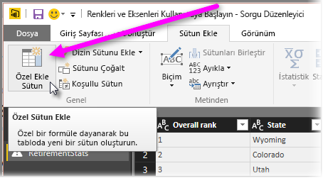

# Histogramlar
Power BI'da histogram oluşturmanın birkaç yolu vardır. En basitiyle başlayacağız.

## Basit Histogramlar
İlk olarak, histogram oluşturmak istediğiniz alanın hangi sorguda bulunduğunu olduğunu belirleyin.  Sorgunun yeni bir sorgu oluşturması için *Başvuru* seçeneğini kullanın ve yeni sorguyu *FieldName Histogram* olarak adlandırın. **Dönüştür** şeridindeki **Gruplandır** seçeneğini kullanın ve **Satırları Say** toplamını seçin. Elde edilecek olan toplama sütunu için, veri türünün bir sayı olduğundan emin olun. Daha sonra bu verileri raporlar sayfasında görselleştirebilirsiniz. Bu yaklaşım hızlı ve kolay bir yol sunsa da çok sayıda veri noktanız olması halinde pek kullanışlı değildir ve görsellerde fırça kullanılmasına izin vermez.

## Histogram oluşturmak için demetleri tanımlama
Histogram oluşturmak istediğiniz alanın hangi sorguda bulunduğunu belirleyin. Sorgunun yeni bir sorgu oluşturması için *Başvuru* seçeneğini kullanın ve yeni sorguyu *FieldName* olarak adlandırın.  Ardından, demetleri bir kural ile tanımlayın. **Sütun Ekle** şeridindeki **Özel Sütun Ekle** seçeneğini kullanarak özel bir kural oluşturun.

Elde edilecek olan toplama sütunu için, veri türünün bir sayı olduğundan emin olun. Artık, **Basit Histogramlar** bölümünde (yukarıda) açıklanan gruplandırma yöntemini kullanarak histogramı oluşturabilirsiniz. Bu seçenek daha fazla veri noktasıyla birlikte kullanılabilir ancak fırça kullanımına bunda da izin verilmez.

## Fırça kullanımını destekleyen bir histogram tanımlama
Fırça özelliği, görseller bağlantılıyken kullanıcı bir görselde bir veri noktasını seçtiğinde rapor sayfasında bulunan diğer görsellerin, seçilen veri noktası ile ilgili veri noktalarını vurgulaması veya filtrelemesi için kullanılır.  Sorgu süresince verileri düzenlediğimiz için tablolar arasında bir ilişki oluşturmamız ve histogramda bulunan demetin hangi ayrıntı öğesiyle ilgili olduğundan (veya tam tersi) emin olmamız gerekir.

Histogram oluşturmak istediğiniz alanın bulunduğu sorguda *Başvuru* seçeneğini kullanarak işleme başlayın.  Yeni sorguyu *Buckets* olarak adlandırın.  Bu örnek için özgün sorguyu *Details* olarak adlandıralım.  Ardından, histogram için demet olarak kullanacağınız sütun dışındaki tüm sütunları kaldırın.  Şimdi, sorguda bulunan ve sütunu seçtiğinizde sağ tıklama menüsünde bulunan *Yinelenenleri Kaldır* özelliğini kullanın. Böylece sütunda yalnızca benzersiz değerler kalır. Elinizde ondalık sayılar varsa yönetebileceğiniz kadar demeti almak için bir histogram oluşturmak üzere ilk olarak demet tanımlama ipucunu kullanabilirsiniz.  Şimdi, sorgu önizlemesinde gösterilen verileri kontrol edin. Boş veya null değerler görürseniz ilişki oluşturmadan önce bunları düzeltmeniz gerekir. Bkz. "Verilerinizde null veya boş değerler varsa ilişki oluşturma". Sıralama gereksinimi nedeniyle, bu yaklaşımın kullanılması sorunlara neden olabilir. Demetlerin doğru şekilde sıralanması için bkz. "Sıralama düzeni: kategorilerin istediğiniz düzende görünmesini sağlama". 

> [!NOTE]
> Herhangi bir görsel oluşturulmadan önce sıralama düzeni göz önünde bulundurulmalıdır.   
> 
> 

Bu işlemin bir sonraki adımında, demetler sütunundaki *Buckets* ve *Details* sorguları arasında bir ilişki tanımlayacağız.  *Power BI Desktop*'ta, şeritte bulunan *İlişkileri Yönet*'i seçin.  *Buckets*'ın sol tabloda, *Details*'in ise sağ tabloda olduğu bir ilişki oluşturun ve histogram için kullandığınız alanı seçin. 

Son adımda, histogramı oluşturacağız. *Buckets* tablosundaki Bucket alanını sürükleyin. Elde edilen sütun grafiğinden, varsayılan alanı kaldırın.  Şimdi, *Details* tablosundaki histogram alanını aynı görsele sürükleyin. Alan kutusunda, varsayılan toplamı Sayı olarak değiştirin. Histogramınız oluşturulur. Details tablosundan ağaç haritası gibi başka bir görsel oluşturursanız ağaç haritasındaki bir veri noktasını seçerek histogramın, tüm veri kümesine ilişkin eğilime göre, seçili veri noktasına ait histogramı vurgulamasını ve göstermesini sağlayın.

