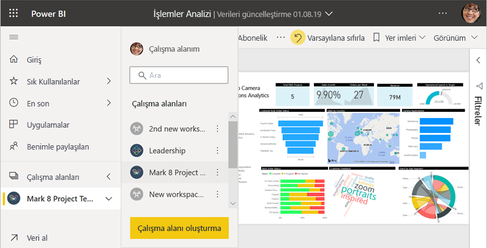
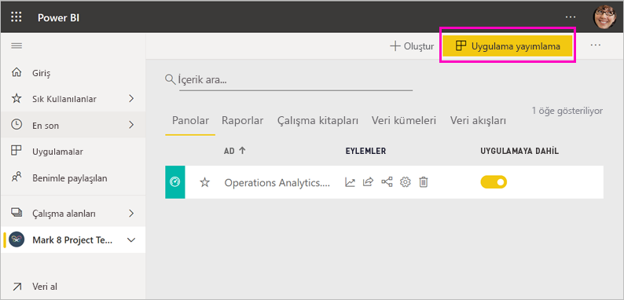
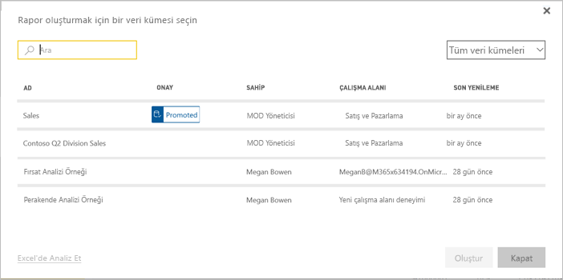
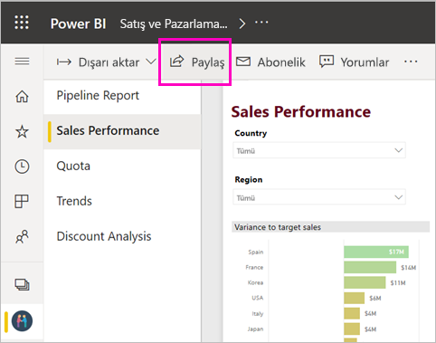

# Power BI'da çalışmanızı paylaşmanın yolları

Panolar ve raporlar oluşturdunuz. Bu pano ve raporlar üzerinde iş arkadaşlarınızla işbirliği yapmış da olabilirsiniz. Şimdi başkalarının da bu panolara ve raporlara erişmesini istiyorsunuz. Bunları dağıtmanın en iyi yolu nedir? Bu makalede, Power BI'da işbirliği yapmaya ve paylaşmaya yönelik seçenekleri karşılaştırdık:

* *Çalışma alanlarında* anlamlı raporlar ve panolar oluşturmak üzere iş arkadaşlarınızla işbirliği yapma.
* Bu panoları ve raporları *uygulamalarda* gruplandırma ve bunları daha büyük bir grupta ya da kuruluş genelinde dağıtma.
* İş arkadaşlarınızın kendi çalışma alanlarında kendi raporları için temel olarak kullanabilecekleri *paylaşılan veri kümeleri* oluşturma.
* Microsoft AppSource üzerinden dış Power BI kullanıcılarına dağıtabileceğiniz bir *şablon uygulaması* oluşturma.
* Panoları veya raporları hizmetten ya da Power BI mobil uygulamalarından birkaç kişiyle paylaşma.
* Raporları yazdırma.
* Raporları güvenli portallara veya genel Web sitelerine *ekleme*.

Hangisini seçerseniz seçin içeriğinizi paylaşmak için [Power BI Pro lisansınız](service-features-license-type.md) olmalı veya içerik [Premium kapasitede](service-premium-what-is.md) yer almalıdır. Lisans gereksinimleri, seçiminize bağlı olarak içeriğinizi görüntüleyen iş arkadaşlarınıza göre farklılık gösterir. Aşağıda ayrıntılara yer verilmiştir. 

*Power BI hizmetindeki uygulamalar*

## Çalışma alanında işbirliği yapma

Birlikte çalışan ekiplerin hızla işbirliği yapabilmesi için aynı belgelere erişmesi gerekir. Power BI çalışma alanlarında ekipler bir araya gelip panolarının, raporlarının, veri kümelerinin ve çalışma kitaplarının sahipliğini ve yönetimini paylaşır. Bazen Power BI kullanıcıları çalışma alanlarını kurumsal yapılara göre düzenler, bazen de belirli projeler için çalışma alanı oluşturur. Diğer bazı kuruluşlar da, kullandıkları raporların veya panoların farklı sürümlerini depolamak üzere çeşitli çalışma alanları kullanır. 

Çalışma alanları, iş arkadaşlarınızın sahip olacağı izinleri belirleyen roller sağlar. Bu rolleri kullanarak çalışma alanının tamamını kimin yönetebileceğini veya içeriğini düzenleyebileceğini ve dağıtabileceğini belirleyebilirsiniz.

Doğal olarak içeriği kendi Çalışma Alanım içine yerleştirebilir ve oradan paylaşabilirsiniz. Ama çalışma alanları işbirliği açısından Çalışma Alanım'dan daha iyidir çünkü içerik üzerinde ortak sahipliğe olanak sağlar. Siz ve tüm ekibiniz kolayca güncelleştirmeler yapabilir ve diğer kişilere erişim verebilir. Çalışma Alanım en iyi şekilde tek tek kişiler tarafından özel veya kişisel içerik için kullanılır.

Şimdi diğer iş arkadaşlarınızla paylaşmanız gereken tamamlanmış bir panonuzun olduğunu düşünün. Onlara panoya erişim vermenin en iyi yolu hangisidir? Yanıt, bir dizi faktöre bağlıdır. 

- İş arkadaşlarının panoyu güncel tutması veya çalışma alanındaki tüm içeriğe erişmesi gerekiyorsa, bu kişileri çalışma alanına eklemeyi göz önünde bulundurun. 
- Çalışma arkadaşlarının o panoyu görmesi ama çalışma alanındaki tüm içeriği görmemesi gerekiyorsa, yine bazı alternatifleriniz vardır. Bu tek panoya yalnızca birkaç kişinin ihtiyacı varsa en iyi çözüm panoyu paylaşmak olabilir.
- Öte yandan pano birçok iş arkadaşınıza dağıtmanız gereken daha büyük bir içeriğin parçasıysa, bu durumda en iyi seçenek bir *uygulama* yayımlamak olabilir.

Power BI'ın yeni bir çalışma alanı deneyimi vardır. Çalışma alanlarında hangi değişiklikler olduğunu görmek için [Yeni çalışma alanları oluşturma](service-create-the-new-workspaces.md) makalesini okuyun. 

## Uygulamada içgörüler dağıtma

Panonuzu kuruluşunuz içinde geniş bir kitleye dağıtmak istediğinizi varsayalım. İş arkadaşlarınızla birlikte bir *çalışma alanı* oluşturdunuz ve daha sonra bu çalışma alanında panolar, raporlar ve veri kümeleri oluşturup geliştirdiniz. Şimdi de istediğiniz panoları ve raporları seçip bir gruba veya tüm kuruluşa bir uygulama olarak yayımlayacaksınız.

Power BI hizmetinde ([https://app.powerbi.com](https://app.powerbi.com)) uygulamaları kolayca bulabilir ve yükleyebilirsiniz. İş kullanıcılarınıza uygulamaya ait bir doğrudan bağlantı gönderebilirsiniz veya kullanıcılar söz konusu uygulamayı AppSource'ta arayabilir. Power BI yöneticinizin izin vermesi durumunda bir uygulamayı otomatik olarak iş arkadaşlarınızın Power BI hesaplarına yükleyebilirsiniz. [Uygulamalarınızı yayımlama](service-create-distribute-apps.md) hakkında daha fazla bilgi edinin.

Kullanıcılar uygulamayı yükledikten sonra tarayıcılarında veya mobil cihazlarında görüntüleyebilir.

Kullanıcılarınızın uygulamanızı görüntülemesi için bir Power BI Pro lisansına sahip olması ya da uygulamanın bir Power BI Premium kapasitede depolanmış olması gerekir. Ayrıntılar için [Power BI Premium nedir?](service-premium-what-is.md) makalesini okuyun.

Uygulamaları kuruluşunuzun dışındaki kişilere de yayımlayabilirsiniz. Onlar uygulama içeriğini görüntüleyebilir, bunlarla etkileşimli çalışabilir ancak başkalarıyla paylaşamaz. Şimdi *şablon uygulamaları* oluşturup bunları herhangi bir Power BI müşterisine dağıtabilirsiniz.

## Veri kümesini paylaşma

Kabul etmek gerekir ki bazı kişiler raporlarında kaliteli, iyi tasarlanmış veri modelleri oluşturma konusunda daha yeteneklidir. Belki siz de bu kişilerden birisiniz. Tüm kuruluşunuz bu iyi tasarlanmış veri modellerinden yararlanabilir. *Paylaşılan veri kümeleri* bu rolü üstlenir. Herkesin kullanması gereken bir veri modeliyle rapor oluşturduğunuzda, bu raporu Power BI hizmetine kaydedebilir ve doğru kişilere bunu kullanma izni verebilirsiniz. Ardından onlar da sizin veri kümenizde raporlar oluşturabilir. Bu şekilde herkes raporlarında aynı verileri temel alır ve aynı "doğru bilgi sürümünü" görür.

[Paylaşılan veri kümelerini oluşturma ve kullanma](service-datasets-across-workspaces.md) hakkında daha fazla bilgi edinin.

## Panoları ve raporları paylaşma

Çalışma Alanım bölümünde veya çalışma alanında bir panoyu ve raporu son haline getirdiğinizi ve birkaç başka kişinin de bunlara erişmesini istediğinizi düşünelim. Bunu yapmanın bir yolu, söz konusu panoyu ve raporu *paylaşmaktır*. 

İçeriğinizi paylaşmak için hem sizin hem de paylaşımda bulunduğunuz kişilerin bir Power BI Pro lisansına sahip olması veya içeriğin [Premium kapasitedeki](service-premium-what-is.md) bir çalışma alanında olması gerekir. Panoyu veya raporu paylaştığınızda, alıcılar bu panoyu veya raporu görüntüleyebilir ve bunlarla etkileşimli çalışabilir ancak üzerlerinde düzenleme yapamaz. Bağlantılı veri kümesinde satır düzeyi güvenlik (RLS) uygulanmadığı sürece panoda ve raporlarda sizinle aynı verileri görürler. Paylaşımda bulunduğunuz iş arkadaşlarınız, izin vermeniz durumunda panoyu veya raporu kendi iş arkadaşlarıyla paylaşabilir. 

Kuruluşunuz dışındaki kişilerle de paylaşımda bulunabilirsiniz. Bu kişiler de panoyu veya raporu görüntüleyebilir, bununla etkileşimli çalışabilir ancak paylaşamaz. 

Power BI hizmetinden [pano ve rapor paylaşma](service-share-dashboards.md) hakkında daha fazla bilgi edinin. Ayrıca, bir bağlantıya filtre ekleyebilir ve [raporunuzun filtrelenmiş bir görünümünü paylaşabilirsiniz](service-share-reports.md).

## Power BI mobil uygulamalarından not ekleme ve paylaşma

iOS cihazları ve Android cihazlar için Power BI mobil uygulamalarında bir kutucuğa, rapora veya görsele not ekleyebilir ve bunu e-posta yoluyla başkalarıyla paylaşabilirsiniz.

Kutucuk, rapor veya görselin bir anlık görüntüsünü paylaşırsınız ve alıcılarınız bunu, tam olarak e-postayı gönderirken olduğu şekilde görür. E-posta aynı zamanda panonun veya raporun bir bağlantısını da içerir. Alıcıların nesneyi açabilmesi için Power BI Pro lisansına sahip olması veya içeriğin [Premium kapasitede](service-premium-what-is.md) olması ve nesneyi alıcılarınızla paylaşmış olmanız gerekir. Kutucukların anlık görüntülerini yalnızca aynı etki alanında olduğunuz iş arkadaşlarınıza değil, dilediğiniz kişiye gönderebilirsiniz.

iOS ve Android mobil uygulamalarında [kutucuk, rapor ve görsellere not ekleme ve bunları paylaşma](consumer/mobile/mobile-annotate-and-share-a-tile-from-the-mobile-apps.md) hakkında daha fazla bilgi edinin.

Ayrıca, Windows 10 için Power BI uygulamasında [bir kutucuk anlık görüntüsü paylaşabilirsiniz](consumer/mobile/mobile-windows-10-phone-app-get-started.md).

## PDF veya başka türde bir statik dosya olarak yazdırma ya da kaydetme

Power BI hizmetindeki bir panonun, pano kutucuğunun, rapor sayfasının veya görselleştirmenin tamamını PDF (ya da başka bir statik dosya biçiminde) olarak yazdırabilir veya kaydedebilirsiniz. Raporlar yalnızca sayfa sayfa yazdırılabilir; tek seferde raporun tamamını yazdıramazsınız. [Statik dosya olarak yazdırma veya kaydetme](consumer/end-user-print.md) hakkında daha fazla bilgi edinin.

## Raporları güvenli portallara veya genel Web sitelerine ekleme

### Güvenli portallara ekleme

Power BI raporlarını kullanıcılarınızın bunları bulmayı bekleyeceği portallara veya web sitelerine ekleyebilirsiniz.  
Power BI hizmetindeki **SharePoint Online'da Ekle** ve **Ekle** seçenekleri, şirket içi kullanıcılarınız için raporları güvenle eklemenize olanak tanır. 

- **SharePoint Online'da Ekle** seçeneği SharePoint Online için Power BI web bölümüyle çalışır. Raporun nasıl ekleneceğini denetleyebildiğiniz bir çoklu oturum açma deneyimi sağlar. 
- **Ekle** seçeneği, URL veya iFrame kullanılarak içerik eklemeyi destekleyen her portalda veya web sitesinde çalışır. 

Hangi seçeneği kullanırsanız kullanın, Power BI kullanıcıların içeriği görebilmesi için tüm izinleri ve veri güvenliğini zorunlu tutar. Raporu görüntüleyen kişinin uygun lisansa sahip olması gerekir. Power BI'daki [SharePoint Online'da Ekle](service-embed-report-spo.md) ve [Ekle](service-embed-secure.md) seçenekleri hakkında daha fazla bilgi.

### Genel web sitelerine yayımlama

**Web'de yayımla** özelliğiyle blog gönderileri, web siteleri, sosyal medya ve herhangi bir cihazdan gerçekleştirilen diğer çevrimiçi iletişimlere etkileşimli görselleştirmeler ekleyerek Power BI raporlarını İnternet'te yayımlayabilirsiniz. Raporlarınız, İnternet'te herkes tarafından görüntülenebilir ve yayımladığınız içeriği kimlerin görebildiğini denetleyemezsiniz. Kullanıcıların bu işlemler için bir Power BI lisansına sahip olması gerekmez. Web'de yayımlama özelliği yalnızca düzenleyebileceğiniz raporlar için kullanılabilir. Sizinle paylaşılan veya bir uygulamada bulunan raporları web'de yayımlayamazsınız. [Web'de yayımlama](service-publish-to-web.md) hakkında daha fazla bilgi edinin.

>[!Warning]
>[Web'de yayımla](service-publish-to-web.md)'yı yalnızca içeriği şirket içinde değil de herkese açık olarak paylaşmak için kullanın.

## Şablon uygulamaları oluşturma ve dağıtma

*Şablon uygulamaları* çoğunlukla Microsoft AppSource'ta herkese açık olarak dağıtılmak üzere tasarlanır. Bir uygulama oluşturur ve çok az kodlamayla veya hiç kodlama yapmadan bunu herhangi bir Power BI müşterisine dağıtabilirsiniz. Müşterileriniz kendi verilerine bağlanır ve kendi hesaplarının örneğini oluşturur. [Power BI şablon uygulamaları](service-template-apps-overview.md) ile ilgili daha fazla bilgi edinin.

## Sonraki adımlar

* [İş arkadaşlarınızla ve diğer kullanıcılarla pano paylaşma](service-share-dashboards.md)
* [Power BI'da uygulama oluşturma ve yayımlama](service-create-distribute-apps.md)
* [Raporu güvenli bir portala veya web sitesine ekleme](service-embed-secure.md)

Geri bildirimde bulunmak ister misiniz? [Power BI Topluluğu sitesine](https://community.powerbi.com/) giderek önerilerinizi belirtin.

Başka bir sorunuz mu var? [Power BI Topluluğu'na başvurun](https://community.powerbi.com/)
