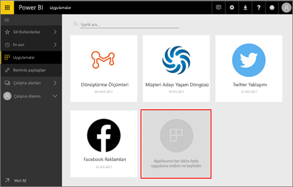
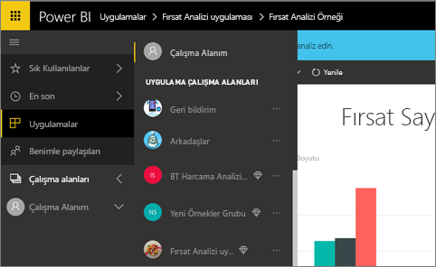
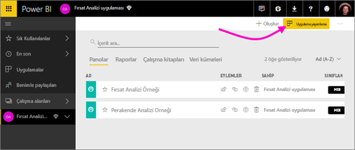
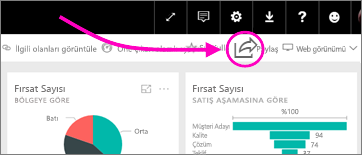
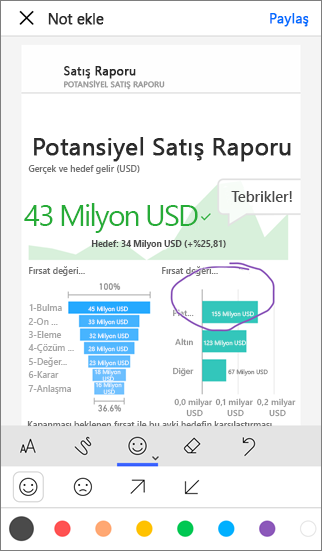

# Power BI'da çalışmanızı paylaşmanın yolları

Panolar ve raporlar oluşturdunuz. Bu pano ve raporlar üzerinde iş arkadaşlarınızla işbirliği yapmış da olabilirsiniz. Şimdi başkalarının da bu panolara ve raporlara erişmesini istiyorsunuz. Bunları dağıtmanın en iyi yolu nedir?

Bu makalede, Power BI'da işbirliği yapmaya ve paylaşmaya yönelik seçenekleri karşılaştıracağız: 

* *Çalışma alanlarında* anlamlı raporlar ve panolar oluşturmak üzere iş arkadaşlarınızla işbirliği yapma.
* Bu panoları ve raporları *uygulamalarda* gruplama ve bunları daha büyük bir grupta ya da kuruluş genelinde yayımlama.
* Panoları veya raporları hizmetten ya da Power BI mobil uygulamalarından birkaç kişiyle paylaşma.
- Raporları yazdırma.
* Dünyadaki herkesin görebileceği ve etkileşimli çalışabileceği şekilde genel web siteleri için web'de yayımlama.

Hangisini seçerseniz seçin bir panoyu paylaşmak için [Power BI Pro lisansınız](service-features-license-type.md) bulunmalı veya içerik, [Premium kapasitede](service-premium.md) olmalıdır. Lisans gereksinimleri, seçiminize bağlı olarak, panolarınızı görüntüleyen iş arkadaşlarınıza göre farklılık gösterir. Aşağıda ayrıntılara yer verilmiştir. 

*Power BI hizmetindeki uygulamalar*

## Çalışma alanında iş arkadaşlarınızla işbirliği yapma

Birlikte çalışan ekiplerin hızla işbirliği yapabilmesi için aynı belgelere erişmesi gerekir. Power BI'daki çalışma alanları ekiplerin bir araya gelip kendileri için önemli panoların, raporların, veri kümelerinin ve çalışma kitaplarının sahipliğini ve yönetimini paylaştıkları bir yer sağlar. Bazen Power BI kullanıcıları çalışma alanlarını kurumsal yapılara göre düzenler, bazen de belirli projeler için çalışma alanı oluşturur. Diğer bazı kuruluşlar da, kullandıkları raporların veya panoların farklı sürümlerini depolamak üzere çeşitli çalışma alanları kullanır. 

Çalışma alanları, iş arkadaşlarınızın sahip olacağı izinleri belirleyen roller sağlar. Bu rolleri kullanarak çalışma alanının tamamını kimin yönetebileceğini veya yalnızca buraya içerik sağlayabileceğini belirleyebilirsiniz.

Bazı kullanıcılar doğal olarak içeriği kendi Çalışma Alanım içine yerleştirir ve oradan paylaşır. Çalışma alanları işbirliği açısından Çalışma Alanım'dan daha iyidir çünkü içerik üzerinde ortak sahiplik sağlar. Siz ve tüm ekibiniz kolayca güncelleştirmeler yapabilir ve diğer kişilere erişim verebilir. Çalışma Alanım en iyi şekilde tek tek kişiler tarafından özel veya kişisel içerik için kullanılır.

Şimdi diğer iş arkadaşlarınızla paylaşmanız gereken tamamlanmış bir panonuzun olduğunu düşünün. Onlara panoya erişim vermenin en iyi yolu hangisidir? Yanıt, bir dizi faktöre bağlıdır. Belirli bir çalışma arkadaşınızın panoya sahip olması ve panonun güncelliğini koruması veya çalışma alanındaki tüm içeriğe erişmesi gerekiyorsa, en iyisi onu çalışma alanına eklemek olabilir. Çalışma arkadaşınızın o panoyu görmesi ama çalışma alanındaki tüm içeriği görmemesi gerekiyorsa, yine bir dizi alternatiften birini seçebilirsiniz. Pano, birçok çalışma arkadaşınıza dağıtmanız gereken daha büyük bir içeriğin parçasıysa, bu durumda en iyi seçenek bir uygulama yayımlamak olabilir. Öte yandan, iş arkadaşınızın yalnızca bu tek panoya ihtiyacı varsa, izlenecek en iyi yol panoyu paylaşmak olabilir. 

[Çalışma alanları oluşturma](service-create-workspaces.md) hakkında daha fazla bilgi edinin.

**Biliyor muydunuz?** Power BI yeni bir çalışma alanı deneyiminin önizlemesini sunuyor. Çalışma alanlarının gelecekte nasıl bir değişim geçireceğini görmek için [Yeni çalışma alanları oluşturma (önizleme)](service-create-the-new-workspaces.md) konusunu okuyun. 

## Uygulama oluşturarak verileri ve içgörüleri dağıtma

Panonuzu geniş bir kitleye dağıtmak istediğinizi varsayalım. İş arkadaşlarınızla birlikte bir *çalışma alanı* oluşturdunuz ve daha sonra bu çalışma alanında panolar, raporlar ve veri kümeleri oluşturup geliştirdiniz. Şimdi de istediğiniz panoları ve raporları seçip bir gruba veya tüm kuruluşa bir uygulama olarak yayımlayacaksınız. 

Power BI hizmetinde ([https://powerbi.com](https://powerbi.com)) uygulamaları kolayca bulabilir ve yükleyebilirsiniz. İş kullanıcılarınıza uygulamaya ait bir doğrudan bağlantı gönderebilirsiniz veya kullanıcılar söz konusu uygulamayı AppSource'ta arayabilir. Power BI yöneticinizin izin vermesi durumunda bir uygulamayı otomatik olarak iş arkadaşlarınızın Power BI hesaplarına yükleyebilirsiniz. [Uygulamalarınızı yayımlama](service-create-distribute-apps.md) hakkında daha fazla bilgi edinin. 

Kullanıcılar uygulamayı yükledikten sonra tarayıcılarında veya mobil cihazlarında görüntüleyebilir.

Kullanıcılarınızın uygulamanızı görüntülemesi için bir Power BI Pro lisansına sahip olması ya da uygulamanın bir Power BI Premium kapasitede depolanmış olması gerekir. Ayrıntılar için [Power BI Premium nedir?](service-premium.md) makalesini okuyun.

Uygulamaları kuruluşunuzun dışındakilere de yayımlayabilirsiniz. Onlar uygulama içeriğini görüntüleyebilir, bunlarla etkileşimli çalışabilir ancak başkalarıyla paylaşamaz.

## Panoları ve raporları paylaşma
Çalışma Alanım bölümünde veya çalışma alanında bir panoyu ve raporu son haline getirdiğinizi ve birkaç başka kişinin de bunlara erişmesini istediğinizi düşünelim. Bunu yapmanın bir yolu, söz konusu panoyu ve raporu *paylaşmaktır*. 

İçeriğinizi paylaşmak için hem sizin hem de paylaşımda bulunduğunuz kişilerin bir Power BI Pro lisansına sahip olması veya içeriğin [Premium kapasitedeki](service-premium.md) bir çalışma alanında olması gerekir. Panoyu veya raporu paylaştığınızda, alıcılar bu panoyu veya raporu görüntüleyebilir ve bunlarla etkileşimli çalışabilir ancak üzerlerinde düzenleme yapamaz. Bağlantılı veri kümesinde satır düzeyi güvenlik (RLS) uygulanmadığı sürece panoda ve raporlarda sizinle aynı verileri görürler. Paylaşımda bulunduğunuz iş arkadaşlarınız, izin vermeniz durumunda panoyu veya raporu kendi iş arkadaşlarıyla paylaşabilir. 

Kuruluşunuz dışındaki kişilerle de paylaşımda bulunabilirsiniz. Bu kişiler de panoyu veya raporu görüntüleyebilir, bununla etkileşimli çalışabilir ancak paylaşamaz. 

Power BI hizmetinden [pano ve rapor paylaşma](service-share-dashboards.md) hakkında daha fazla bilgi edinin. Ayrıca, bir bağlantıya filtre ekleyebilir ve [raporunuzun filtrelenmiş bir görünümünü paylaşabilirsiniz](service-share-reports.md).

## Power BI mobil uygulamalarından not ekleme ve paylaşma
iOS cihazları ve Android cihazlar için Power BI mobil uygulamalarında bir kutucuğa, rapora veya görsele not ekleyebilir ve bunu e-posta yoluyla başkalarıyla paylaşabilirsiniz. 

Kutucuk, rapor veya görselin bir anlık görüntüsünü paylaşırsınız ve alıcılarınız bunu, tam olarak e-postayı gönderirken olduğu şekilde görür. E-posta aynı zamanda panonun veya raporun bir bağlantısını da içerir. Alıcıların nesneyi açabilmesi için Power BI Pro lisansına sahip olması veya içeriğin [Premium kapasitede](service-premium.md) olması ve nesneyi alıcılarınızla paylaşmış olmanız gerekir. Kutucukların anlık görüntülerini yalnızca aynı etki alanında olduğunuz iş arkadaşlarınıza değil, dilediğiniz kişiye gönderebilirsiniz.

iOS ve Android mobil uygulamalarında [kutucuk, rapor ve görsellere not ekleme ve bunları paylaşma](consumer/mobile/mobile-annotate-and-share-a-tile-from-the-mobile-apps.md) hakkında daha fazla bilgi edinin.

Ayrıca, Windows 10 için Power BI uygulamasında [bir kutucuk anlık görüntüsü paylaşabilirsiniz](consumer/mobile/mobile-windows-10-phone-app-get-started.md).

## PDF veya başka türde bir statik dosya olarak yazdırma ya da kaydetme
Power BI hizmetindeki bir panonun, pano kutucuğunun, rapor sayfasının veya görselleştirmenin tamamını PDF (ya da başka bir statik dosya biçiminde) olarak yazdırabilir veya kaydedebilirsiniz. Raporlar yalnızca sayfa sayfa yazdırılabilir; tek seferde raporun tamamını yazdıramazsınız. [Statik dosya olarak yazdırma veya kaydetme](consumer/end-user-print.md) hakkında daha fazla bilgi edinin.

## Web'de yayımlama

> [!WARNING]
> **Web'de yayımla**'yı yalnızca içeriği şirket içinde değil de herkese açık olarak paylaşmak için kullanın.

Blog gönderileri, web siteleri, sosyal medya ve herhangi bir cihazdan gerçekleştirilen diğer çevrimiçi iletişimlere etkileşimli görselleştirmeler ekleyerek Power BI raporlarını İnternet'te yayımlayabilirsiniz. Raporlarınız, İnternet'te herkes tarafından görüntülenebilir ve yayımladığınız içeriği kimlerin görebildiğini denetleyemezsiniz. Kullanıcıların bu işlemler için bir Power BI lisansına sahip olması gerekmez. Web'de yayımlama özelliği yalnızca düzenleyebileceğiniz raporlar için kullanılabilir. Sizinle paylaşılan veya bir uygulamada bulunan raporları web'de yayımlayamazsınız. [Web'de yayımlama](service-publish-to-web.md) hakkında daha fazla bilgi edinin.

## Sonraki adımlar
* [İş arkadaşlarınızla ve diğer kullanıcılarla pano paylaşma](service-share-dashboards.md)
* [Power BI'da uygulama oluşturma ve yayımlama](service-create-distribute-apps.md)
* Geri bildirimde bulunmak ister misiniz? [Power BI Topluluğu sitesine](https://community.powerbi.com/) giderek önerilerinizi belirtin.
* Başka bir sorunuz mu var? [Power BI Topluluğu'na başvurun](http://community.powerbi.com/).

